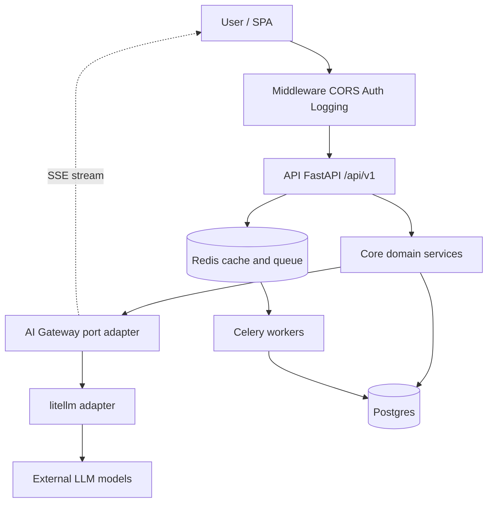
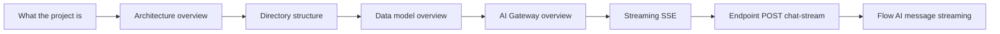

# Backend knowledge base — start here

This is the backend of a platform for **AI model red-teaming**: red teams hold conversations with LLM models to try to break them, and the system records and organizes it. This note is a map of the whole vault — start here when you got lost in the repo.

If you only have 5 minutes: read [What the project is](basics/what-is-the-project.md), then [Architecture overview](basics/architecture-overview.md), and finally glance at the priority notes about the AI Gateway and streaming (marked below).

> **Viewing these docs.** Best in [Obsidian](https://obsidian.md) — open `knowledge-base/` as a vault for the graph, backlinks, and quick navigation. GitHub is fine too: everything is GitHub-Flavored Markdown (relative `` links + mermaid render natively), so browsing the folder on GitHub reads cleanly.

## What this system is in one paragraph

An asynchronous FastAPI backend (Python 3.14), a modular monolith. A user logs in, gets a conversation with an AI model within an evaluation, writes a message, and the backend streams the model's response back (SSE). Underneath sits the **AI Gateway** — one layer that talks to all LLM providers through the `litellm` library. On top of that: Postgres (data), Redis (cache + queue), Celery (background tasks, e.g. sending emails).

## High-level diagram

The boundary matters: `litellm` lives **only** in the adapter (`app/core/ai_gateway/providers/litellm.py`). The rest of the code never sees this library — it operates on neutral message types. More in [AI Gateway - overview](components/ai-gateway-overview.md).

## Note index

### Basics

| Note | About |
|---|---|
| [What the project is](basics/what-is-the-project.md) | Business goal and the AI red-teaming domain. |
| [Stack and tooling](basics/stack-and-tooling.md) | Which technologies and dev tools, who is responsible for what. |
| [Architecture overview](basics/architecture-overview.md) | Modular monolith, layers, bounded contexts. |
| [Directory structure](basics/directory-structure.md) | Map of the repo tree and where everything sits. |
| [Glossary](basics/glossary.md) | Definitions of domain and technical concepts. |

### Data models

| Note | About |
|---|---|
| [Data model overview](data-models/data-model-overview.md) | ERD of all tables and relations. |
| [AiModel](data-models/ai-model.md) | AI model registry: endpoint, credentials, parameters. |
| [Conversation](data-models/conversation.md) | A red-teamer's session with a model within an evaluation. |
| [ConversationGroup](data-models/conversation-group.md) | The required bucket grouping a red-teamer's conversations (comparative testing). |
| [Turn](data-models/turn.md) | A single round (exchange) in a conversation. |
| [Message](data-models/message.md) | A single message in a turn. |
| [MessageFlag](data-models/message-flag.md) | Flag: selecting a message worth an exploit (+ `flagged_messages`). |
| [Note](data-models/note.md) | An annotator's free-text remark on a message selection (+ `noted_messages`). |
| [AnnotationLabel](data-models/annotation-label.md) | The label vocabulary the annotation picker suggests: curated + per-author rows. |
| [Review](data-models/review.md) | A reviewer's verdict on a flagged submission. |
| [EvaluationGroup](data-models/evaluation-group.md) | Top level: a red-teaming engagement. |
| [Evaluation](data-models/evaluation.md) | A single evaluation within a group. |
| [EvaluationAiModel](data-models/evaluation-ai-model.md) | Assignment of an AI model to an evaluation (join table). |
| [EvaluationGroupAiModel](data-models/evaluation-group-ai-model.md) | A group's allowed-model subset: the pool its evaluations may pick from. |
| [EvaluationTagKey](data-models/evaluation-tag-key.md) | An evaluation's allowed conversation-tag keys (the admin tag schema). |
| [Scenario](data-models/scenario.md) | A single challenge in an evaluation. |
| [Task](data-models/task.md) | Lowest level: a task within a scenario. |
| [User and Role](data-models/user-and-role.md) | User, global roles, the link. |
| [ProviderIdentity](data-models/provider-identity.md) | An external (OIDC) login identity linked to a local account. |
| [ObjectRoleAssignment](data-models/object-role-assignment.md) | Polymorphic per-object roles. |
| [Organization](data-models/organization.md) | The tenancy root scoping users and groups. |
| [PlatformSettings](data-models/platform-settings.md) | One-row singleton: data licensing, registration policy, password policy, reset throttling. |
| [DataLicense](data-models/data-license.md) | The data-license catalog row: curated (code-seeded) or user-authored. |
| [Notification](data-models/notification.md) | A per-user in-app message with a read mark and an optional deep link. |
| [Invitation](data-models/invitation.md) | Platform-wide and group-scoped invitations. |
| [ExportJob](data-models/export-job.md) | Async CSV export job: template + scope, lifecycle, stored file. |
| [TaskCompletion](data-models/task-completion.md) | A red-teamer checking off a scenario task per conversation. |
| [MediaAsset](data-models/media-asset.md) | Uploaded image blob metadata (cover/avatar/icon). |
| [SavedView](data-models/saved-view.md) | A user's named filter/sort/column state for a list view. |
| [AuditLog](data-models/audit-log.md) | Append-only, FK-less trail of sensitive actions and accesses. |
| [Support tables (email, verification, reset)](data-models/support-tables-email-verification-reset.md) | outbound_emails, email_verifications, password_reset_tokens. |

### Components

| Note | About |
|---|---|
| [AI Gateway - overview](components/ai-gateway-overview.md) | **PRIORITY** — the LLM integration layer (port/adapter). |
| [AI Gateway - dispatch](components/ai-gateway-dispatch.md) | The gateway's entry point: model alias -> provider call. |
| [AI Gateway - LiteLLM provider](components/ai-gateway-litellm-provider.md) | Adapter to the litellm library. |
| [AI Gateway - message types](components/ai-gateway-message-types.md) | Neutral OpenAI-shape types, the input/output contract. |
| [AI Gateway - inference parameters](components/ai-gateway-inference-parameters.md) | Parameter cascade model -> assignment -> conversation. |
| [AI Gateway - key encryption](components/ai-gateway-key-encryption.md) | Provider credentials encrypted at-rest (JWE). |
| [AI Gateway - error taxonomy](components/ai-gateway-error-taxonomy.md) | ProviderError hierarchy and mapping to HTTP. |
| [Streaming SSE](components/streaming-sse.md) | **PRIORITY** — translating chunks into SSE events. |
| [Endpoint POST chat-stream](components/endpoint-post-chat-stream.md) | **PRIORITY** — the stateless streaming endpoint. |
| [Conversations](components/conversations.md) | Red-teamer sessions: CRUD and scoping. |
| [Conversation tags](components/conversation-tags.md) | Free-form key/value prompt context on a conversation or message + the per-evaluation policy. |
| [Conversation groups](components/conversation-groups.md) | The required grouping bucket for conversations (+ size cap, pruning). |
| [Message persistence (write-path)](components/message-persistence-write-path.md) | Writing turns/messages to the DB (Transaction A/B orchestration). |
| [Conversation content sealing](components/conversation-content-sealing.md) | Message text encrypted at rest under a protecting data licence, and its key rotation. |
| [Message flags](components/message-flags.md) | Flagging a message as an exploit (annotations context). |
| [Notes](components/notes.md) | Free-text remarks on a message selection — no review workflow, no ownership requirement. |
| [Task completions](components/task-completions.md) | Checking off scenario tasks per conversation (annotations context). |
| [Reviews - reviewer verdicts](components/reviews-reviewer-verdicts.md) | Reviewer assignment, verdicts, and the review queue. |
| [Authentication (auth)](components/authentication.md) | Login, JWT, OIDC, registration, password reset. |
| [RBAC - global roles](components/rbac-global-roles.md) | Canonical roles and permissions in the JWT. |
| [Object roles - per-object permissions](components/object-roles-per-object-permissions.md) | The second authorization scope (per-object). |
| [User management](components/user-management.md) | User CRUD + the role-assignment authority rule. |
| [Evaluation domain](components/evaluation-domain.md) | Groups/evaluations/scenarios/tasks + lifecycle. |
| [Organizations](components/organizations.md) | Multi-tenancy: the org entity, membership, and the `organization` access level. |
| [Data licensing & platform settings](components/licenses.md) | License catalog, platform-default singleton, the effective-license cascade. |
| [Exports (CSV / JSON)](components/exports.md) | Async CSV/JSON export of an evaluation/group: templates, formats, filters, job lifecycle, storage. |
| [Analytics - aggregate metrics](components/analytics.md) | Two dashboards (group + single-evaluation), access-aware visibility. |
| [Media (image upload & serving)](components/media-images.md) | Image upload/serve behind a storage port (local/S3), signed URLs. |
| [Saved views](components/saved-views.md) | Per-user named filter/sort/column state for any list view. |
| [Notifications (in-app feed)](components/notifications.md) | Per-user in-app notification feed: emitters, owner scope, mark read/unread. |
| [Audit log](components/audit-log.md) | Append-only trail of sensitive actions/accesses (admin-only read). |
| [Email](components/email.md) | Transactional emails (backend, templates, audit). |
| [Celery workers](components/celery-workers.md) | Background tasks: instance, sync session, tasks. |
| [Configuration (Settings)](components/configuration-settings.md) | Single config source: env -> Settings. |
| [Database and sessions](components/database-and-sessions.md) | Async engine, sessions, soft-delete. |
| [Middleware, logging and request cycle](components/middleware-logging-and-request-cycle.md) | Middleware stack, request_id, access log. |
| [Observability](components/observability.md) | JSON log fields, /metrics, gateway call metrics, metric conventions. |
| [Error handling (RFC 7807)](components/error-handling-rfc-7807.md) | APIError -> Problem (application/problem+json). |
| [API - overview and conventions](components/api-overview-and-conventions.md) | All endpoints + REST conventions. |
| [Pagination, bulk and soft-delete](components/pagination-bulk-and-soft-delete.md) | Platform patterns for list/bulk/delete. |
| [Restore - reading tombstones back](components/restore-soft-deleted-items.md) | The undelete surface: `?deleted=true`, the restore window, deleter scoping. |

### Flows

| Note | About |
|---|---|
| [Flow - AI message streaming (end-to-end)](flows/flow-ai-message-streaming-end-to-end.md) | **PRIORITY** — the full message path from client to SSE. |
| [Flow - HTTP request lifecycle](flows/flow-http-request-lifecycle.md) | What happens to a request from entry to response. |
| [Flow - config from env to Settings](flows/flow-config-env-to-settings.md) | How configuration flows through the system. |
| [Flow - from AI model registration to invocation](flows/flow-ai-model-registration-to-invocation.md) | Path: add a model -> assign -> converse. |
| [Flow - request authentication and authorization](flows/flow-request-authentication-and-authorization.md) | How the system checks who you are and what you can do. |
| [Flow - evaluation group invitation](flows/flow-evaluation-group-invitation.md) | Path of inviting a user to a group. |

## Reading path for a lost developer

If you don't know where to start, go in order:

1. **Understand why it exists** — [What the project is](basics/what-is-the-project.md) and [Glossary](basics/glossary.md). Without that, the rest makes no sense.
2. **See how it's put together** — [Architecture overview](basics/architecture-overview.md), then [Stack and tooling](basics/stack-and-tooling.md) and [Directory structure](basics/directory-structure.md), so you know where to look for files.
3. **Get to know the data** — [Data model overview](data-models/data-model-overview.md). The hierarchy is simple: [EvaluationGroup](data-models/evaluation-group.md) -> [Evaluation](data-models/evaluation.md) -> [Scenario](data-models/scenario.md) -> [Task](data-models/task.md), with a [Conversation](data-models/conversation.md) hanging off an evaluation.
4. **Enter the heart of the system** — [AI Gateway - overview](components/ai-gateway-overview.md), then [Streaming SSE](components/streaming-sse.md) and [Endpoint POST chat-stream](components/endpoint-post-chat-stream.md). This is where all the magic of talking to a model happens.
5. **Walk the whole flow** — [Flow - AI message streaming (end-to-end)](flows/flow-ai-message-streaming-end-to-end.md). It ties everything into one path.
6. **The rest as needed** — [Authentication (auth)](components/authentication.md) and [Flow - request authentication and authorization](flows/flow-request-authentication-and-authorization.md) when you're digging into login; [Celery workers](components/celery-workers.md) and [Email](components/email.md) when you're in background tasks.

## Priority notes

If your work touches AI integration or streaming — these are the notes you must read first:

- [AI Gateway - overview](components/ai-gateway-overview.md) — how the system talks to LLM models at all.
- [Streaming SSE](components/streaming-sse.md) — how the model's response flies to the client piece by piece.
- [Endpoint POST chat-stream](components/endpoint-post-chat-stream.md) — the endpoint that wires it together.
- [Flow - AI message streaming (end-to-end)](flows/flow-ai-message-streaming-end-to-end.md) — the whole path from typing a message to the SSE stream.

## Related

- [What the project is](basics/what-is-the-project.md)
- [Architecture overview](basics/architecture-overview.md)
- [AI Gateway - overview](components/ai-gateway-overview.md)
- [Streaming SSE](components/streaming-sse.md)
- [Flow - AI message streaming (end-to-end)](flows/flow-ai-message-streaming-end-to-end.md)
