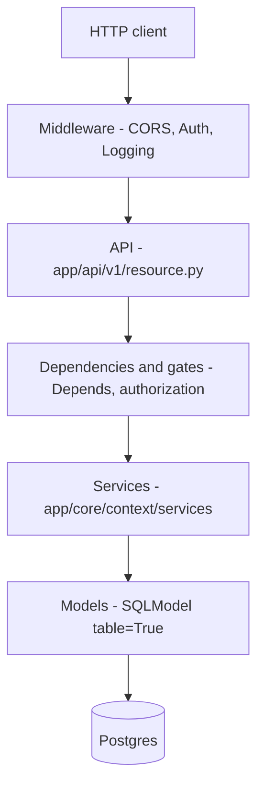
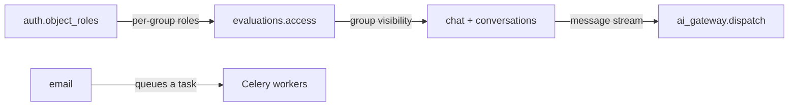
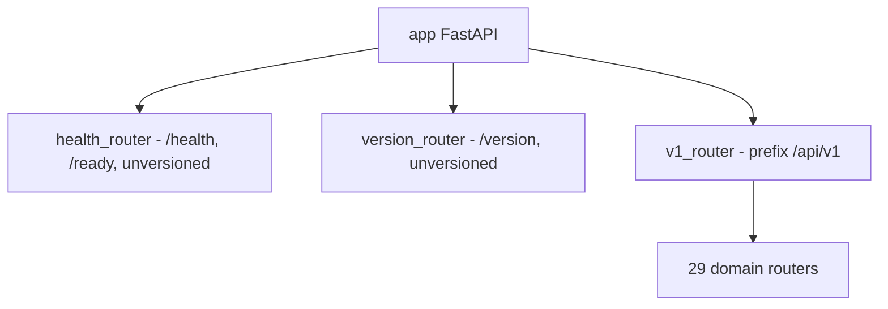
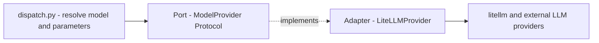

# Architecture overview

The backend is **one FastAPI process** (`app.main:app`) plus a **second process** for background tasks (Celery), both from the same code base. Internally you split the code into **bounded contexts** under `app/core/<context>/` — each context is a separate slice of the domain (auth, ai_gateway, evaluations...). This is a **modular monolith**: deploys easily like a monolith, but with boundaries like microservices.

## Why it exists / what it does

When you get lost in the repo, hold on to two axes:

1. **Vertical (layers)** — a request comes in through the API, descends through the services to the models and the database.
2. **Horizontal (contexts)** — each directory under `app/core/` is a separate domain with its own models, services, and schemas.

Everything is async (asyncpg, FastAPI `async def`). The exception: Celery workers use a sync session (psycopg).

## Layers

Each full context splits vertically:



Rules:

- `api/v1/<resource>.py` — the HTTP layer: router, `Depends`, validation, `@transactional`, raises RFC 7807 errors. See [API - overview and conventions](../components/api-overview-and-conventions.md).
- `services/*.py` — domain logic, authorization, queries. This is where the business lives.
- `models.py` — `SQLModel` inheriting from `BaseModel`. See [Data model overview](../data-models/data-model-overview.md).
- `schemas.py` — Pydantic DTOs (request/response), separated from the ORM models.
- `dependencies.py` — local `Annotated[X, Depends(...)]` aliases (per-domain gates).

Cross-cutting DI aliases sit in `app/core/dependencies.py`:

`app/core/dependencies.py`
```python
SettingsDep = Annotated[Settings, Depends(get_settings)]
CurrentUserDep = Annotated[SessionUser, Depends(current_user)]
DbSession = Annotated[AsyncSession, Depends(get_db)]
PaginationDep = Annotated[PaginationParams, Depends()]
```

## Bounded contexts

Each directory under `app/core/` is one context. State: all sixteen full.

| Context | Directory | State | One sentence |
|---|---|---|---|
| auth | `app/core/auth/` | full | Login, JWT, OIDC, global and per-object roles. See [Authentication (auth)](../components/authentication.md). |
| ai_gateway | `app/core/ai_gateway/` | full | Provider-agnostic LLM access through a port and an adapter. See [AI Gateway - overview](../components/ai-gateway-overview.md). |
| conversations | `app/core/conversations/` | full | A red-teamer's sessions with a model, SSE streaming, and the persistence write-path. See [Conversations](../components/conversations.md). |
| evaluations | `app/core/evaluations/` | full | Groups, evaluations, scenarios, and tasks with a lifecycle. See [Evaluation domain](../components/evaluation-domain.md). |
| organizations | `app/core/organizations/` | full | The tenancy root scoping users and evaluation groups. See [Organizations](../components/organizations.md). |
| licenses | `app/core/licenses/` | full | DB-backed data-license catalog (curated + user-authored) and the effective-license cascade. See [Data licensing & platform settings](../components/licenses.md). |
| platform_settings | `app/core/platform_settings/` | full | The admin-tunable one-row singleton — data licensing, registration policy, password policy, reset throttling. Split out of `licenses/`. See [PlatformSettings](../data-models/platform-settings.md). |
| email | `app/core/email/` | full | Transactional emails rendered from templates and sent via Celery. See [Email](../components/email.md). |
| reviews | `app/core/reviews/` | full | Reviewer verdicts on flagged submissions + the review queue. See [Reviews - reviewer verdicts](../components/reviews-reviewer-verdicts.md). |
| annotations | `app/core/annotations/` | full | Message flags, task completions, notes, and the annotation-label vocabulary. See [Message flags](../components/message-flags.md), [Task completions](../components/task-completions.md), [Notes](../components/notes.md), [AnnotationLabel](../data-models/annotation-label.md). |
| analytics | `app/core/analytics/` | full | Aggregate metrics/reporting: two dashboards (group + single-evaluation) with access-aware visibility. See [Analytics - aggregate metrics](../components/analytics.md). |
| exports | `app/core/exports/` | full | Async CSV/JSON export of evaluation/group data (template catalog, row filters, background jobs, local/S3 storage). See [Exports (CSV / JSON)](../components/exports.md). |
| media | `app/core/media/` | full | Generic image upload + serving behind a swappable storage port (local/S3), signed URLs. See [Media (image upload & serving)](../components/media-images.md). |
| saved_views | `app/core/saved_views/` | full | A user's named filter/sort/column state for any list view. See [Saved views](../components/saved-views.md). |
| audit | `app/core/audit/` | full | Append-only, FK-less trail of sensitive actions/accesses (+ the access-capture middleware). See [Audit log](../components/audit-log.md). |
| notifications | `app/core/notifications/` | full | A user's in-app notification feed; rows minted by other contexts, never over HTTP. See [Notifications (in-app feed)](../components/notifications.md). |

Domain concepts are explained by the [Glossary](glossary.md), and where everything sits in the tree by [Directory structure](directory-structure.md).

### How contexts talk to each other



- **conversations + chat -> ai_gateway** — SSE streaming consumes `dispatch_stream`. See [Flow - AI message streaming (end-to-end)](../flows/flow-ai-message-streaming-end-to-end.md).
- **evaluations.access -> conversations/scenarios/tasks** — the shared `join_visible_evaluation_group` is the single visibility axis. See [Object roles - per-object permissions](../components/object-roles-per-object-permissions.md).
- **auth.object_roles -> evaluations** — per-group roles on a generic layer. See [RBAC - global roles](../components/rbac-global-roles.md).
- **email -> Celery** — `send_email` renders a template and queues a task. See [Celery workers](../components/celery-workers.md).
- **evaluations / exports -> notifications** — a moderation verdict or a finished export calls `create_notification`, which flushes (never commits) so the notice lands with the emitting transaction. See [Notifications (in-app feed)](../components/notifications.md).

## Bootstrap (lifespan, DB engine, router mounting)

The application comes up in `app/main.py`. The key piece is `lifespan`: first logging configuration, then the DB engine, and in `finally` always engine cleanup.

`app/main.py`
```python
@asynccontextmanager
async def lifespan(_: FastAPI) -> AsyncIterator[None]:
    configure_logging(get_settings())
    await db.init_engine(get_settings())
    await session_revocation.init_client(get_settings())
    try:
        yield
    finally:
        await session_revocation.close_client()
        await db.dispose_engine()
```

The order is not accidental — logs before the engine, so you catch an engine-build error. The engine is cleaned up even on a partial startup failure. The second resource is the **session-revocation Redis client**: a process-wide pooled client, because the auth middleware checks the force-logout marker on every authenticated request. See [Authentication (auth)](../components/authentication.md).

**DB engine** (`app/core/database.py`): `build_engine` creates `create_async_engine` with a pool from `Settings` and `pool_pre_ping=True` (SELECT 1 before reusing a connection — survives a database restart). The `_engine` and `_session_factory` singletons are set by `init_engine` in the lifespan. `get_db()` gives one session per request; it raises `RuntimeError` when the lifespan hasn't started. Details: [Database and sessions](../components/database-and-sessions.md).

**Transaction boundaries** are a separate matter: `get_db` manages only the session lifecycle, NOT the commit. A mutating endpoint (POST/PATCH/DELETE) must have `@transactional`, otherwise it loses its INSERTs. Exception: bulk handlers manage the transaction themselves. See [Pagination, bulk and soft-delete](../components/pagination-bulk-and-soft-delete.md).

**Router mounting** — two levels:



`v1_router = APIRouter(prefix="/api/v1")` collects 31 domain routers (auth, roles, permissions, organizations, ai_models, evaluations, evaluation_metrics, exports, evaluation_groups, evaluation_group_members, evaluation_group_invitations, evaluation_group_annotators, evaluation_group_metrics, scenarios, conversations, conversation_groups, messages, model_warmup, tasks, chat, notes, annotation_labels, message_flags, task_completions, reviews, licenses, images, platform_settings, audit_logs, saved_views, notifications). The `/api/v1` prefix is applied **once**; the domain routers define relative paths. `health_router` and `version_router` are deliberately outside versioning.

## Middleware stack

`add_middleware` adds layers from the inside out, so the last one added is the outermost. On a request they execute in the reverse order from the code:

| Layer | What it does |
|---|---|
| CORS | Added last, i.e. the outermost — responds to the preflight before auth. Origins always explicit (never `*`, because `allow_credentials=True`). |
| Auth | Decodes the bearer JWT into `request.state.user`; missing or bad token = anonymous. Also drops the identity to anonymous when a force-logout marker revokes the token (fail-open on a Redis error). |
| Logging | Binds `request_id`, `method`, `path` to structlog, attaches `X-Request-ID`, one access log per request. |
| ScopedSession | The OIDC cookie session, but only on the `/api/v1/auth/oidc` prefix. The rest of the requests don't touch it. |
| AuditAccess | Innermost. After the response, audits allowlisted sensitive reads + login attempts to the audit trail (own session, best-effort). See [Audit log](../components/audit-log.md). |

The full request cycle is described by [Flow - HTTP request lifecycle](../flows/flow-http-request-lifecycle.md) and [Middleware, logging and request cycle](../components/middleware-logging-and-request-cycle.md).

## Port and adapter for the LLM

ai_gateway is a classic **hexagonal port/adapter**. The domain never sees the `litellm` library — it talks to a port.



- **Port** — the `ModelProvider` Protocol in `app/core/ai_gateway/providers/base.py`, the `chat()` and `stream()` methods take semantic inputs (`vendor`, `messages`, `params`), not library strings.
- **Adapter** — `LiteLLMProvider` in `providers/litellm.py`, the only module importing `litellm`.
- **Entry point** — `dispatch_chat`/`dispatch_stream` in `dispatch.py`: model alias -> `AiModel` row -> credential -> parameter merge -> provider call.

`__init__.py` re-exports only the contract without litellm (the `ChatChunk`/`ChatMessage` types, `ProviderError`), so the CRUD path doesn't pull in litellm. Details: [AI Gateway - dispatch](../components/ai-gateway-dispatch.md), [AI Gateway - LiteLLM provider](../components/ai-gateway-litellm-provider.md), [AI Gateway - message types](../components/ai-gateway-message-types.md).

## Key design decisions

| Decision | What it amounts to | Note |
|---|---|---|
| Port/adapter | The LLM behind the `ModelProvider` port; litellm only in one adapter. Easy to swap a provider, the domain doesn't depend on the library. | [AI Gateway - overview](../components/ai-gateway-overview.md) |
| Soft-delete | `BaseModel` has `deleted_at`; `with_live` filters tombstones per-statement (no global listener). We never delete anything physically. | [Pagination, bulk and soft-delete](../components/pagination-bulk-and-soft-delete.md) |
| RFC 7807 | Every non-2xx response is a `Problem` envelope with `Content-Type: application/problem+json`. Routers raise `APIError`, not `HTTPException`. | [Error handling (RFC 7807)](../components/error-handling-rfc-7807.md) |
| Async by default | Handlers, SQL, Redis, HTTP — everything `async`. asyncpg for the application, psycopg sync for the workers. | [Database and sessions](../components/database-and-sessions.md) |
| Two-level RBAC | Global roles in the JWT (`auth.roles`) plus per-object roles (`auth.object_roles`, e.g. per evaluation group). | [RBAC - global roles](../components/rbac-global-roles.md), [Object roles - per-object permissions](../components/object-roles-per-object-permissions.md) |

**Model API keys** are encrypted at-rest: JWE (`dir` + `A256GCM`), key from `MODEL_SECRETS_KEY`, keyring validated at startup. See [AI Gateway - key encryption](../components/ai-gateway-key-encryption.md).

**Central model registry** — `app/models.py` imports all `*.models` modules. Alembic and tooling import this one file. Adding a model = one import here.

**One-way configuration** — env -> `Settings` (pydantic-settings) -> `get_settings()` (`@lru_cache`, singleton per-process). Nowhere else is env read. See [Configuration (Settings)](../components/configuration-settings.md) and [Flow - config from env to Settings](../flows/flow-config-env-to-settings.md).

> [!note] How isolation actually works
> Isolation is **soft-delete + per-statement visibility joins** (`join_visible_evaluation_group`) plus **per-object roles** — there is no Postgres RLS (row-level security) and no `tenant_id`.

> [!note] Every bounded context is implemented
> All sixteen are full implementations (auth, ai_gateway, conversations, evaluations, organizations, licenses, platform_settings, email, reviews, annotations, analytics, exports, media, saved_views, audit, notifications); none is a placeholder.

## Related

- [Stack and tooling](stack-and-tooling.md)
- [Directory structure](directory-structure.md)
- [Glossary](glossary.md)
- [What the project is](what-is-the-project.md)
- [AI Gateway - overview](../components/ai-gateway-overview.md)
- [Evaluation domain](../components/evaluation-domain.md)
- [Organizations](../components/organizations.md)
- [Data licensing & platform settings](../components/licenses.md)
- [Exports (CSV / JSON)](../components/exports.md)
- [Analytics - aggregate metrics](../components/analytics.md)
- [Media (image upload & serving)](../components/media-images.md)
- [Saved views](../components/saved-views.md)
- [Notifications (in-app feed)](../components/notifications.md)
- [Audit log](../components/audit-log.md)
- [Reviews - reviewer verdicts](../components/reviews-reviewer-verdicts.md)
- [Authentication (auth)](../components/authentication.md)
- [ProviderIdentity](../data-models/provider-identity.md)
- [Conversation content sealing](../components/conversation-content-sealing.md)
- [Restore - reading tombstones back](../components/restore-soft-deleted-items.md)
- [Database and sessions](../components/database-and-sessions.md)
- [Configuration (Settings)](../components/configuration-settings.md)
- [Error handling (RFC 7807)](../components/error-handling-rfc-7807.md)
- [API - overview and conventions](../components/api-overview-and-conventions.md)
- [Middleware, logging and request cycle](../components/middleware-logging-and-request-cycle.md)
- [Celery workers](../components/celery-workers.md)
- [Data model overview](../data-models/data-model-overview.md)
- [Flow - HTTP request lifecycle](../flows/flow-http-request-lifecycle.md)
