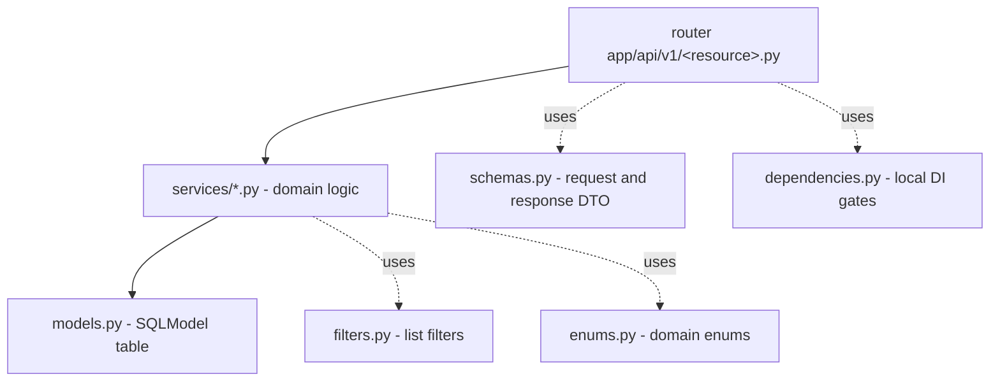

# Directory structure

A map of the repo: where everything sits. If you get lost in `backend`, start here. All the code lives in `app/`, the rest is migrations, tests, docs, and deploy around it.

The whole thing is **one modular monolith** — one FastAPI process plus a Celery worker from the same code base. The domain logic is sliced into bounded contexts under `app/core/<context>/`. A broader picture in [Architecture overview](architecture-overview.md).

## Tree (abridged)

```
app/
  main.py            # FastAPI instance (app), bootstrap, lifespan, middleware
  models.py          # central model registry for Alembic (one import = one model)
  api/
    health.py        # /health, /ready (outside versioning)
    version.py       # /version — deployed commit SHA + environment (outside versioning)
    v1/              # domain routers, prefix /api/v1
      auth/          # login, register, oidc, users, invitations, password_resets
      roles.py  permissions.py  organizations.py
      ai_models.py  chat.py  conversations.py  conversation_groups.py
      messages.py  message_flags.py  task_completions.py
      evaluations.py  evaluation_metrics.py  evaluation_groups.py  evaluation_group_members.py
      evaluation_group_invitations.py  evaluation_group_annotators.py  evaluation_group_metrics.py
      scenarios.py  tasks.py  reviews.py
      exports.py  model_warmup.py  images.py
      licenses.py  platform_settings.py  saved_views.py  audit_logs.py  notifications.py
      notes.py  annotation_labels.py
  core/              # domain logic, one subpackage = one bounded context
    config.py  database.py  base_model.py  soft_delete.py
    dependencies.py  schemas.py  pagination.py  bulk.py
    exceptions.py  error_handlers.py  openapi.py  logging.py
    helpers.py  ordering.py  csv_generator.py
    middleware/      # auth.py, logging.py, scoped_session.py, audit.py
    auth/  ai_gateway/  conversations/  evaluations/  email/
    organizations/  licenses/  platform_settings/  annotations/  reviews/
    analytics/  exports/  media/  saved_views/  audit/  notifications/
  workers/           # celery_app.py, session.py, tasks.py
alembic/             # database migrations
tests/               # mirror of the app/ layout
docs/                # openapi.yaml, erd.md, permissions.md (generated)
deploy/              # deploy.sh, compose dev, Caddyfile, EC2 bootstrap
scripts/             # seed_local, sync_roles, sync_licenses, dump_openapi/erd/permissions
```

## What sits in the main directories

| Directory | What it contains |
|---|---|
| `app/main.py` | The `app` instance, `lifespan` (logging -> engine), router mounting, the middleware stack |
| `app/models.py` | Imports all `*.models`. Alembic and tooling read this one file |
| `app/api/health.py` | `/health` (liveness, always 200) and `/ready` (readiness, checks Postgres+Redis) |
| `app/api/version.py` | `/version` (public, unauthenticated) — deployed commit SHA (short) or `dev`, plus the environment |
| `app/api/v1/` | domain routers under `/api/v1`, the HTTP layer |
| `app/core/` | Domain logic sliced into contexts + cross-cutting modules |
| `app/workers/` | Celery: `celery_app.py` (the instance), `session.py` (sync DB session), `tasks.py` |
| `alembic/` | Migration scripts; run via `make migrate` in a container |
| `tests/` | Mirrors the `app/` layout one to one |
| `docs/` | Generated artifacts: the OpenAPI schema, ERD, permissions map (CI guards against drift) |
| `deploy/` | Deploy script, compose for dev, Caddy (TLS), EC2 bootstrap |
| `scripts/` | CLI tools: seed, role synchronization, documentation dumps |

## Cross-cutting modules in `app/core/` (flat files)

This isn't a domain context, just the shared foundation for everything:

| File | Role | Note |
|---|---|---|
| `config.py` | env -> `Settings` -> `get_settings()` | [Configuration (Settings)](../components/configuration-settings.md) |
| `database.py` | async engine, session factory, `transactional` | [Database and sessions](../components/database-and-sessions.md) |
| `base_model.py` | `BaseModel`: UUID, timestamps, soft-delete | [Data model overview](../data-models/data-model-overview.md) |
| `soft_delete.py` | per-statement tombstone filter (`live_select`) | [Pagination, bulk and soft-delete](../components/pagination-bulk-and-soft-delete.md) |
| `dependencies.py` | shared DI aliases: `DbSession`, `CurrentUserDep`, `PaginationDep` | [Flow - HTTP request lifecycle](../flows/flow-http-request-lifecycle.md) |
| `exceptions.py` + `error_handlers.py` | the `APIError` -> `Problem` hierarchy (RFC 7807) | [Error handling (RFC 7807)](../components/error-handling-rfc-7807.md) |
| `schemas.py` | `Problem`, `Page[T]`, `PaginationParams` | [API - overview and conventions](../components/api-overview-and-conventions.md) |
| `pagination.py` + `bulk.py` | `paginate(...)` count+page helper; the `BulkRequest`/`BulkResponse` contract | [Pagination, bulk and soft-delete](../components/pagination-bulk-and-soft-delete.md) |
| `ordering.py` + `helpers.py` | `order_by` whitelist parsing; small shared utilities | [API - overview and conventions](../components/api-overview-and-conventions.md) |
| `openapi.py` | OpenAPI metadata, response helpers | [API - overview and conventions](../components/api-overview-and-conventions.md) |
| `logging.py` + `middleware/` | structlog, the middleware stack | [Middleware, logging and request cycle](../components/middleware-logging-and-request-cycle.md) |

## Context pattern: each one has the same drawers

This is the most important thing to remember. You open any full context under `app/core/<context>/` and you always find the same layer layout. Thanks to that you don't have to learn each context from scratch — you know where to look.



| Drawer | What's in there |
|---|---|
| `models.py` | `SQLModel` tables with `table=True`, inherit from `BaseModel` |
| `services/*.py` | Domain logic: queries, authorization, transactions |
| `schemas.py` | Pydantic DTOs (request/response), separated from the ORM models |
| `dependencies.py` | Local `Annotated[X, Depends(...)]` aliases, e.g. authorization gates |
| `filters.py` | List filter dependencies (pagination, query params) |
| `enums.py` | Domain enums |

The dependency-split rule (`app/core/dependencies.py`): cross-cutting aliases (DB session, settings, pagination, current user) sit in `core/dependencies.py`; resource-specific aliases — in the given context's `dependencies.py`.

The HTTP layer (`app/api/v1/<resource>.py`) is deliberately thin: router, `Depends`, `@transactional`, validation. All the work is in `services/`.

## Contexts and their state

| Context | Directory | State | Note |
|---|---|---|---|
| auth | `app/core/auth/` | full | [Authentication (auth)](../components/authentication.md), [RBAC - global roles](../components/rbac-global-roles.md), [Object roles - per-object permissions](../components/object-roles-per-object-permissions.md) |
| ai_gateway | `app/core/ai_gateway/` | full | [AI Gateway - overview](../components/ai-gateway-overview.md) |
| conversations | `app/core/conversations/` | full | [Conversations](../components/conversations.md), [Conversation groups](../components/conversation-groups.md), [Streaming SSE](../components/streaming-sse.md), [Message persistence (write-path)](../components/message-persistence-write-path.md) |
| evaluations | `app/core/evaluations/` | full | [Evaluation domain](../components/evaluation-domain.md) |
| organizations | `app/core/organizations/` | full | [Organizations](../components/organizations.md) |
| licenses | `app/core/licenses/` | full | [Data licensing & platform settings](../components/licenses.md) |
| email | `app/core/email/` | full | [Email](../components/email.md) |
| reviews | `app/core/reviews/` | full | [Reviews - reviewer verdicts](../components/reviews-reviewer-verdicts.md) |
| annotations | `app/core/annotations/` | full | [Message flags](../components/message-flags.md) + [Task completions](../components/task-completions.md) + [Notes](../components/notes.md) + [AnnotationLabel](../data-models/annotation-label.md) |
| analytics | `app/core/analytics/` | full | [Analytics - aggregate metrics](../components/analytics.md) (access-aware dashboards) |
| exports | `app/core/exports/` | full | [Exports (CSV / JSON)](../components/exports.md) (async CSV/JSON jobs, filters, local/S3 storage) |
| media | `app/core/media/` | full | [Media (image upload & serving)](../components/media-images.md) (storage port, signed URLs) |
| saved_views | `app/core/saved_views/` | full | [Saved views](../components/saved-views.md) (per-user list state) |
| audit | `app/core/audit/` | full | [Audit log](../components/audit-log.md) (append-only trail + access middleware) |
| notifications | `app/core/notifications/` | full | [Notifications (in-app feed)](../components/notifications.md) (per-user in-app feed, minted by other contexts) |

`annotations` has moved off the placeholder: full `models/services/schemas/filters/dependencies` for four entities (message flags, task completions, notes and the annotation-label vocabulary). `analytics` is real too — no models, but `schemas.py` + `services/metrics.py` back the two access-aware dashboards. `media`, `saved_views`, `audit` and `notifications` are the newest full contexts (image storage behind a port; per-user list state; the append-only audit trail + its access-capture middleware; the in-app notification feed). The rest of the contexts are full.

The `conversations` context splits its domain logic per resource: `services/conversations.py` (the session CRUD + write-path) and `services/groups.py` (conversation-group lifecycle), with the list filters for both in `filters.py`. The group HTTP surface is its own router, `app/api/v1/conversation_groups.py`. See [Conversation groups](../components/conversation-groups.md).

## Two entry points and the /api/v1 prefix

Routers are composed at two levels. `app/api/v1/__init__.py` builds `v1_router` with the `/api/v1` prefix and hooks 31 domain routers under it (auth, roles, permissions, organizations, ai_models, evaluations, evaluation_metrics, exports, evaluation_groups, evaluation_group_members, evaluation_group_invitations, evaluation_group_annotators, evaluation_group_metrics, scenarios, conversations, conversation_groups, messages, model_warmup, tasks, chat, notes, annotation_labels, message_flags, task_completions, reviews, licenses, images, platform_settings, audit_logs, saved_views, notifications). `app/main.py` mounts three routers on app: `health_router` (unversioned, `/health` + `/ready`), `version_router` (unversioned, `/version`), and `v1_router`. The `/api/v1` prefix is applied **once**, at the `v1_router` level — the individual routers define relative paths.

## Where to start digging for typical tasks

| I want to... | Go to |
|---|---|
| Add an endpoint | `app/api/v1/<resource>.py` + `services/` in the context |
| Add a table | a model in `core/<context>/models.py` + an import in `app/models.py` |
| Change config/env | `app/core/config.py` ([Configuration (Settings)](../components/configuration-settings.md)) |
| Touch the LLM integration | `app/core/ai_gateway/` ([AI Gateway - overview](../components/ai-gateway-overview.md)) |
| A background task | `app/workers/` + `tasks.py` in the context ([Celery workers](../components/celery-workers.md)) |
| Migrations | `make makemigrations` -> a file in `alembic/` |

## Related

- [Architecture overview](architecture-overview.md)
- [Stack and tooling](stack-and-tooling.md)
- [Data model overview](../data-models/data-model-overview.md)
- [Configuration (Settings)](../components/configuration-settings.md)
- [Database and sessions](../components/database-and-sessions.md)
- [Middleware, logging and request cycle](../components/middleware-logging-and-request-cycle.md)
- [API - overview and conventions](../components/api-overview-and-conventions.md)
- [Celery workers](../components/celery-workers.md)
- [AI Gateway - overview](../components/ai-gateway-overview.md)
- [Evaluation domain](../components/evaluation-domain.md)
- [Exports (CSV / JSON)](../components/exports.md)
- [Analytics - aggregate metrics](../components/analytics.md)
- [Media (image upload & serving)](../components/media-images.md)
- [Saved views](../components/saved-views.md)
- [Audit log](../components/audit-log.md)
- [Authentication (auth)](../components/authentication.md)
- [Flow - HTTP request lifecycle](../flows/flow-http-request-lifecycle.md)
