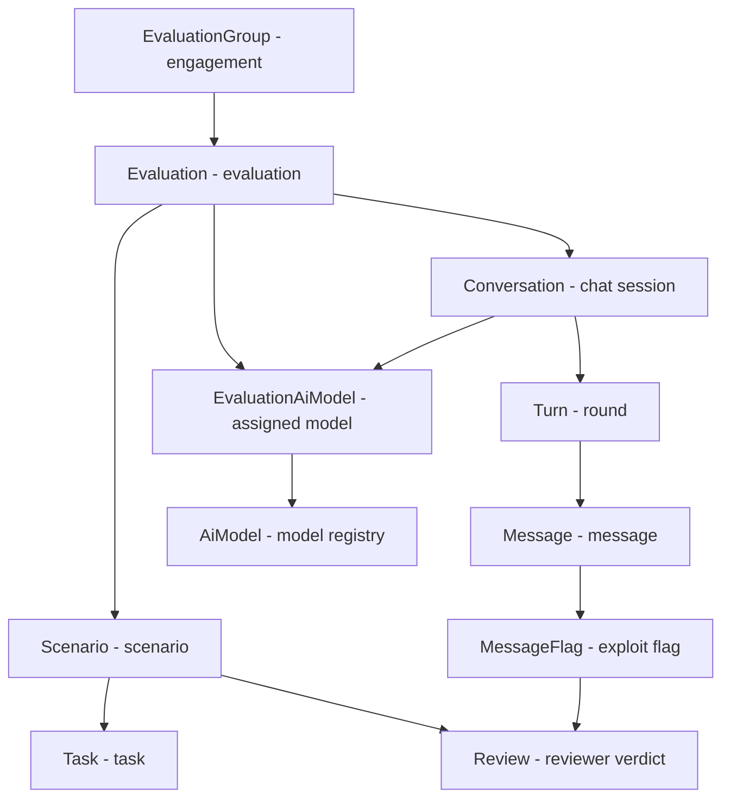
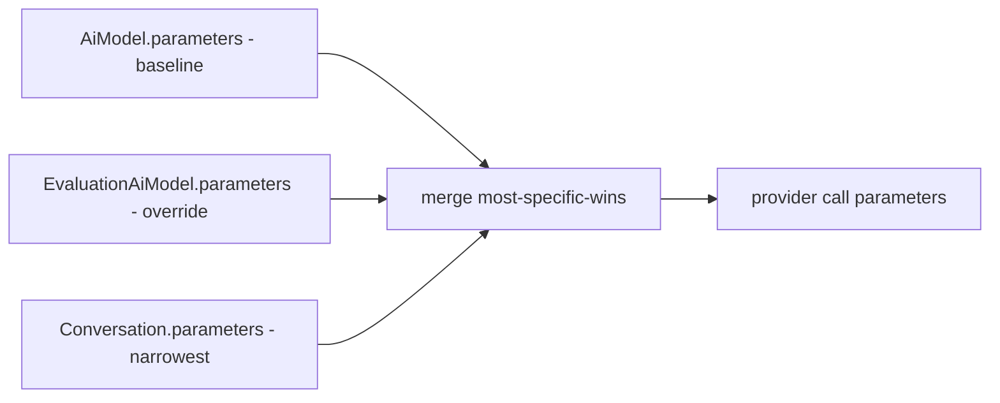
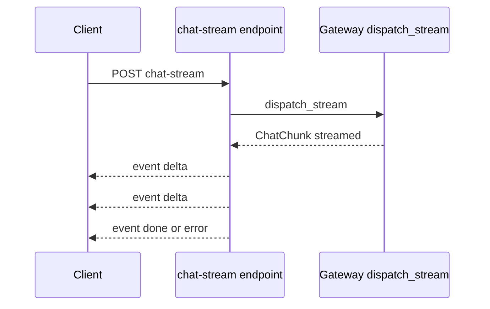

# Glossary

A cheat sheet of concepts used in the project and in this knowledge base. If you get lost on a name from the code or from another note, start here: a short definition + a link to the note where the topic is laid out in more detail.

Entries are alphabetical. Domain concepts (AI red-teaming, evaluations) and technical ones (SSE, JWE, Celery) are mixed together.

## Map of domain concepts

First a picture of how the evaluation-hierarchy concepts hang one under another. This is the skeleton of the whole domain.

## Glossary

### AI red-teaming
The project's domain. Red teams deliberately attack LLM models to detect weak points (jailbreaks, harmful responses). The backend handles this whole workflow: model registry, evaluations, chat sessions, annotations. See [What the project is](what-is-the-project.md).

### AiModel
A row in the AI model registry. Holds what a model is and how to call it: vendor, `provider_model_id`, optional endpoint, encrypted API key, default parameters. It is the baseline of the parameter cascade. See [AiModel](../data-models/ai-model.md).

### model_alias
A stable model slug (e.g. `gpt-4o-prod`). By it, [AI Gateway - dispatch](../components/ai-gateway-dispatch.md) finds the `AiModel` row. Different from `model_display_mask` (the masking alias in an evaluation) and from `provider_model_id` (the id on the provider's side). See [AiModel](../data-models/ai-model.md).

### provider (ProviderVendor)
A model vendor from a closed enum: `openai`, `anthropic`, `google`, `azure`, `cohere`, `huggingface`, `aws_bedrock`, `generic`. Adding a new one requires an `ALTER TYPE` migration. `generic` is any OpenAI-compatible endpoint. See [AiModel](../data-models/ai-model.md).

### EvaluationGroup
The top level of the domain: one red-teaming engagement (legacy `Event`). It has a publication status, an access level (`public` / `organization` / `invitation_only`; a `public` group is only visible once it leaves `draft`), dates, and an optional owning [organization](#organization--tenancy). Per-object roles hang off it. See [EvaluationGroup](../data-models/evaluation-group.md).

### partial draft
A work-in-progress [EvaluationGroup](../data-models/evaluation-group.md) saved via `POST /evaluation-groups/draft` with only a `title`. `title` / `description` / `start_date` are nullable so gaps are allowed; a `public` draft stays owner/manager-only (the `public` visibility arm is gated on `status != draft`). Completeness (required fields, `start_date >= today`, the `organization` invariant) is re-imposed at submit by `assert_group_submittable`. See [Evaluation domain](../components/evaluation-domain.md).

### duplicate-from-template
Cloning an [EvaluationGroup](../data-models/evaluation-group.md) (`POST /evaluation-groups/{id}/duplicate`) or [Evaluation](../data-models/evaluation.md) (`POST /evaluations/{id}/duplicate`) into a fresh copy owned by the caller. `include_children=true` deep-copies the children (evaluations / scenarios / tasks / model assignments, same shared [AiModel](../data-models/ai-model.md)); runtime data (conversations / flags / reviews) and API keys are never copied. Needs write access on the source, not mere visibility. See [Evaluation domain](../components/evaluation-domain.md).

### Organization / tenancy
The tenancy root: a flat, admin-managed entity (name + description) that scopes users and evaluation groups. A [User](../data-models/user-and-role.md) belongs to at most one (nullable `organization_id`); an [EvaluationGroup](../data-models/evaluation-group.md) can belong to one. The `organization` access level makes a group visible only to members of its org (resolved from the caller's **live** org, fail-closed on a soft-deleted org). Orgless accounts/groups stay platform-wide. See [Organization](../data-models/organization.md) and [Organizations](../components/organizations.md).

### data license / effective license
The license attached to red-teaming **data** (distinct from the code license, Apache-2.0). It is a **row** in `data_licenses` ([DataLicense](../data-models/data-license.md)) — either **curated** (the CC/ODC/CDLA set shipped in code and reconciled by `make synclicenses`, never editable via the API) or **user-authored** (an owner's own, full CRUD). A **three-layer cascade**, most-specific non-null wins: the platform default ([PlatformSettings](../data-models/platform-settings.md) singleton, `default_license_id`) → an [EvaluationGroup](../data-models/evaluation-group.md) override (`data_license_id`) → an [Evaluation](../data-models/evaluation.md) override (both NULL = inherit). The **effective license** is resolved at the projection layer; conversations inherit it from their evaluation. See [Data licensing & platform settings](../components/licenses.md).

### Evaluation
A single evaluation within a group. Holds the assigned models, scenarios, its own lifecycle status, and the `mask_models_enabled` toggle (masking model identity). See [Evaluation](../data-models/evaluation.md).

### Scenario
A single challenge within an evaluation (legacy `Challenge`). It has a `position` (ordering, dense 0,1,2...) and a list of tasks. See [Scenario](../data-models/scenario.md).

### Task
The lowest level: a concrete task in a scenario. A minimal row: name, description, FK to the scenario. See [Task](../data-models/task.md).

### EvaluationAiModel (assignment)
A join table: which `AiModel` is assigned to which `Evaluation`. It also carries `model_display_mask` (the alias when we mask) and its own `parameters` layer (override over the model). Addressed by `assignment_id`, not by `model_id`. See [EvaluationAiModel](../data-models/evaluation-ai-model.md).

### Conversation
A red-teamer's session with a model within an evaluation. It points to an assignment, carries the most specific layer of inference parameters. Every conversation belongs to exactly one conversation group (required parent). See [Conversation](../data-models/conversation.md) and [Conversations](../components/conversations.md).

### conversation group (ConversationGroup)
A named bucket grouping a red-teamer's conversations within one evaluation — the unit of comparative model testing (one prompt, several models side by side). It is a **required** parent: every conversation has exactly one group, batch-create spins up one conversation per model entry, and an emptied group is soft-deleted so a group never lingers without a live conversation. A `MAX_CONVERSATION_GROUP_SIZE` cap (default 4) bounds the membership. See [Conversation groups](../components/conversation-groups.md) and [ConversationGroup](../data-models/conversation-group.md).

### Turn
A single round in a conversation: a user message + the assistant's response(s). It has a dense `turn_index` (0,1,2...) local to the conversation. See [Turn](../data-models/turn.md).

### Message
A single message in a turn (`user`/`assistant`/`system`). It has a `status` (streaming→complete/error), an optional `slot` (the multi-model branch), and a self-FK `replaces_message_id` (regenerate). See [Message](../data-models/message.md).

### write-path / message persistence
The layer writing the conversation: `open_turn` creates a turn + placeholder, `finalize_message` closes it after the stream. Architecture A/B (the request session + `standalone_session`). Wired to the endpoint `POST .../conversations/{cid}/messages` (+ `/regenerate`, `/continue`), the `conversations:update` gate. See [Message persistence (write-path)](../components/message-persistence-write-path.md).

### MessageFlag / flag
A marker selecting a message as worth an exploit: `reason`, `red_flagged`, `status` (pending/approved/rejected). The first citizen of the `annotations` context; the lighter sibling without a review workflow is a [Note](#note). See [MessageFlag](../data-models/message-flag.md) and [Message flags](../components/message-flags.md).

### Note
An annotator's free-text remark on a **selection** of one conversation's messages (renamed from *Annotation*). Independent of a [flag](#messageflag--flag): no exploit assertion, no review status, and — the load-bearing difference — **its author need not own the conversation**, only see the parent group. Reads and the by-id writes stay author-scoped (lifted by the `evaluation_groups:manage` break-glass); the selection is fixed at create. Its own `notes:*` permission split. See [Note](../data-models/note.md) and [Notes](../components/notes.md).

### Annotation label
The vocabulary a per-message **label** picker suggests — flat reference data, anchored to no conversation. Two kinds in one table, told apart by `created_by_id` and enforced by a `CHECK`: **curated** (code-shipped, keyed by a stable `key`, reconciled by `make syncannotationlabels`) and **user-scoped** (a label an annotator names while annotating, never joining the shared list). The annotation entity that *carries* a label doesn't exist yet. Not to be confused with a [Note](#note) — a note is prose, a label is a token you aggregate over. See [AnnotationLabel](../data-models/annotation-label.md).

### Restore window
How long a soft-deleted row stays restorable — `RESTORE_WINDOW_DAYS`, 7 by default. Past it a tombstone is a 404: nothing purges it, it just stops being addressable. Bounds both the `?deleted=true` listings and every `POST .../restore`. Who may see and revive a tombstone is scoped by `deleted_by_id` (its deleter), except for licences, which are scoped by the row's **author**. See [Restore - reading tombstones back](../components/restore-soft-deleted-items.md).

### Content sealing
Encryption at rest of conversation **message text**, switched on per conversation by `content_protected` — resolved from the effective data licence at create time when that licence sets `protects_conversation_data`. Its own key (`CONVERSATION_SECRETS_KEY`), its own format, its own re-wrap sweep (`make rewraptranscripts`), sharing nothing with the AI-gateway credential crypto. `messages.content` is therefore sometimes ciphertext — always read it through `unseal_content`. See [Conversation content sealing](../components/conversation-content-sealing.md).

### conversation tag / tag schema
A free-form `key: value` pair on a [Conversation](../data-models/conversation.md) or a single user [Message](../data-models/message.md) which the backend folds into the model's **system prompt** as context — so it changes what the model is told, it is not archive metadata. Message tags override the conversation's per key. Each evaluation governs them with two flags (`tags_enabled`, `tags_restricted`) plus an allow-list of keys, the **tag schema** ([EvaluationTagKey](../data-models/evaluation-tag-key.md)); authored tags are *rejected* against that policy, stored ones are *filtered* at the fold. See [Conversation tags](../components/conversation-tags.md).

### token spend / usage metrics
Model token counts read from each assistant message's `extra["usage"]` and rolled up per evaluation, scenario, assigned model, and group. `prompt_tokens` re-counts resent history (right for cost, so per-message averages grow with depth by design); averages divide by the usage-bearing denominator, never by the full message count. The group-wide per-model breakdown is **withheld wholesale** when any evaluation masks model names — it would correlate a model's cost across evaluations. See [Analytics - aggregate metrics](../components/analytics.md).

### modality (input / output)
What a model takes in and gives back, declared by an operator as two **sets** (`text` / `image`) on [AiModel](../data-models/ai-model.md) — replacing the old single `modality` enum plus `supports_image_input` boolean. `input_modalities` gates image attachments and must include `text`; `output_modalities` gates dispatch (which needs a text reply) and must be non-empty. Held in `varchar[]` columns, not a DB enum, so a new modality is a code change. See [AI Gateway - dispatch](../components/ai-gateway-dispatch.md).

### custom role / role flags
Beside the code-owned canonical roles, an admin holding `roles:manage` can define **custom** roles. Four flags on the row carry the policy: `is_active` (an inactive role grants nothing yet stays in the catalog), `is_default` (auto-assigned to every new user), `is_participant_default` (granted on group self-join), `is_object_assignable` (may be held in-group). `NON_DELEGABLE_PERMISSIONS` keeps elevation vectors out of an operator-defined set. See [RBAC - global roles](../components/rbac-global-roles.md) and [User and Role](../data-models/user-and-role.md).

### reviewer pool / reviews:annotate
The set of users assignable as a reviewer in a group. Keyed on the **capability** `reviews:annotate` — a live, active role granting it, globally or in-group — not on the `annotator` role name, so a custom role can opt in. The access level scopes only the global arm; in-group holders are always assignable. One predicate serves both the `/annotators` picker and the assign gate. See [Reviews - reviewer verdicts](../components/reviews-reviewer-verdicts.md).

### Review / reviewer verdict
The assignment of a reviewer to a flag ("submission") plus their assessment: `status` (pending → approved/rejected), `successful_exploit`, `unique_exploit`, `valid_submission`, `number_prompts`, `notes`. A single flag collects multiple reviews, one per reviewer. The reviewer is an `annotator` (and `owner`/`admin`); a read-only `red_teamer` sees only reviews of their own flags. See [Review](../data-models/review.md) and [Reviews - reviewer verdicts](../components/reviews-reviewer-verdicts.md).

### review queue / required_reviews
The review queue (`GET /api/v1/review-queue`) lists flags whose number of completed verdicts is smaller than `Scenario.required_reviews` (fallback 1 with no live scenario). `required_reviews` is a **queue threshold, not an assignment limit** — assign does not enforce that number. See [Reviews - reviewer verdicts](../components/reviews-reviewer-verdicts.md) and [Scenario](../data-models/scenario.md).

### metrics dashboard / analytics
The reporting layer: two read-only dashboards that roll up an engagement's runtime data (submissions, reviewer verdicts, conversation/message activity) with nothing persisted. The **group dashboard** (`GET /evaluation-groups/{id}/metrics`) covers the whole event with a per-evaluation breakdown; the **evaluation dashboard** (`GET /evaluations/{id}/metrics`) is one evaluation plus exploit distributions (by prompt count, by model). Who sees them is **access-aware** (see below). See [Analytics - aggregate metrics](../components/analytics.md).

### metrics access level / metrics scope
Who may read a group's [metrics dashboards](#metrics-dashboard--analytics), and how much. A group configures its audience with two `MetricsAccessLevel` columns — `metrics_access_during` and `metrics_access_after` (values `owner_only` / `members_personal_metrics` / `all_members` / `inherit_group_access`). The gate returns a **`MetricsScope`**: `full` (event-wide, for the owner / `view_metrics` holder / break-glass admin, always) or `personal` (a member with `evaluation_groups:view_personal_metrics` at the `members_personal_metrics` level — filtered to their own submissions/conversations/reviews), or denies (403). See [Analytics - aggregate metrics](../components/analytics.md).

### saved view
A user's named, reusable list-view state — filters, sort, search, hidden columns, pagination — persisted per list console so it can be recalled. One `saved_views` table backs every list (a `resource` string key + a shape-validated-but-opaque `state` JSONB envelope); strictly owner-scoped, held by every role. See [Saved views](../components/saved-views.md) and [SavedView](../data-models/saved-view.md).

### notification (in-app)
A per-user in-app message shown by the console bell: a short `name` + optional `description`, a `read_at` mark, and an optional loose pointer at the row it is about (`object_type` / `object_id`, no FK) for deep-linking. Emitted by other contexts — a moderation verdict on an [evaluation](../data-models/evaluation.md)/[group](../data-models/evaluation-group.md) (never to the actor themselves) or a finished [export](../components/exports.md) — through `create_notification`, which flushes without committing so the notice lands with the emitting transaction. Strictly owner-scoped, no HTTP create, no break-glass. Row: `notifications`. See [Notifications (in-app feed)](../components/notifications.md) and [Notification](../data-models/notification.md).

### force logout / session revocation
An admin revoking **all** of a user's active sessions (permission `users:manage_sessions`). Auth is stateless JWT, so revocation is one Redis marker per user (`auth:revoked_after:<id>`): the auth middleware and the refresh exchange reject any token whose `iat` is at or before it. The read path fails **open** (a Redis blip must not 401 everyone); the refresh path fails **closed** (503), since it mints credentials. See [Authentication (auth)](../components/authentication.md) and [User management](../components/user-management.md).

### allowed-model subset
The set of AI models an [EvaluationGroup](../data-models/evaluation-group.md) permits its evaluations to use, held in `evaluation_group_ai_models` and edited as the declarative `allowed_model_ids` field. Every model assignment is gated on it, and an **empty subset allows nothing** (fail-closed) — so deleting a model can never silently widen a group's pool. See [EvaluationGroupAiModel](../data-models/evaluation-group-ai-model.md) and [Evaluation domain](../components/evaluation-domain.md).

### endpoint health check
An operator-triggered liveness probe of one registered model's endpoint, persisted on the [AiModel](../data-models/ai-model.md) row (`health_check_status` `checking`/`alive`/`dead` + `last_health_check_at` / `last_health_reason` / `last_healthy_at`). A Celery task retries a 1-token probe until the endpoint answers or the wake-deadline passes (waiting out a scale-to-zero cold start), then CAS-writes the verdict. Distinct from the **warmup probe**, which is automatic, transient, and never stored.

### media asset / signed URL
An uploaded image blob (cover/avatar/icon/chat attachment) tracked by a `media_assets` row and stored behind a swappable backend (local filesystem / S3). Uploads are decoupled: the consumer holds an opaque `key`, the store holds the bytes, and a **public** asset's reads are open (the unguessable UUID key is the capability). A **signed URL** layers time-limited access on the same proxy GET via an `itsdangerous`-signed token with its expiry embedded at mint — deliberately not an S3-presigned URL, so it stays backend-agnostic. A **private** asset (`is_private=true` at upload) 404s on the bare key and serves only via signed URLs bound to the requesting user; a beat-scheduled reaper GCs assets nothing references. See [Media (image upload & serving)](../components/media-images.md) and [MediaAsset](../data-models/media-asset.md).

### message attachment
Up to 5 images a red-teamer attaches to one user message for a vision-capable model: ordered `message_images` rows holding media keys of the caller's own private uploads. The history rebuild inlines them as base64 `data:` URLs on every (re)dispatch; the target model must declare `image` in its `input_modalities`. See [Message](../data-models/message.md) and [Message persistence (write-path)](../components/message-persistence-write-path.md).

### task completion
A red-teamer checking off a scenario [Task](../data-models/task.md) as done within one conversation they own. A toggle, not a status: a live `task_completions` row means done, un-checking soft-deletes it. Per conversation (⇒ per user); the `annotations` context's second feature after [message flags](#messageflag--flag) and before [notes](#note). See [Task completions](../components/task-completions.md) and [TaskCompletion](../data-models/task-completion.md).

### audit log
An append-only, FK-less trail of sensitive **actions** and **accesses**: actor, `action` (a `domain.verb` string), polymorphic target, curated before/after, `request_id`. Two write paths — mutating handlers call `record_audit(...)` atomically inside `@transactional`; reads/accesses (login attempts, export downloads, transcript reads) are captured by the innermost `AuditAccessMiddleware`. Never updated or soft-deleted; read back only by an admin (`GET /api/v1/audit-logs`, `audit:read`). Row: `audit_logs`. See [Audit log](../components/audit-log.md) and [AuditLog](../data-models/audit-log.md).

### export job
A background request to generate a CSV or JSON extract of an evaluation or evaluation group, optionally narrowed by row filters. Lands `pending`, a Celery worker runs it to `ready` (file stored) or `failed`; the requester polls then downloads. Only a group owner/admin may export (a whole-group extract). Row: `export_jobs`. See [Exports (CSV / JSON)](../components/exports.md) and [ExportJob](../data-models/export-job.md).

### export template / engagement report
An export template is a named, code-shipped tabular shape (`flags`, `reviews`, `conversations`, `conversation-groups`, `transcript`, `engagement_report`): its columns + a scoped row fetcher + the filter dimensions it honors, listed in the export catalog and rendered to CSV or JSON. The **engagement report** is the client-facing template — one denormalised row per conversation (red-teamer email, group/evaluation titles, full transcript as a JSON array), a complete shareable deliverable. See [Exports (CSV / JSON)](../components/exports.md).

### model masking
Hiding a model's real identity in API responses. When `Evaluation.mask_models_enabled` is on, the projection shows `model_display_mask` instead of the name/provider. This is only a response layer, the real row still resolves. See [EvaluationAiModel](../data-models/evaluation-ai-model.md).

### inference params / cascade
A dictionary of model knobs (temperature, max_tokens, system_prompt, stop_sequences...). The same shape hangs at several levels: `AiModel` is the baseline, assignment and conversation apply overrides. At call time the merge does most-specific-wins. See [AI Gateway - inference parameters](../components/ai-gateway-inference-parameters.md).

### dispatch
The [gateway's](../components/ai-gateway-overview.md) entry point. Translates `model_alias` into a provider call: finds the `AiModel` row, decrypts the credential, merges the parameters, translates the registry knobs into provider arguments. The `dispatch_chat` / `dispatch_stream` functions. See [AI Gateway - dispatch](../components/ai-gateway-dispatch.md).

### ModelProvider / adapter
The port/adapter pattern. `ModelProvider` is a Protocol (the port) with `chat` and `stream` methods. `LiteLLMProvider` is the only adapter and the only place importing `litellm`. The rest of the code knows only the neutral types. See [AI Gateway - LiteLLM provider](../components/ai-gateway-litellm-provider.md).

### warmup probe / scale-to-zero endpoint
A **scale-to-zero endpoint** (a self-hosted SLM or serverless GPU endpoint) idles down to no replicas and rejects the first request while it wakes. A model flags this per-row with `AiModel.warmup_enabled`; the client then warms it via the **warmup probe** (`dispatch_probe`, `POST /evaluations/{id}/models/{assignment_id}/warmup`) — a throwaway 1-token chat that itself triggers the wake and returns a coarse `WarmupStatus` (`ready` / `starting` / `error`). See [AI Gateway - dispatch](../components/ai-gateway-dispatch.md) and [AI Gateway - overview](../components/ai-gateway-overview.md).

### SSE / delta / done / error
Server-Sent Events: streaming the model's response to the client piece by piece. Provider chunks are translated into events: `delta` (a text fragment), `done` (the end, with usage), `error` (an error). See [Streaming SSE](../components/streaming-sse.md) and [Endpoint POST chat-stream](../components/endpoint-post-chat-stream.md).

### provider identity (ProviderIdentity)
An external login identity — one `(provider, subject)` pair from an OIDC IdP — linked to a local account, held in `provider_identities`. Persisting it is what keeps one human on one local `id` across sessions instead of re-resolving them by email each time. See [ProviderIdentity](../data-models/provider-identity.md) and [Authentication (auth)](../components/authentication.md).

### RBAC
Role-Based Access Control. Global roles (`admin`, `owner`, `red_teamer`, `annotator`, `viewer`) carry a set of permissions (`Permission`) that land in the JWT. The route gate is `require_permission`. See [RBAC - global roles](../components/rbac-global-roles.md).

### object role / break-glass
The second authorization scope: a role assigned per-specific-object (e.g. `owner` on a given `EvaluationGroup`), held in `object_role_assignments`. Break-glass is a global permission like `evaluation_groups:manage` that bypasses the per-object override (an admin gets in everywhere). See [Object roles - per-object permissions](../components/object-roles-per-object-permissions.md) and [ObjectRoleAssignment](../data-models/object-role-assignment.md).

### soft-delete
Deletion via a `deleted_at` stamp, not physically removing the row. `BaseModel` provides `live_select()` (filters deleted rows per-query through `with_loader_criteria`). No global listener; raw SQL is not filtered. See [Database and sessions](../components/database-and-sessions.md) and [Pagination, bulk and soft-delete](../components/pagination-bulk-and-soft-delete.md).

### RFC 7807 / Problem
The standard HTTP error format. Every non-2xx response is a `Problem` envelope with `Content-Type: application/problem+json`. The `APIError` hierarchy (`NotFoundError`, `ForbiddenError`...) maps to statuses. See [Error handling (RFC 7807)](../components/error-handling-rfc-7807.md).

### Celery
A background task queue. The second process type (worker) from the same code base. Uses Redis as the broker, a sync DB session (psycopg), JSON-only (anti-pickle). Email sending, and CSV export generation, go through Celery. See [Celery workers](../components/celery-workers.md) and [Email](../components/email.md).

### email backend
The wire-level sender behind transactional mail — an `EmailBackend` protocol with a single `send(message)`. Three adapters: `console` (log only), `ses` (AWS SESv2, Raw MIME so the inline logo rides along), `smtp` (stdlib smtplib); chosen at runtime by `EMAIL_BACKEND`. See [Email](../components/email.md).

### SLM / self-hosted model
Small language model. Locally, the opt-in `slm` compose service (a `llama.cpp`/llama-server image serving a small CPU model) exercises the `generic`/OpenAI-compatible model path with no cloud account — behind the `llm` profile via `make upllm`. See [Stack and tooling](stack-and-tooling.md) and [warmup probe / scale-to-zero endpoint](#warmup-probe--scale-to-zero-endpoint).

### Mailpit
A throwaway dev SMTP server with a web inbox (`localhost:8025`) that catches transactional mail when `EMAIL_BACKEND=smtp`; `make emailpreview` fires one sample of every template at it. See [Email](../components/email.md).

### JWE
JSON Web Encryption. Encrypts model API keys at-rest: `dir` + `A256GCM`, key from `MODEL_SECRETS_KEY`. Stored format: `<kid>:<jwe>`, with a keyring (active + retired) for rotation without data migration. The `joserfc` library. See [AI Gateway - key encryption](../components/ai-gateway-key-encryption.md).

## Shorthands from other layers

Concepts that come up in the notes but have their own home:

| Concept | What it is | Note |
|---|---|---|
| ProviderError | Provider error taxonomy, separate from HTTP | [AI Gateway - error taxonomy](../components/ai-gateway-error-taxonomy.md) |
| ChatMessage / ChatChunk | Neutral OpenAI-shape types, the gateway's I/O contract | [AI Gateway - message types](../components/ai-gateway-message-types.md) |
| Settings | The single config source, env -> pydantic-settings | [Configuration (Settings)](../components/configuration-settings.md) |
| transactional | A commit/rollback decorator on mutations | [Database and sessions](../components/database-and-sessions.md) |
| JWT | The session token (HS256), carries permissions | [Authentication (auth)](../components/authentication.md) |
| Invitation | A platform-wide or group-scoped invitation | [Invitation](../data-models/invitation.md) |

## Related

- [Start here](../README.md)
- [What the project is](what-is-the-project.md)
- [Architecture overview](architecture-overview.md)
- [Data model overview](../data-models/data-model-overview.md)
- [AI Gateway - overview](../components/ai-gateway-overview.md)
- [Evaluation domain](../components/evaluation-domain.md)
- [Reviews - reviewer verdicts](../components/reviews-reviewer-verdicts.md)
- [Authentication (auth)](../components/authentication.md)
- [Streaming SSE](../components/streaming-sse.md)
