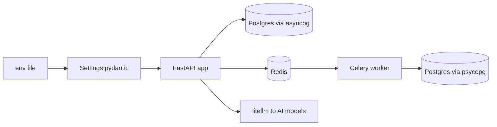
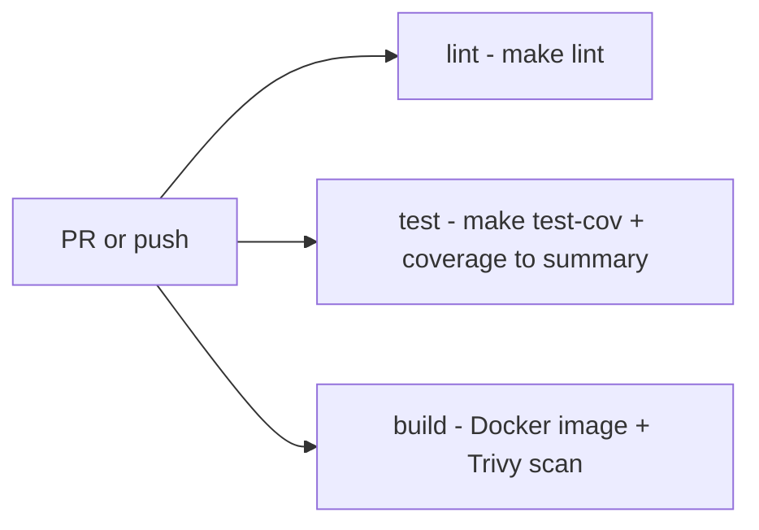

# Stack and tooling

A list of the technologies the backend stands on, plus the tools you use day to day to work with the code. When you get lost on "what's this library and what's it for" or "which command runs the tests" — this is the note.

In short: it's an async FastAPI backend on Python 3.14, managed by `uv`, with the Astral toolchain (ruff, ty). The database is Postgres, the queue is Celery on Redis, and conversations with AI models go through `litellm`.

## Map: where the stack comes from

## Runtime and framework

The core of the application. You touch this on every request.

| Technology | Role | Where it's used |
|---|---|---|
| Python 3.14 | The language. Pin `>=3.14,<3.15`, `.python-version` file = `3.14` | everything, image `python:3.14.6-slim` |
| FastAPI (`fastapi[standard]`) | Web framework. Routing, OpenAPI, dependency injection. Bundles uvicorn as the ASGI server | `app/main.py`, `app/api/` |
| Starlette | The base under FastAPI. Middleware and `StarletteHTTPException` in the error handler come from there | the middleware layer |
| SQLAlchemy 2 + SQLModel | The ORM. Async engine from SQLAlchemy, models inherit from `SQLModel` | `app/core/database.py`, models in the domains |
| Alembic | DB schema migrations. Async, takes the URL from `Settings` | `alembic/`, `alembic/env.py` |
| asyncpg | The Postgres driver for the application (FastAPI). URL `postgresql+asyncpg://` | the application engine |
| psycopg 3 | The Postgres driver for Celery (sync). URL `postgresql+psycopg://` | Celery workers |
| Pydantic 2 + pydantic-settings | Data validation and models. `Settings` reads env | API schemas, `app/core/config.py` |
| Celery | Background tasks. JSON-only, acks-late | `app/workers/celery_app.py` |
| Redis | Celery broker (db `/1`) plus application cache (db `/0`) | broker, cache |
| Postgres | The main database | all data |
| structlog | Structured logging, wired to stdlib logging | `app/core/logging.py`, middleware |

Why two Postgres drivers: FastAPI is async, so it uses `asyncpg`. The Celery worker is synchronous, so it uses `psycopg`. Details in [Database and sessions](../components/database-and-sessions.md).

## Integrations

Libraries for specific external things: AI models, OIDC, encryption, passwords.

| Technology | Role | Where it's used |
|---|---|---|
| litellm | The only adapter to LLM providers. Calls `litellm.acompletion` | `app/core/ai_gateway/providers/litellm.py` |
| sse-starlette | Streaming chat responses over Server-Sent Events (`EventSourceResponse`) | `app/core/conversations/streaming.py`, `app/api/v1/chat.py` |
| authlib | The OIDC client. Redirect to the IdP and back | `app/core/auth/services/oidc.py` |
| joserfc | JWT (session token, HS256) and JWE (encryption of model API keys) | `app/core/auth/services/jwt.py`, `app/core/ai_gateway/crypto.py` |
| argon2-cffi | Hashing user passwords | `app/core/auth/services/passwords.py` |
| itsdangerous | Signs the OIDC session cookie (runtime dep of `SessionMiddleware`) **and** the time-limited media signed-URL tokens (now a direct import — dropped from the deptry `DEP002` ignore) | the middleware layer, `app/core/media/signing.py` |
| pillow | Image decode + processing for uploaded media: sniff format from bytes, EXIF-transpose, downscale ≤1200² | `app/core/media/services/images.py` |
| jinja2 | Email templates on disk | `app/core/email/` |
| boto3 | AWS SDK. Used by the `ses` email backend (SESv2), the `s3` export storage backend, and the `s3` media storage backend; `botocore`/`anyio` (transitive) are declared to deptry as used-but-not-direct | `app/core/email/backends/`, `app/core/exports/storage/`, `app/core/media/storage/` |
| sentry-sdk | Opt-in error reporting (Sentry protocol → self-hosted GlitchTip); a no-op without `SENTRY_DSN` | `app/core/sentry.py`, `app/main.py`, `app/workers/celery_app.py` |
| prometheus-fastapi-instrumentator + prometheus-client | HTTP RED + process metrics on `GET /metrics`; module-level `redteam_*` counters/histograms in dispatch | `app/main.py`, `app/core/ai_gateway/dispatch.py` |

More on this layer: [AI Gateway - overview](../components/ai-gateway-overview.md), [AI Gateway - LiteLLM provider](../components/ai-gateway-litellm-provider.md), [Authentication (auth)](../components/authentication.md), [AI Gateway - key encryption](../components/ai-gateway-key-encryption.md), [Email](../components/email.md), [Media (image upload & serving)](../components/media-images.md).

## Dev tooling

What you run locally and what runs in CI. `uv` and `make` tie it all together.

| Tool | Role | Where/how |
|---|---|---|
| uv | Package and venv manager. `package=false` (this isn't a library) | `make install`, `uv sync`, `uv run` |
| ruff | Linter plus formatter. Replaces flake8, isort, black, pyupgrade. ~33 rule sets (incl. the added FURB/PERF/RET/RSE/PIE/FLY/A), `target-version=py314`, `line-length=120` | `make format`, `make lint` |
| pip-audit | Scan of the locked dependencies for known CVEs | `make audit` (a separate step, also in CI) |
| ty | Type checker from Astral (beta). Instead of mypy | `make lint` |
| bandit | Security linter, deeper than ruff `S`. Skips `tests` | `make lint` |
| deptry | Detects unused, missing, and misplaced dependencies | `make lint` |
| prek | A git-hook runner. A replacement for pre-commit | `make install-hooks`, `make lint` |
| pytest | Test runner. Markers: `unit`, `integration`, `e2e`, `slow` | `make test` |
| pytest-asyncio | `asyncio_mode=auto` for async tests | automatically |
| pytest-cov + coverage | Code coverage. Threshold `fail_under=80`, `branch=true` | `make test-cov` |
| pytest-random-order | Random test order, catches hidden dependencies between tests (under xdist the controller's seed is pushed to the workers) | automatically |
| pytest-xdist | Parallel test run (`--numprocesses=auto`, `--dist=worksteal` — test durations are uneven), each worker with its own test DB; `-n 0` disables | automatically |
| pytest-socket | Blocks the network in tests (allow loopback only) | automatically |
| time-machine | Freezes/travels time in tests (deterministic timestamps, TTLs) | tests |
| polyfactory | Test data factories | tests |
| pgcli | A SQL client for the database. Caps `sqlparse<0.6`, which `make audit` flags for CVEs; `[tool.uv] override-dependencies` in `pyproject.toml` forces `sqlparse~=0.6.0` past that cap. Dev group only — prod builds run `uv sync --no-dev`, so the override never reaches the image | `make dbshell` |

The key thing: `make lint` runs ruff + ty + deptry + bandit through prek (the pre-push stage), with the frontend hooks skipped (`SKIP=fe-eslint,fe-format-check`) — this is the backend's target in a monorepo whose prek config covers both halves. It's also in CI.

## Known issue: litellm vs Python 3.14

This is an important trap.

No released `litellm` declares support for Python 3.14 — its metadata caps Python at `<3.14`. `uv` ignores upper bounds of `requires-python`, so the lock resolves and installation and tests pass without a problem.

An artifact of this issue: litellm fires an internal async logging handler that it never awaits. A `RuntimeWarning` "coroutine ... was never awaited" flies on GC in a random test — that's why there's a silenced filterwarning in `pyproject.toml`. To be removed once litellm ships a version that allows 3.14.

`litellm` is imported **only** in `app/core/ai_gateway/providers/litellm.py`. The rest of the application doesn't know it exists — it talks through the neutral types and error taxonomy. For details: [AI Gateway - LiteLLM provider](../components/ai-gateway-litellm-provider.md) and [AI Gateway - error taxonomy](../components/ai-gateway-error-taxonomy.md).

## make targets and CI

`make` is the facade over everything. The most important targets:

| Target | What it does |
|---|---|
| `make setup` | first start after a clone: `install` + `install-hooks` + `migrate` + `seedlocal` (canonical roles + a full local dataset: one login per role plus a demo evaluation/conversation/flag/review) |
| `make install` | `uv sync --locked --all-groups` |
| `make install-hooks` | installs the prek git-hooks (once after a clone) |
| `make lock` | relock `uv.lock` from `pyproject` without an upgrade (e.g. after changing `requires-python`) |
| `make lint` | ruff + ty + deptry + bandit through prek (frontend hooks skipped) |
| `make audit` | pip-audit — a scan of the locked deps for CVEs |
| `make format` | `ruff format` + `ruff check --fix` |
| `make test` | tests on the host (brings up `db` and `redis` first) |
| `make test-cov` | tests with coverage |
| `make migrate` | `alembic upgrade head` in a container |
| `make makemigrations MSG=...` | autogenerate a migration |
| `make mergemigrations MSG=...` | `alembic merge heads` — resolve divergent heads after a branch merge |
| `make checkmigrations` | fail if the migration history has more than one head (no live DB needed) |
| `make synclicenses` | upsert the curated data-license catalog into `data_licenses` (a deploy step after `migrate`; part of `seedlocal`) |
| `make syncannotationlabels` | upsert the curated annotation-label catalog into `annotation_labels` (same deploy slot as `synclicenses`; part of `seedlocal`) |
| `make rewraptranscripts` | re-wrap sealed message text onto the active conversation key — a **rotation** step, run after promoting a key and restarting every replica, before dropping the previous one; `ARGS=--dry-run` just counts what is left |
| `make resetdata` | drops ALL compose volumes (incl. the SLM model cache) and re-migrates (local recovery) |
| `make emailpreview` | send one sample of every email template to the local Mailpit inbox (forces the `smtp` backend for that run) |
| `make newman COLL=<name>` | run one self-contained Postman scenario collection under Newman against the live stack |
| `make newmanchained COLL=<name>` | the same, for a collection that needs `00-bootstrap`'s exported environment (ids + `access_token`) |
| `make up` / `make down` | the whole stack in docker compose (`up` includes Mailpit; `down` also stops opt-in profiles) |
| `make upllm` | the whole stack **plus** the opt-in self-hosted SLM (llama.cpp, `llm` profile); first run downloads the model |
| `make upmonitoring` | starts `postgres-exporter` for the local monitoring stack (opt-in `monitoring` profile); run `make seedlocal` after, for the read-only `monitoring` role it connects as |

`synclicenses` sits alongside `syncroles` as the second **idempotent reconcile** step a deploy runs after `migrate` — both project a code-shipped catalog onto rows (see [Data licensing & platform settings](../components/licenses.md)).

The two `newman` targets run the published `postman/newman` image with `--network host` — no host Node needed — so the Postman scenario collections under `docs/postman/` are runnable as a smoke suite against a live local stack.

Convention: target names without separators (`migrationsql`, not `migration-sql`). Migrations always go through `make` in a container (the directories are mounted as volumes, so the files come back to the host).

## Local dev services: Mailpit + opt-in SLM

Two compose services exist purely to make external integrations testable locally without cloud accounts:

- **Mailpit** (`axllent/mailpit`) — a throwaway SMTP sink with a web inbox on `localhost:8025` (SMTP on `1025`). It always runs with `make up`; routing mail to it is just an `.env` switch (`EMAIL_BACKEND=smtp`, `SMTP_HOST=mailpit`, `SMTP_PORT=1025`, `SMTP_TLS=none`). `make emailpreview` fires one sample of every template at it for a styling review. See [Email](../components/email.md).
- **`slm`** (`ghcr.io/ggml-org/llama.cpp:server-*`, pinned to a numbered build) — an **opt-in** self-hosted model serving Qwen2.5-0.5B-Instruct (CPU-only) behind the compose `llm` profile, so plain `make up` skips it. `make upllm` brings it up (first run downloads the ~400 MB GGUF into the `slm_models` volume, exposed on `localhost:8081`). It exercises the `generic` provider through litellm's `openai` path — no code change to register a self-hosted OpenAI-compatible model. `make seedlocal` registers a matching `local-slm` `AiModel` row (inert until `make upllm` runs); the server, the seeded row, and the e2e test share one credential — `SLM_API_KEY` (default `local`). See [Configuration (Settings)](../components/configuration-settings.md).

Async exports use a shared `export_data` compose volume mounted into both `app` (serves downloads) and `worker` (generates files); the image seeds `/src/var/exports` as `app:0` group-writable so a non-1000 host UID can write it while staying non-root.

CI (`.github/workflows/ci.yml`) runs on every PR and push to `main`/`dev`. Three jobs:

- **lint** — `make install`, then `make lint` + `make audit` (pip-audit for CVEs).
- **test** — `make test-cov`, adds the coverage report to the PR summary.
- **build** — builds the Docker image and scans it with Trivy (`HIGH,CRITICAL`, blocks on a finding).

CD runs only after a green CI on `main` and deploys to a single `dev` environment (EC2 + Caddy). Environment configuration: [Configuration (Settings)](../components/configuration-settings.md) and [Flow - config from env to Settings](../flows/flow-config-env-to-settings.md).

## Related

- [What the project is](what-is-the-project.md)
- [Architecture overview](architecture-overview.md)
- [Directory structure](directory-structure.md)
- [Configuration (Settings)](../components/configuration-settings.md)
- [Database and sessions](../components/database-and-sessions.md)
- [Celery workers](../components/celery-workers.md)
- [Observability](../components/observability.md)
- [AI Gateway - overview](../components/ai-gateway-overview.md)
- [AI Gateway - LiteLLM provider](../components/ai-gateway-litellm-provider.md)
- [AI Gateway - error taxonomy](../components/ai-gateway-error-taxonomy.md)
- [Streaming SSE](../components/streaming-sse.md)
- [Authentication (auth)](../components/authentication.md)
- [AI Gateway - key encryption](../components/ai-gateway-key-encryption.md)
- [Email](../components/email.md)
- [Flow - config from env to Settings](../flows/flow-config-env-to-settings.md)
