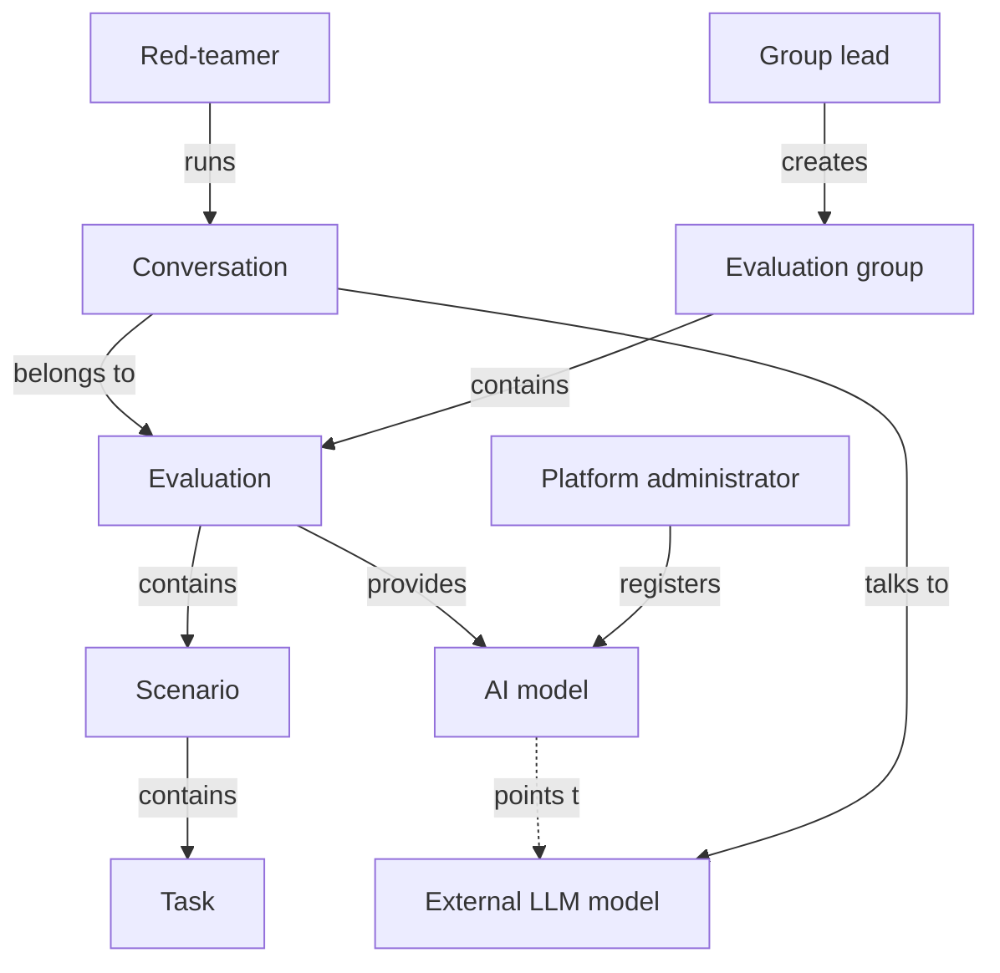

# What the project is

This is the backend of a platform for **AI model red-teaming**. Put simply: people from "attacking" teams hold conversations with AI models (LLMs), try to get something harmful or undesirable out of them, and the system organizes all of it, records it, and lets you assess the results.

If you got lost in the repo: this is an API server (FastAPI) that connects red-teamers with AI models and keeps track of who does what, in which evaluation.

## What AI red-teaming is

Red-teaming is deliberately "attacking" a system to find its weaknesses before someone unauthorized does. In the AI context the goal is to check whether the model:

- can be talked into a harmful response (instructions, hate speech, sensitive data),
- can have its safeguards bypassed (a so-called jailbreak),
- behaves differently than its author intended.

This is done by a human — the **red-teamer** — who talks to the model through our platform. The backend does not assess the model itself. It provides the tools: access to models, conversation recording, task structure, and permissions.

## What this backend does

In short: it is a gateway and an organizer.

| Does | Why |
|---|---|
| Holds a registry of AI models | so a red-teamer can talk to different models without knowing their API keys |
| Streams the conversation with the model | the model's response goes to the browser live, token by token (SSE) |
| Organizes work into a hierarchy | evaluation groups → evaluations → scenarios → tasks |
| Guards access | who is an admin, who belongs to which group, what they can see |
| Invites people | email invitations to the platform and to a specific group |

The AI model itself is **external** (OpenAI, Anthropic, Google, etc.). The backend only reaches it through one intermediary layer — see [AI Gateway - overview](../components/ai-gateway-overview.md).

## Main concepts (top to bottom)

The system arranges work into four levels. From the largest to the smallest:

| Level | What it is | Note |
|---|---|---|
| Evaluation group | the whole red-teaming engagement, e.g. "evaluation of model X for client Y" | [EvaluationGroup](../data-models/evaluation-group.md) |
| Evaluation | one assessment within a group | [Evaluation](../data-models/evaluation.md) |
| Scenario | a concrete challenge within an evaluation | [Scenario](../data-models/scenario.md) |
| Task | the smallest unit of work within a scenario | [Task](../data-models/task.md) |

On top of that come side concepts, but key ones:

- **Conversation** ([Conversation](../data-models/conversation.md)) — the session in which a red-teamer actually talks to a model within an evaluation.
- **AI model** ([AiModel](../data-models/ai-model.md)) — an entry in the registry: which model, where the endpoint is, what key (encrypted), what parameters.
- **Model assignment** ([EvaluationAiModel](../data-models/evaluation-ai-model.md)) — which model is available in which evaluation.
- **User and roles** ([User and Role](../data-models/user-and-role.md)) — who someone is and what they can do globally.
- **Per-object roles** ([ObjectRoleAssignment](../data-models/object-role-assignment.md)) — who is what in a specific group.

You'll find full definitions in the [Glossary](glossary.md).

## Who uses the system (actors)

| Actor | What they do |
|---|---|
| Platform administrator | manages AI models, users, settings |
| Group lead | creates a group, invites people, sets up evaluations and scenarios |
| Red-teamer | runs conversations with models, performs tasks |
| AI model (external) | answers messages — it is the thing we test, not a "user" but a resource |

Global roles are described in [RBAC - global roles](../components/rbac-global-roles.md), and permissions within a single group in [Object roles - per-object permissions](../components/object-roles-per-object-permissions.md).

## Diagram: actors and main resources

## How it all comes together

The most important flow in the system: a red-teamer sends a message, it travels through the backend to the external model, and the response comes back live as a stream. This full path is described in [Flow - AI message streaming (end-to-end)](../flows/flow-ai-message-streaming-end-to-end.md).

Briefly, in points:

1. The admin registers an AI model ([AiModel](../data-models/ai-model.md)) — address and key.
2. The lead assigns the model to an evaluation ([EvaluationAiModel](../data-models/evaluation-ai-model.md)).
3. The red-teamer opens a conversation ([Conversation](../data-models/conversation.md)) and writes.
4. The backend calls the real model through the [AI Gateway - overview](../components/ai-gateway-overview.md).
5. The response comes back as an SSE stream — see [Streaming SSE](../components/streaming-sse.md) and [Endpoint POST chat-stream](../components/endpoint-post-chat-stream.md).

The full sequence from adding a model to a conversation: [Flow - from AI model registration to invocation](../flows/flow-ai-model-registration-to-invocation.md).

## What this backend does NOT do

- It does not contain its own AI model — it always reaches out to external providers.
- It has no frontend — it is a pure API (the SPA is separate, the backend only knows its URL for links in emails).
- It runs no synchronous heavy work in the request — long jobs (email, CSV export generation) are handed to Celery and polled/delivered out of band.

The architecture as a whole (modular monolith, layers, contexts) is described in [Architecture overview](architecture-overview.md).

## Related

- [Start here](../README.md)
- [Architecture overview](architecture-overview.md)
- [Glossary](glossary.md)
- [Evaluation domain](../components/evaluation-domain.md)
- [EvaluationGroup](../data-models/evaluation-group.md)
- [Evaluation](../data-models/evaluation.md)
- [Scenario](../data-models/scenario.md)
- [Task](../data-models/task.md)
- [Conversation](../data-models/conversation.md)
- [AiModel](../data-models/ai-model.md)
- [EvaluationAiModel](../data-models/evaluation-ai-model.md)
- [User and Role](../data-models/user-and-role.md)
- [ObjectRoleAssignment](../data-models/object-role-assignment.md)
- [RBAC - global roles](../components/rbac-global-roles.md)
- [Object roles - per-object permissions](../components/object-roles-per-object-permissions.md)
- [AI Gateway - overview](../components/ai-gateway-overview.md)
- [Streaming SSE](../components/streaming-sse.md)
- [Endpoint POST chat-stream](../components/endpoint-post-chat-stream.md)
- [Flow - AI message streaming (end-to-end)](../flows/flow-ai-message-streaming-end-to-end.md)
- [Flow - from AI model registration to invocation](../flows/flow-ai-model-registration-to-invocation.md)
