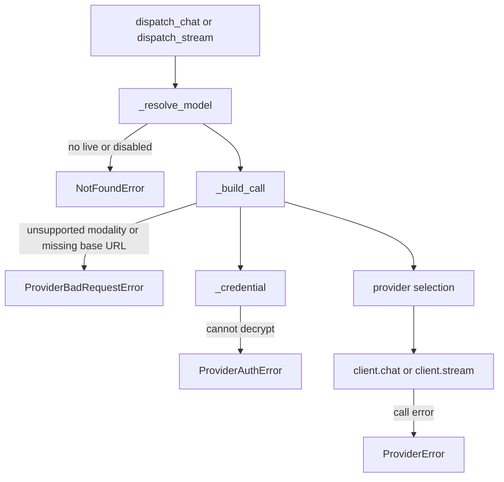
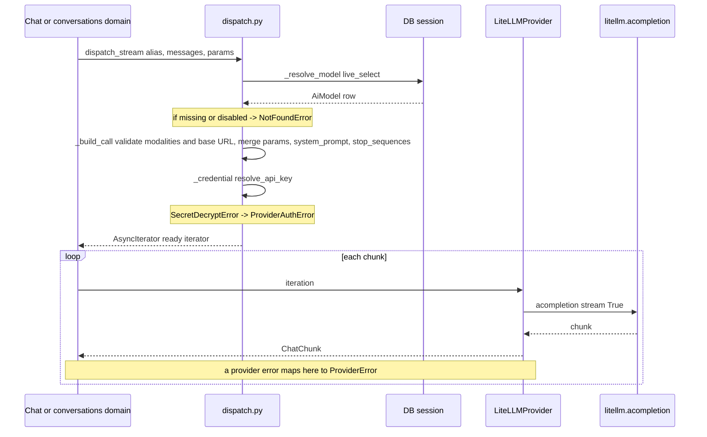

# AI Gateway - dispatch

This is the entry gate into the gateway. The domain (conversations, evaluations) does not know the provider or the `litellm` library. It only says: "I have this `model_alias`, these messages and these parameters — call the model". The rest happens here.

All the code lives in `app/core/ai_gateway/dispatch.py`. Four public functions: `dispatch_chat` (a one-shot response), `dispatch_stream` (a stream of chunks), `dispatch_probe` (a readiness check — see [Warmup probe](#warmup-probe-dispatch_probe)) and `dispatch_health` (the shared probe classifier behind it, [below](#health-probe-dispatch_health--the-shared-classifier)). The first three take a `model_alias` and turn it into a concrete provider call; `dispatch_health` takes an already-resolved row.

> [!info] Import decision
> You import `dispatch_*` DIRECTLY from `app.core.ai_gateway.dispatch`, not from the package root. That keeps the *package root* free of `litellm`. Note that the CRUD router (`app/api/v1/ai_models.py`) does reach the litellm-backed module transitively — its `/health-check` route imports the health service and Celery task, which import `dispatch_health` — so the router is no longer litellm-free the way the warmup split (`app/api/v1/model_warmup.py`) was designed to keep it. See [AI Gateway - overview](ai-gateway-overview.md).

## Why this (intuition)

`model_alias` is a stable slug from [AiModel](../data-models/ai-model.md) (e.g. `gpt-4o-prod`). By that slug you look up the row in the database. From the row you pull: the provider, its `provider_model_id`, the API key, the custom endpoint and the inference parameters. You assemble the arguments from that and call the adapter ([AI Gateway - LiteLLM provider](ai-gateway-litellm-provider.md)). That's it.

## Step by step



### 1. `_resolve_model` — find the row

`dispatch.py:118-124`

```python
statement = AiModel.live_select().where(col(AiModel.model_alias) == model_alias)
result = await session.execute(statement)
model = result.scalar_one_or_none()
if model is None or model.is_disabled:
    raise NotFoundError(f"Model {model_alias!r} is not available.")
return model
```

Two gates:
- `live_select()` filters out soft-deleted (rows with `deleted_at`).
- `is_disabled` (a set `disabled_at`) is also treated as "unavailable".

So soft-deleted and disabled are two different mechanisms, but for dispatch both mean the same thing: `NotFoundError`. More in [AiModel](../data-models/ai-model.md).

### 2. `_build_call` — assembling the arguments

This is the heart of dispatch. It takes the row and assembles the kwargs dict for the adapter.

`app/core/ai_gateway/dispatch.py`

```python
def _build_call(model, settings, messages, params, *, system_suffix=None) -> dict[str, Any]:
    if Modality.TEXT not in model.output_modalities:
        raise ProviderBadRequestError(f"Model {model.model_alias!r} does not produce text output.")
    if Modality.IMAGE not in model.input_modalities and _has_image_content(messages):
        raise ProviderBadRequestError(f"Model {model.model_alias!r} does not accept image input.")
    # Write-side validation cannot reach rows that predate it.
    if missing_inference_endpoint(model.provider, model.inference_endpoint):
        raise ProviderBadRequestError(
            f"Model {model.model_alias!r} is generic but carries no inference_endpoint — there is no base URL to call."
        )
    # An advanced_params_disabled row drops the whole operator cascade — its own knobs
    # and everything the caller merged on top. This is the single chokepoint, so no
    # upstream param source can bypass the flag.
    merged = {} if model.advanced_params_disabled else merge_inference_params(model.parameters, params)
    system_prompt = merged.pop("system_prompt", None)
    # Registry names it stop_sequences; litellm's kwarg is stop. Without this it
    # would be dropped by drop_params and silently never applied.
    stop = merged.pop("stop_sequences", None)
    if stop is not None:
        merged.setdefault("stop", stop)
    # system_suffix is appended AFTER the suppression above: it carries gateway-owned
    # context (the conversation tag block), not an operator knob.
    system_content = "\n\n".join(part for part in (system_prompt, system_suffix) if part)
    call_messages = [ChatMessage(role="system", content=system_content), *messages] if system_content else messages
    return {
        "vendor": model.provider,
        "provider_model_id": model.provider_model_id,
        "messages": call_messages,
        "api_key": _credential(model, settings),
        "api_base": model.inference_endpoint,
        "params": merged,
    }
```

What happens here, in order:

| Step | What it does | Why |
|---|---|---|
| Output gate | `text` must be in `model.output_modalities` | dispatch asks for a chat completion, so a model that cannot answer in text is refused up front |
| Vision gate | image content parts pass only when `image` is in `model.input_modalities` | an operator declaration on [AiModel](../data-models/ai-model.md); an image to a text-only model → `ProviderBadRequestError` (400) instead of an opaque provider error |
| Base-URL gate | a `generic` row must carry an `inference_endpoint` (`missing_inference_endpoint`, shared with the write path) | write-side validation can't reach legacy rows; without this such a row would ride litellm's `openai` defaults — red-teaming OpenAI on the platform key |
| `advanced_params_disabled` | drops the merge entirely for this row | one chokepoint, so the opt-out can't be bypassed by a new param source upstream — see [AiModel](../data-models/ai-model.md) |
| `merge_inference_params` | merge `model.parameters` + `params` from the call | the call wins (most-specific-wins) — see [AI Gateway - inference parameters](ai-gateway-inference-parameters.md) |
| `system_prompt` -> system message | pulls it out of params and inserts it as the first `ChatMessage(role="system")` | the provider has no `system_prompt` knob; it has to be a message |
| `system_suffix` appended | joined onto the system message with a blank line, **after** the flag check | gateway-owned context ([conversation tags](conversation-tags.md)) must still reach a model that opted out of the params cascade |
| `stop_sequences` -> `stop` | renaming the knob to the litellm name | without this `drop_params=True` would silently eat it |
| `api_base` | `model.inference_endpoint` | custom URL for an OpenAI-compatible provider |
| `extras` | NOT forwarded | this is call-shape metadata, not an inference parameter |

Renaming the names is not cosmetic. The adapter has `litellm.drop_params = True`, so litellm itself drops knobs the provider does not know. If `stop_sequences` went on under that name, litellm would silently remove it and `stop` would never work. Hence the explicit rename here. Same with `system_prompt` — it is not a provider kwarg, it is a message.

> [!note] `setdefault`, not assignment
> `merged.setdefault("stop", stop)` — if someone already manually pins `stop` in the row's `parameters`, its value wins over the translated `stop_sequences`.

> [!warning] Never fold platform context into `params`
> `params` is exactly what `advanced_params_disabled` suppresses. Putting the tag block in `params["system_prompt"]` would silently drop it for a flagged model while the reply still recorded that context as sent. Same reasoning for the probes' `max_tokens: 1`, which is applied to `call["params"]` *after* `_build_call` returns.

### 3. `_credential` — decrypt the key

Calls `resolve_api_key(model, settings)`, catches `SecretDecryptError` and turns it into `ProviderAuthError` — a **terminal** auth fault, not a transient outage (the credential is present but unreadable, so no retry will fix it, so the JOSE cause does not leak). Returns the decrypted secret or `None`. Encryption details in [AI Gateway - key encryption](ai-gateway-key-encryption.md).

### 4. Provider selection + invocation

The default adapter is a module-level instance:

```python
_DEFAULT_PROVIDER: ModelProvider = LiteLLMProvider()
```

`dispatch_chat`/`dispatch_stream` take a `provider=None` argument. If supplied — it overrides the default (tests, a future second adapter). Otherwise `_DEFAULT_PROVIDER` is used.

## chat vs stream — where the error surfaces

This is the most important difference between these two functions. It is not about the shape of the data (chat returns `ChatCompletion`, stream `AsyncIterator[ChatChunk]` — see [AI Gateway - message types](ai-gateway-message-types.md)), but about the MOMENT at which the error comes back to you.

`dispatch_stream` is DELIBERATELY written so that it is NOT an async generator (there is no `yield`). This is intentional.

```python
# dispatch_chat
model = await _resolve_model(session, model_alias)
client = provider or _DEFAULT_PROVIDER
return await client.chat(**_build_call(model, settings, messages, params), timeout=timeout)
```

```python
# dispatch_stream — same shape, but returns an iterator (wrapped for metrics)
model = await _resolve_model(session, model_alias)
client = provider or _DEFAULT_PROVIDER
stream = client.stream(**_build_call(model, settings, messages, params), timeout=timeout)
return _observed_stream(stream, model.provider.value)
```

If `dispatch_stream` were an async generator, ALL the code (including `_resolve_model` and `_build_call`) would only fire on the first iteration. Then you cannot tell "bad alias" apart from "the provider died mid-stream". And the endpoint needs that boundary: on a resolution error it wants to return 404/400 BEFORE it opens the SSE stream.

| Errors from the resolution phase | When they surface |
|---|---|
| `NotFoundError` (bad/disabled/deleted alias) | on `await dispatch_stream(...)` — before the first chunk flies |
| `ProviderBadRequestError` (unsupported modality, missing `generic` base URL, unknown vendor) | on `await` |
| `ProviderAuthError` (credential cannot be decrypted) | on `await` |
| `ProviderError` and subtypes (provider/transport, also mid-stream) | on ITERATION over the iterator |

So: `await dispatch_stream(...)` returns a ready iterator. If the alias was bad, you get the exception immediately, on the await. Only when you start iterating the chunks can provider errors pop up — including mid-stream, after partial output. This is exactly the boundary used by [Endpoint POST chat-stream](endpoint-post-chat-stream.md) and [Streaming SSE](streaming-sse.md).

For `dispatch_chat` the distinction does not matter — everything happens under a single `await`, so every error (resolution or provider) surfaces in the same place.

## Sequence diagram



## What dispatch returns / what it raises

| Function | Returns | Raises |
|---|---|---|
| `dispatch_chat` | `ChatCompletion` | `NotFoundError`, `ProviderBadRequestError`, `ProviderAuthError`, `ProviderError` |
| `dispatch_stream` | `AsyncIterator[ChatChunk]` | the same — but split into await vs iteration (see above) |
| `dispatch_probe` | `WarmupStatus` | `NotFoundError` only — every `ProviderError` is caught and mapped to a status |

The full exception hierarchy and HTTP mapping: [AI Gateway - error taxonomy](ai-gateway-error-taxonomy.md).

## Call metrics — every provider call is metered

Dispatch owns two Prometheus series (module-level, land on `GET /metrics` via the default registry — see [Observability](observability.md)):

- `redteam_model_calls_total{provider, outcome}` — counter; `outcome` ∈ `ok`, the mapped [ProviderError taxonomy](ai-gateway-error-taxonomy.md) (`rate_limit`/`timeout`/`auth`/`context_window`/`bad_request`/`unavailable`), `aborted` (the consumer walked away mid-stream — `GeneratorExit`/`CancelledError`, not a provider fault), `error` (anything else).
- `redteam_model_call_duration_seconds{provider, outcome}` — histogram with buckets up to 300 s (LLM calls routinely exceed Prometheus' default 10 s ceiling).

`dispatch_chat` times the single `await`; `dispatch_stream` wraps the provider stream in `_observed_stream`, so the observation spans **first iteration to exhaustion** (the wrapper is lazy — pre-flight failures in `_resolve_model`/`_build_call` are exceptions, not call metrics) and closes the wrapped generator deterministically in `finally`. The probe paths (`dispatch_probe` / `dispatch_health` / `dispatch_capability_probe`) call the adapter directly and are never metered — they aren't real traffic and their cold-start timeouts would pollute the provider error-rate/latency series.

## Usage stamps — the inactivity bookkeeping

Both real-traffic entry points also stamp the registry row, on a **detached** session (`session_provider`, a required keyword — `get_db` never commits and both streaming call sites close the request session right after dispatch returns, so a stamp on it would roll back unwritten):

| Helper | Writes | Fired |
|---|---|---|
| `_stamp_usage` | `last_used_at = now`, `inactivity_alerted_at = NULL` | `dispatch_chat` after `_build_call`; `dispatch_stream` as iteration begins |
| `_stamp_warmup` | `last_warmup_at = now`, at most every 5 min | `dispatch_probe` |

Three deliberate details:

- **After `_build_call`**, so a permanently misconfigured model (no endpoint, no text output) doesn't read as "used" on every failed attempt and thereby never alert.
- **As iteration begins**, not on the `await` — both call sites `db.close()` in between, so the stamp's pooled checkout never nests inside a held request connection. A config fault still raises on the `await`, before any stamp; config faults are not usage.
- **A warmup never touches `last_used_at`** — keeping an endpoint warm without messaging it is the cost pattern the alert exists to catch.

`_stamp` never raises (SQL errors are logged as `ai_gateway.usage_stamp_failed`) and pins `updated_at`, so a public "last update" timestamp doesn't move on every message and every warmup poll.

## Warmup probe (`dispatch_probe`)

`dispatch_probe` is the third entry point, added for scale-to-zero endpoints (self-hosted SLMs on a serverless GPU, a HuggingFace Inference Endpoint). A cold endpoint rejects the first real message while a replica wakes; the probe fires a throwaway 1-token chat first — **the probe itself is the wake signal** — and reports a coarse readiness so the client can poll until `ready` before sending anything.

It is a two-liner over the shared classifier `dispatch_health` (below): resolve the alias, probe, drop the reason. Both **never raise `ProviderError`** — the fault is the answer, not an exception:

```python
model = await _resolve_model(session, model_alias)
status, _reason = await dispatch_health(model, settings, provider=provider)
return status
```

The classification is the whole point:

| Outcome | Status | Meaning for the client |
|---|---|---|
| call succeeds | `ready` | send the first message now |
| `ProviderRateLimitError` | `ready` | endpoint is up, just throttled — don't keep it waiting |
| `ProviderUnavailableError` / `ProviderTimeoutError` | `starting` | still waking (the probe just triggered scale-up) — retry |
| any other `ProviderError` (auth, bad request, context window, base) | `error` | terminal — a retry won't fix it (e.g. bad credentials) |
| `NotFoundError` (bad / disabled / deleted alias) | — | **propagates** — a 404, not a warmup state, so it isn't swallowed into `error` |

`max_tokens: 1` and a fixed `_PROBE_TIMEOUT` (10s) keep the probe cheap. The HTTP surface is a separate router, `app/api/v1/model_warmup.py` (`POST /evaluations/{evaluation_id}/models/{assignment_id}/warmup`), kept out of the CRUD router precisely so this litellm-backed dispatch import stays off the CRUD path — see [AI Gateway - overview](ai-gateway-overview.md#warming-up-scale-to-zero-endpoints).

## Capability probe (`dispatch_capability_probe`)

The fifth entry point. It re-sends the same call with a 1×1 transparent PNG attached — the smallest thing unambiguously an image, so it tests whether the endpoint takes image parts at all, not whether it can describe a picture — and returns `(conclusive, mismatch reason)`.

Three outcomes, not two: `(True, None)` the image was taken, `(True, reason)` it was refused, `(False, None)` nothing was learned. The caller **must keep** the stored finding on the third; collapsing it into "no mismatch" would report a rate-limited endpoint as having confirmed a declaration nobody checked.

Only `ProviderBadRequestError` is conclusive, and it is conclusive because the probe is **differential**: `dispatch_health` has just made the identical call *minus* the image part and been served, so a 400 here is attributable to the image or the content-part shape. The caller owes that premise — which is why a liveness verdict that came from a rate limit skips the probe (`_HEALTH_FAULTS` maps `ProviderRateLimitError` to `(READY, "rate-limit")`; the reason is never persisted, its *presence* is the signal). Every other fault is inconclusive and logged with its `error_class` — the bare base `ProviderError` is the one worth hunting for.

The call is built **outside** the `try`, so only the provider's refusal can be reported as one: our own gates also raise `ProviderBadRequestError`, and dressing those as upstream evidence would accuse the operator of what the caller got wrong. The token cap rides `call["params"]` after the build, for the `advanced_params_disabled` reason above.

## Health probe (`dispatch_health`) — the shared classifier

`dispatch_health(model, settings, *, provider=None) -> tuple[WarmupStatus, str | None]` is the fourth entry point and the classifier `dispatch_probe` now delegates to. Three differences from the warmup wrapper:

- **It takes an already-resolved `AiModel` row**, not an alias — going straight to `_build_call`, so it works on a **disabled** model (the manual health check must be usable *before* enabling an endpoint).
- **It returns a machine reason** alongside the status (`timeout`, `unreachable`, `context-window`, `auth`, `bad-request`, `error`, `None` when alive), which is what gets persisted to `AiModel.last_health_reason`.
- The fault → verdict mapping is a **table**, `_HEALTH_FAULTS`, instead of an `except` ladder; anything unmapped falls through to `(ERROR, "error")`.

Like the warmup path it never records metrics (a probe isn't real traffic) and never raises `ProviderError`. The persisted-verdict machinery that loops it until the wake-deadline lives in `app/core/ai_gateway/services/health.py` — see [AiModel](../data-models/ai-model.md) and [Celery workers](celery-workers.md).

## Signatures (shorthand)

```
dispatch_chat(session, settings, *, model_alias, messages,
              params=None, timeout=None, provider=None,
              system_suffix=None, session_provider) -> ChatCompletion

dispatch_stream(session, settings, *, model_alias, messages,
                params=None, timeout=None, provider=None,
                system_suffix=None, session_provider) -> AsyncIterator[ChatChunk]

dispatch_probe(session, settings, *, model_alias, provider=None,
               session_provider) -> WarmupStatus

dispatch_health(model, settings, *, provider=None) -> tuple[WarmupStatus, str | None]

dispatch_capability_probe(model, settings, *, provider=None) -> tuple[bool, str | None]
```

`params` from the call merges ON TOP OF the row's `parameters` (call wins), unless the row sets `advanced_params_disabled`. `timeout` and `provider` are passed straight through to the adapter. `session_provider` has **no default**: the right stamp transport depends on the process — `standalone_session` needs the API lifespan and would silently drop stamps in a Celery worker — and tests inject the test session.

## Related

- [AI Gateway - overview](ai-gateway-overview.md) — the layers and dependency direction of the whole gateway
- [AI Gateway - LiteLLM provider](ai-gateway-litellm-provider.md) — what happens to the kwargs from `_build_call` inside the adapter
- [AI Gateway - inference parameters](ai-gateway-inference-parameters.md) — `merge_inference_params`, the model -> assignment -> conversation cascade
- [AI Gateway - error taxonomy](ai-gateway-error-taxonomy.md) — the `ProviderError` hierarchy and HTTP mapping
- [AI Gateway - message types](ai-gateway-message-types.md) — `ChatMessage`, `ChatCompletion`, `ChatChunk`
- [AI Gateway - key encryption](ai-gateway-key-encryption.md) — what `_credential` does underneath
- [Observability](observability.md) — where the `redteam_*` call metrics land and the metric conventions
- [AiModel](../data-models/ai-model.md) — the row that dispatch resolves by `model_alias`
- [Endpoint POST chat-stream](endpoint-post-chat-stream.md) — the main consumer of `dispatch_stream`
- [Streaming SSE](streaming-sse.md) — translating chunks into SSE events
- [Flow - AI message streaming (end-to-end)](../flows/flow-ai-message-streaming-end-to-end.md) — the full path from the client to SSE
- [Flow - from AI model registration to invocation](../flows/flow-ai-model-registration-to-invocation.md) — the path: add a model -> assign -> converse
