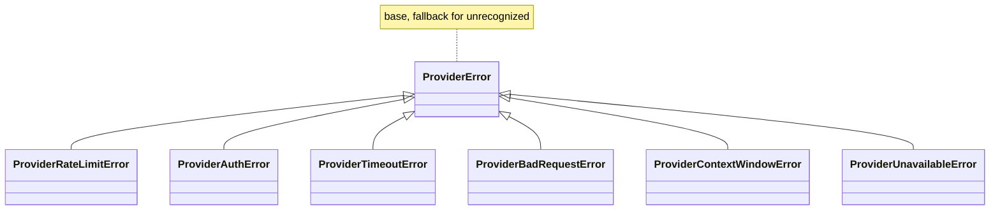
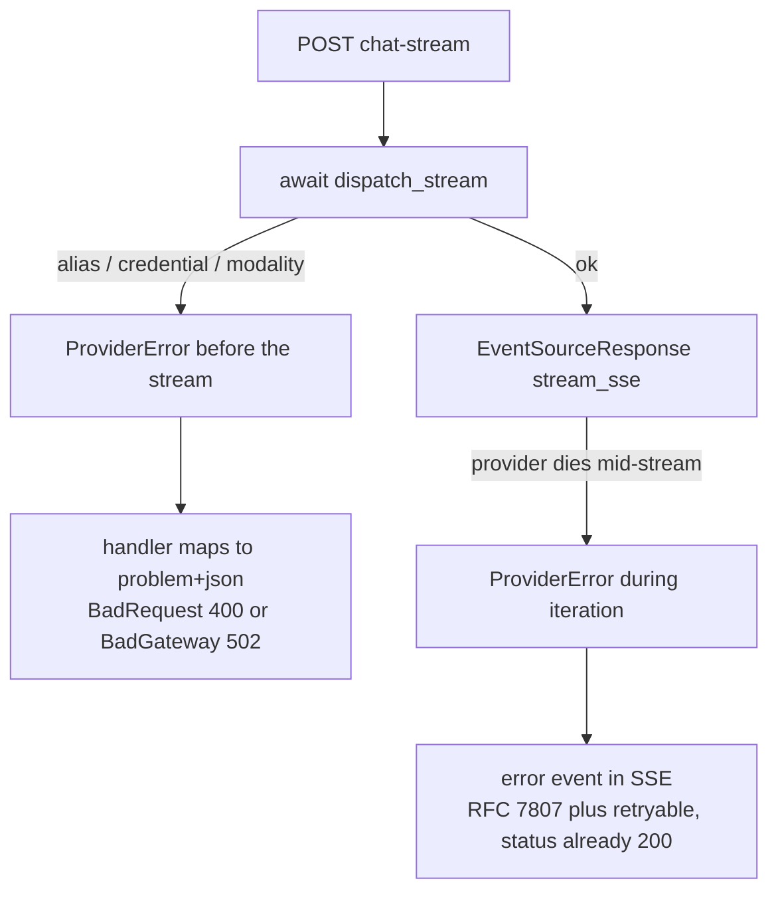

# AI Gateway - error taxonomy

When a provider (OpenAI, Anthropic, ...) refuses or goes down, the gateway does not release a raw exception from the `litellm` library. It translates it into its own, tiny family of `ProviderError` exceptions. Thanks to that the rest of the code (endpoints, streaming) knows nothing about `litellm` and can make a decision: retry, truncate the context, or give up.

This is the only error contract on which the whole dispatch layer rests. Defined in `app/core/ai_gateway/exceptions.py`.

## Why a separate hierarchy and not APIError

A provider failure is **not** inherently an HTTP problem. That is why `ProviderError` does not inherit from `APIError` (see [Error handling (RFC 7807)](error-handling-rfc-7807.md)). The subclasses are **markers** for a branch in the caller: "this was a rate limit, you can retry" or "the input is too long, truncate and retry". The HTTP mapping is done only at the edge, when the response goes to the client.

## ProviderError hierarchy



All subclasses inherit **directly** from `ProviderError` (a flat hierarchy). In particular `ProviderContextWindowError` is separate from `ProviderBadRequestError` even though in `litellm` context-window inherits from bad-request. The reason: the caller is to tell "input too long" (truncate-and-retry) apart from a plain malformed request.

| Exception | When |
|---|---|
| `ProviderError` | base; fallback for errors the adapter did not recognize |
| `ProviderRateLimitError` | the provider returned 429 |
| `ProviderAuthError` | bad / missing / unauthorized credentials |
| `ProviderTimeoutError` | timeout exceeded |
| `ProviderBadRequestError` | malformed: bad params, unknown model, unsupported modality |
| `ProviderContextWindowError` | input longer than the model's context window |
| `ProviderUnavailableError` | 5xx / dropped connection / **unreadable credential at-rest** |

`ProviderUnavailableError` aggregates three `litellm` cases (ServiceUnavailable, APIConnection, InternalServer) plus one of its own: an undecryptable key from the database (see [AI Gateway - key encryption](ai-gateway-key-encryption.md)).

## How the adapter translates litellm errors

The translation lives exclusively in the adapter `app/core/ai_gateway/providers/litellm.py` (the only module importing `litellm`, see [AI Gateway - LiteLLM provider](ai-gateway-litellm-provider.md)). The adapter has a `_ERROR_MAP` table and a `_map_error(exc)` function. Each method (`chat`, `stream`) catches `Exception`, logs `ai.chat.error` and does `raise _map_error(exc) from exc`.

The table is **most-specific-first** (the first match wins), because `ContextWindowExceededError` inherits from `BadRequestError` in litellm:

| litellm | -> ProviderError |
|---|---|
| `ContextWindowExceededError` | `ProviderContextWindowError` |
| `AuthenticationError` | `ProviderAuthError` |
| `RateLimitError` | `ProviderRateLimitError` |
| `Timeout` | `ProviderTimeoutError` |
| `BadRequestError` | `ProviderBadRequestError` |
| `ServiceUnavailableError` | `ProviderUnavailableError` |
| `APIConnectionError` | `ProviderUnavailableError` |
| `InternalServerError` | `ProviderUnavailableError` |

Anything unrecognized -> a bare `ProviderError`. The library's type never leaks beyond the adapter.

The second route to `ProviderBadRequestError` (without litellm involved): an unknown vendor in the `_model(...)` routing, plus an unsupported modality, a `generic` row with no base URL, and an unknown alias detected in `_build_call` / `dispatch` (see [AI Gateway - dispatch](ai-gateway-dispatch.md)).

## HTTP mapping in streaming

Here comes the key thing: in an SSE stream the **HTTP status is already 200** (the headers went out before the provider died mid-stream). So the error cannot be returned as an HTTP code — it goes as an `error` event in the body of the stream, in RFC 7807 shape + a `retryable` field. Mapping the exception to `(status, retryable)` is done by `provider_error_to_status` in `app/core/conversations/streaming.py` (see [Streaming SSE](streaming-sse.md)).

### Mapping table: exception -> HTTP -> retryable

| Exception | HTTP | retryable | Why |
|---|---|---|---|
| `ProviderRateLimitError` | 429 | yes | transient, retry with backoff |
| `ProviderTimeoutError` | 504 | yes | transient |
| `ProviderUnavailableError` | 502 | yes | transient upstream |
| `ProviderContextWindowError` | 400 | no | input too long — a retry does nothing, you have to truncate |
| `ProviderBadRequestError` | 400 | no | malformed request |
| `ProviderAuthError` | 502 | no | bad creds — a retry without a fix does nothing |

`retryable` = whether a retry makes sense. Transient upstream (rate limit / timeout / unavailable) may pass after a retry; auth / bad-request / context-window will not.

### Mapping table snippet

`app/core/conversations/streaming.py`

```python
_PROVIDER_ERROR_STATUS: tuple[tuple[type[ProviderError], int, bool], ...] = (
    (ProviderRateLimitError, status.HTTP_429_TOO_MANY_REQUESTS, True),
    (ProviderTimeoutError, status.HTTP_504_GATEWAY_TIMEOUT, True),
    (ProviderUnavailableError, status.HTTP_502_BAD_GATEWAY, True),
    (ProviderContextWindowError, status.HTTP_400_BAD_REQUEST, False),
    (ProviderBadRequestError, status.HTTP_400_BAD_REQUEST, False),
    (ProviderAuthError, status.HTTP_502_BAD_GATEWAY, False),
)
```

`provider_error_to_status(exc)` iterates this table via `isinstance` and returns the first hit as `(code, retryable)`. The fallback when nothing matches: `(502, False)`.

> Note: here the table order is less critical than in the adapter, because the `ProviderError` subclasses are flat (no exception is a subclass of another on this list). But the "iterate most-specific-first via isinstance" pattern is the same.

## Two paths: before the stream vs during it

An important distinction — where the error surfaces decides whether you see problem+json or an SSE event.



- **Before the stream** (in `app/api/v1/chat.py`): `dispatch_stream` does an `await`, so errors resolving the alias / credential / modality surface here. The handler catches `ProviderBadRequestError` -> `BadRequestError` (400), any other `ProviderError` -> `BadGatewayError` (502). It goes out as `application/problem+json`.
- **During it** (in `stream_sse`): `dispatch_stream` is deliberately **not an async generator**, but `client.stream(...)` is. So a provider error reveals itself only on iteration over the chunks — then `provider_error_to_status` provides the status for the body of the `error` event.

## Pitfalls

1. `ProviderContextWindowError` is separate from `ProviderBadRequestError` on purpose — without it the caller could not tell "truncate and retry" apart from a plain error. Both map to HTTP 400, but they differ by the marker.
2. `ProviderUnavailableError` is the only subclass with two sources: 5xx/transport errors from litellm **and** an unreadable key at-rest (`SecretDecryptError` caught in `_credential`).
3. In a stream the `detail` of the `error` event is the **raw provider text** — it may name the real model. A masked write-path has to sanitize it.
4. An unrecognized exception does not escalate to a bare 500 — it lands as `ProviderError` -> the `(502, False)` fallback.

## Related

- [Streaming SSE](streaming-sse.md) — where `provider_error_to_status` lives and how the error becomes an SSE event
- [AI Gateway - LiteLLM provider](ai-gateway-litellm-provider.md) — the adapter with `_ERROR_MAP` / `_map_error`, the only litellm import
- [Error handling (RFC 7807)](error-handling-rfc-7807.md) — `APIError` -> Problem; why ProviderError is NOT an APIError
- [AI Gateway - dispatch](ai-gateway-dispatch.md) — where the pre-stream errors go (alias, modality, credential)
- [AI Gateway - key encryption](ai-gateway-key-encryption.md) — an unreadable key -> ProviderUnavailableError
- [Endpoint POST chat-stream](endpoint-post-chat-stream.md) — the handler mapping pre-stream errors to problem+json
- [AI Gateway - overview](ai-gateway-overview.md) — the whole port/adapter bounded context
