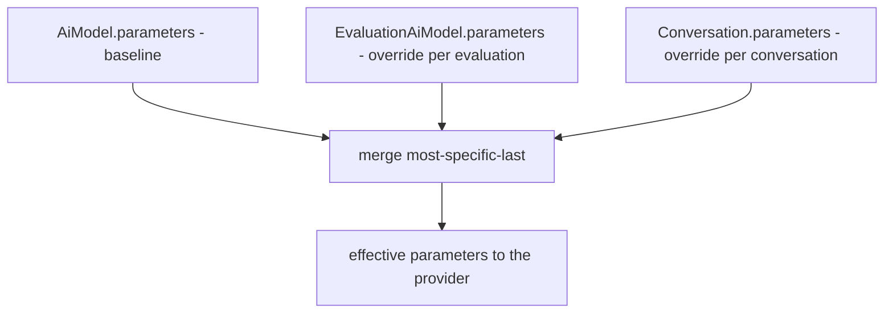

# AI Gateway - inference parameters

The model knobs (temperature, max_tokens, system_prompt etc.) do not sit in one place. The same parameter dict hangs at three layers and **merges into one** when the model is invoked — a more specific layer overrides a more general one. Here I describe how this cascade works and why we never persist parameters with a raw `model_dump`.

File: `app/core/ai_gateway/inference_params.py`.

## Why this

You want the model to have reasonable default parameters defined once (in the model registry), but to be able to override them for a specific evaluation, and even more for a specific conversation. Instead of copying the full set at every level, each level keeps **only what it actually overrides**. The rest is inherited from above.

## The three cascade layers

From the most general to the most specific:

| Layer | Carrier | Role |
|---|---|---|
| baseline | [AiModel](../data-models/ai-model.md) `.parameters` | the model's default knobs |
| override | [EvaluationAiModel](../data-models/evaluation-ai-model.md) `.parameters` | per-assignment to an evaluation |
| most specific | [Conversation](../data-models/conversation.md) `.parameters` | per red-teamer conversation |

All three inherit the same column via `InferenceParamsMixin` (JSONB, NOT NULL, server_default `'{}'`). No NULL → an unset row keeps an empty dict and inherits everything from above, with no "null or empty" ambiguity.



The merge rule: **most-specific-wins**. The layer given later in the list wins per key.

## The knobs (`InferenceParams`)

`InferenceParams(BaseModel)` is a typed edge view with `extra="allow"` — provider-specific knobs (without their own Python field) also pass through. All fields are optional, default `None`:

| Field | Type | Validation |
|---|---|---|
| `system_prompt` | `str` | prepended by the gateway as a system message |
| `temperature` | `float` | ge=0, le=2 |
| `max_tokens` | `int` | ge=1 |
| `top_p` | `float` | ge=0, le=1 |
| `top_k` | `int` | ge=0 |
| `stop_sequences` | `list[str]` | translated to litellm `stop` |
| `frequency_penalty` | `float` | ge=-2, le=2 |
| `presence_penalty` | `float` | ge=-2, le=2 |
| `repetition_penalty` | `float` | ge=0 |
| `seed` | `int` | — |

`extras` is **something else** — call-shape metadata on [AiModel](../data-models/ai-model.md), NOT part of the cascade and NOT forwarded to the provider. Do not confuse `parameters` with `extras`.

## The cascade is TWO-STATE

This is the most important decision. Per knob there are only two states:

- **key present** in the layer → overrides (override),
- **key absent** → inherits from the layer above (inherit).

There is no third "clear" state (i.e. "erase a knob set by a higher level"). Where this comes from: the write-path strips knobs with a `null` value, so a `null` never reaches JSONB. Since there are no `null`s in the dict, you cannot clear anything with them.

`merge_inference_params` (`inference_params.py:87-110`):

```python
merged: dict[str, Any] = {}
for level in levels:
    if level:
        merged.update(level)
return merged
```

`None` on input = an empty dict, so the caller can pass e.g. `evaluation.parameters if evaluation else None` without an `if` around it.

## Persistence: ALWAYS via `dump_inference_params`

`dump_inference_params` (`inference_params.py:74-84`) is the **only** allowed write-path for the `parameters` column at every level:

```python
def dump_inference_params(params: InferenceParams) -> dict[str, Any]:
    return params.model_dump(exclude_none=True)
```

`exclude_none=True` drops unset knobs → a level keeps only what it really overrides, never `null`. This is also rule no. 13 in the project's CLAUDE.md: persist via `dump_inference_params`, **never with a raw `model_dump`** (without `exclude_none` the `null`s would slip in and break the two-state property).

## PATCH rules (`parameters` = None means "no change")

In the model PATCH endpoint we distinguish "field omitted" from "field set":

- `payload.parameters is None` → the caller did not touch the parameters → **we write nothing**.
- `payload.parameters is not None` → re-dump via `dump_inference_params` before it reaches JSONB.

Why re-dump, and not a raw `model_dump(exclude_unset=True)` from the payload? Because `exclude_unset` recurses into the nested model and a knob set explicitly to `null` would survive to JSONB. `dump_inference_params` (`exclude_none`) removes it.

On the schema side, `parameters` on PATCH **rejects an explicit `null`** (`_reject_explicit_null`) — the column is NOT NULL, so an explicit null → 422 instead of an IntegrityError.

A semantic note: PATCH `parameters` replaces the **whole** override layer of a given level, it is not a merge within a single layer. The merge happens only between layers at dispatch time.

## Surfacing effective params — and masking them

The assignment view (`EvaluationAiModelView`, see [EvaluationAiModel](../data-models/evaluation-ai-model.md)) surfaces `effective_parameters` — the model baseline merged with the per-assignment override, i.e. what a conversation under that assignment inherits (the FE explains each knob and shows inherited values). Under **model masking** the merged dict is filtered by `mask_inference_params` to `MASKABLE_PARAM_KEYS` — the identity-safe numeric sampling knobs only (`temperature`, `top_p`, `top_k`, `max_tokens`, `frequency_penalty`, `presence_penalty`, `repetition_penalty`, `seed`). Excluded: `system_prompt` (free text) and `stop_sequences`/provider-specific keys — operator-entered content that can leak which model backs a masked assignment.

## Opting a model out entirely — `advanced_params_disabled`

A model row may set `advanced_params_disabled`, which drops the **whole** operator-set cascade for that model: its own `parameters` *and* everything the higher layers merged on top. Enforced in exactly one place — `_build_call`, which every provider call funnels through — so a new param source added upstream cannot bypass it:

```python
merged = {} if model.advanced_params_disabled else merge_inference_params(model.parameters, params)
```

Two consequences worth holding on to:

- **Stored overrides survive.** The flag suppresses at dispatch; nothing is deleted, so flipping it back restores every layer. Reads that advertise inheritable params (`EvaluationAiModelView.effective_parameters`) project **empty** for such a model.
- **Platform context must not ride `params`.** Anything the gateway itself adds to a call — the [conversation tag](conversation-tags.md) block, a probe's `max_tokens: 1` — travels on its own channel: `dispatch_*`'s `system_suffix`, or applied to `call["params"]` after `_build_call` returns. Folding the tag block into `params["system_prompt"]` would silently drop it for a flagged model **while the reply still recorded that context as sent**.

## Where the cascade fires — `_build_call`

The merging and the translation of knobs into the litellm world lives in `_build_call` (`app/core/ai_gateway/dispatch.py`):

```python
merged = {} if model.advanced_params_disabled else merge_inference_params(model.parameters, params)
system_prompt = merged.pop("system_prompt", None)
stop = merged.pop("stop_sequences", None)
if stop is not None:
    merged.setdefault("stop", stop)
# system_suffix is gateway-owned context, appended after the suppression above.
system_content = "\n\n".join(part for part in (system_prompt, system_suffix) if part)
call_messages = [ChatMessage(role="system", content=system_content), *messages] if system_content else messages
```

Here `params` is the already-merged override of the higher layers (assignment + conversation), merged on top of `model.parameters` (call wins). Two knobs need translation, because otherwise `litellm.drop_params=True` would silently eat them:

- `system_prompt` → pulled out and prepended as `ChatMessage(role="system", ...)`,
- `stop_sequences` → litellm calls it `stop`.

Gateway entry details: [AI Gateway - dispatch](ai-gateway-dispatch.md).

## Example

- [AiModel](../data-models/ai-model.md): `{"temperature": 0.7, "max_tokens": 512}`
- [EvaluationAiModel](../data-models/evaluation-ai-model.md): `{"temperature": 0.2}`
- [Conversation](../data-models/conversation.md): `{"system_prompt": "You are an attacker."}`

The result after the merge: `{"temperature": 0.2, "max_tokens": 512, "system_prompt": "..."}`. `temperature` from the evaluation won over the model, `max_tokens` is inherited, `system_prompt` is added by the conversation.

## Related

- [AiModel](../data-models/ai-model.md)
- [EvaluationAiModel](../data-models/evaluation-ai-model.md)
- [Conversation](../data-models/conversation.md)
- [AI Gateway - dispatch](ai-gateway-dispatch.md)
- [AI Gateway - overview](ai-gateway-overview.md)
- [Conversation tags](conversation-tags.md) — the gateway-owned context that must stay out of `params`
- [AI Gateway - LiteLLM provider](ai-gateway-litellm-provider.md)
- [AI Gateway - message types](ai-gateway-message-types.md)
