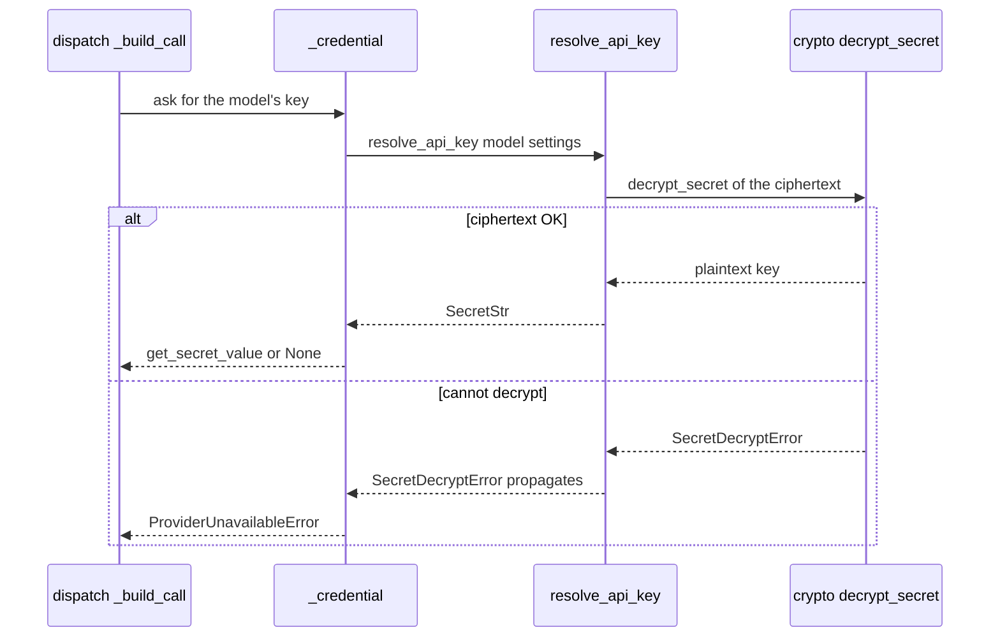
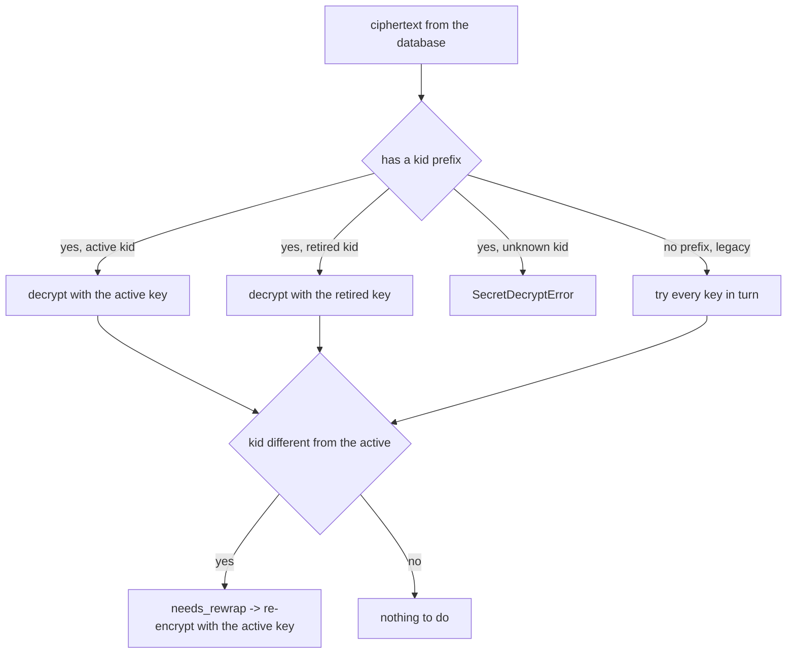

# AI Gateway - key encryption

Provider API keys (OpenAI, Anthropic etc.) cannot sit in the database in plaintext. `crypto.py` encrypts them at-rest and decrypts them only at the moment the model is invoked. If someone peeks into the `ai_models` table, they see ciphertext, not the key.

All the work is in a single file: `app/core/ai_gateway/crypto.py`. Format: JWE compact, `alg="dir"` + `enc="A256GCM"` (AES-256-GCM, key supplied directly, no key exchange). The column in the database is `api_key_encrypted` on [AiModel](../data-models/ai-model.md).

## Why this / what it is about

- We keep the provider credential in `ai_models.api_key_encrypted` as ciphertext.
- The encryption key comes from config: `MODEL_SECRETS_KEY` (see [Configuration (Settings)](configuration-settings.md)).
- We encrypt when the model is saved, and decrypt right before invoking the provider in [AI Gateway - dispatch](ai-gateway-dispatch.md).
- If it cannot be decrypted, dispatch returns `ProviderUnavailableError` instead of trying further (see [AI Gateway - error taxonomy](ai-gateway-error-taxonomy.md)).

## Where the encryption key comes from

You do not have to generate a base64 256-bit key by hand. You take any secret of length >= 32 characters, and `crypto.py` turns it into a key via SHA-256:

`app/core/ai_gateway/crypto.py`
```python
material = hashlib.sha256(secret.get_secret_value().encode()).digest()
kid = hashlib.sha256(material).digest()[:1].hex()
return kid, OctKey.import_key(material)
```

- `material` is the 32-byte digest of the secret - this is the actual AES-256 key.
- `kid` (key-id) is the 2-character hex from the **second** hash. The second hash gives preimage resistance: from the id you cannot reconstruct a byte of the key.
- The IV is fresh on each encryption, so the same plaintext gives a different ciphertext every time.

## Stored format: `<kid>:<jwe>`

The ciphertext in the database is `<kid>:<jwe>` - a 2-hex prefix, a colon, then JWE compact. JWE compact (base64url + dots) never has a `:`, so a leading `2-hex:` unambiguously points to the key-id. No prefix = an old, untagged ciphertext (legacy untagged).

`api_key_encrypted` is `VARCHAR(1024)` - the ciphertext is pure ASCII, it fits with room to spare.

## Encryption and decryption

Two public functions:

| Function | What it does |
|---|---|
| `encrypt_secret(plaintext, settings) -> str` | empty plaintext -> `ValueError`; returns `f"{active_kid}:{jwe}"` |
| `decrypt_secret(ciphertext, settings) -> str` | selects the key by `kid`, decrypts; empty result -> `SecretDecryptError` |

Key selection on decryption:

`app/core/ai_gateway/crypto.py`
```python
kid, payload = _split(ciphertext)
if kid is None:
    candidates = list(ring.values())  # active first by insertion order
elif kid in ring:
    candidates = [ring[kid]]
else:
    raise SecretDecryptError(f"No key configured for key-id {kid!r}.")
...
result = jwe.decrypt_compact(payload, key, algorithms=[_ALG, _ENC])
```

Two things worth noting:
- `algorithms=[_ALG, _ENC]` is pinned - a ciphertext declaring a weaker algorithm is rejected.
- An untagged legacy ciphertext is tried with every key in turn. GCM auth rejects the wrong key, so there is no silent mis-decrypt.

### `SecretDecryptError`

`class SecretDecryptError(Exception)` wraps `JoseError` from the JOSE library. Thanks to that callers do not depend on the JOSE error hierarchy - they catch one custom type.

## How the credential reaches the invocation

Dispatch does not read the ciphertext itself. `resolve_api_key` does, and `_credential` in [AI Gateway - dispatch](ai-gateway-dispatch.md) translates a decryption error into a provider error.



### `resolve_api_key` - precedence

`resolve_api_key(model, settings) -> SecretStr|None` in `app/core/ai_gateway/services/ai_models.py`:

1. If the row has its own `api_key_encrypted` - it wins. We decrypt here, the env-var fallback is NOT consulted.
2. No own key -> fallback to `<provider>_api_key` from [Configuration (Settings)](configuration-settings.md) (e.g. `openai_api_key`).
3. A provider without a fallback (e.g. `aws_bedrock` on IAM, `generic` with an out-of-band key) -> `None`.

A security decision: a decryption error surfaces verbatim, it does not silently fall back to the env-var. If it did, after an at-rest rotation traffic would go out with a bad credential - worse than a hard error.

### `_credential` in dispatch

`app/core/ai_gateway/dispatch.py`
```python
def _credential(model, settings) -> str | None:
    try:
        secret = resolve_api_key(model, settings)
    except SecretDecryptError as exc:
        raise ProviderUnavailableError(...) from exc
    return secret.get_secret_value() if secret is not None else None
```

This is the only place where `SecretDecryptError` turns into `ProviderUnavailableError`. Without leaking the JOSE cause to the outside.

## Key rotation without data migration

A key can be swapped without rewriting all ciphertexts at once. Two config fields serve this:

| Field | Role |
|---|---|
| `MODEL_SECRETS_KEY` | the active key - we encrypt new entries with this |
| `MODEL_SECRETS_KEY_RETIRED` | the outgoing key - we no longer encrypt with it, but still read old entries |

`_keyring(settings)` returns `(active_kid, ring)`, where `ring = {kid: OctKey}` - active first, then retired. An id collision between active and retired (a 1/256 chance) -> `ValueError` at startup (fail loud is better than silent mis-routing).



`needs_rewrap(ciphertext)` = `kid != active_kid` (i.e. legacy untagged or retired). This drives the re-wrap job: it takes an old ciphertext, decrypts it retired/legacy, encrypts it anew with the active key. After going through the whole table you remove `MODEL_SECRETS_KEY_RETIRED` from config.

### Validation at startup

The keyring is checked at startup, not on the first decryption. `validate_keyring(settings)` builds the keyring (the build itself is the validation - it detects id collisions). Called lazily from `Settings._validate_model_secret_keyring` in `app/core/config.py`, to break the config <-> crypto import cycle.

## Rotation and `models:update`

Swapping the secret in config is itself a deployment operation, but rotating the **key of a specific model** (i.e. changing `api_key_encrypted`) goes through endpoints under the `models:update` permission:

| Endpoint | What it does |
|---|---|
| `PUT /v1/ai-models/{id}/api-key` | sets/rotates the key - `set_api_key` -> `encrypt_secret` + flush |
| `DELETE /v1/ai-models/{id}/api-key` | clears the key - `clear_api_key`, idempotent |

The API key is deliberately not on the `PATCH` model surface - rotation and clearing have dedicated `.../api-key` endpoints. In API responses the key never comes back: `AiModelResponse` collapses it to a `has_api_key` bool.

## Pitfalls

1. A decryption error = a hard `ProviderUnavailableError`, never a silent fallback to the env-var. A deliberate security decision.
2. `kid` comes from the **second** hash of the secret - it does not leak a byte of the AES key.
3. A legacy untagged ciphertext is tried with every key; GCM auth protects against a mis-decrypt, so it is safe.
4. The keyring validation is at process startup, not at runtime - an id collision is a config error, not an incident during traffic.
5. The key never comes back in an API response - only `has_api_key: bool`.

## Related

- [AiModel](../data-models/ai-model.md)
- [AI Gateway - dispatch](ai-gateway-dispatch.md)
- [Configuration (Settings)](configuration-settings.md)
- [AI Gateway - error taxonomy](ai-gateway-error-taxonomy.md)
- [AI Gateway - overview](ai-gateway-overview.md)
- [Flow - from AI model registration to invocation](../flows/flow-ai-model-registration-to-invocation.md)
