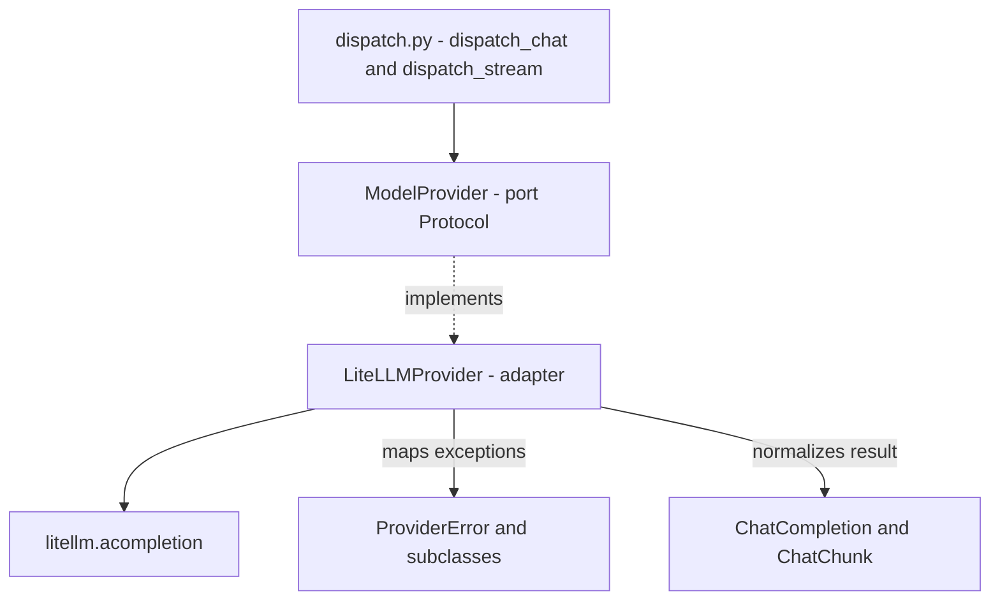
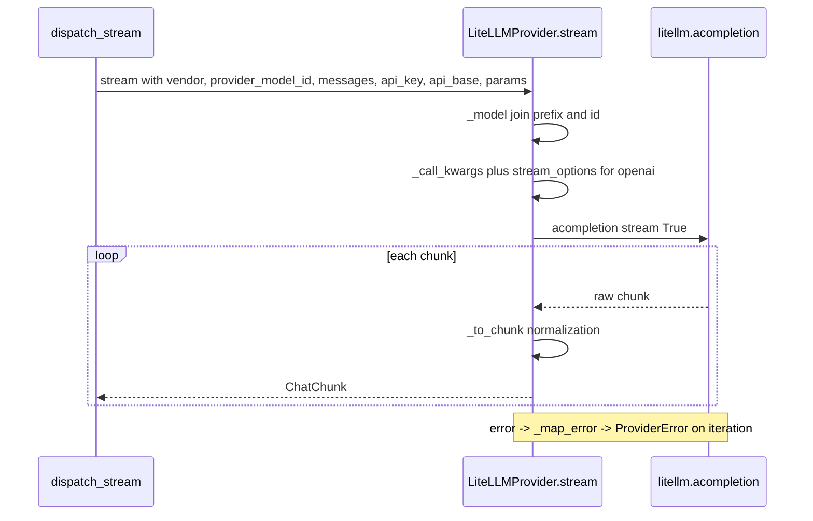

# AI Gateway - LiteLLM provider

This is the only place in the repo where we touch the `litellm` library. The adapter takes our neutral message types, translates them into what `litellm.acompletion` expects, and the other way around: it turns the library's response into our `ChatCompletion`/`ChatChunk` and the library's exceptions into our `ProviderError`. The rest of the code does not know about `litellm`.

File: `app/core/ai_gateway/providers/litellm.py` (adapter) and `app/core/ai_gateway/providers/base.py` (port).

## Why a port and an adapter here

The domain (conversations, evaluations) is to talk to any LLM provider without knowing which library handles it. That is why we have two layers:

- **`ModelProvider`** — the port, i.e. the contract. What a provider must be able to do: `chat` and `stream`. It is a `Protocol`, an abstraction.
- **`LiteLLMProvider`** — the adapter, i.e. a concrete implementation via `litellm`. Today the only one.

The dependency direction: the domain knows only the types from `chat.py`, the taxonomy from `exceptions.py` and the entry from `dispatch.py`. It never imports `litellm` or the adapter directly. See [AI Gateway - dispatch](ai-gateway-dispatch.md).



## Why `litellm` is imported only here

A very deliberate decision. The model CRUD path (`app/api/v1/ai_models.py`) must not pull in the heavy `litellm` library just to write a row in the database. That is why:

- `dispatch_*` is imported **directly** from `app.core.ai_gateway.dispatch`, not from the package root (the `dispatch.py` docstring).
- `litellm` is imported only in `providers/litellm.py`.

The effect: code that only manages the model registry is light and provider-independent.

## The `ModelProvider` port

File `app/core/ai_gateway/providers/base.py`. It is a `@runtime_checkable` `Protocol` (runtime_checkable so that tests can do `isinstance`). Two methods, both with **keyword-only** arguments:

| Method | Returns | Why |
|---|---|---|
| `async chat(...)` | `ChatCompletion` | one full response |
| `stream(...)` | `AsyncIterator[ChatChunk]` | a stream of fragments |

The arguments of both are the same and are **semantic**, not library-specific: `vendor: ProviderVendor`, `provider_model_id: str`, `messages: list[ChatMessage]`, `api_key`, `api_base`, `params`, `timeout`. Only from that does the adapter assemble the model string for `litellm`. The message types are described in [AI Gateway - message types](ai-gateway-message-types.md).

## Global `litellm` configuration

Set once at module level (`litellm.py`):

```python
litellm.drop_params = True
litellm.telemetry = False
litellm.num_retries = 0
```

| Flag | Why |
|---|---|
| `drop_params=True` | if a provider does not accept some parameter, `litellm` silently removes it instead of raising an error — thanks to that a row can carry knobs specific to one provider (e.g. `top_k`) without breaking others |
| `num_retries=0` | retry is the consumer's policy, not the adapter's |
| `telemetry=False` | no outbound ping (keeps the sandbox quiet, among other things) |

The adapter's default timeout: `_DEFAULT_TIMEOUT = 60.0`.

Watch out for `drop_params`: it has a side effect. If you pass a parameter under a name `litellm` does not know (e.g. `stop_sequences` instead of `stop`), it will be **silently eaten**. That is why the renaming of knob names happens in `dispatch.py` (`_build_call`), before params reaches the adapter. See [AI Gateway - dispatch](ai-gateway-dispatch.md).

## Combining vendor + provider_model_id

`litellm` wants a string like `"anthropic/claude-..."`. We keep `vendor` (an enum) and `provider_model_id` (the provider's string) separately. The adapter joins them via a prefix map.

The `_LITELLM_PREFIX` map:

| vendor | litellm prefix |
|---|---|
| `openai` | `openai` |
| `anthropic` | `anthropic` |
| `google` | `gemini` |
| `azure` | `azure` |
| `aws_bedrock` | `bedrock` |
| `cohere` | `cohere` |
| `huggingface` | `huggingface` |
| `generic` | `openai` |

`generic` is an OpenAI-compatible endpoint — it rides on the `openai` prefix with an `api_base` supplied by the caller.

`app/core/ai_gateway/providers/litellm.py`

```python
@staticmethod
def _model(vendor: ProviderVendor, provider_model_id: str) -> str:
    prefix = _LITELLM_PREFIX.get(vendor)
    if prefix is None:
        raise ProviderBadRequestError(f"No litellm routing for provider vendor {vendor!r}.")
    return f"{prefix}/{provider_model_id}"
```

An unknown vendor does not raise a raw `KeyError`/500 — `ProviderBadRequestError` is raised, our own type.

## How `chat` and `stream` call `litellm`

Both build the kwargs via the shared `_call_kwargs` (only `stream` differs between them):

`app/core/ai_gateway/providers/litellm.py`

```python
return {
    "model": model,
    "messages": [m.model_dump() for m in messages],
    "api_key": api_key,
    "api_base": api_base,
    "timeout": timeout if timeout is not None else self._default_timeout,
    **_safe_params(params),
}
```

- `api_key` and `api_base` go straight to `litellm` as kwargs. `api_base` is our `inference_endpoint` (custom URL) — used mainly with `generic`.
- `_safe_params` strips from params the knobs that the adapter sets itself: `_RESERVED_PARAMS = {"model","messages","api_key","api_base","timeout","stream"}`. If they got through, there would be a duplicate kwarg to `acompletion`. The drop logs `ai.params.reserved_dropped`.

### `chat`

Builds `model`, logs `ai.chat.start`, calls `await litellm.acompletion(**self._call_kwargs(...))`, normalizes via `_to_completion`. Every `Exception` gets mapped: `raise _map_error(exc) from exc` (after `logger.warning("ai.chat.error", ...)`). Success logs `ai.chat.ok` with usage.

### `stream` — the actual fragment

`app/core/ai_gateway/providers/litellm.py`

```python
async def stream(
    self, *, vendor, provider_model_id, messages, api_key=None, api_base=None, params=None, timeout=None
) -> AsyncIterator[ChatChunk]:
    model = self._model(vendor, provider_model_id)
    logger.info("ai.chat.start", model=model, message_count=len(messages), stream=True)
    call_kwargs = self._call_kwargs(model, messages, api_key, api_base, params, timeout)
    if vendor in _USAGE_IN_STREAM_VENDORS:
        # setdefault, not assign: a row whose stored params already pin
        # stream_options keeps its value (it isn't a reserved kwarg).
        call_kwargs.setdefault("stream_options", {"include_usage": True})
    try:
        stream = await litellm.acompletion(stream=True, **call_kwargs)
        async for chunk in stream:
            yield _to_chunk(chunk)
        logger.info("ai.chat.ok", model=model, stream=True)
    except Exception as exc:
        logger.warning("ai.chat.error", model=model, error_class=type(exc).__name__)
        raise _map_error(exc) from exc
```

Two things to remember:

- It is an **async generator** (there is a `yield`). The implication: provider/transport errors do not surface on the call, only on iteration over the chunks.
- `stream_options={"include_usage": True}` is appended **only** for OpenAI-compatible vendors (`_USAGE_IN_STREAM_VENDORS = {OPENAI, GENERIC}`) and via `setdefault`, not assignment — if the row already pins its own `stream_options`, it keeps its value. Anthropic streams usage natively, so it does not need the flag.

## Mapping litellm exceptions onto ProviderError

The whole `ProviderError` hierarchy is described in [AI Gateway - error taxonomy](ai-gateway-error-taxonomy.md). Here what matters is the mapping itself. `_ERROR_MAP` is **ordered most-specific-first** (top down, the first hit wins), because `ContextWindowExceededError` inherits from `BadRequestError` — if the order were reversed, context-window would never be hit.

| litellm exception | -> ProviderError |
|---|---|
| `ContextWindowExceededError` | `ProviderContextWindowError` |
| `AuthenticationError` | `ProviderAuthError` |
| `RateLimitError` | `ProviderRateLimitError` |
| `Timeout` | `ProviderTimeoutError` |
| `BadRequestError` | `ProviderBadRequestError` |
| `ServiceUnavailableError` | `ProviderUnavailableError` |
| `APIConnectionError` | `ProviderUnavailableError` |
| `InternalServerError` | `ProviderUnavailableError` |

Anything unrecognized -> `ProviderError` (the base). Thanks to that the library's type never leaks beyond the adapter.

## Response normalization

The adapter turns `litellm` objects into our types from [AI Gateway - message types](ai-gateway-message-types.md). The normalizers are deliberately defensive, because providers report inconsistently.

| Function | What it does |
|---|---|
| `_to_completion` | non-stream -> `ChatCompletion`; pins `role="assistant"` in the choice (a completion is always an assistant response), `content or ""` |
| `_to_chunk` | chunk -> `ChatChunk`; defensive `getattr(chunk,"model","") or ""`, `created or 0` |
| `_to_usage` | `getattr(..., None)` on every field — a partial usage report does not blow up validation |
| `_delta_role` | a role outside `{system,user,assistant}` (e.g. `"tool"`) -> `None`, instead of crashing `ChatMessageDelta` validation |

## The sequence of a single stream



## Pitfalls

1. `stream` is an async generator — provider/transport errors surface on iteration, not on await. The "where the error surfaces" boundary is drawn by `dispatch.py`, which is deliberately NOT a generator.
2. `drop_params=True` silently eats unknown knobs — that is why names like `stop_sequences` -> `stop` are translated by `_build_call` in dispatch, not the adapter.
3. `stream_options.include_usage` only for OpenAI/`generic`; Anthropic has usage natively.
4. `_to_completion` always pins `role="assistant"`; `_delta_role` zeroes out unknown roles.
5. An unknown vendor and an unrecognized exception are not raw Python errors — `ProviderBadRequestError` / `ProviderError` is raised.

## Related

- [AI Gateway - dispatch](ai-gateway-dispatch.md)
- [AI Gateway - message types](ai-gateway-message-types.md)
- [AI Gateway - error taxonomy](ai-gateway-error-taxonomy.md)
- [AI Gateway - overview](ai-gateway-overview.md)
- [AI Gateway - inference parameters](ai-gateway-inference-parameters.md)
- [AI Gateway - key encryption](ai-gateway-key-encryption.md)
- [Streaming SSE](streaming-sse.md)
- [Flow - AI message streaming (end-to-end)](../flows/flow-ai-message-streaming-end-to-end.md)
