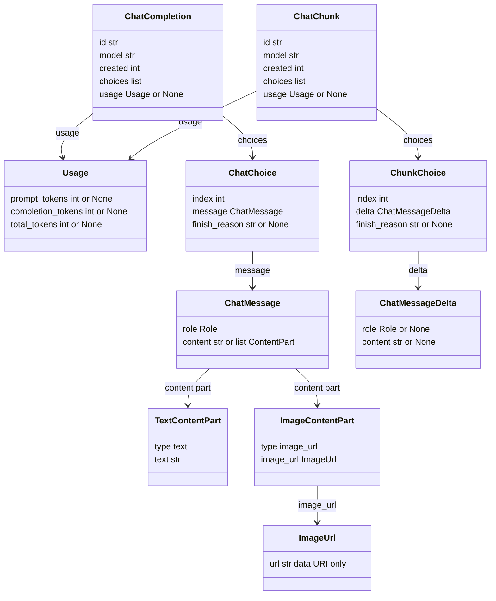
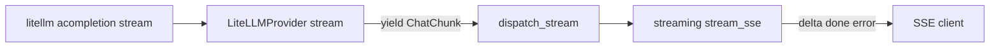

# AI Gateway - message types

This is the I/O contract of the dispatch layer: a set of simple OpenAI-shape Pydantic classes used by the whole domain. Thanks to them the conversation and evaluation code never touches raw `litellm` or `openai` objects — the adapter translates the library into these types, and the rest of the system sees only them.

Everything lives in a single file: `app/core/ai_gateway/chat.py`.

## Why a separate set of types

The domain must not depend on the provider's library. If `Conversation` or `streaming.py` accepted a `litellm` object, every library version change or adapter swap would break half the system. Instead we have our own, stable shape:

- `ModelProvider.chat` returns `ChatCompletion` (see [AI Gateway - LiteLLM provider](ai-gateway-litellm-provider.md)).
- `ModelProvider.stream` returns a stream of `ChatChunk`.
- The `LiteLLMProvider` adapter is the only place that knows the litellm types and normalizes them into these classes.

So these types are the "language" in which dispatch ([AI Gateway - dispatch](ai-gateway-dispatch.md)) talks to the domain.

## Roles

```python
Role = Literal["system", "user", "assistant"]
```

Only three roles. A provider can return something outside this triple (e.g. `"tool"`) — the adapter maps such roles to `None` instead of blowing up validation (`_delta_role`).

## Class map



Two symmetric branches:

- **Non-stream** (the whole response at once): `ChatCompletion` → `ChatChoice` → `ChatMessage`.
- **Stream** (piece by piece): `ChatChunk` → `ChunkChoice` → `ChatMessageDelta`.

`Usage` hangs optionally on both results.

## Type table

| Class | Fields | Why |
|---|---|---|
| `ChatMessage` | `role`, `content` (`str` or `list[ContentPart]`) | a full message (input to the call and the result in `ChatChoice`); the list form is a multi-modal input |
| `TextContentPart` | `type="text"`, `text` | the text fragment of a multi-modal message (OpenAI content-part shape) |
| `ImageContentPart` | `type="image_url"`, `image_url` | the image fragment; `ContentPart` is the discriminated union of the two (on `type`) |
| `ImageUrl` | `url` | the image payload — constrained to an inline `data:` URI (see below) |
| `ChatMessageDelta` | `role` optional, `content` optional | a stream fragment; both fields can be empty |
| `Usage` | `prompt_tokens`, `completion_tokens`, `total_tokens` (all optional) | token accounting; the provider reports partially or not at all |
| `ChatChoice` | `index`, `message`, `finish_reason` | one variant in a non-stream response |
| `ChatCompletion` | `id`, `model`, `created`, `choices`, `usage` | the normalized result of `chat` |
| `ChunkChoice` | `index`, `delta`, `finish_reason` | one variant in a single chunk |
| `ChatChunk` | `id`, `model`, `created`, `choices`, `usage` | a chunk from the stream; `usage` only in the last chunk, if at all |

## Multi-modal content parts (vision input)

For an image attachment `ChatMessage.content` widens from a bare `str` to `str | list[ContentPart]`, where `ContentPart = TextContentPart | ImageContentPart` (a Pydantic discriminated union on `type`, the OpenAI content-part shape). The list form serialises straight into litellm's `content` via `model_dump()` — the adapter needs no special handling. A model reply is always plain text; only inputs carry parts.

The one hard constraint sits on `ImageUrl.url`: it must be an inline **`data:` URI**, never a fetchable URL. The type is public via `POST /chat/stream`, and a fetchable URL would let a caller make the provider (or litellm's inlining) request an arbitrary host from our infrastructure — SSRF. The write-path always inlines the blob as base64 (`read_data_url` / `cached_data_url` in the media service), so nothing legitimate needs a remote URL. See [Message persistence (write-path)](message-persistence-write-path.md) for where the parts are built from stored attachments, and [AI Gateway - dispatch](ai-gateway-dispatch.md) for the vision gate (`image` in `input_modalities`).

## Why delta is separate from message

This is a key decision, written down explicitly in the module docstring.

`app/core/ai_gateway/chat.py`
```python
class ChatMessage(BaseModel):
    """One complete message in a conversation. ..."""

    role: Role
    content: str | list[ContentPart]


class ChatMessageDelta(BaseModel):
    """Incremental slice of a streamed message; both fields optional (role on the first chunk only)."""

    role: Role | None = None
    content: str | None = None
```

The reason is simple: in a stream a chunk carries only a **piece** of the content. The first chunk usually gives `role="assistant"` and empty or zero content, the following ones add just `content` and no longer repeat the role. If the stream used `ChatMessage` (where `role` and `content` are required), every chunk without a role would blow up Pydantic validation.

Hence `ChatMessageDelta` has **both fields optional** — it is a "fragment" model, not a "whole" one. `ChatMessage` stays strict, because it represents a complete message (input to the model or a finished response).

In short:

| | role | content | meaning |
|---|---|---|---|
| `ChatMessage` | required | required | a whole message |
| `ChatMessageDelta` | optional | optional | one piece of the stream |

## Usage — why everything is optional

`app/core/ai_gateway/chat.py`
```python
class Usage(BaseModel):
    """Token accounting; None (or partial) when a provider reports little or nothing."""

    prompt_tokens: int | None = None
    completion_tokens: int | None = None
    total_tokens: int | None = None
```

Not every provider reports tokens, and some do so only partially. The fields are optional so that a partial (or no) report does not crash normalization. In a stream, `usage` appears only in the terminal chunk — and not always (see below).

## Usage in a stream — when it even arrives

The adapter forces usage in a stream only for OpenAI-compatible vendors (`openai`, `generic`), by adding `stream_options={"include_usage": True}`. Then the provider sends a final chunk with usage and an empty `choices` list. Anthropic streams usage natively, so it does not need the flag. The mechanics details are in [AI Gateway - LiteLLM provider](ai-gateway-litellm-provider.md).

This is why `ChatChunk.usage` is optional and meaningful only at the end of the stream — most chunks have `usage=None`.

## How it flows through the stream



The adapter normalizes each raw litellm object into a `ChatChunk` (`_to_chunk`), dispatch passes the stream through unchanged, and the [Streaming SSE](streaming-sse.md) layer translates `ChatChunk` into `delta` / `done` / `error` events. From the chunk content it takes `delta.content`, and from the final one — `finish_reason` and any `usage`.

## Normalization details (where the types "close up")

The adapter makes sure these types can always be built, even when the provider returns something weird:

- In a non-stream response the choice always gets `role="assistant"` (a completion is by definition an assistant response), and missing content is turned into `""`.
- An unknown role in a delta (`"tool"` etc.) goes to `None`, not to an exception.
- Missing `model` / `created` in a chunk get placeholder values (`""` / `0`).

The effect: the domain never gets a half-built object or a raw library type.

## Who uses these types

| Place | What it imports |
|---|---|
| `app/core/ai_gateway/providers/base.py` | port signatures: `chat -> ChatCompletion`, `stream -> AsyncIterator[ChatChunk]` |
| `app/core/ai_gateway/providers/litellm.py` | all the types — normalizes litellm into them |
| `app/core/ai_gateway/dispatch.py` | `ChatMessage` (builds the system prompt), `ImageContentPart` (the vision gate), returns `ChatCompletion` / a `ChatChunk` stream |
| `app/core/conversations/streaming.py` | `ChatChunk` — translates into SSE events |
| `app/core/conversations/schemas.py` | `ChatMessage` + `Usage` in edge schemas |
| `app/core/conversations/services/messages.py` | `TextContentPart` / `ImageContentPart` / `ImageUrl` — rebuilds stored attachments into multi-modal history |

## Related

- [AI Gateway - dispatch](ai-gateway-dispatch.md)
- [AI Gateway - LiteLLM provider](ai-gateway-litellm-provider.md)
- [Streaming SSE](streaming-sse.md)
- [AI Gateway - overview](ai-gateway-overview.md)
- [AI Gateway - error taxonomy](ai-gateway-error-taxonomy.md)
- [AI Gateway - inference parameters](ai-gateway-inference-parameters.md)
- [Endpoint POST chat-stream](endpoint-post-chat-stream.md)
- [Flow - AI message streaming (end-to-end)](../flows/flow-ai-message-streaming-end-to-end.md)
