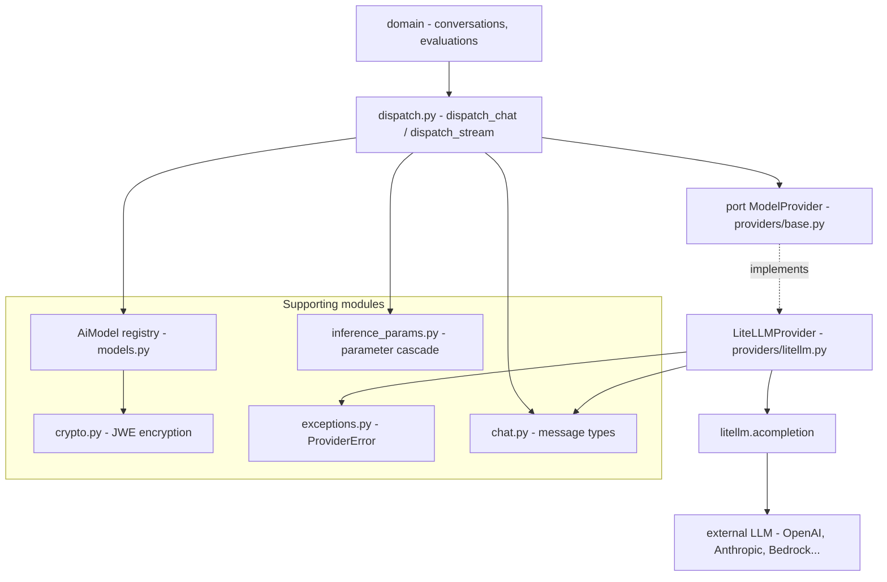

# AI Gateway - overview

The AI Gateway is the layer through which the whole application talks to LLM models. The rest of the code does not know that the `litellm` library sits underneath, nor that the conversation goes to OpenAI or Anthropic. You say "invoke the model with alias X using these messages", and the gateway handles routing, credentials, parameters and error translation.

Think of it as a single counter at an office. The domain walks up to the counter with a simple request (alias + messages), and what happens in the back office is not its problem.

Code: `app/core/ai_gateway/` + CRUD router `app/api/v1/ai_models.py` + warmup router `app/api/v1/model_warmup.py`.

## Why it exists

Two goals:

1. **Provider-agnostic access** - the domain calls a model by a stable alias, unaware of the differences between OpenAI, Anthropic, Bedrock etc. Adding a new vendor = an entry in the registry + optionally routing in the adapter, not rewriting the domain.
2. **Dependency isolation** - only one module in the entire repo imports `litellm`: `providers/litellm.py`. If the library ever had to be swapped out, the change is in a single file.

## Port/adapter pattern

This is the classic hexagonal port/adapter (ports and adapters):

| Element | File | Role |
|---|---|---|
| Port | `app/core/ai_gateway/providers/base.py` | `Protocol` `ModelProvider` - contract: two methods, `chat` and `stream` |
| Adapter | `app/core/ai_gateway/providers/litellm.py` | `LiteLLMProvider` - the only implementation, the only `litellm` import |
| Entry | `app/core/ai_gateway/dispatch.py` | `dispatch_chat` / `dispatch_stream` - this is what the domain calls |

The port says what a provider can do (semantic inputs: vendor, provider_model_id, messages, api_key, api_base, params), the adapter translates that into a call to a concrete library. The domain sticks to the port and value types, never the adapter.

More in [AI Gateway - dispatch](ai-gateway-dispatch.md), [AI Gateway - LiteLLM provider](ai-gateway-litellm-provider.md) and [AI Gateway - message types](ai-gateway-message-types.md).

## Component diagram



The dotted port -> adapter line is the "litellm only here" boundary. Everything to the left of the adapter does not see the library.

## Why the domain does not know litellm

This is a deliberate decision, enforced even by the import layout.

The domain imports EXCLUSIVELY the litellm-free part of the package: `chat.py` (types), `exceptions.py` (`ProviderError`), `dispatch.py`, `inference_params.py`. Never `providers/litellm.py`.

The key: `dispatch_chat`/`dispatch_stream` is imported **directly** from `app.core.ai_gateway.dispatch`, not from the package root. Thanks to that the CRUD path (`app/api/v1/ai_models.py`) does not pull in `litellm` at startup. The root `__init__.py` re-exports the whole **litellm-free** contract that other domains can rely on: chat types + `ProviderError`, the cross-domain registry surface (`AiModel`, `get_model`, `soft_delete_model`, `ProviderVendor`) and the inference parameters toolkit — but not `dispatch_*` (those go straight from `.dispatch`, to keep the root import litellm-free).

What you get out of it:

- **Domain testable without network** - you swap in a fake provider (the `provider=` argument in dispatch), without touching `litellm`.
- **Errors do not leak** - the adapter maps `litellm` exceptions onto its own [ProviderError taxonomy](ai-gateway-error-taxonomy.md). The domain catches `ProviderError`, not `litellm.RateLimitError`.
- **Neutral types** - the port accepts `vendor` + `provider_model_id` + `messages`, not a library-specific model string. The adapter assembles `"openai/gpt-4o"` from that.

```python
# app/core/ai_gateway/providers/base.py
@runtime_checkable
class ModelProvider(Protocol):
    async def chat(
        self,
        *,
        vendor: ProviderVendor,
        provider_model_id: str,
        messages: list[ChatMessage],
        api_key: str | None = None,
        api_base: str | None = None,
        params: dict | None = None,
        timeout: float | None = None,
    ) -> ChatCompletion: ...
```

## What is inside - module map

| Module | File | Note |
|---|---|---|
| Entry / dispatch | `dispatch.py` | [AI Gateway - dispatch](ai-gateway-dispatch.md) |
| litellm adapter | `providers/litellm.py` | [AI Gateway - LiteLLM provider](ai-gateway-litellm-provider.md) |
| Message types | `chat.py` | [AI Gateway - message types](ai-gateway-message-types.md) |
| Inference parameters | `inference_params.py` | [AI Gateway - inference parameters](ai-gateway-inference-parameters.md) |
| Key encryption | `crypto.py` | [AI Gateway - key encryption](ai-gateway-key-encryption.md) |
| Error taxonomy | `exceptions.py` | [AI Gateway - error taxonomy](ai-gateway-error-taxonomy.md) |
| Model registry | `models.py` | [AiModel](../data-models/ai-model.md) |
| Endpoint health check | `services/health.py` + `tasks.py` | the manual probe loop, the capability probe, and their Celery task ([AiModel](../data-models/ai-model.md)) |
| Inactivity sweep | `services/inactivity.py` + `tasks.py` | the beat-scheduled alert for warmed-but-unused models |
| Closed-set enums | `enums.py` | `ProviderVendor`, `Modality`, `WarmupStatus`, `HealthCheckStatus` |

Briefly about each:

- **`AiModel` registry** - the `ai_models` table: alias, vendor, provider_model_id, endpoint, encrypted key, baseline parameters. Dispatch looks up the model by `model_alias`. Details in [AiModel](../data-models/ai-model.md).
- **crypto** - provider API keys kept at-rest as JWE (`dir` + `A256GCM`), key from `MODEL_SECRETS_KEY`, with two-key rotation. The credential never comes back in a response.
- **inference params** - the same dict of knobs (temperature, top_p, system_prompt...) hangs at several levels: model -> assignment -> conversation. Dispatch merges most-specific-wins.
- **exceptions** - `ProviderError` + subclasses (rate limit, auth, timeout, bad request, context window, unavailable). These are markers for the caller: retry, truncate or show the error.
- **chat types** - neutral OpenAI-shape types (`ChatMessage`, `ChatCompletion`, `ChatChunk`...). The I/O contract of the whole layer.
- **enums** - the closed sets the row and the wire share: `ProviderVendor` (which adapter), `Modality` (`text` / `image` — a kind of content, held in the `input_modalities` / `output_modalities` **array columns as plain text**, not a DB enum, so a new modality is a code change rather than an `ALTER TYPE`), `WarmupStatus` (the transient probe verdict, never stored), `HealthCheckStatus` (the **persisted** health-check verdict: `checking`/`alive`/`dead`, a real PG enum on `ai_models`). Adding a provider needs a migration (`ALTER TYPE ... ADD VALUE`), keeping the DB enum and the strategy table in sync.
- **health** - the manual per-model endpoint check: `services/health.py` loops `dispatch_health` until the endpoint answers or the wake-deadline passes, then CAS-writes the verdict onto the row; on an endpoint that was actually *served*, it additionally runs `dispatch_capability_probe` against a declared image input and settles `capability_mismatch`. `tasks.py` is its Celery entry point. See the health-check section in [AiModel](../data-models/ai-model.md).
- **inactivity** - `services/inactivity.py` sweeps warmup-enabled models nobody has messaged and alerts every holder of `models:update` + `models:read`, once per episode. Warmups deliberately don't count as usage — see below.

## How it flows - an invocation example

1. The domain calls `dispatch_stream(session, settings, model_alias="gpt-4o-prod", messages=[...])`.
2. `_resolve_model` finds the `AiModel` row by alias (filters out soft-deleted and disabled - both = unavailable -> `NotFoundError`).
3. `_build_call` validates the declared modalities and the base URL, merges parameters (call wins over the row), translates `system_prompt`/`stop_sequences` into litellm knobs, resolves the credential.
4. The adapter assembles the model string (`"openai/gpt-4o-prod"`), calls `litellm.acompletion(stream=True, ...)`.
5. Chunks come back as neutral `ChatChunk`, a provider error -> `ProviderError`.

The full end-to-end path (from the client through the endpoint to SSE) is in [Flow - AI message streaming (end-to-end)](../flows/flow-ai-message-streaming-end-to-end.md). The registration -> assignment -> conversation path is in [Flow - from AI model registration to invocation](../flows/flow-ai-model-registration-to-invocation.md).

## Bulk registration and key upload

Two bulk endpoints on the CRUD router let an operator stand up a whole fleet from one import config, both riding the platform `BulkRequest`/`BulkResponse` envelope (per-row savepoint, partial success, `dry_run` rolls back — see the bulk contract):

- `POST /api/v1/ai-models/bulk` (`models:create`) — each row is a full create payload. A `name` or a `model_alias` repeated **within the batch** is rejected upfront (422); a collision with an existing live row surfaces per-row (409) without aborting the batch.
- `POST /api/v1/ai-models/api-keys/bulk` (`models:update`) — store/rotate encrypted keys for many models at once. Each row targets its model by the **`name` business key** (`get_model_by_name`), not a server-assigned id, so keys upload from the same config that named the models — nothing to thread back. No live match for a row → per-row 404. Disabled models are valid targets (a key can be pre-loaded before enabling).

This leans on the uniqueness rule (below): `name` is a unique live key, so a business-key lookup resolves at most one row.

## `name` is globally unique again

Live-row uniqueness on `AiModel.name` briefly moved to a composite on `(name, provider)`, then came back to `name` alone (index `ix_ai_models_name`). Two registry rows called `GPT-4o` under different vendors were indistinguishable in every picker, so the display name is the business key on its own — and `provider` dropped out of the bulk keys with it. `model_alias` stays globally unique among live rows too. Details in [AiModel](../data-models/ai-model.md).

## Warming up scale-to-zero endpoints

Self-hosted SLMs (and serverless GPU endpoints like a HuggingFace Inference Endpoint) scale to zero when idle and **reject the first request while a replica wakes**. To avoid failing the red-teamer's first message, a model carries an opt-in `warmup_enabled` flag ([AiModel](../data-models/ai-model.md)) and the gateway exposes a warmup probe:

- `dispatch_probe` ([AI Gateway - dispatch](ai-gateway-dispatch.md#warmup-probe-dispatch_probe)) fires a throwaway 1-token chat — the probe itself is the wake signal — and maps the outcome to a `WarmupStatus`: `ready` (send now, also when merely rate-limited), `starting` (unreachable/timeout — still waking, retry), or `error` (a terminal fault a retry won't fix). It never raises `ProviderError`; the fault is the answer.
- The HTTP surface is a **separate router**, `app/api/v1/model_warmup.py` — `POST /evaluations/{evaluation_id}/models/{assignment_id}/warmup`, gated on `conversations:update` (warming is a precursor to talking, not a config action) with conversation-style evaluation visibility. It lives outside the CRUD router precisely so its litellm-backed `dispatch` import stays off the CRUD path, honouring the same import discipline as `dispatch_*`.
- `warmup_enabled` survives masking: it's an explicit operator toggle (not derived from `provider`), surfaced on the assignment view (`EvaluationAiModelView`) and the `WarmupResponse` (an opaque enum, no provider/model identity, no upstream error text) so the client knows to warm a model without learning it's a self-hosted box.

The config side — the opt-in llama.cpp compose profile, the `upllm` target, the SLM env vars — is covered by the configuration notes.

## Manual health check (the operator's counterpart)

Warmup is automatic and transient; the **health check** is manual and persisted. `POST /api/v1/ai-models/{id}/health-check` (gated `models:update`, on the CRUD router) runs the same 1-token probe through the shared `dispatch_health` classifier, but in a Celery task that retries a cold endpoint up to the wake-deadline and then writes `health_check_status` / `last_health_check_at` / `last_health_reason` / `last_healthy_at` onto the row. `202` starts a check; a fresh in-flight one answers `200` unchanged (idempotent); **disabled models are checkable**, since the point is verifying an endpoint before enabling it. Full mechanics: [AiModel](../data-models/ai-model.md), [AI Gateway - dispatch](ai-gateway-dispatch.md#health-probe-dispatch_health--the-shared-classifier), [Celery workers](celery-workers.md).

## Inactivity alerting for warmed-up models

A scale-to-zero endpoint is warmed on every conversation open, so one can stay hot — and billable — long after the last real message. That makes "warm but unused" the state worth flagging, and it is why the two clocks are kept apart:

- `dispatch_chat` / `dispatch_stream` stamp **`last_used_at`** (and clear `inactivity_alerted_at`);
- `dispatch_probe` stamps **`last_warmup_at`** only, at most once every 5 minutes — a warmup is what makes an unused model *look* active, so it must not reset the usage clock.

Both stamps ride a **detached** `standalone_session`, because the streaming call sites close the request session uncommitted; the stream's stamp fires as iteration begins, after those call sites `db.close()`, so its pooled checkout never nests inside a held request connection. Both are best-effort and never raise — a lost stamp costs at most one spurious alert — and both pin `updated_at`, so that public timestamp keeps meaning "last admin edit".

`check_model_inactivity` (Celery beat, every `MODEL_INACTIVITY_CHECK_INTERVAL_SECONDS`) then alerts once a model passes its own opt-in `inactivity_alert_hours` — in-app [notification](notifications.md) deep-linking to the model page, plus [email](email.md). The claim UPDATE re-checks the whole inactive predicate rather than just the stamp, so traffic landing mid-sweep loses the row; that is also what makes the sweep safe under `acks_late` redelivery and overlapping beat ticks. Disabling the model stays a human decision — the sweep only says it is worth doing.

## The registry read is object-scopeable

`GET /api/v1/ai-models` no longer requires the **global** `models:read`. A caller without it is authorized object-scoped, via an in-group role (the in-group `owner` role grants `models:read`) on either `for_group=<group_id>` (an authorization hint, not a filter — it never narrows results) or the parent group of `assignable_to_evaluation=<evaluation_id>`. When both are present the **evaluation's** group wins, so a caller can't authorize against a group they own while reading another group's subset. `assignable_to_evaluation` also filters: only models in the parent group's [allowed-model subset](../data-models/evaluation-group-ai-model.md) that aren't already assigned (an empty subset yields none — fail-closed). `include_disabled=true` still needs the global `models:update`. A global `models:read` holder is authorized outright, so their `for_group` is neither resolved nor validated.

## Pitfalls worth remembering

- `dispatch_stream` is deliberately NOT an async generator. Errors resolving the alias / credential / capability surface on `await` (before the first chunk), provider/transport errors - only on iteration.
- `system_prompt` and `stop_sequences` must be translated in `_build_call`, because `litellm.drop_params=True` would silently eat keys it does not recognize.
- `extras` is NOT `parameters` - extras is call-shape metadata, it does not go to the provider.
- `advanced_params_disabled` drops the operator params cascade inside `_build_call`. Anything the *platform* adds to a call (the tag block, a probe's token cap) must therefore ride `system_suffix` or be applied after the build, never `params` — see [AI Gateway - inference parameters](ai-gateway-inference-parameters.md).
- `resolve_api_key`: the row's own encrypted key takes absolute precedence over the env-var fallback. A decrypt fail = hard fail (`ProviderAuthError` — a terminal auth fault, present-but-unreadable credential), so that after a key rotation traffic is not routed with a bad credential.

## Related

- [AI Gateway - dispatch](ai-gateway-dispatch.md)
- [AI Gateway - LiteLLM provider](ai-gateway-litellm-provider.md)
- [AI Gateway - message types](ai-gateway-message-types.md)
- [AI Gateway - inference parameters](ai-gateway-inference-parameters.md)
- [AI Gateway - key encryption](ai-gateway-key-encryption.md)
- [AI Gateway - error taxonomy](ai-gateway-error-taxonomy.md)
- [AiModel](../data-models/ai-model.md)
- [EvaluationGroupAiModel](../data-models/evaluation-group-ai-model.md) — the group subset the `assignable_to_evaluation` filter reads
- [Celery workers](celery-workers.md) — the health-check and inactivity tasks
- [Flow - AI message streaming (end-to-end)](../flows/flow-ai-message-streaming-end-to-end.md)
- [Flow - from AI model registration to invocation](../flows/flow-ai-model-registration-to-invocation.md)
- [Streaming SSE](streaming-sse.md)
- [Endpoint POST chat-stream](endpoint-post-chat-stream.md)
- [Architecture overview](../basics/architecture-overview.md)
