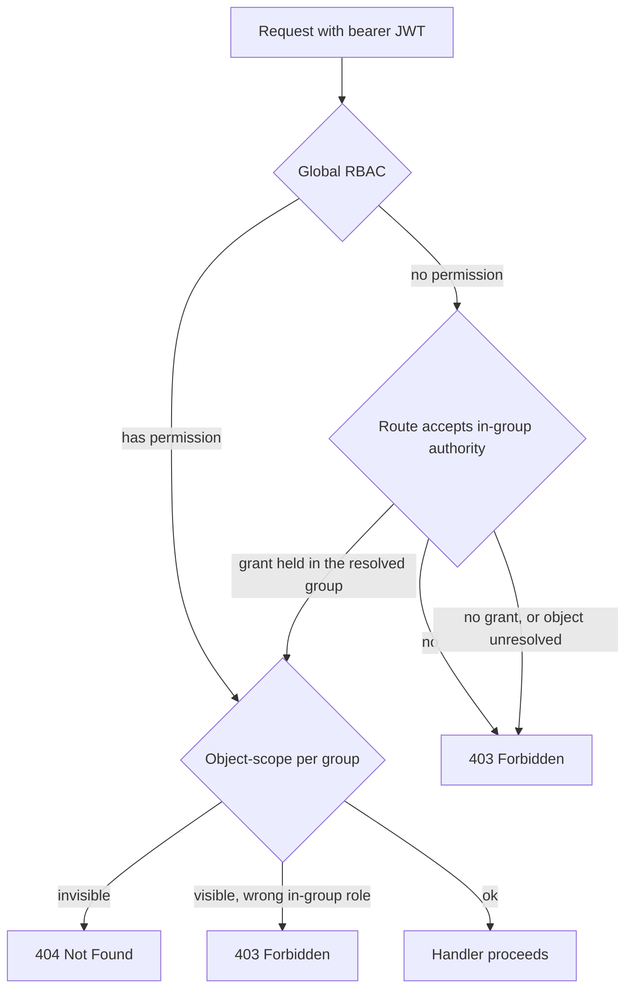

# API - overview and conventions

This is the map of the backend's entire HTTP surface. If you're looking for "where is the endpoint for X" or "how do we do pagination/errors/permissions" — this is the note. We start with a few rules that hold everywhere, then comes the big table of all endpoints.

Surface: three unversioned probes (`/health`, `/ready`, `/version`) plus over 100 domain endpoints under `/api/v1`. They all keep the same conventions, so once you know one resource, you know them all.

## Conventions - what all endpoints follow

These rules are enforced by the skill `app/.claude/skills/api/SKILL.md` and visible in every router module.

### Versioning and paths

- Domain endpoints sit under `/api/v1/...`. The liveness/readiness/version probes (`/health`, `/ready`, `/version`) are mounted at top-level, unversioned - because they're infrastructure, not domain.
- Paths: plural, `lower-kebab-case` (`/evaluation-groups`, `/ai-models`).
- Path params in `snake_case`: `{evaluation_id}`, `{assignment_id}`.
- Mounting in `app/main.py`: three routers - `health_router` and `version_router` (both top-level, unversioned) and `v1_router` (prefix `/api/v1`).

### Errors always as problem+json (RFC 7807)

Routers NEVER raise `fastapi.HTTPException`. They raise `APIError` subclasses from `app/core/exceptions.py` (`BadRequestError`=400, `NotFoundError`=404, `ConflictError`=409, `GoneError`=410, `BadGatewayError`=502, etc.). Global handlers map them to a `Problem` envelope with the header `Content-Type: application/problem+json`. Details: [Error handling (RFC 7807)](error-handling-rfc-7807.md).

### The `responses=` declaration

Every operation declares `response_model`, `status_code`, `summary`, `description` and `responses=`. The baseline is `COMMON_ERROR_RESPONSES` (`app/core/openapi.py`) - i.e. always **422** (validation) + **500** (unexpected error). You add the remaining codes per-route via `|`:

`app/core/openapi.py`
```python
COMMON_ERROR_RESPONSES: dict[int | str, dict[str, Any]] = {
    status.HTTP_422_UNPROCESSABLE_CONTENT: problem_response("Request failed validation."),
    status.HTTP_500_INTERNAL_SERVER_ERROR: problem_response("Unexpected server error."),
}
```

Modules keep shared constants at the top of the file (`_UNAUTHORIZED`, `_FORBIDDEN`, `_NOT_FOUND`, `_CONFLICT`) and compose them into `responses=COMMON_ERROR_RESPONSES | {...}`.

### `Page[T]` pagination

Every listing endpoint takes `PaginationDep` (`limit` 1-100, default 20; `offset` >=0, default 0) and returns the generic `Page[T]` envelope with the fields `items / total / limit / offset`. Sorting goes through `order_by` (a `Query` param of type `Literal`, a leading `-` = descending, the JSON:API convention). Patterns: [Pagination, bulk and soft-delete](pagination-bulk-and-soft-delete.md).

### Nested + standalone

Some resources have two variants:

- **nested** (`/evaluations/{id}/scenarios`) - resolves the parent first, an invisible parent gives 404.
- **standalone / flat** (`/scenarios`) - a cross-evaluation list; a filter on invisible ids returns an empty page, NOT a 404 (so the existence of a resource isn't leaked).

That's how scenarios and conversations work. Tasks have the nested variant only.

### `/health`, `/ready` and `/version`

- `/health` - liveness, always 200, doesn't touch dependencies.
- `/ready` - readiness, checks Postgres + Redis in parallel with a 2 s timeout, 503 when one fails.
- `/version` - public (no auth), returns `{version, environment}` where `version` is the deployed commit SHA (short, 7 chars) or `"dev"` when `GIT_SHA` is unset; backs the frontend version readout, including the pre-login page. The same value is the OpenAPI `info.version`.

### Visibility convention (404 vs 403)

A resource invisible to the caller reads as **404** (we don't leak existence). A resource that is visible but lacks permission for the action is **403**.

## Three authorization scopes

The "permission" column in the table below mixes three parallel models - worth telling them apart.



- **A. Global RBAC from the JWT** - `require_permission(Permission.X)`. The permissions are the families `users:*`, `roles:read`, `organizations:*`, `models:*`, `evaluations:*`, `evaluation_groups:*`, `conversations:*`, `flags:*`, `reviews:*`, `platform_settings:*`, `saved_views:*`, `audit:read`. The role->permissions mapping is in `ROLE_SPECS`. More: [RBAC - global roles](rbac-global-roles.md), [Authentication (auth)](authentication.md).
- **B. Object-scope (per-group)** - the in-group role is authoritative. A member with a lower role won't pass even with a global permission; break-glass `evaluation_groups:manage` (admin) waives the scope. More: [Object roles - per-object permissions](object-roles-per-object-permissions.md).
- **C. Global *or* in-group** - `require_object_or_global(permission, resolve_group)` in `app/core/evaluations/dependencies.py`. The JWT carries only global roles, so an object-role assignment never satisfied arm A: a caller added to a group as `red_teamer` could not start a conversation there, even though that role grants the whole conversation CRUD set. This gate tries the global permission first, then object authority in the group the route resolves (`assert_object_permission`), and refuses when the object doesn't resolve. Unlike arm B the global permission still passes on its own. `resolve_group` is a dependency in its own right, so each route family declares where it finds the group: `require_conversation_permission` (from the path evaluation) and `require_flag_permission` (from the path flag) wrap the common cases, while conversations/groups resolve from the path scenario and task-completions from the path conversation. Used by the conversations, conversation-groups, messages, message-flags, task-completions and model-warmup route families.

In the tables below the "permission" column gives the RBAC permission; where object-scope applies, I add it in words.

## Full endpoint table

### Health (top-level, unversioned, no auth)

| Method | Path | Permission | Description |
|---|---|---|---|
| GET | `/health` | none | Liveness, always 200, doesn't touch dependencies |
| GET | `/ready` | none | Readiness, checks Postgres + Redis (2 s timeout), 503 on failure |
| GET | `/version` | none | Deployed commit SHA (short) or `dev`, plus the environment; backs the FE version readout |

### Auth - session and identity (`/api/v1/auth`)

| Method | Path | Permission | Description |
|---|---|---|---|
| GET | `/auth/me` | bearer | Identity from the token + the caller's live `roles`/`permissions` from the DB |
| POST | `/auth/login` | none | Login email+password, returns a token, uniform 401 |
| POST | `/auth/refresh` | token in body | Exchange a refresh token for a new pair, rotates the token, uniform 401 |
| GET | `/auth/oidc/providers` | none | List of configured OIDC providers |
| GET | `/auth/oidc/{provider}/login` | none | 302 redirect to the IdP, `oidc_state` cookie |
| GET | `/auth/oidc/{provider}/callback` | none | Exchange the code for a token, mint JWT |
| POST | `/auth/register` | none | Self-signup, always 202 (anti-enumeration) |
| POST | `/auth/register/resend` | none | Re-issue the verification mail for a `pending` account (same anti-enumeration shape) |
| POST | `/auth/register/verify` | token in body | Mail verification + activation, 204 |
| POST | `/auth/password-resets/request` | none | Send a reset link, always 204 |
| POST | `/auth/password-resets/confirm` | token in body | Set a new password, 204 |

### Auth - users (`/api/v1/auth/users`)

| Method | Path | Permission | Description |
|---|---|---|---|
| GET | `/auth/users` | `users:read` | Paginated list, filters + `order_by` |
| GET | `/auth/users/{user_id}` | `users:read` | Single user |
| PATCH | `/auth/users/{user_id}` | `users:update` (+ `users:manage_admin`) | Partial edit, `role_ids` replaces the whole set |
| DELETE | `/auth/users/{user_id}` | `users:delete` (+ `users:manage_admin`) | Soft-delete; self-delete forbidden (403); sole `owner` of an object → 409 |
| POST | `/auth/users/{user_id}/force-logout` | `users:manage_sessions` | Revoke all of the user's sessions, 204 |
| POST | `/auth/users/force-logout` | `users:manage_sessions` | Bulk force-logout (`BulkRequest[ForceLogoutTarget]`); side-effects gated on `dry_run` |
| POST | `/auth/users/{user_id}/status` | `users:update` (+ elevated-role guard) | Activate / deactivate; deactivate also revokes sessions; onboarding account → 409, own account → 403 |
| POST | `/auth/users/status` | `users:update` | Bulk status change (`BulkRequest[UserStatusTarget]`, per-row target status) |
| POST | `/auth/users/{user_id}/password-reset` | `users:update` | Mail a fresh reset link (revokes the pending one), 204; not-`active` / passwordless → 409 |
| POST | `/auth/users/password-reset` | `users:update` | Bulk reset links; duplicate `user_id` → 422; mail dispatched after the commit |
| POST | `/auth/users/{user_id}/invitation/resend` | `users:invite` (+ elevated-role guard) | Re-issue + re-mail the **platform** invitation; not `invited` → 409 |
| DELETE | `/auth/users/{user_id}/invitation` | `users:invite` (+ elevated-role guard) | Revoke the pending platform accept link, 204; nothing pending → 404 |

There is **no create-user endpoint** — accounts are provisioned via platform invitations or self-registration (the `users:create` permission still exists but backs no route). See [User management](user-management.md).

### Auth - platform invitations (`/api/v1/auth/invitations`)

| Method | Path | Permission | Description |
|---|---|---|---|
| POST | `/auth/invitations/bulk` | `users:invite` | **The only invite path** (a single invitee is a one-row request); creates each `User(invited)`; per-row outcomes; side-effects gated on `dry_run` |
| GET | `/auth/invitations/accept` | token in query | Invitation preview, `Cache-Control: no-store` (PII) |
| POST | `/auth/invitations/accept` | token in body | Set the password, activate the account, 204 |

### Roles & permissions catalog (`/api/v1/roles`, `/api/v1/permissions`)

The RBAC vocabulary for the admin/owner role-builder UI, plus role management. Reads gate on `roles:read`, writes on the admin-only `roles:manage`; both routers are top-level (not under `/auth`).

| Method | Path | Permission | Description |
|---|---|---|---|
| GET | `/roles` | `roles:read` | Paginated role catalog (permissions + the `is_system` / `is_active` / `is_default` / `is_participant_default` / `is_object_assignable` flags); active-only unless `include_inactive=true`; `is_object_assignable=` narrows to in-group-assignable |
| GET | `/roles/{role_id}` | `roles:read` | Single role, active or inactive |
| POST | `/roles` | `roles:manage` | Create a custom role (always active, non-default); reserved name → 409, non-delegable permission → 400 |
| PATCH | `/roles/{role_id}` | `roles:manage` | Field edits (custom only) → activation → new-user default → participant default; guards → 409 |
| DELETE | `/roles/{role_id}` | `roles:manage` | Soft-delete a custom role; system → 400, default / sole-active-role → 409 |
| GET | `/permissions` | `roles:read` | Paginated permission catalog (`{key, description, is_delegable}`) from `PERMISSION_DESCRIPTIONS` |

`GET /auth/me` returns the caller's live `roles`/`permissions` from the same vocabulary. Details: [RBAC - global roles](rbac-global-roles.md).

### Organizations (`/api/v1/organizations`)

The tenancy root. **`organizations:read` is held by every role**; management is admin-only. Details: [Organizations](organizations.md).

| Method | Path | Permission | Description |
|---|---|---|---|
| GET | `/organizations` | `organizations:read` | Paginated list; `name` filter, `order_by` |
| POST | `/organizations` | `organizations:create` | Create; duplicate live name → 409, `Location` |
| GET | `/organizations/{organization_id}` | `organizations:read` | Single org |
| PATCH | `/organizations/{organization_id}` | `organizations:update` | Edit name/description; explicit `null` clears `description` |
| DELETE | `/organizations/{organization_id}` | `organizations:delete` | Soft-delete; **409** while a live evaluation group still references it |
| GET | `.../{organization_id}/members` | `organizations:manage_members` | Paginated members (users in the org) |
| POST | `.../{organization_id}/members` | `organizations:manage_members` | Assign a user (stamps `User.organization_id`); idempotent |
| DELETE | `.../{organization_id}/members/{user_id}` | `organizations:manage_members` | Detach the user; wrong (org, user) pair → 404, 204 |

### AI models (`/api/v1/ai-models`)

| Method | Path | Permission | Description |
|---|---|---|---|
| GET | `/ai-models` | `models:read` — global **or** object-scoped via `for_group` / `assignable_to_evaluation` (+ global `models:update` for `include_disabled=true`) | List, disabled hidden by default; `assignable_to_evaluation` narrows to the parent group's allowed-model subset minus already-assigned |
| POST | `/ai-models` | `models:create` | Creates a model (`name` unique among live rows), encrypts the optional `api_key`, `Location` |
| POST | `/ai-models/bulk` | `models:create` | Bulk create (`BulkRequest`); duplicate `name`/`model_alias` in-batch → 422, live collision → per-row 409 |
| POST | `/ai-models/api-keys/bulk` | `models:update` | Bulk set/rotate keys; each row targets its model by the `name` business key; no live match → per-row 404 |
| GET | `/ai-models/{model_id}` | `models:read` | Detail; a disabled one without `models:update` reads as 404 |
| PATCH | `/ai-models/{model_id}` | `models:update` | Partial edit (no api_key), two-state cascade `parameters` |
| PUT | `/ai-models/{model_id}/api-key` | `models:update` | Set/rotate the key, 204 |
| DELETE | `/ai-models/{model_id}/api-key` | `models:update` | Clear the key (idempotent), 204 |
| POST | `/ai-models/{model_id}/health-check` | `models:update` | Start an endpoint health check (202); a fresh in-flight one → 200 unchanged; disabled models allowed |
| DELETE | `/ai-models/{model_id}` | `models:delete` | Soft-delete + cascade (unassign, drop from every group's allowed-model subset, soft-delete conversations) |

### Evaluation groups (`/api/v1/evaluation-groups`)

| Method | Path | Permission | Description |
|---|---|---|---|
| GET | `/evaluation-groups` | `evaluation_groups:read` (+ `:manage` for `all_groups=true`) | List of visible groups |
| POST | `/evaluation-groups` | `evaluation_groups:create` | Full create — a **complete** group submitted for review (lands `pending_approval`); grants the creator in-group `owner` |
| POST | `/evaluation-groups/draft` | `evaluation_groups:create` | Partial draft (title-only), lands `draft`; a `public` draft stays owner/manager-only |
| POST | `/evaluation-groups/{group_id}/duplicate?include_children=` | `evaluation_groups:create` + source write access | Copy a group into a fresh `draft` owned by the caller; visible-but-not-owner → 403, invisible → 404 |
| GET | `/evaluation-groups/{group_id}` | `evaluation_groups:read` + visibility | Detail with embedded evaluations + the caller's in-group `user_permissions`; invisible -> 404 |
| GET | `/evaluation-groups/{group_id}/metrics` | access-aware (object-scope) | Whole-event aggregate dashboard; owner/`:manage` always FULL, members per the group's `metrics_access_*` level; 403 insufficient, 404 invisible |
| PATCH | `/evaluation-groups/{group_id}` | `evaluation_groups:update` (in-group role or `:manage`) | Partial edit; `status` not editable; `organization_id` + `access_level` validated (an `organization` group needs a live org) |
| POST | `/evaluation-groups/{group_id}/submit` | `evaluation_groups:update` / `:manage` | `draft` / `changes_requested -> pending_approval`; re-checks completeness (400 on an incomplete draft); 409 bad state |
| POST | `/evaluation-groups/{group_id}/approve` | `evaluation_groups:update` / `:manage` | `pending_approval -> approved` (owner may approve own); clears `rejection_reason`; 409 |
| POST | `/evaluation-groups/{group_id}/request-changes` | `evaluation_groups:manage` (admin) | `pending_approval -> changes_requested`; clears `rejection_reason`; 409 |
| POST | `/evaluation-groups/{group_id}/reject` | `evaluation_groups:manage` (admin) | `pending_approval -> not_approved`, writes `rejection_reason`; 409 |
| POST | `/evaluation-groups/{group_id}/publish` | `evaluation_groups:update` / `:manage` | `approved -> published`; 409 bad state |
| POST | `/evaluation-groups/{group_id}/finish` | `evaluation_groups:update` / `:manage` | `published -> inactive`; 409 |
| POST | `/evaluation-groups/{group_id}/join` | `evaluation_groups:read` + visibility | Self-service as `red_teamer`; public+published only |

### Evaluation group members (`/api/v1/evaluation-groups/{group_id}/members`)

| Method | Path | Permission | Description |
|---|---|---|---|
| GET | `.../members` | `evaluation_groups:read` + visibility | List of members + their roles |
| POST | `.../members` | `evaluation_groups:manage_members` | Add a member with roles |
| PATCH | `.../members/{user_id}` | `evaluation_groups:manage_members` | Replace the member's whole role set; dropping the group's last `owner` → 409 |
| DELETE | `.../members/{user_id}` | `evaluation_groups:manage_members` | Remove a member (soft-delete the roles), 204; removing the last `owner` → 409 |
| GET | `.../annotators` | `evaluation_groups:manage_members` | Annotator search for a flag/review; three-branch pool — `public`=global `annotator`s, `organization`=the org's global `annotator`s ∪ in-group annotator members, `invitation_only`=in-group `annotator` members |

### Evaluation group invitations (`/api/v1/evaluation-groups/{group_id}/invitations`)

| Method | Path | Permission | Description |
|---|---|---|---|
| POST | `.../invitations/bulk` | `evaluation_groups:manage_members` | **The only group-invite path** (one invitee = one row); roles pre-assigned immediately; a re-invite that drops the group's last `owner` → 409; mail best-effort after the commit |

### Evaluations (`/api/v1/evaluations`)

| Method | Path | Permission | Description |
|---|---|---|---|
| GET | `/evaluations` | `evaluations:read` | List of visible ones (parent group public/member); model masking |
| POST | `/evaluations` | `evaluations:create` + write on the parent group | Creates in `new`; invisible group -> 404 |
| GET | `/evaluations/{evaluation_id}` | `evaluations:read` | Detail with models (masked) |
| GET | `/evaluations/{evaluation_id}/metrics` | access-aware (object-scope, parent group) | Single-evaluation aggregate dashboard + exploit distributions; owner/`:manage` FULL, members per the `metrics_access_*` level; 403 insufficient, 404 invisible |
| PATCH | `/evaluations/{evaluation_id}` | `evaluations:update` (object-scope) | Partial edit; `status` not editable |
| DELETE | `/evaluations/{evaluation_id}` | `evaluations:delete` (object-scope) | Soft-delete |
| POST | `/evaluations/{evaluation_id}/duplicate?include_children=` | `evaluations:create` + source write access | Copy an evaluation into the same group as a new `new` row; runtime data + keys never copied |
| GET | `/evaluations/{evaluation_id}/tag-keys` | `evaluations:read` | The evaluation's allowed conversation-tag keys — a flat list, not a `Page[T]` (capped at 16) |
| POST | `/evaluations/{evaluation_id}/tag-keys` | `evaluations:update` (object-scope) | Allow a tag key, `Location`; duplicate or at cap → 409 |
| DELETE | `/evaluations/{evaluation_id}/tag-keys/{key}` | `evaluations:update` (object-scope) | Disallow a tag key, 204; stored conversation tags untouched |
| POST | `/evaluations/{evaluation_id}/models` | `evaluations:update` (object-scope) | Assign a model + mask + parameters, `Location` |
| GET | `/evaluations/{evaluation_id}/models` | `evaluations:read` | List of assignments (masked) |
| GET | `/evaluations/{evaluation_id}/models/{assignment_id}` | `evaluations:update` (object-scope) | Single assignment UNMASKED (edit-form payload) |
| PATCH | `/evaluations/{evaluation_id}/models/{assignment_id}` | `evaluations:update` | Edit the assignment; `parameters` replaces the layer |
| DELETE | `/evaluations/{evaluation_id}/models/{assignment_id}` | `evaluations:update` | Soft-delete the assignment + conversation cascade |
| POST | `/evaluations/{evaluation_id}/models/{assignment_id}/warmup` | `conversations:update` (+ evaluation visibility) | Fire a 1-token readiness probe at an assigned model (scale-to-zero endpoints); returns `{status: ready\|starting\|error}`, no model/provider identity; invisible eval → 404 |
| POST | `/evaluations/{evaluation_id}/approve` | `evaluations:approve` (admin) | `under_review -> approved`; 409 |
| POST | `/evaluations/{evaluation_id}/reject` | `evaluations:approve` (admin) | `under_review -> rejected`, writes reason; 409 |

### Scenarios (nested + standalone)

| Method | Path | Permission | Description |
|---|---|---|---|
| POST | `/evaluations/{evaluation_id}/scenarios` | `evaluations:update` (object-scope) | Add a scenario (append, highest `position`), `Location` |
| GET | `/evaluations/{evaluation_id}/scenarios` | `evaluations:read` | List of scenarios; default `order_by=position` |
| PATCH | `/evaluations/{evaluation_id}/scenarios/order` | `evaluations:update` | Rewrite the whole order; 409 when the id set doesn't match |
| GET | `/evaluations/{evaluation_id}/scenarios/{scenario_id}` | `evaluations:read` | Detail with embedded tasks |
| PATCH | `/evaluations/{evaluation_id}/scenarios/{scenario_id}` | `evaluations:update` | Edit name/description; `position` not editable |
| DELETE | `/evaluations/{evaluation_id}/scenarios/{scenario_id}` | `evaluations:update` | Soft-delete |
| GET | `/scenarios` | `evaluations:read` | Flat cross-evaluation list; invisible filter -> empty page |

### Tasks (`/api/v1/scenarios/{scenario_id}/tasks`)

| Method | Path | Permission | Description |
|---|---|---|---|
| POST | `.../tasks` | `evaluations:update` (object-scope) | Add a task, `Location` |
| GET | `.../tasks` | `evaluations:read` | List of tasks, order `(created_at, id)` |
| GET | `.../tasks/{task_id}` | `evaluations:read` | Single task |
| PATCH | `.../tasks/{task_id}` | `evaluations:update` | Edit name/description |
| DELETE | `.../tasks/{task_id}` | `evaluations:update` | Soft-delete |

### Conversations (nested + standalone)

| Method | Path | Permission | Description |
|---|---|---|---|
| POST | `/scenarios/{scenario_id}/conversations` | `conversations:create` | Start an empty conversation **under a scenario**; the evaluation is derived from it; required `conversation_group_id` (a live group of this evaluation *and* this scenario — cap → 409 when full, other scenario → 409); optional `tags` (a key the evaluation disallows → 400); `Location` points at the evaluation-nested read route |
| GET | `/evaluations/{evaluation_id}/conversations` | `conversations:read` | List of own conversations (admin `:manage` sees others'; an in-group `conversations:read_any` holder sees the group's); `?deleted=true` for tombstones |
| GET | `/evaluations/{evaluation_id}/conversations/{conversation_id}` | `conversations:read` | Single conversation (owner-scoped) |
| GET | `/evaluations/{evaluation_id}/conversations/{conversation_id}/messages` | `conversations:read` | Message history (from the oldest turn, no overwritten ones); `flag_count` per message; invisible conversation -> 404 |
| PATCH | `/evaluations/{evaluation_id}/conversations/{conversation_id}` | `conversations:update` | Edit `parameters` / `tags` (each replaces the map wholesale; a disallowed tag key → 400, a real tag change is audited); `conversation_group_id` moves it to another group of this evaluation **and this scenario** (target cap → 409, another scenario → 409, an emptied source group is soft-deleted); the evaluation/model/scenario links stay immutable |
| DELETE | `/evaluations/{evaluation_id}/conversations/{conversation_id}` | `conversations:delete` | Soft-delete; if it was the group's last live conversation, the group is soft-deleted too |
| POST | `/evaluations/{evaluation_id}/conversations/{conversation_id}/restore` | `conversations:delete` | Revive a tombstone inside the restore window; not restorable if a model-unassign cascade killed it |
| POST | `/evaluations/{evaluation_id}/conversations/{conversation_id}/messages` | `conversations:update` | Write-path: append a user message and stream the response (SSE, A/B split); idempotent on `client_message_id`; optional per-message `tags` folded over the conversation's |
| POST | `.../conversations/{conversation_id}/messages/{message_id}/regenerate` | `conversations:update` | Overwrite the assistant response and stream a fresh one (last turn only, otherwise 409) |
| POST | `.../conversations/{conversation_id}/messages/{message_id}/continue` | `conversations:update` | Extend the assistant response (continuation, last turn only) |
| GET | `/conversations` | `conversations:read` | Flat list of own cross-evaluation ones |

### Conversation groups (nested + standalone)

A conversation group is the required parent that buckets a red-teamer's conversations within one evaluation (comparative model testing). The routes share the `conversations:*` permissions and the owner-scope + group-visibility rule of conversations; break-glass `evaluation_groups:manage` lifts both.

| Method | Path | Permission | Description |
|---|---|---|---|
| POST | `/scenarios/{scenario_id}/conversation-groups` | `conversations:create` | Create a group + one conversation per `models[]` entry (≥1, ≤ cap) under that scenario, `name`; `Location` |
| GET | `/evaluations/{evaluation_id}/conversation-groups` | `conversations:read` | List groups in the evaluation, `-created_at`; resolves the evaluation first → invisible 404 |
| GET | `/evaluations/{evaluation_id}/conversation-groups/{group_id}` | `conversations:read` | Single group + its member conversations (owner-scoped) |
| PATCH | `/evaluations/{evaluation_id}/conversation-groups/{group_id}` | `conversations:update` | Rename only; the evaluation/scenario links and the member set are immutable |
| DELETE | `/evaluations/{evaluation_id}/conversation-groups/{group_id}` | `conversations:delete` | Soft-delete + cascade-soft-delete its member conversations |
| GET | `/conversation-groups` | `conversations:read` | Flat cross-evaluation list, filters `evaluation_id` / `scenario_id`; invisible-eval filter → empty page, not 404 |

Details: [Conversation groups](conversation-groups.md).

### Chat / stream (`/api/v1/chat`)

| Method | Path | Permission | Description |
|---|---|---|---|
| POST | `/chat/stream` | `conversations:participate` | Stateless SSE; resolves the model, closes the DB session, streams events |

`/chat/stream` (and the write-path `POST .../messages` + `/regenerate`/`/continue`) is an exception to the JSON convention - no `response_model`, success is `text/event-stream` (the shared `SSE_RESPONSE` from `app/core/openapi.py` + `response_class=EventSourceResponse`, so FastAPI doesn't add a phantom `application/json` on 200). Details: [Endpoint POST chat-stream](endpoint-post-chat-stream.md), [Streaming SSE](streaming-sse.md), [Message persistence (write-path)](message-persistence-write-path.md).

### Message flags (`/api/v1/message-flags`)

| Method | Path | Permission | Description |
|---|---|---|---|
| POST | `/message-flags` | `flags:create` | Flag a selection of conversation messages; denormalizes ancestors, `Location` |
| GET | `/message-flags` | `flags:read` | List of own flags (admin `:manage` sees others'); filters + `order_by` |
| GET | `/message-flags/{flag_id}` | `flags:read` | Single flag with messages (owner-scoped) |
| PATCH | `/message-flags/{flag_id}` | `flags:update` | Edit the content only (`reason`/`red_flagged`/`comment`); the anchor and set are immutable |
| DELETE | `/message-flags/{flag_id}` | `flags:delete` | Soft-delete |

Owner-scope + group visibility as in conversations; break-glass `evaluation_groups:manage` lifts the read, but authorship is always owner-only. Details: [Message flags](message-flags.md), [MessageFlag](../data-models/message-flag.md).

### Notes (`/api/v1/notes`)

| Method | Path | Permission | Description |
|---|---|---|---|
| POST | `/notes` | `notes:create` | Note a selection of one conversation's messages; **needs only group visibility, not ownership**; `Location` |
| GET | `/notes` | `notes:read` | Own notes (admin `:manage` sees others'); filters + `order_by`; `?deleted=true` for tombstones |
| GET | `/notes/{note_id}` | `notes:read` | Single note with its `message_ids` |
| PATCH | `/notes/{note_id}` | `notes:update` | Edit `text` only; `extra="forbid"`, so sending `message_ids` is a 422 |
| DELETE | `/notes/{note_id}` | `notes:delete` | Soft-delete |
| POST | `/notes/{note_id}/restore` | `notes:delete` | Revive a tombstone inside the restore window |

Reads and by-id writes are author-scoped through the shared `join_conversation_scoped` (break-glass `evaluation_groups:manage` lifts author + visibility); **authoring is not** — an annotator may note a red-teamer's transcript. Renamed from `/annotations`. Details: [Notes](notes.md), [Note](../data-models/note.md).

### Annotation labels (`/api/v1/annotation-labels`)

| Method | Path | Permission | Description |
|---|---|---|---|
| GET | `/annotation-labels` | `annotations:read` | The **curated** label vocabulary, ordered by display name; read-only |

Code-owned reference data reconciled on deploy (`make syncannotationlabels`), so there is no create or edit route. An empty first page means the sync step hasn't run. Details: [AnnotationLabel](../data-models/annotation-label.md).

### Task completions (nested under conversations + conversation-groups)

A red-teamer checks off scenario tasks per conversation (a toggle: a live row = done). Routes hang off the existing conversation parents, tag `task-completions`; they reuse the `conversations:*` split (no new permission). Details: [Task completions](task-completions.md), [TaskCompletion](../data-models/task-completion.md).

| Method | Path | Permission | Description |
|---|---|---|---|
| PUT | `/conversations/{conversation_id}/completed-tasks/{task_id}` | `conversations:update` | Check off (idempotent, 200); 404 if unreachable or task not in the scenario |
| DELETE | `/conversations/{conversation_id}/completed-tasks/{task_id}` | `conversations:update` | Un-check (idempotent, 204 no-op) |
| GET | `/conversations/{conversation_id}/completed-tasks` | `conversations:read` | The caller's completions for one conversation; unreachable → empty list (never 404) |
| GET | `/conversation-groups/{conversation_group_id}/completed-tasks` | `conversations:read` | Roll-up: `total_conversations` + per-task counts; unreachable → `total_conversations: 0` |

Authoring is owner-only (`can_manage` lifts reads only). The roll-up scopes by each conversation's *current* group (a live join), not the denormalised snapshot.

### Reviews (`/api/v1/reviews` + `/review-queue` + `/submissions`)

| Method | Path | Permission | Description |
|---|---|---|---|
| POST | `/reviews` | `reviews:create` | Assign a reviewer to a flag (`pending`); 409 when the flag is decided / self-review / duplicate, `Location` |
| POST | `/reviews/bulk` | `reviews:create` | Bulk assign — one row per `{flag, reviewer}` pair; per-row failures in `results[]`, notify after the commit |
| GET | `/reviews` | `reviews:read` | List of reviews; filters `message_flag_id`/`evaluation_id`/`reviewer_id`/`status`; a reviewer sees the whole group, a red_teamer only their own flags |
| GET | `/review-queue` | `reviews:read` | Flags waiting for review (completed < `required_reviews`); filters `evaluation_id`/`evaluation_group_id`/`scenario_id` |
| GET | `/reviews/{review_id}` | `reviews:read` | Single review |
| PATCH | `/reviews/{review_id}` | `reviews:update` | Write the verdict (`approved`/`rejected`); only the assigned reviewer (or a manager) |
| DELETE | `/reviews/{review_id}` | `reviews:delete` | Unassign (soft-delete); the verdict is removed only by its reviewer or a manager |
| GET | `/submissions/{submission_id}` | `reviews:read` | Reviewer's submission detail: flag + flagged messages + a page of reviews + `superseded_message_ids`; a reviewer sees any in a visible group, a red_teamer only their own |
| GET | `/submissions/{submission_id}/messages` | `reviews:read` | Review-scoped parent-conversation transcript (oldest first, superseded excluded) — the owner-scoped history GET is closed to a non-owner reviewer |
| GET | `/submissions/{submission_id}/assignable-reviewers` | `reviews:create` | The assign picker's candidate pool — the flag group's assignable-annotator set minus the author and already-assigned reviewers; exactly what `POST /reviews` accepts |

Writes go on group visibility + the `reviews:*` permission (NOT the scenarios' in-group write-gate). `annotator`/`owner`/`admin` have `reviews:*` in full, `red_teamer` only `reviews:read`. Details: [Reviews - reviewer verdicts](reviews-reviewer-verdicts.md), [Review](../data-models/review.md).

### Licenses & platform settings (`/api/v1/licenses`, `/api/v1/platform-settings`)

Catalog **reads** back the picker (auth-only, **no permission** — like `/permissions` but ungated); the writes are permission-gated and the platform-settings singleton is admin-only. Details: [Data licensing & platform settings](licenses.md).

| Method | Path | Permission | Description |
|---|---|---|---|
| GET | `/licenses` | bearer | Page of data licenses (`is_curated` / `is_default` flags); full `content` omitted |
| GET | `/licenses/{license_id}` | bearer | One license **with its full text**; unknown id → 404 |
| POST | `/licenses` | `licenses:create` | Create a user-authored license owned by the caller; 201 + `Location` |
| PATCH | `/licenses/{license_id}` | `licenses:update` (+ `licenses:manage` for others') | Edit; a curated license → 403 (code-managed), except a `content`-only fill by a `licenses:manage` holder on an entry the catalog ships without text |
| DELETE | `/licenses/{license_id}` | `licenses:delete` (+ `licenses:manage` for others') | Soft-delete; curated → 403, user-authored current default → 409 |
| POST | `/licenses/{license_id}/restore` | `licenses:delete` (+ `licenses:manage` for others') | Revive a tombstone; curated → 403 (`synclicenses` revives those) |
| GET | `/platform-settings` | `platform_settings:read` | Every knob + `updated_at` (`null` = never overridden) |
| PATCH | `/platform-settings` | `platform_settings:update` | Any subset of the knobs; omit = unchanged; explicit `null` → 422; a licence that isn't live, or the `No license` sentinel → 400 |
| GET | `/platform-settings/public` | **none** | Anonymous subset for the login/registration screens: `signup_enabled` + `password_policy`; `Cache-Control: public, max-age=30` |

### CSV exports (`/api/v1/exports`)

Async export (CSV or JSON, chosen per job; optional row filters) of an evaluation or group. Only a group **owner/admin** may run one (a whole-group extract) — running/downloading gates on the object-scoped `evaluation_groups:export` (conferred by the in-group `owner` role) or the `evaluation_groups:manage` break-glass, via `assert_export_authority`. Jobs are owner-scoped (a caller sees only jobs they requested). Details: [Exports (CSV / JSON)](exports.md).

| Method | Path | Permission | Description |
|---|---|---|---|
| GET | `/exports` | bearer | List export templates (the picker); auth-only, no permission |
| POST | `/exports/jobs` | owner/admin authority | Queue a job (202); exactly one scope in the body else 422; optional `format` (`csv`/`json`), `filters` (unsupported dimension → 400) and `idempotency_key`; 403/404/409/503 |
| GET | `/exports/jobs` | owner-scope | List the caller's jobs for one scope (exactly one of `evaluation_id`/`evaluation_group_id` on the query, else **400**) |
| GET | `/exports/jobs/{job_id}` | owner-scope | Poll job status (404 across requesters) |
| DELETE | `/exports/jobs/{job_id}` | owner-scope (+ `:manage` break-glass) | Delete a *finished* (`ready`/`failed`) job — file + row; **409** while still generating; 204 |
| GET | `/exports/jobs/{job_id}/download` | owner-scope | Stream a `ready` job's file (200, `text/csv` or `application/json` per the job's format); live authority re-check; 403/404/409 |

### Analytics dashboards (`/api/v1/.../metrics`)

Two read-only owner reporting dashboards (tag `analytics`), both gated on the object-scoped `evaluation_groups:view_metrics` (conferred by the in-group `owner`, lifted by `:manage`) — listed inline in the evaluation-groups and evaluations tables above: `GET /evaluation-groups/{group_id}/metrics` (whole-event roll-up) and `GET /evaluations/{evaluation_id}/metrics` (single evaluation + exploit distributions). They compute live from the existing tables — nothing persisted. Details: [Analytics - aggregate metrics](analytics.md).

### Images / media (`/api/v1/images`)

Generic image upload + serving behind a swappable storage backend. **No dedicated permission** — for a public asset the unguessable UUID key is the capability; a **private** asset (`is_private=true` at upload) 404s on the bare key and serves via user-bound signed URLs only. Details: [Media (image upload & serving)](media-images.md).

| Method | Path | Auth | Description |
|---|---|---|---|
| POST | `/images` | bearer (any user) | Upload an image (≤20 MB, JPEG/PNG/WebP; Pillow resize ≤1200²; optional immutable `is_private`); 201 + `Location`, returns `MediaAssetResponse` |
| GET | `/images/signed-url?key=` | **public**; auth required for a private asset | Mint a time-limited signed URL for a key (`SignedUrlResponse`; expiry embedded in the token; private → user-bound); 404 if the asset is gone |
| GET | `/images/signed/{token}` | **public**; a private asset's token demands its bound user (401/403) | Stream by signed token; expired/forged → 403; `Cache-Control: private` |
| GET | `/images/{key:path}` | **public** (public assets only) | Stream by key; `Cache-Control: public, immutable` (1 year); 404 if gone or private |
| DELETE | `/images/{key:path}` | uploader-only | Soft-delete the asset + best-effort blob delete; 403 if not the uploader |

The two signed routes are declared **before** the greedy `/{key:path}` catch-all (ordering is load-bearing).

### Saved views (`/api/v1/saved-views`)

A user's named filter/sort/column state for any list view. Permission-gated **and** owner-scoped by the service (no admin break-glass, no default-view concept). Details: [Saved views](saved-views.md).

| Method | Path | Permission | Description |
|---|---|---|---|
| POST | `/saved-views` | `saved_views:create` | Save a view; 201 + `Location`; duplicate `(resource, name)` → 409 |
| GET | `/saved-views` | `saved_views:read` | `Page[SavedViewResponse]`; `?resource=` filter; `order_by` default `name` |
| GET | `/saved-views/{view_id}` | `saved_views:read` | Single view; foreign → 404 |
| PATCH | `/saved-views/{view_id}` | `saved_views:update` | Rename / replace `state` wholesale; explicit `null` → 422; 404 / 409 |
| DELETE | `/saved-views/{view_id}` | `saved_views:delete` | 204 soft-delete |

### Notifications (`/api/v1/notifications`)

A user's in-app notification feed. Owner-scoped by the service with **no** break-glass; there is no create route (rows are minted internally) and no delete. Details: [Notifications (in-app feed)](notifications.md).

| Method | Path | Permission | Description |
|---|---|---|---|
| GET | `/notifications` | `notifications:read` | `Page[NotificationResponse]`, newest-first; filters `read` / `object_type`. `total` on `?read=false` **is** the unread count |
| POST | `/notifications/mark` | `notifications:update` | Flip read state; empty `ids` = all of the caller's; returns `{updated}` (rows that actually changed) |
| GET | `/notifications/{notification_id}` | `notifications:read` | Single notification; another user's → 404 |

### Audit log (`/api/v1/audit-logs`)

Read-only, admin-only view of the append-only audit trail. Rows are written elsewhere — by `record_audit` in mutating handlers and by the access-capture middleware — so there is **no write/create route** and no detail-by-id route. Details: [Audit log](audit-log.md).

| Method | Path | Permission | Description |
|---|---|---|---|
| GET | `/audit-logs` | `audit:read` (admin) | `Page[AuditLogResponse]`; filters `actor_id` / `action` / `object_type` / `object_id` / `created_from` / `created_to`; `order_by` default `-created_at` |

### Restore (`?deleted=true` + `POST .../restore`)

Fourteen resources carry an undelete pair: AI models, users, roles, organizations, data licenses, evaluations, evaluation model assignments, scenarios, tasks, conversations, message flags, notes, reviews, saved views. The list flag and the restore share one shape — a restore window, a deleter (or, for licences, an author) scope, and a **409** when a live row has taken the restored one's unique key. Per-resource preconditions and the four documented listing scopes: [Restore - reading tombstones back](restore-soft-deleted-items.md).

## Details and pitfalls worth remembering

- **`Location` on creating POSTs** - endpoints returning 201 set `Location: /api/v1/.../{id}`. Exception: invitations (platform and group) don't set `Location`.
- **DELETE and some POSTs return 204** without a `response_model` - an explicit `Response(status_code=204)`.
- **Bulk has no `@transactional`** - the `/bulk` endpoints own the transaction themselves (commit/rollback in `apply_bulk`). The other mutating routes have the `@transactional` decorator.
- **Model masking** - the assignment list and detail return the masked model identity when the group has `mask_models_enabled`. The only unmasked view is the edit-form read (`GET .../models/{assignment_id}`), gated more strongly (`evaluations:update`).
- **Two-state cascade `parameters`** - a PATCH on an ai-model / assignment / conversation does the guard `if payload.parameters is not None:` and a re-dump with `exclude_none`, so JSONB never holds a `null`-knob. Cascade details: [AI Gateway - inference parameters](ai-gateway-inference-parameters.md).
- **OpenAPI tag drift** - the `oidc` tag is used on a router but not registered in `OPENAPI_TAGS` (`app/core/openapi.py`), so it shows up in the spec without a description. (The `messages` / `conversation-groups` / `model_warmup` routers deliberately reuse the `conversations` tag; `exports`, `analytics`, `notes`, `annotation-labels`, `task-completions`, `images`, `saved-views`, `notifications` and `audit` are registered. The `task-completions` router carries no path prefix — its routes hang off the `/conversations` and `/conversation-groups` parents.)

## Related

- [Error handling (RFC 7807)](error-handling-rfc-7807.md)
- [Pagination, bulk and soft-delete](pagination-bulk-and-soft-delete.md)
- [Authentication (auth)](authentication.md)
- [RBAC - global roles](rbac-global-roles.md)
- [Object roles - per-object permissions](object-roles-per-object-permissions.md)
- [AiModel](../data-models/ai-model.md)
- [Evaluation domain](evaluation-domain.md)
- [Organizations](organizations.md)
- [Data licensing & platform settings](licenses.md)
- [Exports (CSV / JSON)](exports.md)
- [Analytics - aggregate metrics](analytics.md)
- [Conversations](conversations.md)
- [Conversation groups](conversation-groups.md)
- [Message flags](message-flags.md)
- [Notes](notes.md)
- [Conversation tags](conversation-tags.md)
- [Task completions](task-completions.md)
- [Reviews - reviewer verdicts](reviews-reviewer-verdicts.md)
- [Media (image upload & serving)](media-images.md)
- [Saved views](saved-views.md)
- [Notifications (in-app feed)](notifications.md)
- [Audit log](audit-log.md)
- [Endpoint POST chat-stream](endpoint-post-chat-stream.md)
- [Streaming SSE](streaming-sse.md)
- [Middleware, logging and request cycle](middleware-logging-and-request-cycle.md)
- [Flow - HTTP request lifecycle](../flows/flow-http-request-lifecycle.md)
- [Flow - request authentication and authorization](../flows/flow-request-authentication-and-authorization.md)
