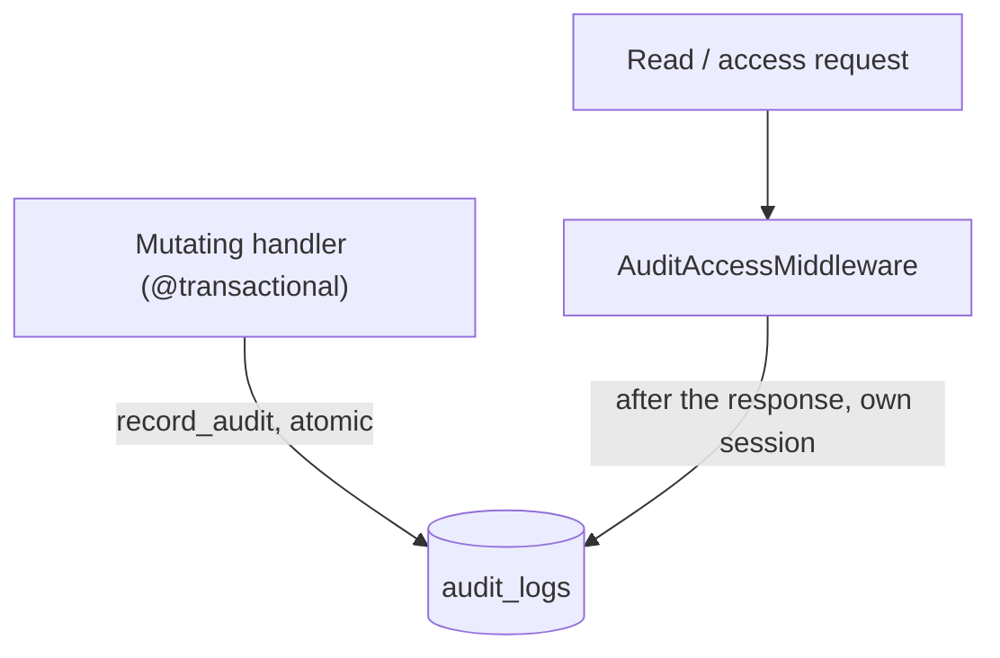

# Audit log

A single append-only trail of sensitive **actions** and **accesses** — who did what, to which target, with a curated before/after snapshot and a timestamp. It answers "who changed this group's status", "who downloaded this export", "who read this transcript", "who tried to log in". This is the first part of a larger audit effort.

Code: `app/core/audit/` (logic) + `app/core/middleware/audit.py` (the access-capture middleware) + `app/api/v1/audit_logs.py` (the admin read API, `/api/v1/audit-logs`, tag `audit`). Table: [AuditLog](../data-models/audit-log.md).

## Why it exists

Sensitive operations need a durable, tamper-evident record that outlives the actor and the target. The trail is **append-only** (never updated, never soft-deleted) and **FK-less** (a deleted user or evaluation must not cascade its history away) — modelled on `outbound_emails`.

## Two write paths

An audit row is created in one of two ways, never both for the same event:

1. **Mutations — explicit `record_audit(...)`.** A mutating handler calls the service helper inside its `@transactional` body, so the audit row commits **atomically** with the action (a rollback drops the audit row too). It passes a curated before/after (see the service). Example: `PATCH /auth/users/{id}` records `user.update` with the changed fields (roles included — a privilege change must never write an empty diff). This instrumentation spans the whole mutation catalog: evaluations/scenarios/tasks, evaluation groups (lifecycle transitions, members, invitations), ai-models (incl. credential set/clear), organizations, flags, reviews, exports, platform settings, and the account-lifecycle auth events.
2. **Reads/accesses — `AuditAccessMiddleware`.** A read touches no row, so no in-service hook can see it; the middleware captures it centrally from a route allowlist, *after* the response is sent. The same middleware also records two kinds of auth events best-effort (login attempts and the pre-auth lifecycle successes — below), because an audit write must never change an auth outcome.

## `AuditAccessMiddleware`

`app/core/middleware/audit.py` — a **pure ASGI** middleware (like `LoggingMiddleware`, not `BaseHTTPMiddleware`) that audits allowlisted read/access routes plus login attempts.

- **Innermost middleware** — added first in `app/main.py`, so it wraps the router directly (sees the matched route + path params) and runs *inside* `AuthMiddleware` (sees `request.state.user`) and `LoggingMiddleware` (sees `request_id`). See [Middleware, logging and request cycle](middleware-logging-and-request-cycle.md).
- **After the response, best-effort, own session.** The write runs after `self.app(...)` returns (off the caller's latency path) via a detached `standalone_session()`. Any failure is swallowed and logged (`audit.access_write_failed`) — auditing can never change the outcome of a login or a download. It never buffers the body, so it sits cleanly in front of the streaming export download.
- **Keyed by `(method, route name)`** — the endpoint function name (`scope["route"].name`), stable against the `/api/v1` prefix and path params. The `ACCESS_AUDIT_ROUTES` allowlist (fired only on 2xx):

  | Route | Action | Target |
  |---|---|---|
  | `GET download_export_job_endpoint` | `export.download` | `export_job` (data egress) |
  | `GET list_conversation_messages_endpoint` | `data.read` | `conversation` (full transcript) |
  | `GET get_submission_messages_endpoint` | `data.read` | `submission` (reviewer-side transcript) |

- **Login is separate** (`POST login`), because it must fire on 401 too: 2xx → `auth.login`, 401 → `auth.login_failed`, anything else → not recorded. The row records only the attempt + outcome (derived from HTTP status) — no email, no actor, no password (OWASP; the middleware can't see them anyway).
- **Pre-auth lifecycle successes** (`AUTH_LIFECYCLE_ROUTES`): email verification → `auth.email_verified`, invitation accept → `invitation.accept`. Pre-auth means no actor, so no login-style outcome branching — recorded **only on 2xx**, and only when the handler stashed the affected account on `request.state.audit_subject` (a purely additive line in the handler; the auth flow itself is never touched). `auth.register` and `auth.credential_reset_confirmed` are deliberately NOT here — attributing them would require changing their auth-flow services to return the resolved user.

Two deliberate scope notes: the allowlist is **narrow** (only reads that expose a sensitive payload / data egress — never routine browsing, which would flood the log), and a sensitive read is audited on **every** access, so a paginated transcript read writes **one row per page** (intended per-egress granularity, not noise).

## Service

`app/core/audit/service.py`:

| Function | What it does |
|---|---|
| `record_audit(session, *, actor_id, actor_email, action, object_type=None, object_id=None, before=None, after=None, context=None)` | The single write helper — appends one row + `flush()`, **no commit** (the caller owns the transaction). Reads `request_id` ambiently from `structlog.contextvars`. **Returns the flushed row**, so a handler that manages its transaction manually can compensate: `object_id` is a bare UUID with no FK cascade, so when the export-create route drops its job after a broker failure, it deletes the already-committed audit row alongside it. |
| `changed_fields(before, after)` | Reduces two full snapshots to only the keys whose values differ (union of both sides), returning `(before_subset, after_subset)` — how a handler records *what changed* rather than the whole object. |
| `list_audit_logs(session, *, filters, order_by, limit, offset)` | One page of rows matching `filters`; a plain `select` (append-only → no `with_live`), ordered + paginated. |

`before`/`after` must be **curated** dicts — never whole rows, credentials or tokens (OWASP). The trail is **secret-free but not PII-free**: identifying fields (email, names) are kept deliberately as attribution, retained under a (deferred) audit-retention / right-to-erasure policy. Access events pass `before = after = None`.

## The `AuditAction` catalog

`app/core/audit/enums.py` — `AuditAction(StrEnum)`, `domain.verb` strings persisted as **plain text**, not a Postgres enum (same choice as `Role.permissions` / `OutboundEmail.template_name`), so the catalog grows without a migration. Grouped by domain: auth/identity (`auth.login`, `auth.login_failed`, `auth.register`, `user.update`, `user.delete`, `user.force_logout`, `user.status_change`, `user.credential_reset`, `user.restore`, `role.create|update|delete|restore`, `organization.*` (incl. `organization.restore`), `member.*`, `invitation.create|accept|resend|revoke`), evaluation groups (`evaluation_group.create|draft|duplicate|update|submit|publish|finish|approve|request_changes|reject|join`), evaluations/scenarios/tasks/models (`evaluation.*` incl. `evaluation.tag_key_add|tag_key_remove`, `evaluation.restore` and `evaluation.model_restore`, `scenario.*` incl. `scenario.restore`, `task.*` incl. `task.restore`, `ai_model.*` incl. `ai_model.restore`), conversations (`conversation.tags_update` — the **only** audited conversation write: tags are prompt context the model acts on, so who changed them and to what is a governance question the transcript alone can't answer), notes/flags/reviews (`note.create|update|delete|restore` — renamed from `annotation.*`, `flag.*` incl. `flag.restore`, `review.*` incl. `review.restore`), data licenses (`data_license.create|update|delete|restore`), and access/egress (`export.create|delete|download|ready|failed`, `data.read`, `ai_model.credential_access`, `platform_settings.update`). The **outcome** is encoded in the action itself (`auth.login` vs `auth.login_failed`), and the **resource type** is the free-text `object_type` column — there is no separate outcome or resource-type enum.

Two of these are unlike the rest:

- `export.ready` / `export.failed` are written by the **worker**, so they carry a **null actor** — the completion is worker-driven, not an interactive action. See [Exports (CSV / JSON)](exports.md).
- `data_license.update` keeps the (large) license `content` out of its snapshot and instead flags `context = {"content_changed": true}`, so a text-only edit still records an event. See [Data licensing & platform settings](licenses.md).

## Endpoint

Read-only, admin-only. There is **no write/create route** (writes happen only via `record_audit` / the middleware) and no detail-by-id route.

| Method | Path | Permission | Description |
|---|---|---|---|
| GET | `/api/v1/audit-logs` | `audit:read` | `Page[AuditLogResponse]`; filters `actor_id` / `action` / `object_type` / `object_id` / `created_from` / `created_to`; `order_by` default `-created_at` (most recent first) |

`audit:read` is held by **admin only** — the trail is a platform-security surface, not a member-facing view. See [RBAC - global roles](rbac-global-roles.md).

## Related

- [AuditLog](../data-models/audit-log.md) — the `audit_logs` table
- [Middleware, logging and request cycle](middleware-logging-and-request-cycle.md) — where `AuditAccessMiddleware` sits in the stack
- [RBAC - global roles](rbac-global-roles.md) — the `audit:read` permission (admin-only)
- [Email](email.md) — `outbound_emails`, the FK-less append-only row this is modelled on
- [API - overview and conventions](api-overview-and-conventions.md)
- [Data model overview](../data-models/data-model-overview.md)
