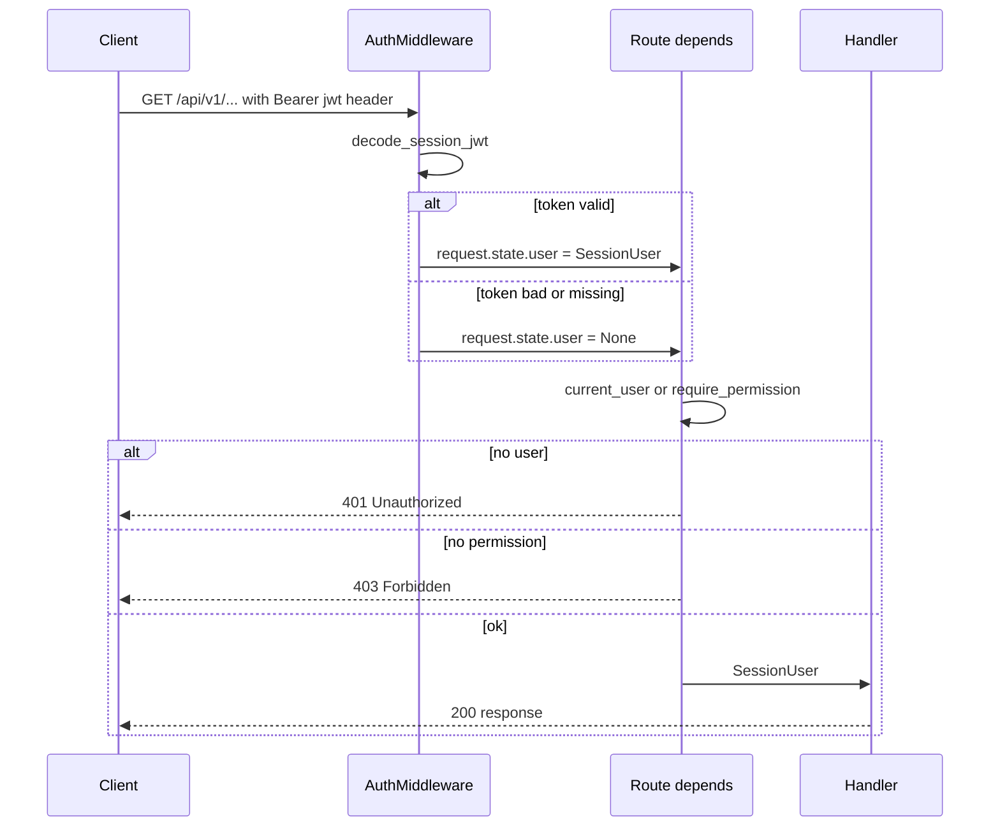
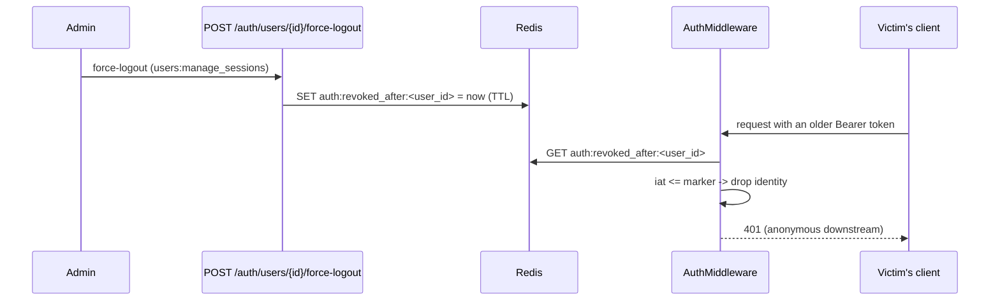
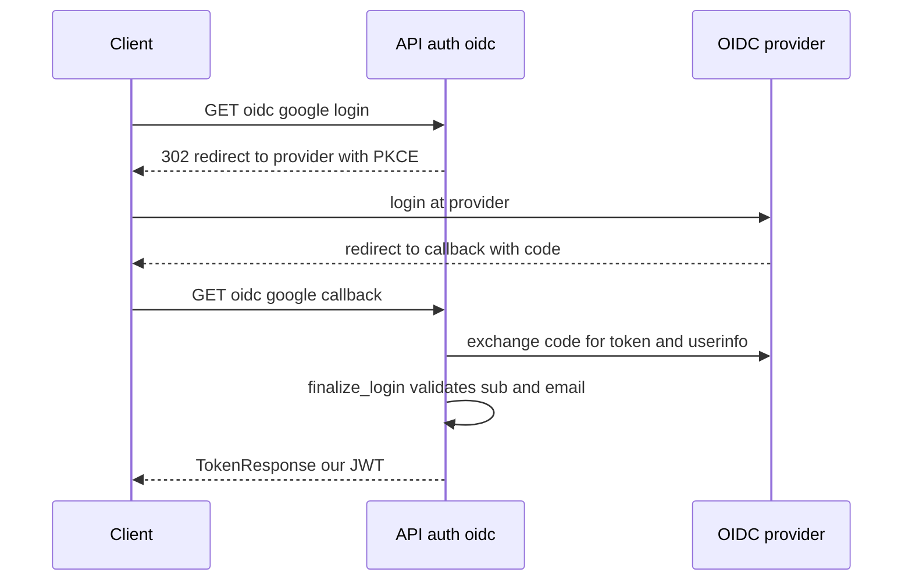

# Authentication (auth)

This is the system's entry gate. It guards **who you are**: it logs in, issues a JWT, registers accounts, does password resets and login via an external provider (OIDC). Checking **what you can do** (permissions) is a separate topic — see [RBAC - global roles](rbac-global-roles.md) and [Object roles - per-object permissions](object-roles-per-object-permissions.md).

Key to understanding: after logging in you get a JWT with all permissions inside it. Each subsequent request carries this token in the `Authorization: Bearer <jwt>` header, and the system reads identity **from the token itself, not from the database**.

The code sits in `app/core/auth/` (services, models, roles, schemas) and `app/api/v1/auth/` (endpoints). Middleware: `app/core/middleware/auth.py`.

## Where the request identity comes from



The middleware is **soft**: a bad, expired or missing token does not break the request — it sets `request.state.user = None` and lets it through as anonymous. Enforcing login is decided only by the route dependencies. Thanks to this, one middleware handles both public and protected routes. The full request path is in [Flow - request authentication and authorization](../flows/flow-request-authentication-and-authorization.md).

The middleware **never reads the database** — the entire identity comes from the token claims. It does make one **Redis** lookup: the per-user force-logout marker (below), which can drop a technically-valid token to anonymous.

## Endpoints /api/v1/auth/*

| Method + path | Purpose | Auth |
|---|---|---|
| `POST /auth/login` | Login email + password, returns a token | public |
| `POST /auth/refresh` | Exchange a refresh token for a new token pair | public (token) |
| `GET /auth/me` | Who am I — identity from the token + live `roles`/`permissions` from the DB | requires token |
| `POST /auth/register` | Self-signup, status `PENDING` | public |
| `POST /auth/register/resend` | Re-issue the verification email for a `pending` account | public |
| `POST /auth/register/verify` | Activate account with token from email | public (token) |
| `POST /auth/invitations/bulk` | Issue platform invitations — the only invite path (one invitee = one row) | `users:invite` |
| `GET /auth/invitations/accept?token=` | Preview an invitation | public (token) |
| `POST /auth/invitations/accept` | Accept, sets a password | public (token) |
| `POST /auth/password-resets/request` | Request a password reset | public |
| `POST /auth/password-resets/confirm` | Set a new password with a token | public (token) |
| `GET /auth/oidc/providers` | List of OIDC providers | public |
| `GET /auth/oidc/{provider}/login` | Start OIDC login (302) | public |
| `GET /auth/oidc/{provider}/callback` | Return from provider, returns a token | public |
| `GET /auth/users`, `GET/PATCH/DELETE /auth/users/{id}` | User read / update / delete (no create — provisioning is via invitation / self-registration) | `users:*` |
| `POST /auth/users/{id}/force-logout`, `POST /auth/users/force-logout` | Revoke all of a user's sessions (single 204 / bulk envelope) | `users:manage_sessions` |

The router is mounted under `/api/v1` + the `/auth` prefix. All errors are returned as RFC 7807 — see [Error handling (RFC 7807)](error-handling-rfc-7807.md).

User CRUD (the `/auth/users` rows above) and the role-assignment authority rule are detailed in [User management](user-management.md).

## JWT — issuing and verification

Library **joserfc**. HMAC, configurable algorithm (`HS256/384/512`, HS256 by default), secret from `Settings.session_jwt_secret` (min 32 characters). File: `app/core/auth/services/jwt.py`.

The token holds identity plus the **flattened permissions** from all of the user's live roles. There are two token types distinguished by the `typ` claim: `access` and `refresh`. The access decoder rejects refresh and vice versa.

Claims: `sub` (user id), `provider`, `email`, `email_verified`, `first_name`, `last_name`, `permissions`, `typ`, `iat`, `exp`. Refresh tokens additionally carry `auth_time` (the original-login instant) to bound the absolute session lifetime across rotations. `iat` is materialized onto `SessionUser.issued_at` (both token types) — that is what the force-logout check compares against.

`app/core/auth/services/jwt.py`
```python
now = int(time.time())
claims: dict[str, Any] = {
    **_identity_claims(user, provider=provider),
    "typ": _TYP_ACCESS,
    "iat": now,
    "exp": now + ttl_seconds,
}
token = jwt.encode({"alg": algorithm}, claims, _key(secret), algorithms=[algorithm])
return token, ttl_seconds
```

Public functions:
- `encode_session_jwt(...)` — access token + `expires_in`.
- `encode_refresh_jwt(...)` — the same claims, `typ=refresh`, longer `exp`, plus the `auth_time` (original-login instant) carried across rotations.
- `decode_session_jwt(...)` — verifies the signature and `exp`, enforces `typ=access`, builds a `SessionUser`.
- `decode_refresh_jwt(...)` — the refresh counterpart: same signature/expiry/shape checks but enforces `typ=refresh`, so an access token can't be replayed at the refresh endpoint.
- `mint_token_pair(...)` — issues both tokens at once with TTLs from `Settings` (access 1 day, refresh 30 days); the refresh re-mint passes the carried `auth_time` so the absolute ceiling survives rotation.

## Refreshing the session — `POST /auth/refresh`

`POST /auth/refresh` exchanges a valid refresh token for a **new access + refresh pair** — the refresh token is rotated on every call (a sliding window). Service: `app/core/auth/services/refresh.py`.

- **Identity is re-read from the DB**, not from the token. `refresh_session` loads the live user via `get_user` (which eager-loads roles) and re-mints from the current roles + status — so a deactivated or re-permissioned account is reflected at the next refresh. This is the only way to pick up permission changes before the access token's own `exp` (see "No immediate revocation" below).
- **Absolute session ceiling.** Rotation re-mints with a fresh `exp`, so without a hard limit a continuously-refreshed token would never expire. The immutable `auth_time` claim is carried unchanged across rotations and checked against `refresh_absolute_max_lifetime_seconds` (default 90 days) — stateless, no token store needed. Tokens minted before `auth_time` existed are grandfathered: the ceiling starts from the first refresh.
- **Uniform 401.** Every failure mode — invalid / expired / forged token, an access token presented in its place, a session past its absolute lifetime, or a deleted / non-ACTIVE account — collapses to the same `401 Invalid or expired refresh token.`; the real reason goes to the logs only, so the endpoint can't be used to probe which tokens map to live accounts.
- **Revocation is honoured here too.** A refresh token minted at or before the user's revocation marker is rejected. The check runs with `fail_open=False` — a Redis outage **raises** (mapped to `503 Session store unavailable; please retry.`) rather than letting a revoked session mint a fresh pair with `iat > marker` and escape revocation permanently.
- **No refresh-token store.** There is still no per-token record: apart from the force-logout marker, a leaked refresh token stays valid until its own `exp`. An OIDC session refreshes like any other now that identities are persisted — the callback mints a normal pair and `refresh_session` re-reads the live user.

Two important decisions:
- **No immediate *permission* revocation.** Permissions are frozen for the token's lifetime. Revoking a role takes effect only once the token expires (or at the next refresh, which re-reads the DB). Revoking the whole **session** *is* immediate — see below.
- **The roles trap.** `permissions` in the token is computed only from eager-loaded roles (`selectinload`). If the roles are not loaded, the function returns an empty list instead of crashing on a lazy-load under async. Every path that issues a token must load the roles first.

A single exception `InvalidSessionTokenError` wraps all errors (bad signature, expiry, missing claim) — the middleware treats them uniformly as anonymous. TTL and secrets configuration is in [Configuration (Settings)](configuration-settings.md).

## Force-logout (session revocation via a Redis marker)

Auth is stateless JWT with no session store, so a token would normally stay valid until its own `exp`. One narrow escape hatch exists: an admin can revoke **all** of a user's sessions at once. Code: `app/core/auth/services/session_revocation.py`.



The whole mechanism is one key per user:

- **The marker** — `auth:revoked_after:<user_id>` = the epoch second of the revocation, with a TTL of `refresh_absolute_max_lifetime_seconds` (the longest a token could still be valid), so it self-expires once no pre-revocation token could exist. An over-long TTL never produces a false positive: a post-revoke token has `iat > marker` regardless.
- **The rule** — a token is revoked unless it was minted **strictly after** the marker (`issued_at <= marker` ⇒ revoked), so one issued in the same second as the force-logout is caught too (there is no `jti` for finer ordering). A token with no `iat` is never revoked.
- **Read path fails open.** The middleware check swallows a `RedisError` and degrades to "not revoked", so a cache blip can't 401 all traffic; the fallout is surfaced on the `redteam_auth_revocation_check_failed_total` counter (see [Observability](observability.md)). The **refresh** path opts out (`fail_open=False` → 503), because it mints new credentials.
- **The client is pooled** — built once in the app lifespan (`init_client` / `close_client`), since this sits on the hot path of every authenticated request; short 1s connect/socket timeouts so a hung Redis fails fast. Under the test harness (no lifespan) each call falls back to a short-lived client bound to the running loop.
- **`revoke_user_sessions` lets a Redis failure propagate** — the caller is an admin action that must not report success when the revocation didn't land.

Operational caveat, documented in the module: the marker and the token `iat` both come from per-instance `time.time()`, so scaling beyond one app instance makes NTP an ops requirement (or add a forward margin).

The endpoints (single + bulk, gated on `users:manage_sessions`) live with user management — see [User management](user-management.md).

## SessionUser and require_permission

`SessionUser` (`app/core/auth/schemas.py`) is a frozen object built from claims: `id`, `email`, `email_verified`, names, `provider`, `permissions: frozenset[str]`, plus `auth_time` (refresh tokens only) and `issued_at` (the `iat`, both types). It is the only representation of a logged-in user in handlers.

Route dependencies (`app/core/auth/dependencies.py`):
- `current_user(request)` — returns a `SessionUser` or raises 401.
- `require_permission(permission)` — a factory gating on a specific permission, otherwise 403.

`app/core/auth/dependencies.py`
```python
def require_permission(permission: Permission) -> Callable[..., SessionUser]:
    def _check(user: Annotated[SessionUser, Depends(current_user)]) -> SessionUser:
        if permission not in user.permissions:
            raise ForbiddenError(f"Caller lacks the '{permission}' permission.")
        return user

    return _check
```

The dictionary of roles and permissions (what is in the JWT) is described in [RBAC - global roles](rbac-global-roles.md).

## Email + password login

`POST /auth/login` takes an email and password, returns a `TokenResponse`. Service: `app/core/auth/services/login.py`. Protection against brute-force/timing is meant to be a mechanism **at the edge** (rate limiter in front of the app), not in the handler itself — the service docstring says directly "handled at the edge (rate limiter), not here".

Two things to remember:
- **Uniform 401** for every rejection reason (unknown email, inactive account, account without a password, wrong password, **over-cap password**). The user always gets `"Invalid email or password."`, the real reason goes only to the logs. This is account anti-enumeration. Login runs **no** length or content policy — an empty password is just a wrong credential, and an over-cap one is rejected **before** the argon2 verify (to bound work) as the same 401, never a 422 that would leak the policy.
- **Protection against the timing side-channel.** Even when the user does not exist, the service still computes argon2 on a dummy hash, so that the response time does not reveal whether an account exists.

`app/core/auth/services/login.py`
```python
if len(password) > MAX_PASSWORD_LENGTH:
    raise UnauthorizedError(_INVALID_CREDENTIALS)  # over-cap → same 401, before argon2
if user is None:
    verify_password(password, _DUMMY_HASH)
    raise UnauthorizedError(_INVALID_CREDENTIALS)
if user.status != UserStatus.ACTIVE:
    verify_password(password, user.password or _DUMMY_HASH)
    raise UnauthorizedError(_INVALID_CREDENTIALS)
if user.password is None:
    verify_password(password, _DUMMY_HASH)
    raise UnauthorizedError(_INVALID_CREDENTIALS)
```

On success: `mint_token_pair(user, provider="local")`. Login requires `ACTIVE` status.

## Registration + activation

`POST /auth/register` always returns **202** (anti-enumeration — it does not reveal whether the email already exists). Service: `app/core/auth/services/registration.py`.

- New email → `User(status=PENDING)` with a password (argon2) and the **default role** — resolved from the `is_default` flag on the `roles` row (seeded onto `red_teamer`, operator-reassignable via `PATCH /api/v1/roles/{id}`), not from the code constant. See [RBAC - global roles](rbac-global-roles.md).
- Email already exists as `PENDING` → refreshes the verification token, **does not overwrite the password or names** (re-registration does not take over an account mid-signup).
- Email already exists as `INVITED` (an admin-provisioned account self-onboarding after its invite link went unused) → **re-issues the platform invitation** (`reissue_platform_invitation`, a fresh accept link to the account's own address) instead of setting a password. The supplied password/names are ignored and the account stays `INVITED`; binding a credential from an email-only request would be an account-takeover vector — a planted password the victim's verification click would activate, carrying preserved invite-time roles. The email owner sets the password via `accept_invitation`.
- Any other live status (`ACTIVE` / `INACTIVE`) → silent no-op.

An `EmailVerification` token is issued (the raw token only in the email, only the hash in the database), the `email_verification` mail with a link `{frontend_base_url}/verify-email?token=...`. **The TTL is admin-tunable**: `PlatformSettings.email_verification_ttl_hours`, 1–8760, seeded from the `EMAIL_VERIFICATION_TTL_HOURS` env default.

`POST /auth/register/resend` re-issues that mail for a `pending` account. It is public and shares the registration endpoint's anti-enumeration shape.

> **Invite-only mode**. When `PlatformSettings.invite_only` is set, `register_user` refuses as a blanket **403** — enumeration-safe, i.e. identical whether or not the email exists — and OIDC first-login provisioning is refused too. Existing accounts keep logging in and invited/pending ones still activate; the anonymous `GET /api/v1/platform-settings/public` exposes the inverse as `signup_enabled` so the SPA can hide the sign-up path.

`POST /auth/register/verify` with a token → 204. Sets `status=ACTIVE`, `email_verified_at=now`, the token to `VERIFIED`. A double submit is serialized with a `FOR UPDATE` lock — the second one sees `VERIFIED` and gets 410. Activation also sweeps any live invitation for the account to `ACCEPTED` (`accept_pending_invitations`) — a no-op for plain self-signup, but one that had meanwhile been group-invited (`invite_to_group` issued a group-scoped invitation while it was still `PENDING`) consumes it here, so none lingers `PENDING` against the now-active account. The token tables are described in [Support tables (email, verification, reset)](../data-models/support-tables-email-verification-reset.md).

## Platform invitations

`POST /auth/invitations/bulk` (gate `users:invite`) creates an `INVITED` account per row with its roles and issues an invitation token (TTL 7 days), the `platform_invitation` mail. It is the **only** platform invite path — a single invitee is a one-row request. Preview and acceptance are **unauthenticated** — the token is the only credential.

An admin can also **resend** (`POST /auth/users/{id}/invitation/resend`) or **revoke** (`DELETE /auth/users/{id}/invitation`) the pending platform invitation of an `invited` account, and `UserResponse` surfaces its effective status — see [User management](user-management.md).

`POST /auth/invitations/accept` with a token, password and optionally names → sets the password, `status=ACTIVE`, the token to `ACCEPTED`. Acceptance requires `INVITED` or `PENDING` status — otherwise 410 (so that an old token does not act like a password reset on an active account).

> [!important] Lock order: `users` first, then `invitations`
> Accept, admin resend, admin revoke and the `/register` INVITED arm all take `SELECT … FOR UPDATE` on the **user row** before touching invitation rows. What these operations race over is the invitation *set* ("revoke whatever is pending", "re-issue"), and a set has no row to lock — the user row is the only mutex that covers it. A consistent order is also what stops the paths deadlocking each other (Postgres aborts one side of an AB-BA with a 500, which on the invitee's accept page would be the accept). A new mutation path must follow the same order and re-read invitation state *after* both locks. The re-invite arm of `invite_to_platform` is a **known gap** — it still mutates the pending set holding only invitation-row locks; don't copy it. See [Invitation](../data-models/invitation.md).

The same mechanism handles invitations **scoped to an evaluation group** (`object_type` + `object_id` on the invitation). In that case roles come from [Object roles - per-object permissions](object-roles-per-object-permissions.md), not from global roles. Model and flow details: [Invitation](../data-models/invitation.md) and [Flow - evaluation group invitation](../flows/flow-evaluation-group-invitation.md).

## Password reset

`POST /auth/password-resets/request` always returns **204** (anti-enumeration). For an active account with a password: it issues a single-use `PasswordResetToken` (TTL 24h), the `password_reset` mail with a link. Service: `app/core/auth/services/password_resets.py`.

`POST /auth/password-resets/confirm` with a token and a new password → 204. The token is single-use (`FOR UPDATE`, `USED` after use). The account must be live and `ACTIVE`, otherwise 410.

**Throttling** is two knobs on [PlatformSettings](../data-models/platform-settings.md) — `password_reset_cooldown_seconds` (0 disables) and `password_reset_max_per_day` — measured against **that account's own reset tokens**, so no separate counter store is needed. A throttled request is one of the request endpoint's silent branches, **not a 429**: it still returns 204 and logs `throttled_cooldown` / `throttled_daily_cap`, because a distinguishable response would be the enumeration oracle the 204 exists to avoid. The check-and-issue is serialized, so the throttle survives parallel requests.

The limit therefore bounds **per-inbox** volume, not aggregate outbound — there is no edge limiter.

An admin can trigger the same reset for someone else (`POST /auth/users/{id}/password-reset`, single or bulk). The link still goes to the account's **own** mailbox, so it is not a takeover route; unlike the self-service request it reports why it could not send (404 unknown, 409 not `active` / passwordless), and the mail renders with `triggered_by_admin=true` so the copy never claims the recipient asked for it. It is **not throttled at all** — an admin acting deliberately is not the flood the cooldown exists for — **but its sends fill the same window**, so enough of them silently disable the account's own "forgot password" for the rest of the day. Deliberate (same inbox, same flood); separating the two would need a source column on `password_reset_tokens`. See [User management](user-management.md).

## OIDC (external login)

Library **authlib**. File: `app/core/auth/services/oidc.py`, provider registry `providers.py`, endpoints `api/v1/auth/oidc.py`.



- The provider registry (`providers.py`) is still code-shipped — `google` is the only entry — but it is **credential-gated**: a provider is registered only when its client id *and* secret are in the environment, so `GET /auth/oidc/providers` lists it only when a login would actually work, and a deployment with no IdP is unaffected. Half-configuring one is a **startup error**. PKCE (`S256`) enabled.
- `state` and `nonce` are kept in the `oidc_state` cookie, restricted by middleware to just the `/api/v1/auth/oidc` prefix.
- The callback does **not** return RFC 7807. It 302s to the SPA's `/auth/callback` carrying either the token pair or `error=<code>` **in the URL fragment** — browsers never put a fragment on the wire, so tokens stay out of the FE server's access log and out of the next request's `Referer`; `Cache-Control: no-store` is defence in depth on top.

### Identities are persisted

`ProviderIdentity` is a real table now, not a DTO — so the same human keeps one local `id` across sessions. Full resolution rules, the two savepoint-recovered races and the activation semantics: [ProviderIdentity](../data-models/provider-identity.md).

Resolution order at the callback: **identity row** → **account with that email** → **provision a new one**. The last branch is refused when the platform is [invite-only](../data-models/platform-settings.md). An account that is `pending` or `invited` is activated on the way through, which **wipes any password on the row** and stamps `password_cleared_at` — otherwise an attacker who self-registered the victim's email would keep a live credential once the victim's Google login activated the account.

Error codes on the fragment. **No code names an account**, so the callback never confirms a password or a role — but they are not one opaque set:

| Code | Cause |
|---|---|
| the IdP's own code (e.g. `access_denied`) | passed straight through from `OAuthError.error` when the IdP names the failure |
| `oauth_error` | the IdP leg failed with no usable code — transport error, non-JSON body, or an unexpected exception |
| `invalid_claims` | the id-token would not verify (`JoseError`), or a required claim was missing (`MissingClaimError`) |
| `email_unverified` | `email_verified=false` from an IdP whose verification we don't trust |
| `account_inactive` | deactivated, soft-deleted, or an `invited` account whose invitation was revoked or lazily expired |
| `invite_only` | no identity row, no account owns the email, and the platform is invite-only — self-serve provisioning refused |
| `login_conflict` | a concurrent write neither savepoint could adopt |

One caveat worth stating plainly: `invite_only` fires **only** on the provisioning branch (`_resolve_user`, `app/core/auth/services/oidc.py` — the resolver `finalize_login` calls), so on an invite-only platform it does separate "no account owns this address" from every other outcome. That is the same address-level exposure the invite-only registration gate already carries, not a new one — but it means the set is not uniform, and a future change here should keep that in view.

Linking users to roles is described in [User and Role](../data-models/user-and-role.md).

## Password policy (setting a password)

The policy lives in `app/core/auth/password_policy.py` and splits into two layers, applied only when a password is **set** (register / invitation-accept / password-reset):

- **Length bounds on the schema type.** `NewPassword = Annotated[SecretStr, Field(min_length=8, max_length=128)]` (`MIN_PASSWORD_LENGTH` / `MAX_PASSWORD_LENGTH`). Lives on the set-password Pydantic types, so the *schema floor* reaches the OpenAPI contract and rejects early as **422**.
- **Content rules, run in the service.** A registry (`PASSWORD_VALIDATORS`) run by `validate_password(password, *, identity=..., policy=...)`:
  - **length** — against the admin-configured `password_min_length`, which can only ever be **at or above** the schema floor → code `password_too_short`.
  - **character classes** — uppercase / digit / symbol, each an independent admin toggle, all **off** by default so the shipped behaviour is unchanged.
  - **common-password denylist** — the plaintext (case-folded) is rejected if it's in a shipped denylist (`data/common_passwords.txt.gz`, loaded once at import) → code `password_too_common`.
  - **identity similarity** — rejected if too similar (`SequenceMatcher` ≥ 0.7) to the account's email/name tokens → code `password_too_similar`. Runs in the service because it needs the account identity, which the reset/invite schemas don't carry.

### The policy is admin-tunable

`PasswordPolicy.from_settings(platform_settings)` builds the rule set from the [PlatformSettings](../data-models/platform-settings.md) singleton, so every set-password path resolves it at request time. The denylist and the identity-similarity rule are **unconditional and deliberately not knobs** — they cost nothing and there is no defensible reason to switch them off.

The anonymous `GET /api/v1/platform-settings/public` publishes the tunable half as `password_policy`, so the register / invitation-accept / reset-confirm screens can state the rules up front rather than deliver them as an error.

A failure raises `PasswordPolicyError` (a `BadRequestError`, **400**) carrying a field-addressable `errors[]` entry on the `password` field with a machine-readable `type` code, so a client maps it inline and can localize it.

`hash_password` stays **policy-free** — internal provisioning (seed, admin bootstrap) is exempt. Login (above) runs none of these rules; it verifies an existing credential, so an empty or over-cap password collapses to the uniform 401, never a policy 422.

## Password hashing — argon2

Library **argon2-cffi**. File: `app/core/auth/services/passwords.py`. `hash_password` and `verify_password` with default parameters (tracking OWASP Argon2id, deliberately not pinned). A mismatch and a corrupt hash both yield a uniform `False`.

> [!note] `except A, B:` here is valid — PEP 758, not a Python-2 leftover
> `app/core/auth/services/passwords.py` catches `except VerificationError, InvalidHashError:` **without** parentheses. This is **not** a bug: [PEP 758](https://peps.python.org/pep-0758/) (Python 3.14, the project stack) lets a multi-type `except` drop the parentheses, so it is exactly equivalent to `except (VerificationError, InvalidHashError):` — both exceptions are caught (verified: identical AST under 3.14). It would be a `SyntaxError` only on 3.13 and older. (An earlier revision of this vault wrongly flagged it as a Python-2 bug.)

## Link tokens (shared mechanism)

Invitations, email verification and password reset use the shared `app/core/auth/services/tokens.py`:
- `generate_raw_token()` — a random ~256-bit token (`secrets.token_urlsafe`); goes only to the email.
- `hash_token(raw)` — `sha256`, only the **digest** is stored in the database.
- `project_expired(...)` — generic: an expired `PENDING` is treated as `EXPIRED` without writing to the DB.

## Related

- [User and Role](../data-models/user-and-role.md)
- [RBAC - global roles](rbac-global-roles.md)
- [Object roles - per-object permissions](object-roles-per-object-permissions.md)
- [Invitation](../data-models/invitation.md)
- [Support tables (email, verification, reset)](../data-models/support-tables-email-verification-reset.md)
- [Flow - request authentication and authorization](../flows/flow-request-authentication-and-authorization.md)
- [Flow - evaluation group invitation](../flows/flow-evaluation-group-invitation.md)
- [User management](user-management.md) — the force-logout endpoints
- [Observability](observability.md) — the revocation fail-open counter
- [Email](email.md)
- [Configuration (Settings)](configuration-settings.md)
- [Error handling (RFC 7807)](error-handling-rfc-7807.md)
- [Middleware, logging and request cycle](middleware-logging-and-request-cycle.md)
