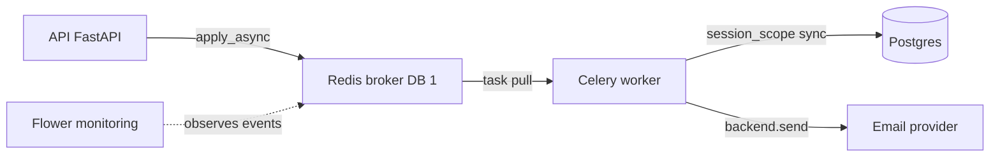

# Celery workers

Workers are processes that do things in the background, outside the HTTP request. The API doesn't wait for the mail to be sent — it drops a task on the queue and responds immediately. A worker picks up the task and runs it. The queue is Redis.

Why? So that slow or unreliable operations (sending a mail to an external provider) don't block the user's response and can retry on failure.

## How it flows



The API only puts a task on the broker and returns. The worker receives it, opens its own synchronous session to the database, and does the work. Flower observes what's going on, but does not store task results.

## Celery instance — `app/workers/celery_app.py`

A singleton `app` built from `Settings`. The broker is Redis, **there is no result backend** — tasks are fire-and-forget, nobody stores the results. Mail delivery state is tracked by the `outbound_emails` table (see [Email](email.md)), not Celery.

`app/workers/celery_app.py`
```python
from celery import Celery
from app.core.config import get_settings

_settings = get_settings()

app = Celery("ai_red_teaming", broker=_settings.broker_url)

app.conf.update(
    task_serializer="json",
    accept_content=["json"],
    timezone="UTC",
    enable_utc=True,
    task_acks_late=True,
    worker_prefetch_multiplier=1,
    worker_send_task_events=True,
    task_send_sent_event=True,
)
```

Key decisions:

| Setting | What for |
|---|---|
| `broker=broker_url` | Redis on DB `/1`, separate from the app cache on `/0` (see [Configuration (Settings)](configuration-settings.md)) |
| no `result_backend` | results not stored; the audit lives in `outbound_emails` |
| `task_serializer="json"` + `accept_content=["json"]` | JSON only — eliminates the deserialize-RCE vulnerability class from pickle |
| `task_acks_late=True` + `prefetch_multiplier=1` | at-least-once delivery, no hoarding; **idempotency is the task author's job** |
| `timezone="UTC"` + `enable_utc=True` | all datetimes in UTC |
| `worker_send_task_events` + `task_send_sent_event` | task lifecycle events on the broker — consumed by a Prometheus `celery-exporter` and Flower alike (see [Observability](observability.md)) |

### Worker logging + error reporting (signals)

Two Celery signals wire the worker into the same observability stack as the API (see [Observability](observability.md)):

- `setup_logging` → `configure_logging(get_settings())` — worker/beat logs run through the same structlog pipeline as the API (`LOG_LEVEL`/`LOG_FORMAT` drive it; connecting the signal stops Celery installing its own root handler, and the CLI `--loglevel` flag is ignored — compose runs plain `celery ... worker`, no flag).
- `celeryd_init` → `init_sentry(_settings)` — Sentry error reporting in the worker process only (a no-op without `SENTRY_DSN`). Scoped to worker startup rather than module scope, because `app/main.py` and beat import this module too and must not share the worker's init.

Compose sets `SERVICE_NAME=ai-red-teaming-worker` on the `worker`/`beat` services, so their JSON log lines are distinguishable from the API's.

`broker_url` is computed in `Settings`: `celery_broker_url or f"redis://{redis_host}:{redis_port}/1"`. `CELERY_BROKER_URL` can point to a different broker (e.g. RabbitMQ).

### Autodiscovery — where the worker looks for tasks

The worker doesn't know about tasks up front. `celery_app.py` walks a list of packages and imports a `tasks` module from each:

```python
app.autodiscover_tasks(
    [
        "app.core.auth",
        "app.core.conversations",
        "app.core.evaluations",
        "app.core.exports",
        "app.core.annotations",
        "app.core.analytics",
        "app.core.email",
        "app.core.ai_gateway",
        "app.core.media",
        "app.workers",
    ]
)
```

Pattern: a new domain adds tasks by creating `app/core/<domain>/tasks.py` — nothing else needs touching. Tasks use the `@shared_task` decorator (not `@app.task`), so they don't bind rigidly to an instance; binding happens at import.

Running the worker: `celery -A app.workers.celery_app worker` (no `--loglevel` — the `setup_logging` signal ignores it, `LOG_LEVEL` decides).

### `@shared_task` producers resolve via `app/main.py`

`@shared_task` binds to whatever Celery treats as the process's *current app*. In the worker process that's this instance (loaded via `-A app.workers.celery_app`). In the **API** process there's no `-A`, so `app/main.py` imports the instance at module load to make it current:

```python
# Registers the redis-backed Celery app as this process's current_app, so `@shared_task` producers resolve to it.
from app.workers.celery_app import app as _celery_app  # noqa: F401
```

Without it, an API handler calling `send_email_task.delay(...)` would resolve `@shared_task` to a default in-memory app and the message would never reach Redis. The import is the whole fix — the producer side (`.delay` / `.apply_async`) needs the broker-configured instance to be current.

## Sync session — `app/workers/session.py`

The worker can NOT use the async engine from `app/core/database.py`. Celery processes have no asyncio loop, so the async engine is useless there. That's why workers get a separate, **synchronous** engine on the psycopg (v3) driver.

DSN difference: the API uses `postgresql+asyncpg://...` (`database_url`), the worker `postgresql+psycopg://...` (`database_url_sync`). Pool tuning (size, overflow, timeout, recycle, `pool_pre_ping`) identical to async — see [Database and sessions](database-and-sessions.md).

`app/workers/session.py`
```python
@contextmanager
def session_scope() -> Iterator[Session]:
    factory = _ensure_session_factory()
    session = factory()
    try:
        yield session
        session.commit()
    except Exception:
        session.rollback()
        raise
    finally:
        session.close()
```

Commit on success, rollback + re-raise on error, always close. `_engine` and `_session_factory` are lazy singletons per worker process — `_ensure_session_factory()` builds them on the first call, subsequent tasks reuse them. Celery manages the worker's startup and shutdown; the pool drains on exit.

Note: a task may do its own `session.commit()` in the middle (e.g. a checkpoint before `raise`) — it works, because it's the same session yielded from `session_scope`.

### `async_session_scope` — for tasks that reuse the async service layer

Most tasks stay on the sync `session_scope`. The exceptions are the **export** path (`run_export_job`, `reap_expired_export_jobs`) and the **model health check** (`run_model_health_check`): they re-run the exact async, DB-bound services the HTTP handlers use (visibility resolution + the export fetchers; the health service + gateway dispatch) unchanged, so they need an `AsyncSession`. The task wraps its body in `asyncio.run(...)` and consumes `async_session_scope()` inside that loop.

`app/workers/session.py`
```python
@asynccontextmanager
async def async_session_scope() -> AsyncIterator[AsyncSession]:
    engine = build_async_engine(get_settings())
    factory = async_sessionmaker(engine, expire_on_commit=False)
    try:
        async with factory() as session:
            yield session
    finally:
        await engine.dispose()
```

Two deliberate differences from the sync scope:

- **Engine built and disposed per call, not a cached singleton.** An async engine is bound to the loop that created it, and each `asyncio.run` spins a fresh loop — a module-level singleton would bind to a dead loop on the next task. `build_async_engine` therefore uses `NullPool` (one connection per run, closed on dispose): with nothing to reuse across runs, a pool would only add warm-up churn.
- **No auto-commit.** Transaction boundaries are the caller's. A multi-minute export shouldn't sit inside one open transaction, so the task commits its state transitions explicitly (the `pending → running → ready` compare-and-swaps); this scope only rolls back / disposes on exit.

`build_async_engine` stays at the default READ COMMITTED. An engine-wide REPEATABLE READ was tried to give exports a stable read snapshot, but it made the reaper's soft-delete and the export's own `READY` commit prone to unretried serialization failures (40001) and pinned a long snapshot across the upload.

## Task pattern

There is no separate file with template tasks — tasks live in the domain, in `app/core/<domain>/tasks.py`. The conventions (and the old `ping`/`db_ping`/`flaky_with_retry` examples) are kept by the skill `.claude/skills/tasks/SKILL.md`. The real tasks today: `send_email_task` (see [Email](email.md)), the export job `run_export_job` (`app/core/exports/tasks.py`, below), the model health check `run_model_health_check` (`app/core/ai_gateway/tasks.py`, below), three periodic reapers — `reap_orphaned_streaming_messages`, `reap_expired_export_jobs` and `reap_orphaned_media` — and the periodic `check_model_inactivity` sweep (all below).

Retry pattern: explicit `name=` (full dotted path), `bind=True` when `self` is needed, plus `autoretry_for` + `retry_backoff` + `retry_jitter` + `max_retries`.

```python
@shared_task(
    name="app.core.email.tasks.send_email_task",
    bind=True,
    autoretry_for=(TransientEmailError,),
    retry_backoff=True,
    retry_jitter=True,
    max_retries=5,
)
def send_email_task(self, email_id: str, secret_context=None) -> None: ...
```

Rule: throw a marker from `autoretry_for` (e.g. `TransientEmailError`) → exponential backoff and a retry. **Any other exception fails the task immediately** — that's for permanent errors, so they surface fast instead of burning the retry budget.

### Export job — `run_export_job` (`app/core/exports/tasks.py`)

Every export is async (no inline path): the API queues a `pending` `ExportJob` row, this task generates the stored CSV and flips the row to `ready` / `failed`. It's the worked example of the `task_acks_late` idempotency contract in a job that both writes a file and mutates a DB row.

- **Detached, but never widens access.** The job carries only *pointers* to its scope (`evaluation_id` / `evaluation_group_id`) plus `requested_by_id` — never authority. The task reconstructs the requester's identity from the *live* DB (`_load_caller` → `effective_permissions` over live roles, mirroring the JWT mint) and re-resolves the scope through the same `assert_export_authority` gate and scoped fetchers the HTTP endpoints use. A role revoked after queueing denies the detached run too.
- **Idempotent, single-writer via compare-and-swap.** A `ready` job is a no-op on redelivery. The `pending → running` claim is a conditional `UPDATE ... WHERE status='pending'`: a concurrent redelivery (the broker's `visibility_timeout` expiring during a long export) matches no `pending` row and bails, so two workers never `open("wb")` the same local `{job_id}.{csv,json}` and interleave a corrupt file. Finalise (`running → ready`) is the mirror CAS: if the row was flipped away while generating (e.g. the reaper failed it), it drops the file it wrote rather than resurrect the job.
- **Transient vs permanent.** `autoretry_for=(OperationalError, ClientError)` with `max_retries=3`, but the retry only fires when the failure is actually transient — `_is_transient` discriminates a boto3 `ClientError` by HTTP status (5xx) and a throttle-code allowlist, so a permanent 4xx misconfiguration (AccessDenied, NoSuchBucket) fails fast instead of burning the budget. On a transient failure with budget left the row is reset to `pending` (again a `running`-guarded CAS) so the retry re-claims it; a permanent failure or exhausted budget is recorded on the row (`status=failed`, a **safe** requester-facing `error` — never upstream/DB internals).

The export task also **announces** each terminal transition (audit + notification + email) inside the same transaction as the status flip, wrapped in a SAVEPOINT that swallows failures — a notify blip must not undo a generated export. See [Exports (CSV / JSON)](exports.md).

### Model health check — `run_model_health_check` (`app/core/ai_gateway/tasks.py`)

`POST /ai-models/{id}/health-check` flips the row to `checking` and enqueues this task (with `countdown=1`, so the worker can't read the row before `@transactional` commits it). The task follows the export pattern — `asyncio.run` + `async_session_scope`, because it reuses the async health service — and is bounded by a hard `time_limit` (`health_check_wake_deadline_seconds` + 30 s) so a wedged probe loop can't run forever.

Idempotency is a **compare-and-swap on `last_health_check_at`** (the start stamp): a retry or duplicate delivery that runs after a newer check started matches no row and no-ops (logged as `health_check.superseded`). Because the staleness horizon is *derived* from that same `time_limit`, a SIGKILLed task never leaves the row un-restartable. Details: [AI Gateway - dispatch](ai-gateway-dispatch.md), [AiModel](../data-models/ai-model.md).

## Celery beat — periodic tasks

Beyond the API-triggered tasks there are four **periodic** ones, fired by `celery beat`. The schedule sits in `celery_app.py` as `app.conf.beat_schedule` and points at the task by its **registered name** (not by import — the schedule is decoupled from import order):

```python
app.conf.beat_schedule = {
    "reap-orphaned-streaming-messages": {
        "task": "app.core.conversations.tasks.reap_orphaned_streaming_messages",
        "schedule": float(_settings.streaming_reap_interval_seconds),  # default 300 s
    },
    "reap-expired-export-jobs": {
        "task": "app.core.exports.tasks.reap_expired_export_jobs",
        "schedule": float(_settings.export_reap_interval_seconds),
    },
    "reap-orphaned-media": {
        "task": "app.core.media.tasks.reap_orphaned_media",
        "schedule": float(_settings.media_orphan_reap_interval_seconds),  # default daily
    },
    "check-model-inactivity": {
        "task": "app.core.ai_gateway.tasks.check_model_inactivity",
        "schedule": float(_settings.model_inactivity_check_interval_seconds),  # default hourly
    },
}
```

`reap_orphaned_streaming_messages` (`app/core/conversations/tasks.py`) cleans up assistant placeholders stuck in `streaming` after a **hard crash** of the process (SIGKILL/OOM/power loss) that killed the worker before the detached finalize (Transaction B) managed to flip the status — see [Message persistence (write-path)](message-persistence-write-path.md). What it does:

- scans the partial `ix_messages_streaming` (`WHERE status='streaming'`) and flips to `interrupted` the rows older than `STREAMING_REAP_TTL_SECONDS` (default 900 s — the threshold must exceed the longest realistic generation, so it doesn't eat a stream in flight),
- mixes `{"interrupted_by": "reaper"}` into `extra` (JSONB `||`) — to distinguish crash-reaped from a handled client disconnect (both land on `interrupted`, but the latter holds partial content),
- **idempotent** (guarded `WHERE status='streaming'` → a re-run touches only the still-stuck ones), **without `autoretry_for`** — the next beat tick is the recovery path,
- it does not recover content (the buffer died with the process) — it's a plain status flip.

Handled interruptions (provider error, client disconnect, timeout) finalize themselves — the reaper targets exclusively the *unhandled* crash. The thresholds are controlled by `STREAMING_REAP_TTL_SECONDS` / `STREAMING_REAP_INTERVAL_SECONDS` (see [Configuration (Settings)](configuration-settings.md)).

`reap_expired_export_jobs` (`app/core/exports/tasks.py`) is the storage/TTL analogue for exports — two sweeps in one tick, both idempotent, no retry (the next tick is the recovery path):

- **Expiry:** any live job past `expires_at` (only `ready`/`failed` rows carry one) has its file deleted and its row soft-deleted — finished files *and* recorded failures are eventually cleaned up. Storage delete is best-effort per job, so one missing file can't stall the sweep.
- **Stuck:** any `pending`/`running` job older than `EXPORT_STUCK_TTL_SECONDS` (worker crash, or the broker dropped the message so no `acks_late` redelivery fires) is flipped to `failed` in a single conditional `UPDATE` and stamped with a TTL so the next expiry sweep reaps it. A row that finishes (→ `ready`) between the select and commit no longer matches the `status IN (pending, running)` predicate and is not clobbered — the worker's finalise CAS is the mirror guard on the other side of that race.

Thresholds: `EXPORT_REAP_INTERVAL_SECONDS` (beat cadence), `EXPORT_JOB_TTL_SECONDS` (the `expires_at` window stamped on ready/failed rows), `EXPORT_STUCK_TTL_SECONDS` (see [Configuration (Settings)](configuration-settings.md)).

`reap_orphaned_media` (`app/core/media/tasks.py`) is the orphan GC for uploaded images: a live `MediaAsset` older than `MEDIA_ORPHAN_GRACE_HOURS` (default 7 days) that no consumer references (today `Evaluation.cover_image` + `MessageImage.image_key` — the inventory is a convention, a new media-key column MUST be added to the query) is soft-deleted, then its blob is best-effort deleted **after** the commit (the soft-delete is authoritative; a failed blob delete only leaves a harmless file). Idempotent, no retry — the next beat tick is the recovery path. Full rationale + the accepted mid-sweep race: [Media (image upload & serving)](media-images.md).

`check_model_inactivity` (`app/core/ai_gateway/tasks.py` → `services/inactivity.py`) is the only periodic task that is not a reaper. It finds warmup-enabled live models whose own opt-in `inactivity_alert_hours` of quiet have passed — measured from `last_used_at`, or `created_at` for a model that never carried traffic, and deliberately **not** from `last_warmup_at`, since warming an unused endpoint is the cost pattern being caught — and alerts every holder of `models:update` + `models:read` with an in-app [notification](notifications.md) plus an [email](email.md).

It fires **once per episode**: the claim `UPDATE` stamps `inactivity_alerted_at` while re-checking the *whole* inactive predicate, not just the stamp. That is what makes traffic landing mid-sweep lose the row (a stamp-only CAS would alert on a just-used model *and* swallow the next genuine episode) and what makes the sweep safe under `acks_late` redelivery and overlapping beat ticks — one run wins the row. Real traffic, or restoring any disarm knob (enable, warm-up, threshold, undelete), re-arms it. Cadence: `MODEL_INACTIVITY_CHECK_INTERVAL_SECONDS`; the threshold lives on the model row. See [AiModel](../data-models/ai-model.md).

Running beat: `celery -A app.workers.celery_app beat` (same signal-driven logging as the worker). In `docker-compose.yml` it's a separate `beat` service (alongside `worker`); all services have `restart: unless-stopped`.

## Flower — monitoring

A separate service (`docker-compose.yml`), image `mher/flower`, on port `5555`. It takes the broker from `.env` (`CELERY_BROKER_URL=redis://redis:6379/1`), consistent with `Settings.broker_url`. It persists state in SQLite on a volume (`--persistent=True --db=/data/flower.db`).

It shows task events and worker state from the broker. But: since **there is no result backend**, Flower has no store of task results. The mail delivery audit lives exclusively in `outbound_emails`, not in Flower.

The `worker` service in compose has a healthcheck `celery -A app.workers.celery_app inspect ping`.

## Security — quick cheat sheet

- JSON-only serialization → no pickle-RCE.
- No secrets in task payloads (tokens, OTP) — pass a handle (e.g. a row id), resolve it in the task.
- `task_acks_late` → at-least-once → the task author must ensure idempotency (guards against duplicates).

## Related

- [Email](email.md) — worker task: `send_email_task`, retry on `TransientEmailError`, `outbound_emails` audit, the delivery-failure notification
- [Exports (CSV / JSON)](exports.md) — worker tasks: `run_export_job` (generation) + `reap_expired_export_jobs` (TTL/stuck reaper)
- [Media (image upload & serving)](media-images.md) — the `reap_orphaned_media` orphan GC
- [AI Gateway - overview](ai-gateway-overview.md) — the `check_model_inactivity` sweep and the usage stamps it reads
- [Observability](observability.md) — task events, worker logging + Sentry signals
- [Message persistence (write-path)](message-persistence-write-path.md) — where the orphaned placeholders the reaper cleans up come from
- [Database and sessions](database-and-sessions.md) — async engine for the API; here its synchronous counterpart for workers is described
- [Configuration (Settings)](configuration-settings.md) — `broker_url`, `database_url_sync`, DB pool, `email_backend`
- [Stack and tooling](../basics/stack-and-tooling.md)
- [Directory structure](../basics/directory-structure.md)
