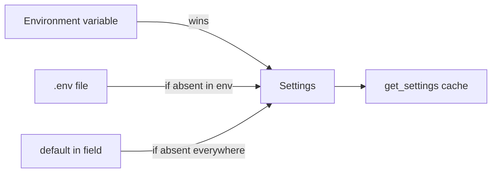

# Configuration (Settings)

The single place the whole backend reads configuration from. Environment variables flow into one `Settings` class, and the rest of the code asks for it via `get_settings()`. Iron rule: **never read env outside Settings** (no `os.environ` in services). This gives you one source of truth and lets you see what the app needs by looking at one file.

File: `app/core/config.py`.

## What it is for / what it does

- Holds the entire process configuration in one object.
- Validates it at startup (a missing required variable or a too-short secret = the app won't start).
- Builds ready-made URLs (DB, Redis, Celery broker) as properties, so you don't concatenate strings by hand.
- Caches itself once per process via `get_settings()`.

## Env resolution order

`Settings` is `pydantic-settings` (`BaseSettings`). A field name maps 1:1 to an uppercase env variable: the `database_host` field reads `DATABASE_HOST`.



Order (the pydantic-settings default): **environment variables > `.env` > field default**. Fields without a default (e.g. `environment`, `database_host`, `session_jwt_secret`) are required, and their absence = a validation error at startup. The config is `extra="ignore"`, so unknown env variables are ignored (the same `.env` is sometimes shared with sibling services).

## `get_settings()` — singleton cache

```python
@lru_cache
def get_settings() -> Settings:
    return Settings()
```

`lru_cache` makes env and `.env` read **once per process**. The whole app calls `get_settings()` (usually through the DI alias `SettingsDep`). Tests don't mutate the instance, they just do `get_settings.cache_clear()` or override the FastAPI dependency. The flow direction is one-way: env -> `Settings` -> `get_settings()`. Details in [Flow - config from env to Settings](../flows/flow-config-env-to-settings.md).

## Settings snippet

`app/core/config.py`

```python
class Settings(BaseSettings):
    model_config = SettingsConfigDict(env_file=".env", extra="ignore")

    environment: Literal["test", "local", "dev", "prod"]
    database_host: str
    database_name: str
    session_jwt_secret: SecretStr = Field(..., min_length=32)
    model_secrets_key: SecretStr = Field(..., min_length=32)
    log_level: Literal["DEBUG", "INFO", "WARNING", "ERROR", "CRITICAL"] = "INFO"
    log_format: Literal["json", "console"] = "json"
```

(Illustrative fragment — the full list of fields is in the file.)

## Most important variables

| Env variable | Required | Default | Role |
|---|---|---|---|
| `ENVIRONMENT` | yes | — | `test`/`local`/`dev`/`prod` |
| `GIT_SHA` | no | `""` | deployed commit SHA; `deploy.sh` writes it into `.env` on the box, empty locally → surfaced as `"dev"` by `/version` and the OpenAPI `info.version` |
| `DATABASE_HOST` | yes | — | Postgres host |
| `DATABASE_USER` / `DATABASE_PASSWORD` / `DATABASE_NAME` | yes | — | rest of the DB credentials |
| `DATABASE_PORT` | no | `5432` | port |
| `REDIS_HOST` | yes | — | Redis host |
| `REDIS_PORT` | no | `6379` | port |
| `SESSION_JWT_SECRET` | yes | — | min 32 chars, HMAC for the session JWT |
| `OAUTH_STATE_SECRET` | yes | — | min 32 chars, OIDC state/nonce cookie |
| `OAUTH_REDIRECT_BASE_URL` | yes | — | public base URL the IdP redirects back to |
| `MODEL_SECRETS_KEY` | yes | — | min 32 chars, JWE key encrypting model API keys |
| `MODEL_SECRETS_KEY_RETIRED` | no | — | retired key during rotation (min 32 chars when set); **no sweep** — see below |
| `CONVERSATION_SECRETS_KEY` | yes | — | min 32 chars, AES-256-GCM key sealing conversation **message text**; must not share a value with `MODEL_SECRETS_KEY` |
| `CONVERSATION_SECRETS_KEY_RETIRED` | no | — | outgoing transcript key during rotation; droppable only after `make rewraptranscripts` reports zero |
| `OIDC_GOOGLE_CLIENT_ID` / `OIDC_GOOGLE_CLIENT_SECRET` | no | — | Google OIDC client; **both unset** leaves Google out of the provider registry entirely, setting only one is a startup error |
| `EMAIL_FROM` | yes | — | sender address on outbound mail |
| `FRONTEND_BASE_URL` | yes | — | SPA base URL embedded in transactional mail links, no trailing slash |
| `LOG_LEVEL` | no | `INFO` | log level |
| `LOG_FORMAT` | no | `json` | `json` (prod) / `console` (dev) |
| `SERVICE_NAME` | no | `ai-red-teaming-api` | `service` field on JSON log lines; compose sets `ai-red-teaming-worker` on worker/beat |
| `SENTRY_DSN` | no | — | opt-in error reporting (Sentry SDK protocol → self-hosted GlitchTip); unset = disabled (see [Observability](observability.md)) |
| `POSTGRES_MONITORING_PASSWORD` | no | — | password for the read-only `monitoring` Postgres role used by the opt-in `postgres-exporter` compose service; unset = `make seedlocal` skips creating the role |
| `DB_POOL_SIZE` / `DB_MAX_OVERFLOW` / `DB_POOL_TIMEOUT` / `DB_POOL_RECYCLE` / `DB_ECHO` | no | `5` / `10` / `30` / `1800` / `false` | DB pool tuning |
| `BULK_MAX_ROWS` | no | `1000` | hard row limit on bulk endpoints |
| `CORS_ORIGINS` | no | `[]` | list of origins, no `"*"` (credentials on) |
| `CELERY_BROKER_URL` | no | fallback `redis://.../1` | Celery broker override |
| `STREAMING_REAP_TTL_SECONDS` | no | `900` | age of a `streaming` placeholder after which the reaper flips it to `interrupted` (must exceed the longest generation) |
| `STREAMING_REAP_INTERVAL_SECONDS` | no | `300` | how often Celery beat fires the reaper |
| `MAX_CONVERSATION_GROUP_SIZE` | no | `4` | hard cap on conversations a single conversation group may hold |
| `HEALTH_CHECK_WAKE_DEADLINE_SECONDS` | no | `120` | how long a manual model health check keeps retrying a cold (`starting`) endpoint before settling `dead` |
| `HEALTH_CHECK_BACKOFF_SECONDS` | no | `5` | pause between those probe attempts |
| `PLATFORM_DEFAULT_DATA_LICENSE` | no | `CC-BY-4.0` | initial/fallback default DATA license (a **curated** SPDX id); validated at startup; overridable at runtime via the platform-settings singleton |
| `EMAIL_BACKEND` | no | `console` | mail delivery adapter: `console` (log-only) / `ses` (AWS SESv2) / `smtp` |
| `EXPORT_STORAGE_BACKEND` | no | `local` | async-export store adapter: `local` (filesystem) / `s3` |
| `MEDIA_STORAGE_BACKEND` | no | `local` | uploaded-image store adapter: `local` (filesystem) / `s3` |
| `SLM_API_KEY` | no | `local` | credential for the opt-in self-hosted `slm` compose service (`make upllm`); non-secret local default |
| `RESTORE_WINDOW_DAYS` | no | `7` | how long a soft-deleted row stays restorable; bounds both `?deleted=true` and every restore endpoint. Never published to clients, so retuning it needs no client change |
| `MODEL_INACTIVITY_CHECK_INTERVAL_SECONDS` | no | `3600` | Celery beat cadence of the warmed-but-unused model sweep; the *threshold* lives per model (`inactivity_alert_hours`) |
| `EMAIL_VERIFICATION_TTL_HOURS` | no | `24` | **seed** for the platform-settings knob of the same name (transient reads + first materialization); bounded 1–8760 to stay inside the PATCH contract |

`STREAMING_REAP_*` control the periodic cleanup of orphaned placeholders — see [Celery workers](celery-workers.md).

`RESTORE_WINDOW_DAYS` bounds the whole undelete surface; nothing purges a tombstone past it, it just stops being addressable. See [Restore - reading tombstones back](restore-soft-deleted-items.md).

Several knobs are **admin-tunable at runtime** rather than env-only — invite-only mode, the verification TTL, the password policy and reset throttling all live on the [PlatformSettings](../data-models/platform-settings.md) singleton, with the env value acting only as the shipped default.

`MAX_CONVERSATION_GROUP_SIZE` is enforced on every path that grows a group — batch-create, adding a conversation, and moving one between groups — a full group rejects with 409. See [Conversation groups](conversation-groups.md).

`HEALTH_CHECK_*` tune the manual per-model endpoint probe. There is deliberately **no third knob** for when an in-flight check counts as abandoned: `health_check_task_time_limit_seconds` is a **derived property** (`wake_deadline + 30 s`) used both as the Celery task's hard `time_limit` and as the staleness horizon, so the two can't drift into a window where a SIGKILLed task still blocks a restart. See [AiModel](../data-models/ai-model.md) and [Celery workers](celery-workers.md).

`PLATFORM_DEFAULT_DATA_LICENSE` is the shipped default data license; a `model_validator` rejects a value that isn't a **selectable** curated SPDX id at startup (which excludes the `No license` sentinel as well as a typo) (a typo becomes a boot error, not a bogus `effective_license` on every inheriting evaluation). It defaults to the catalog's designated default (`CC-BY-4.0`) so the two never drift, and is overridable at runtime via the platform-settings singleton — which stores a license **row id**, not the SPDX string. See [Data licensing & platform settings](licenses.md).

`REFRESH_ABSOLUTE_MAX_LIFETIME_SECONDS` (default 90 days) caps a refreshed session: `/auth/refresh` rotates the refresh token with a fresh `exp` each call, so this is the absolute ceiling carried in the immutable `auth_time` claim. A startup `model_validator` rejects a config where it isn't strictly greater than `REFRESH_TOKEN_TTL_SECONDS` — otherwise the cap would reject refresh tokens before their own `exp` and sliding-window rotation would silently never happen. See [Authentication (auth)](authentication.md).

The rest (session/oauth TTLs and `OAUTH_COOKIE_SECURE`, the email TTLs `INVITATION_TTL_HOURS` / `EMAIL_VERIFICATION_TTL_HOURS` / `PASSWORD_RESET_TTL_HOURS`, and the per-provider API keys) is in the file and in `.env.example`.

## Email backend (EMAIL_BACKEND + SES/SMTP)

`email_backend` picks the transactional-mail adapter (see [Email](email.md)):

| Env variable | Required | Default | Role |
|---|---|---|---|
| `EMAIL_BACKEND` | no | `console` | `console` (log-only, no network) / `ses` (AWS SESv2) / `smtp` |
| `EMAIL_FROM` | yes | — | sender address; must be a verified identity when `ses` |
| `EMAIL_FOOTER_ADDRESS` | no | — | optional postal/company footer line; omitted from the footer entirely when unset |
| `BRAND_COMPANY` | no | `Humane Intelligence` | operator name injected into the shared mail frame as the `brand` context |
| `BRAND_PRODUCT` | no | `AI Red Teaming` | product name in subjects + footer |
| `AWS_REGION` | no | `us-east-1` | region for the `ses` backend (credentials come from the default boto3 chain, never from Settings) |
| `SMTP_HOST` | no | — | SMTP server host (required when `smtp`) |
| `SMTP_PORT` | no | `587` | SMTP port |
| `SMTP_USERNAME` / `SMTP_PASSWORD` | no | — | SMTP auth; skipped when username unset (password required if username set) |
| `SMTP_TLS` | no | `starttls` | `none` (e.g. local Mailpit) / `starttls` (587) / `ssl` (465) |

`_validate_email_backend` fails the boot on an incoherent config — `smtp` with no `smtp_host`, or a `smtp_username` with no `smtp_password` — rather than letting the Celery worker discover it on the first send. For local dev the compose stack ships **Mailpit** (SMTP sink + web inbox on `localhost:8025`); point `SMTP_HOST=mailpit`, `SMTP_PORT=1025`, `SMTP_TLS=none`. See [Stack and tooling](../basics/stack-and-tooling.md).

## Export storage (EXPORT_*)

Async export jobs (Celery-generated, stored for download) resolve their store from one switch:

| Env variable | Required | Default | Role |
|---|---|---|---|
| `EXPORT_STORAGE_BACKEND` | no | `local` | `local` (filesystem) / `s3` |
| `EXPORT_STORAGE_DIR` | no | `var/exports` | local: dir finished files are written into (in Docker a volume shared by `app` + `worker`) |
| `EXPORT_S3_BUCKET` | no | — | s3: bucket (required when `s3`); credentials from the default boto3 chain, region reuses `AWS_REGION` |
| `EXPORT_S3_PREFIX` | no | `exports/` | s3: key prefix |
| `EXPORT_JOB_TTL_SECONDS` | no | `86400` | how long a finished export stays downloadable before the reaper drops file + job row |
| `EXPORT_REAP_INTERVAL_SECONDS` | no | `3600` | how often Celery beat fires the export reaper |
| `EXPORT_STUCK_TTL_SECONDS` | no | `3600` | a job stuck in `pending`/`running` longer than this is failed by the reaper (mirrors the streaming reaper) |

`_validate_export_storage` rejects `export_storage_backend=s3` with no `export_s3_bucket` at boot, so a misconfig fails startup instead of landing every export job `failed`. Only the selected backend's config is read.

## Media storage (MEDIA_*)

Uploaded images (covers/avatars/icons) resolve their store from one switch (see [Media (image upload & serving)](media-images.md)):

| Env variable | Required | Default | Role |
|---|---|---|---|
| `MEDIA_STORAGE_BACKEND` | no | `local` | `local` (filesystem) / `s3` |
| `MEDIA_STORAGE_DIR` | no | `var/media` | local: dir uploaded images are written into (in Docker a volume on `app`, which both stores and serves them) |
| `MEDIA_S3_BUCKET` | no | — | s3: bucket (required when `s3`); credentials from the default boto3 chain, region reuses `AWS_REGION` |
| `MEDIA_S3_PREFIX` | no | `images/` | s3: key prefix |
| `MEDIA_SIGNED_URL_TTL_SECONDS` | no | `900` | lifetime of a minted `/images/signed/{token}` URL (15 min); the expiry is embedded in the token at mint |
| `MEDIA_URL_SIGNING_SECRET` | no | — | ≥32 chars; signs the media signed-URL tokens. Leave unset to reuse `SESSION_JWT_SECRET`; set it to rotate media-URL signing independently |
| `MEDIA_ORPHAN_GRACE_HOURS` | no | `168` | a live asset older than this that no consumer references is swept by the orphan reaper (7 days) |
| `MEDIA_ORPHAN_REAP_INTERVAL_SECONDS` | no | `86400` | how often Celery beat fires the media orphan reaper (daily) |

`_validate_media_storage` rejects `media_storage_backend=s3` with no `media_s3_bucket` at boot (mirroring the export/email validators) — a misconfig fails startup, not the first upload. Only the selected backend's config is read.

## SLM_API_KEY — opt-in self-hosted model

`slm_api_key` (`SecretStr`, default `local`) is the single credential shared by the opt-in `slm` compose service's `--api-key`, the seeded `local-slm` `AiModel` row, and the e2e test. It is not a real secret — the local llama.cpp server just enforces the exact value and litellm's `openai` path only needs it non-empty; it is `SecretStr` for parity with the other provider keys. Change it in `.env` to rotate all three. See the SLM service in [Stack and tooling](../basics/stack-and-tooling.md).

## Computed URLs (properties)

Don't concatenate URLs by hand — Settings does it for you:

| Property | Value | For whom |
|---|---|---|
| `database_url` | `postgresql+asyncpg://...` | async, FastAPI |
| `database_url_sync` | `postgresql+psycopg://...` | sync, Celery workers |
| `redis_url` | `redis://{host}:{port}/0` | app cache (DB index 0) |
| `broker_url` | `celery_broker_url` or `redis://{host}:{port}/1` | Celery broker (DB index 1) |

The cache and the broker sit on separate Redis indices (`/0` vs `/1`) so they don't mix. How the engine uses `database_url` — see [Database and sessions](database-and-sessions.md).

## DB pool tuning

The fields `db_pool_size` (5), `db_max_overflow` (10), `db_pool_timeout` (30), `db_pool_recycle` (1800 s = recycle after 30 min), `db_echo` (false) go straight into `create_async_engine`. Note: `pool_pre_ping` is NOT exposed as a field — it is always enabled in `build_engine`. The rest in [Database and sessions](database-and-sessions.md).

## MODEL_SECRETS_KEY and key rotation

`model_secrets_key` is the JWE key (`dir` + `A256GCM`) that encrypts the AI model API keys **at-rest** in the database. `model_secrets_key_retired` is an optional old key in the rotation window — it allows decrypting data encrypted with the previous key.

Settings has a validator (`model_validator(mode="after")`) that, when the retired key is set, calls `validate_keyring(self)` and detects **key-id collisions** between the active and the retired key as a configuration error at startup (rather than later as a runtime decrypt failure). The `validate_keyring` import is lazy to break the `config` <-> `crypto` cycle. Encryption mechanics: [AI Gateway - key encryption](ai-gateway-key-encryption.md).

## CONVERSATION_SECRETS_KEY — a second, separate keyring

Message text of a conversation under a licence that protects conversation data is sealed with **its own** key, never `MODEL_SECRETS_KEY`, so the two datasets keep separate blast radii. Two validators enforce that at startup: one refuses a key-id collision between a keyring's active and retired slot, the other refuses **any** overlap of values between the transcript keyring and the credential one (retired slots included — a value still able to open one dataset must not open the other).

The rotation stories differ, and the difference matters:

| | Model credentials | Conversation transcripts |
|---|---|---|
| Rotation | forward-only | `make rewraptranscripts` re-wraps rows onto the active key |
| Dropping the retired key | every credential still sealed under it must be **re-entered by hand** | safe once the sweep reports zero remaining |

See [AI Gateway - key encryption](ai-gateway-key-encryption.md) and [Conversation content sealing](conversation-content-sealing.md).

## LOG_LEVEL / LOG_FORMAT / SERVICE_NAME

`log_level` (default `INFO`) and `log_format` (`json` for prod, `console` for dev) control structlog via `configure_logging(settings)`. `json` produces machine-parsable logs, `console` — colored ones for humans. `service_name` (default `ai-red-teaming-api`) is stamped as the `service` field on every JSON line so log queries can tell the API and the Celery worker apart (compose overrides it to `ai-red-teaming-worker` on `worker`/`beat`). Pipeline details in [Middleware, logging and request cycle](middleware-logging-and-request-cycle.md); the conventions in [Observability](observability.md).

## Related

- [Flow - config from env to Settings](../flows/flow-config-env-to-settings.md)
- [Database and sessions](database-and-sessions.md)
- [Data licensing & platform settings](licenses.md)
- [AI Gateway - key encryption](ai-gateway-key-encryption.md)
- [Conversation content sealing](conversation-content-sealing.md)
- [Restore - reading tombstones back](restore-soft-deleted-items.md)
- [PlatformSettings](../data-models/platform-settings.md) — the runtime-tunable half of the configuration
- [Email](email.md)
- [Media (image upload & serving)](media-images.md)
- [Middleware, logging and request cycle](middleware-logging-and-request-cycle.md)
- [Observability](observability.md)
- [Stack and tooling](../basics/stack-and-tooling.md)
- [Pagination, bulk and soft-delete](pagination-bulk-and-soft-delete.md)
