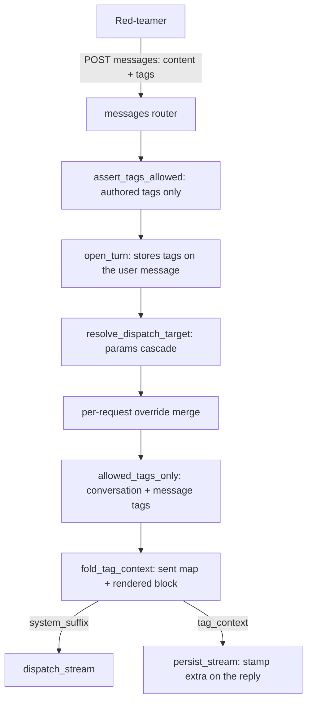

# Conversation tags

Free-form `key: value` pairs a red-teamer attaches to a [Conversation](../data-models/conversation.md) — or to a single [Message](../data-models/message.md) — which the backend folds into the model's **system prompt** as context. "Persona: support agent", "environment: staging", "language: pl". They are not metadata for the archive: they change what the model is told.

Code: `app/core/conversations/tags.py` (the prompt boundary) + `app/core/evaluations/services/tag_keys.py` (the per-evaluation policy). Models: [Conversation](../data-models/conversation.md) `tags`, [Message](../data-models/message.md) `tags`, [EvaluationTagKey](../data-models/evaluation-tag-key.md).

## Two layers, message wins

| Layer | Column | Lifetime |
|---|---|---|
| Conversation | `conversations.tags` JSONB | persists; replayed on every turn |
| Message | `messages.tags` JSONB (user messages) | authored per send; stored on that message |

At dispatch the two merge — `{**conversation.tags, **message_tags}` — so a **message tag overrides the conversation's for the same key**. A regenerate/continue re-reads the tags of the turn's originating *user* message, so re-answering the same prompt uses the same prompt context the transcript still shows on it.

## The fold into the prompt

`app/core/conversations/tags.py` renders the merged map under a fixed instruction preamble, so the model treats the pairs as context to apply rather than as stray text:

```python
TAG_CONTEXT_PREAMBLE = "Context tags for this request — take them into account when responding:"


def fold_tag_context(tags: dict[str, str]) -> tuple[dict[str, str], str | None]:
    """The pairs a prompt will carry and the block rendering them, sanitised once."""
    sent = sent_tag_context(tags)
    return sent, _render_pairs(sent) if sent else None
```

Rules that matter:

- **Sorted keys** — the composed prompt is deterministic. Sorting happens on the *raw* key, before sanitising, so the order is decided once; the emitted key (which sanitising can change) is not necessarily the one it was sorted on.
- **One derivation, two consumers.** `fold_tag_context` returns the map *and* the block together, because the write path needs both — it records what was sent and folds what is sent. Deriving them separately would sort on the sanitised key the second time, so two lines could swap where sanitising changes a key's rank.
- **An empty value is not sent.** A tag whose value sanitises to nothing carries no context; if no tag has a value, nothing is folded at all.
- **The block travels out-of-band** — `dispatch_*`'s `system_suffix`, **never** the dispatch `params` (see below).

### The block is `system_suffix`, not `params["system_prompt"]`

The gateway appends `system_suffix` to the system message *after* it has applied `advanced_params_disabled`, which drops the whole operator params cascade. Folding the tag block into `params["system_prompt"]` would therefore silently drop it for a flagged model **while the reply still recorded that context as sent**. Tag context is gateway-owned platform context, not an operator knob, so it gets its own channel — see [AI Gateway - inference parameters](ai-gateway-inference-parameters.md).

A cascade-level or per-request `system_prompt` still survives: the two are joined with a blank line, operator prompt first.

## Recording what a reply's prompt carried

A tag map is mutable and the policy filtering it can change, so a reply read back later can't be re-derived — the transcript would show today's tags against yesterday's answer. The write path therefore **stamps the map onto the reply**, under two `Message.extra` keys named next to the column they live in:

| Key | Meaning |
|---|---|
| `tag_context` | the sanitised pairs this reply's prompt actually carried |
| `tag_context_partial` | present only alongside a non-empty `tag_context`; marks a map that covers only a `continue`'s appended continuation, not the whole reply |

`recorded_tag_context(message)` is the single reader, so the writer (`persist_stream`) and the projection (`MessageBase`) cannot disagree about the key names. It returns `None`, not `{}`, when nothing was recorded — **undecidable** (a user message, a reply older than the record, a finalize that never ran) is not the same as "no tags", and it is what makes the current policy the only available answer for such a row.

Both surface on `MessageBase` as `tag_context` / `tag_context_partial`, so every message projection carries them.

### Injection safety

Both halves of every pair are sanitised at the prompt boundary by the shared `sanitise_single_line` (`app/core/helpers.py`): `Cc` / `Cf` / `Co` / `Cs` (control, format, private-use, surrogates) are stripped and whitespace runs — newlines and tabs included — collapse to a single space. Neither a value nor a key can therefore forge an extra `key: value` line or a spoofed preamble. `Cn` (unassigned) is deliberately **not** stripped: it is a property of the interpreter's Unicode build, not of the text, so a codepoint assigned in a newer UCD would otherwise vanish from the prompt while the chip still showed it — exactly the divergence the stripping exists to prevent.

The same normalisation runs at the **write** edge (`ConversationTags`), so *stored == returned == sent*: a chip or an export can't name context the model never saw. The pass in `tags.py` is the boundary's own layer, re-cleaning a value that reached storage by another route (a direct DB write, an import, a pre-normalisation row).

## Limits (schema edge)

`ConversationTags` in `app/core/conversations/schemas.py`:

| Bound | Value | Published in OpenAPI |
|---|---|---|
| keys per map | `MAX_TAGS` = 16 | yes (`maxProperties`) |
| key charset/length | letters, digits, `_.-`, 1–64, not dots alone | yes (`propertyNames.pattern`) |
| value length | 512 chars | yes (`additionalProperties.maxLength`) |
| serialised size | 10 KiB | **no** — JSON Schema can't express a byte bound |

The byte ceiling sits above the largest ASCII payload the published maxima allow, so it can never reject one of those; it bites on multi-byte text (16 × 512 CJK chars is ~24 KiB), which is the case it exists for. A whitespace-only value is normalised to empty (treated as unfilled); a value that *looks* like text but sanitises to nothing — a pasted zero-width space, a lone soft hyphen — is **rejected** instead of silently emptied.

## The per-evaluation policy

[EvaluationTagKey](../data-models/evaluation-tag-key.md) plus two flags on [Evaluation](../data-models/evaluation.md) (`tags_enabled`, `tags_restricted`) define what is allowed. The policy has **two entry points**, because authoring a tag and replaying one already stored are different acts:

| Function | Guards | Behaviour |
|---|---|---|
| `assert_tags_allowed` | the write paths — conversation create, PATCH, and the tags a send request carries | **rejects** (400) |
| `allowed_tags_only` | the prompt fold, which includes the conversation's stored tags | **drops** silently (logs `conversations.tags.dropped`) |

Rejecting at the fold instead would mean an admin toggling a flag leaves every already-tagged conversation unable to send, regenerate or continue — over state its owner cannot even reach once the console hides the tagging surface. Conversely, a *replayed* send (idempotent retry on `client_message_id`) is not re-judged: re-checking a turn that was already accepted would turn the stored reply into a permanent 400 the client can't distinguish from "never persisted".

`TagFoldPolicy` (resolved once per export via `load_tag_fold_policy`) answers the read-side question offline: `unsent(tags)` returns the keys this policy keeps out of the prompt, so a projection or an export never prints a stored tag as though the model received it. It is judged against the policy **as it stands now** — nothing persists the rendered prompt, so "was this sent?" is only answerable as "would it be sent?".

## HTTP surface

| Where | What |
|---|---|
| `POST /api/v1/evaluations/{id}/conversations` | optional `tags`; a disallowed key is **400** |
| `PATCH …/conversations/{conversation_id}` | `tags` replaces the map wholesale (`{}` clears); explicit `null` is 422 |
| `POST …/conversations/{id}/messages` | per-request `tags` on `UserMessageIn`; a disallowed key is 400 |
| `GET /api/v1/evaluations/{id}/tag-keys` | flat list (not a `Page[T]` — capped at 16), `evaluations:read` |
| `POST /api/v1/evaluations/{id}/tag-keys` | `evaluations:update` (or `evaluation_groups:manage`); 409 on duplicate/at cap |
| `DELETE /api/v1/evaluations/{id}/tag-keys/{key}` | same gate; existing conversation tags untouched |

`ConversationResponse.tags` and `TranscriptMessage.tags` surface the stored maps. A tag change on a conversation is the **one** conversation write that is audited (`conversation.tags_update`) — tags are prompt context the model acts on, so who changed them and to what is a governance question the transcript alone can't answer. Only real changes are recorded: the FE sends the whole map, so a no-op PATCH would otherwise fill the log.

## Exports

The `conversations` export carries `Tags` (the stored map — a real nested object in JSON, a JSON-encoded cell in CSV) plus `Tags not sent` (the keys the current policy keeps out of the prompt). `engagement_report` carries the conversation layer, the per-message layer inside `messages`, and a reduced `tags_not_sent`: a key counts as **sent once some turn sent it**, and is reported only if no turn did — merging every message map into one instead would let a later turn blanking `env` claim `env` never reached the model. See [Exports (CSV / JSON)](exports.md).

## Diagram: where tags enter the prompt



## Related

- [EvaluationTagKey](../data-models/evaluation-tag-key.md)
- [Conversation](../data-models/conversation.md)
- [Message](../data-models/message.md)
- [Evaluation](../data-models/evaluation.md)
- [Conversations](conversations.md)
- [Message persistence (write-path)](message-persistence-write-path.md)
- [AI Gateway - inference parameters](ai-gateway-inference-parameters.md) — why the block is `system_suffix`
- [AI Gateway - dispatch](ai-gateway-dispatch.md) — where `system_suffix` joins the system message
- [Evaluation domain](evaluation-domain.md)
- [Exports (CSV / JSON)](exports.md)
- [Audit log](audit-log.md)
