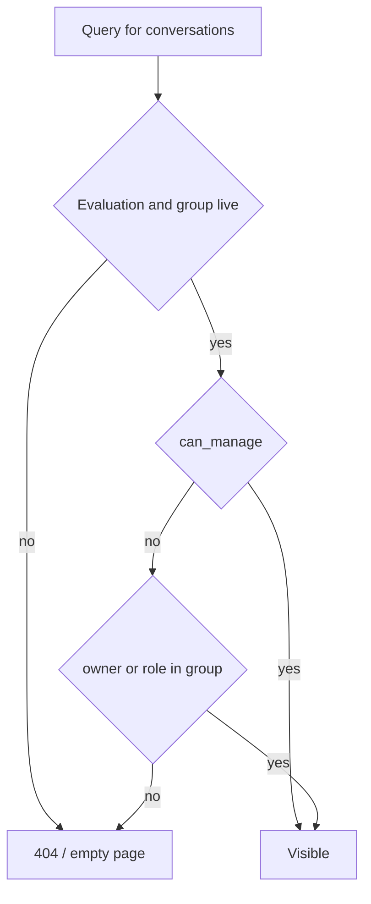
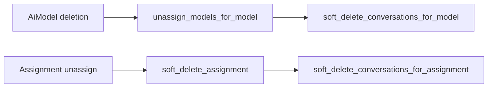

# Conversations

A conversation is a saved red-teamer session with one AI model within a specific evaluation. Think of it as a "conversation folder": it holds who, with which model, within which challenge, and with what inference parameters. The message content hangs beneath it in the `turns`/`messages` tables — this note describes the conversation itself (session metadata).

The subsystem has three deliberately separated parts:
- **Conversation CRUD** — durable session metadata, owner-scoped, what this note describes.
- **Stateless streaming** — `POST /api/v1/chat/stream`, no DB writes, described in [Endpoint POST chat-stream](endpoint-post-chat-stream.md) and [Streaming SSE](streaming-sse.md).
- **Persistence write-path** — the [Turn](../data-models/turn.md)/[Message](../data-models/message.md) models + write services, described in [Message persistence (write-path)](message-persistence-write-path.md). Tied to its own endpoint `POST .../conversations/{cid}/messages` (+ `/regenerate`, `/continue`), gated by `conversations:update` — it writes the conversation and streams the response (A/B split), unlike the stateless `chat/stream`.

## Why it exists

A red-teamer tests a model within an evaluation. A conversation groups that probe: it points to a model assignment ([EvaluationAiModel](../data-models/evaluation-ai-model.md)), optionally the scenario ([Scenario](../data-models/scenario.md)) it concerns, and lets you override inference parameters per session. Access is guarded by two rules: you are the owner OR you have a role in the group ([Object roles - per-object permissions](object-roles-per-object-permissions.md)).

## Data model

See [Conversation](../data-models/conversation.md) for the full description. Here is a summary of the fields relevant to the service:

| Field | FK | ondelete | Note |
|---|---|---|---|
| `user_id` | `users.id` | none | owner, NOT NULL, indexed |
| `evaluation_id` | `evaluations.id` | CASCADE | explicitly denormalized (single-join lists) |
| `evaluation_ai_model_id` | `evaluation_ai_models.id` | none | the assignment, NOT the bare model |
| `conversation_group_id` | `conversation_groups.id` | CASCADE | **required** parent group, indexed — see [Conversation groups](conversation-groups.md) |
| `scenario_id` | `scenarios.id` | SET NULL | optional, usually points to a tombstoned scenario |
| `title` | — | — | VARCHAR(255), nullable optional label; filterable + sortable on the list |
| `parameters` | — | — | JSONB, the most specific cascade layer |
| `tags` | — | — | JSONB NOT NULL default `{}` — free-form prompt context, see [Conversation tags](conversation-tags.md) |

Two deliberate decisions:
- **Link to the assignment, not the bare model.** A conversation inherits the model identity masking and the parameter cascade layer from the assignment. The price: deleting an assignment can't be caught by an ordinary visibility-join, so there are separate soft-delete cascades (see below).
- **`evaluation_id` denormalized despite the redundancy.** It could be derived from the assignment or the scenario, but holding it directly allows listing owner/visibility with a single join. The `create` service validates that the assignment and scenario actually belong to this evaluation, so the denormalization can't drift.

## Parameter cascade

`parameters` is the lowest, most specific layer. The effective parameters are computed by [AI Gateway - inference parameters](ai-gateway-inference-parameters.md):

```
merge_inference_params(ai_model.parameters, assignment.parameters, conversation.parameters)
```

The merge is "most-specific-last": a present key overrides, an absent key inherits from above. There is no "clear to null" state.

`ConversationResponse` also surfaces `effective_license`, inherited from the parent [evaluation](../data-models/evaluation.md) via the three-layer cascade (its `data_license_id` override → its group's → the platform default) — conversations have no license column of their own. See [Data licensing & platform settings](licenses.md).

## Scoping (the core of read authorization)

The heart is `_scope` in `app/core/conversations/services/conversations.py` — every read passes through it.

`app/core/conversations/services/conversations.py`
```python
def _scope(
    statement: Select[tuple[Conversation]], *, caller_id: UUID, can_manage: bool, read_any: bool = False
) -> Select[tuple[Conversation]]:
    statement = join_visible_evaluation_group(
        statement, col(Conversation.evaluation_id), caller_id=caller_id, can_manage=can_manage
    )
    if can_manage:
        return statement
    owned = col(Conversation.user_id) == caller_id
    if read_any:
        readable_groups = groups_granting(Permission.CONVERSATIONS_READ_ANY, caller_id)
        return statement.where(or_(owned, col(EvaluationGroup.id).in_(readable_groups)))
    return statement.where(owned)
```

Two predicates:
- **owner** — `user_id == caller_id`.
- **group visibility** — the parent group is `public` or the caller has a live role on the group. The shared `join_visible_evaluation_group` from [Evaluation domain](evaluation-domain.md) (the same one as scenarios/tasks).

### `conversations:read_any` — a group owner reading its members' transcripts

An **object-scoped** permission: held in-group, it widens the *owner* predicate to admit every conversation in that group. The predicate reads `EvaluationGroup.id` off the visibility join already in the statement — `Conversation` carries no evaluation-group column of its own (its `conversation_group_id` points at the bucket table, a different thing). Three things it deliberately is not:

- it never touches **visibility** — a group the caller can't see stays invisible;
- it is **reads only** — update and delete stay owner-scoped for every holder;
- it is **not** passed on the `deleted=true` branch, where it would be inert: a tombstone listing is scoped by *who deleted the row*, not by who owns it.

The `owner` system role holds it (plus plain `conversations:read`); `red_teamer` deliberately does not.

`can_manage` (i.e. `evaluation_groups:manage` in the JWT) is break-glass — it raises owner + visibility. But **parent liveness** (Evaluation and EvaluationGroup `deleted_at IS NULL`) is enforced ALWAYS, even for a manager: a soft-deleted parent hides the conversation from everyone.



> [!warning] No RLS
> There is no Postgres RLS or `tenant_id` — isolation lives solely in the query predicates. Every new read path MUST pass through `join_visible_evaluation_group`.

## CRUD endpoints

There are two sets: **nested** under an evaluation and **flat** cross-evaluation. File: `app/api/v1/conversations.py`.

| Method + path | Permission | `@transactional` | Service |
|---|---|---|---|
| `POST /scenarios/{scenario_id}/conversations` | `conversations:create` | yes | `create_conversation` |
| `GET /evaluations/{id}/conversations` | `conversations:read` | no | `get_evaluation` + `list_conversations` |
| `GET /evaluations/{id}/conversations/{cid}` | `conversations:read` | no | `get_conversation` |
| `GET /evaluations/{id}/conversations/{cid}/messages` | `conversations:read` | no | `get_conversation` + `list_conversation_messages` |
| `PATCH /evaluations/{id}/conversations/{cid}` | `conversations:update` | yes | `update_conversation` |
| `DELETE /evaluations/{id}/conversations/{cid}` | `conversations:delete` | yes | `soft_delete_conversation` |
| `POST /evaluations/{id}/conversations/{cid}/restore` | `conversations:delete` | yes | `restore_conversation` |
| `GET /conversations` (flat) | `conversations:read` | no | `list_conversations` |

**Create is the exception to the nesting**: it is posted to `/api/v1/scenarios/{scenario_id}/conversations`, so the URL mirrors the taxonomy the conversation sits in, and the evaluation is *derived* from the resolved scenario. The route validates that the chosen assignment belongs to that (caller-visible) evaluation and that the scenario is the target group's — a mismatch reads as 404, a scenario that isn't the group's as **409**. The `Location` header still points at the evaluation-nested read route, which is where the conversation is read from.

Both lists accept `?deleted=true` for the caller's tombstones inside `RESTORE_WINDOW_DAYS` — see [Restore](restore-soft-deleted-items.md). Restoring the last member revives a group the delete pruned; a conversation the model-unassign cascade tombstoned is **not** restorable (its assignment is gone, so it could no longer run).

The permissions `conversations:read|create|update|delete` are held by `red_teamer` + `admin`. The persistence write-path (`POST .../messages` + `/regenerate`/`/continue`, see [Message persistence (write-path)](message-persistence-write-path.md)) is gated by **`conversations:update`** — it's a write to a specific conversation. A separate `conversations:participate` gates ONLY the stateless sandbox ([Endpoint POST chat-stream](endpoint-post-chat-stream.md)), not CRUD or the write-path.

### List filters and ordering

Both list routes take `ConversationFilters` (`app/core/conversations/filters.py`, injected via `Depends`): `evaluation_id`, `scenario_id`, `conversation_group_id`, and `title` — a **case-insensitive substring** match (`ILIKE '%…%'`). `LIKE`/`ILIKE` metacharacters in `title` are escaped by a model-level validator (`escape_like`, matching down the `\` escape used in the query), done model-level rather than per-field so FastAPI's `Depends()` re-validation can't double-escape. Filters never widen visibility — the owner + group-visibility scope in `_scope` is enforced regardless.

`order_by` is the `ConversationOrderBy` whitelist: `created_at` / `updated_at` / `title`, each with a leading `-` for descending (default `-created_at`).

### What is editable

**`parameters`, `tags`, `conversation_group_id` (move), and `title`.** Links to the evaluation / assignment / scenario are immutable — you set them at creation and that's it. A move must land in another group of the same evaluation **and of this conversation's own scenario**: a group's conversations all share its scenario, so a target group on another scenario is a **409**, not a 404.

- `ConversationCreate` (POST): `evaluation_ai_model_id`, `parameters`, optional `tags`, an optional `title` (`≤255`, whitespace-stripped, whitespace-only → 422), and the **required** `conversation_group_id` — it must reference an existing caller-owned live [group](conversation-groups.md) of the **same evaluation** and **same scenario**. `scenario_id` comes from the path (and the evaluation is derived from it), the owner from auth — not from the payload. The conversation starts empty, with `content_protected` frozen from the evaluation's effective licence.
- `ConversationUpdate` (PATCH): `parameters`, `tags`, `conversation_group_id`, and/or `title`.
  - `parameters` — the validator rejects an explicit `null` (→ 422, because the column is NOT NULL); omitting the field = leave unchanged. `{}` clears the whole override (replacing the layer, not merging).
  - `tags` — same shape as `parameters`: the map **replaces** the stored one wholesale (`{}` clears), omitting leaves it unchanged, explicit `null` is a 422. A key the evaluation disallows is a **400** on both create and PATCH (`assert_tags_allowed`), and a real change writes one audit row (`conversation.tags_update`). See [Conversation tags](conversation-tags.md).
  - `conversation_group_id` — **moves** the conversation to another group of the **same evaluation** (caller-owned). If the move empties the previous group, that group is pruned (`soft_delete_empty_groups`). The target group's `MAX_CONVERSATION_GROUP_SIZE` cap is enforced — a full group is a **409**.
  - `title` — **tri-state** (mirrors `EvaluationUpdate.data_license_id`): omit = leave unchanged, a string = set it (same strip/non-blank validation as create), explicit `null` = clear it. Because `null` is a legitimate value (the column is nullable), the field is deliberately excluded from the `_reject_explicit_null` validator, and the route can't use `None` as its "unchanged" sentinel — it passes `title_provided` (from `ConversationUpdate.model_fields_set`) to `update_conversation` to distinguish "field absent" from "field set to null".

### Graph validation in create

`create_conversation` checks the whole reference graph BEFORE the insert:
1. the path `scenario_id` resolves under the caller's visibility, and its evaluation is taken from it,
2. `get_assignment` — must belong to that evaluation,
3. `acquire_group_for_conversation` — the `conversation_group_id` must be the caller's own live group under this evaluation; the group row is locked and its `MAX_CONVERSATION_GROUP_SIZE` cap checked,
4. the group's scenario must be the path scenario.

Any mismatch → 404 (addressing through an invisible evaluation doesn't confirm existence). A full target group, or a group sitting on a different scenario → **409**.

`content_protected` is resolved here from the evaluation's [effective licence](licenses.md) and never re-derived afterwards — a licence changed later does not reach conversations that already exist. See [Conversation content sealing](conversation-content-sealing.md).

### Nested vs flat — different 404 semantics

A deliberate difference:
- **Nested list** first calls `get_evaluation`. An unknown/hidden parent = **404**, not an empty page.
- **Flat list** with an `evaluation_id` filter pointing to an invisible evaluation = **empty page, not 404** (we don't leak existence).

### Message history (read)

`GET .../{cid}/messages` returns the paginated history of a single conversation — live [messages](../data-models/message.md) from the oldest turn (`turn_index`, then user before assistant by `slot`/`id`). The "live" rule is the same as in [Message persistence (write-path)](message-persistence-write-path.md): a message overwritten by regenerate/continue (pointed at by someone's `replaces_message_id`) drops out. The service (`list_conversation_messages` in `services/messages.py`) only reads rows — **scoping is the route's job**: first `get_conversation` under the owner/visibility rule, so an unknown / someone else's / hidden conversation is a **404**, not an empty 200 page. An admin with `evaluation_groups:manage` reads others'.

The projection is `MessageResponse`, the bottom of a three-level schema chain in `schemas.py`: `MessageBase` (`id`, `role`, `status`, `content`, `slot`, `created_at` — the turn-less shape reused inside a message flag) → `TranscriptMessage` (adds `turn_id`, `replaces_message_id`, `image_keys`, `extra` — the reviewer transcript shape, no flag count) → `MessageResponse` (adds `flag_count`). `flag_count` is computed by `flag_counts_by_message` from [Message flags](message-flags.md) — how many **of the caller's flags** (owner-scope, raised by `can_manage`) mark this message; the flags themselves are fetched on demand from the flag list (`?message_id=`), the transcript carries only the badge. `image_keys` (the message's attachments in order, `[]` when none — see [Message](../data-models/message.md)) comes from the batched `image_keys_for_messages` lookup, supplied by the route like `flag_count`.

## Soft-delete cascades

**Group pruning.** `soft_delete_conversation` (and the bulk assignment/model cascades below) call `soft_delete_empty_groups`: when deleting a conversation leaves its [group](conversation-groups.md) with no live members, that group is soft-deleted too. Invariant: every group keeps ≥1 live conversation and an empty group never lingers. The same prune fires when a PATCH **moves** a conversation out of its group (see [What is editable](#what-is-editable)).

The only case the visibility-join doesn't cover: the assignment (`evaluation_ai_model_id`) sits OUTSIDE the evaluation→group path, so the join won't catch it. Hence two explicit bulk soft-delete cascades:

- `soft_delete_conversations_for_assignment(eval_ai_model_id)` — a hook when unassigning a model from an evaluation. Invoked in the same transaction as `soft_delete_assignment` (`app/api/v1/evaluations.py:568`).
- `soft_delete_conversations_for_model(model_id)` — a hook when deleting an [AiModel](../data-models/ai-model.md). Layered on `unassign_models_for_model` (`app/api/v1/ai_models.py:320`). It keys by `EvaluationAiModel.model_id` regardless of assignment liveness (it's tombstoned in the same request).



## Related

- [Conversation](../data-models/conversation.md)
- [Conversation tags](conversation-tags.md)
- [Conversation groups](conversation-groups.md)
- [Turn](../data-models/turn.md)
- [Message](../data-models/message.md)
- [Message persistence (write-path)](message-persistence-write-path.md)
- [Endpoint POST chat-stream](endpoint-post-chat-stream.md)
- [Evaluation domain](evaluation-domain.md)
- [Streaming SSE](streaming-sse.md)
- [EvaluationAiModel](../data-models/evaluation-ai-model.md)
- [Scenario](../data-models/scenario.md)
- [AiModel](../data-models/ai-model.md)
- [AI Gateway - inference parameters](ai-gateway-inference-parameters.md)
- [Object roles - per-object permissions](object-roles-per-object-permissions.md)
- [Pagination, bulk and soft-delete](pagination-bulk-and-soft-delete.md)
