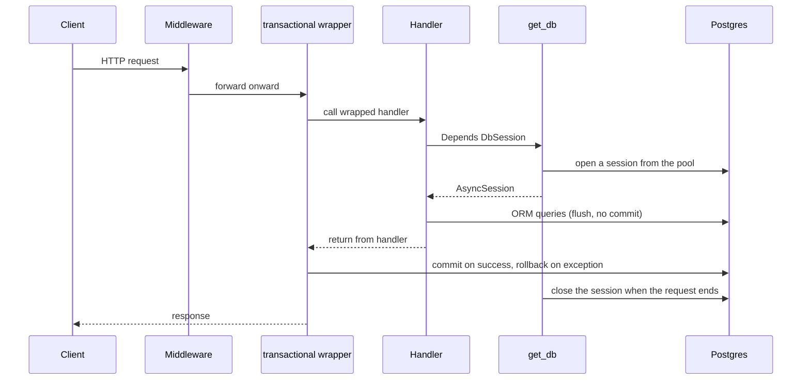
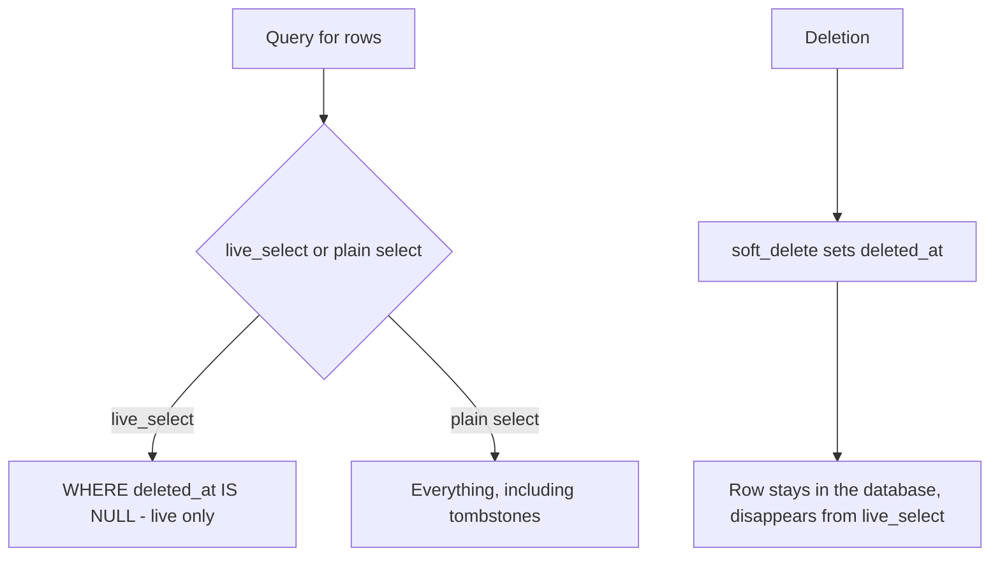

# Database and sessions

This is where all Postgres handling lives: how we build the engine, where a request's session comes from, and how "soft delete" works. If you got lost looking for `db: AsyncSession` in a handler or don't know why a deleted record still lingers in the database — this is the note.

All the code described here sits in `app/core/database.py` and `app/core/soft_delete.py`. The engine and session-factory singletons are set up once, at application startup (in the lifespan from `app/main.py`).

## What it's for / what it does

- **Engine** - one object per process, holds the connection pool to Postgres.
- **Session factory** - produces sessions from the engine; one session per HTTP request.
- **`get_db`** - a FastAPI dependency that injects a session into the handler and closes it after the request.
- **Soft-delete** - instead of `DELETE` we set `deleted_at`; the record stays in the database but disappears from normal queries.

## Async engine: `build_engine`

The engine is **asynchronous** (asyncpg) - because the API is FastAPI, which does all I/O on asyncio. The engine URL is `postgresql+asyncpg://...`, generated by `Settings.database_url` (see [Configuration (Settings)](configuration-settings.md)).

`app/core/database.py`
```python
def build_engine(settings: Settings) -> AsyncEngine:
    return create_async_engine(
        settings.database_url,
        pool_size=settings.db_pool_size,
        max_overflow=settings.db_max_overflow,
        pool_timeout=settings.db_pool_timeout,
        pool_recycle=settings.db_pool_recycle,
        pool_pre_ping=True,  # SELECT 1 before reuse - survives a DB restart / network blip
        echo=settings.db_echo,
    )
```

The pool parameters (`db_pool_size`, `db_max_overflow`, `db_pool_timeout`, `db_pool_recycle`) come from `Settings`. `pool_pre_ping=True` is hardcoded - before reusing a connection a `SELECT 1` is issued, so a database restart doesn't blow up the first request after the outage.

## Async (API) vs sync (Celery)

This is an important distinction. **The API uses the async engine, Celery uses the sync engine** - two separate URLs and two separate worlds of connections.

| | API (FastAPI) | Celery worker |
|---|---|---|
| Driver | asyncpg | psycopg |
| URL | `database_url` (`postgresql+asyncpg`) | `database_url_sync` (`postgresql+psycopg`) |
| Session type | `AsyncSession` | sync `Session` |
| Where the session comes from | `get_db` dependency | its own factory in the worker |

Workers do not use `get_db` or this module's singletons - they have their own synchronous session. Details in [Celery workers](celery-workers.md).

## Singletons set up in lifespan

The module holds two process-level singletons:

`app/core/database.py`
```python
_engine: AsyncEngine | None = None
_session_factory: async_sessionmaker[AsyncSession] | None = None
```

- `init_engine(settings)` - called once from the lifespan in `app/main.py`. Builds the engine and sets `_session_factory = async_sessionmaker(_engine, expire_on_commit=False)`.
- `dispose_engine()` - on application shutdown; idempotent, closes the pool.

`expire_on_commit=False` is deliberate: after `commit()` the ORM objects remain usable (you can serialize them into the HTTP response without another query).

If `_session_factory` is `None` (i.e. the lifespan didn't start), `get_db` raises `RuntimeError` - typical when a test skips the `get_db` override.

## `get_db` - one session per request

`app/core/database.py`
```python
async def get_db() -> AsyncIterator[AsyncSession]:
    if _session_factory is None:
        raise RuntimeError("Database not initialised - the FastAPI lifespan must run ...")
    async with _session_factory() as session:
        yield session
```

Handlers do **not** import `get_db` directly - they use the `DbSession` alias from `app/core/dependencies.py`:

```python
DbSession = Annotated[AsyncSession, Depends(get_db)]
```

Important: `get_db` manages only the session's **lifecycle**, NOT the transaction boundary. The commit itself is done by the `@transactional` decorator (applied to mutating POST/PATCH/DELETE handlers) or by `apply_bulk` for bulk operations. A handler that does `flush()` without a commit will lose its INSERTs when the session closes.

## Session lifecycle within a request



Note: `get_db` only opens and closes the session; the commit/rollback is owned by the `@transactional` wrapper above a mutating handler (or by `apply_bulk` for bulk). A read-only handler has no wrapper and never commits.

The middleware stack wrapping this flow (request_id, logging, auth) is described in [Middleware, logging and request cycle](middleware-logging-and-request-cycle.md).

## `standalone_session` - a session outside the request

`get_db` gives a session **for the duration of the request** - the framework closes it when the handler returns the response. But sometimes work continues AFTER the request session is released: that's the case in the conversation write-path, where the assistant placeholder is finalized only after the (long) SSE stream ends.

Hence `standalone_session()` - a context manager that opens a fresh session from the same factory, but independent of the request lifecycle. Commit on a clean exit, rollback on an error:

`app/core/database.py`
```python
@asynccontextmanager
async def standalone_session() -> AsyncIterator[AsyncSession]:
    if _session_factory is None:
        raise RuntimeError(...)
    async with _session_factory() as session:
        try:
            yield session
            await session.commit()
        except Exception:
            await session.rollback()
            raise
```

Difference from `get_db`: `get_db` is a dependency (yield without a commit - the transaction boundary is drawn by `@transactional`), whereas `standalone_session` **commits itself**, because there is no decorator above it. Used in the A/B architecture from [Message persistence (write-path)](message-persistence-write-path.md): Transaction A (the request session) opens the turn, Transaction B (`standalone_session`) finalizes the message after the stream.

## `scoped_session` - a separate matter

Don't confuse the DB session with `ScopedSessionMiddleware`. These are two different things with similar names:

- **DB session** - the connection to Postgres (this note).
- **`ScopedSessionMiddleware`** - the session-cookie middleware for the OIDC roundtrip (state + nonce). It activates only on the `/api/v1/auth/oidc` prefix; the rest of the requests never touch it.

Details of this middleware are in [Middleware, logging and request cycle](middleware-logging-and-request-cycle.md).

## Soft-delete: `deleted_at` + `live_select`

We don't delete rows. Every table (via `BaseModel`) has a `deleted_at TIMESTAMPTZ NULL` column. A "deleted" record is one that has `deleted_at` set - we call it a **tombstone**.

Filtering is **per-query**, with no global state and no event listener. `with_live(model)` is used for this:

`app/core/soft_delete.py`
```python
def with_live(model: type[BaseModel]) -> LoaderCriteriaOption:
    return with_loader_criteria(
        model,
        lambda cls: col(cls.deleted_at).is_(None),
        include_aliases=True,
    )
```

In practice you don't call `with_live` manually - you use the methods on `BaseModel`:

- `Model.live_select()` = `select(Model)` with `with_live` attached (live rows only).
- `Model.live_update()` = `update(Model)` with `with_live` (a bulk update skips tombstones without a manual `.where`).
- `instance.soft_delete()` - sets `deleted_at = datetime.now(UTC)`.
- `instance.restore()` - clears `deleted_at`.
- `instance.is_deleted` - property.



### Soft-delete pitfalls

- **ORM relationships don't filter tombstones automatically.** When a single query loads more than one soft-delete-aware model (e.g. an eager-loaded relationship), you have to manually add `with_live(OtherModel)` to `.options(...)` per extra class.
- **Raw Core bypasses the filter.** `text(...)` and plain `Table.update()` go outside the ORM pipeline - you must add the `deleted_at IS NULL` predicate yourself.
- **No escape-hatch API.** To query for tombstones, you use a plain `select(Model)` - there is no separate API.
- **Pagination vs count.** `paginate` computes `COUNT(*)` so that it sees the same `deleted_at IS NULL` predicate (which is why it doesn't use `.subquery()`, which would lose `with_loader_criteria`). Otherwise the count would falsely inflate the number of results.
- **`deleted_at` is not the only "off switch".** `AiModel` has a separate `disabled_at` (disable, not deletion), and `User` has `status = INACTIVE`. Three different semantics, easy to mix up.

All columns and relationships are laid out in [Data model overview](../data-models/data-model-overview.md).

## Related

- [Configuration (Settings)](configuration-settings.md) - where the database URL and pool parameters come from
- [Middleware, logging and request cycle](middleware-logging-and-request-cycle.md) - the stack wrapping the request + the OIDC session
- [Celery workers](celery-workers.md) - the sync session on the workers' side
- [Data model overview](../data-models/data-model-overview.md) - tables, columns, `BaseModel`, soft-delete
- [Pagination, bulk and soft-delete](pagination-bulk-and-soft-delete.md) - how count and bulk interplay with tombstones
- [Message persistence (write-path)](message-persistence-write-path.md) - consumer of `standalone_session` (A/B architecture)
