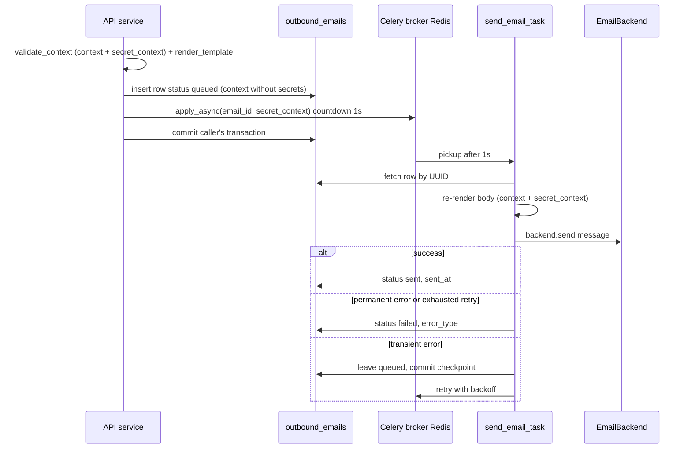
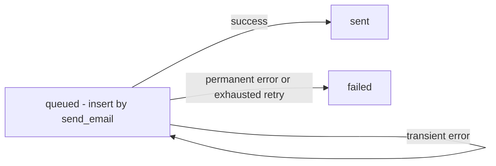

# Email

We send transactional mail: account verification, password reset, invitations. The API side renders and saves the mail into an audit table, and the actual sending is done by a Celery worker in the background. Three real backends exist — `console` (log only, zero network), `ses` (AWS SESv2), `smtp` (stdlib smtplib) — chosen at runtime by `EMAIL_BACKEND`.

## How it works in brief

Three pieces:

1. **EmailBackend** — who physically sends. `ConsoleBackend` (logs the mail), `SESBackend` (AWS SESv2), or `SMTPBackend` (a configured SMTP server). Selected via `Settings.email_backend`; the factory builds a fresh instance per call.
2. **Jinja template registry** — each mail type is a folder on disk (`subject.txt` + `body.txt` + `body.html`) plus a Pydantic context schema. Every `body.html` extends a shared `base.html` frame (see [Templates](#templates)).
3. **send_email -> send_email_task** — the API renders and saves the audit row, the worker delivers. Delivery state lives in the `outbound_emails` table, not in Celery (no result backend — see [Celery workers](celery-workers.md)).

## Templates

Eleven registered templates. The folder name must equal `template.name`.

| Template | What for | Who calls |
|---|---|---|
| `email_verification` | Address verification link after registration | `app/core/auth/services/registration.py` |
| `password_reset` | Password reset link (self-service **and** admin-triggered — `triggered_by_admin` switches the copy) | `app/core/auth/services/password_resets.py`, `app/api/v1/auth/users.py` |
| `account_activated` | Account activation confirmation; `password_cleared` switches the copy when an OIDC activation wiped an existing password | `app/core/auth/services/registration.py`, `app/core/auth/services/oidc.py` |
| `platform_invitation` | Invitation to the platform | `app/core/auth/services/invitations.py` |
| `evaluation_group_invitation` | Invitation to an evaluation group | `app/api/v1/evaluation_group_invitations.py` |
| `evaluation_group_member_added` | Notice of being added to a group | `app/api/v1/evaluation_group_invitations.py` |
| `review_assigned` | Notice of a reviewer being assigned to a flag | `app/core/reviews/notifications.py` |
| `review_unassigned` | Notice of a reviewer being removed from a flag | `app/core/reviews/notifications.py` |
| `export_ready` | A requested data export finished generating (label + retention window + link) | `app/core/exports/notifications.py` |
| `export_failed` | That export failed or timed out (label + safe reason + link) | `app/core/exports/notifications.py` |
| `model_inactivity_alert` | A warmup-enabled AI model has gone unused past its threshold (deep-links the model page) | `app/core/ai_gateway/services/inactivity.py` |

`password_reset` carries a `triggered_by_admin` flag (default `false`): for a reset the recipient never asked for, the copy must not tell them they requested one — it names the administrator instead and says "if you weren't expecting this, contact your administrator before using it". See [User management](user-management.md).

The auth templates (`email_verification`, `password_reset`, `account_activated`, `platform_invitation`) belong to the flow in [Authentication (auth)](authentication.md). The group templates relate to [Flow - evaluation group invitation](../flows/flow-evaluation-group-invitation.md). The `review_*` templates (best-effort, post-condition of assign/unassign) relate to [Reviews - reviewer verdicts](reviews-reviewer-verdicts.md). The `export_*` pair is sent by the worker alongside an in-app [notification](notifications.md) and an audit row — see [Exports (CSV / JSON)](exports.md); both link the FE detail page, never the bearer-gated download URL. `model_inactivity_alert` is sent by the Celery beat sweep, one per recipient (every holder of `models:update` + `models:read`), alongside the same in-app notification — see [AI Gateway - overview](ai-gateway-overview.md).

Template convention (`app/core/email/templates/`): a subpackage `<name>/` with an `__init__.py` exporting `template = EmailTemplate(...)` plus the files `subject.txt`, `body.txt`, `body.html`. The registry builds itself at import (scan via `pkgutil.iter_modules`, `_`-prefixed modules skipped), a duplicate name => `RuntimeError`.

Example — `email_verification/__init__.py`:

`app/core/email/templates/email_verification/__init__.py`

```python
class EmailVerificationContext(BaseModel):
    verify_url: str
    expires_at: datetime


template = EmailTemplate(name="email_verification", context_schema=EmailVerificationContext)
```

The schema serves at once as a context validator and a JSON-Schema source. Jinja runs with `StrictUndefined` — referencing a variable outside the schema blows up loudly (`UndefinedError`), so template-vs-schema drift surfaces immediately. Autoescape only for `.html`.

### Shared frame — `base.html` + `brand` context + inline logo

Every `body.html` is `` and fills the `` from macros imported from `_macros.html` (`heading` / `paragraph` / `note` / `button`), so all mail shares one 600px card layout and type scale. `base.html` carries the header logo (``), an accent rule, and the footer; `_footer.txt` is the plain-text counterpart every `body.txt` ends with (``).

`render_template` injects two things into every render that per-template context schemas never carry:

- a **`brand`** dict (`_brand_context()`) sourced from settings at render time — `company`, `product`, `site_url`, `site_label` (the URL's netloc), and an optional `footer_address`. None of this is persisted on the audit row.
- an **inline logo** — `assets/logo.png` read once at import and attached as `InlineImage(cid="logo")`, so `cid:logo` in `base.html` resolves. This is why HTML mail ships as `multipart/related`, and why SES must send Raw MIME (below).

`_macros.html`, `_footer.txt`, and `base.html` are the `_`-prefixed shared files the registry scan skips. A `datetimefmt` Jinja filter renders ISO/`datetime` context values as `"%B %d, %Y at %H:%M UTC"` (users see formatted dates, not the raw ISO string that crosses the broker).

## send_email — the API side

`send_email` is **async** (the FastAPI side). It renders the mail right away (template/context errors surface at the caller, not in the worker), saves the audit row, and enqueues the task. It takes two contexts: an explicit `context` (non-secret variables, go to the database) and an optional keyword `secret_context` (secrets in the link, do NOT go to the database).

`app/core/email/__init__.py`

```python
secret_keys = set(secret_context or {})
validated = validate_context(template_name, {**context, **(secret_context or {})})
message = render_template(template_name, to, validated)

persisted = {key: value for key, value in validated.items() if key not in secret_keys}
transient = {key: value for key, value in validated.items() if key in secret_keys}

settings = get_settings()
email = OutboundEmail(
    template_name=template_name,
    recipient=to,
    context=persisted,  # only the non-secret subset lands in the DB
    backend=settings.email_backend,
    subject=message.subject,
)
session.add(email)
await session.flush()

send_email_task.apply_async(args=[str(email.id), transient], countdown=1)
return email.id
```

Four things to remember:

- **The caller owns the commit.** `flush()` gives `email.id` without a commit — the row becomes visible to the worker only once the caller's transaction commits.
- **`countdown=1`** (1 s) — gives the caller time to commit, so the worker doesn't race it and see nothing.
- **`secret_context` does not touch the database.** Secrets from the link (token in the URL: `accept_url`, `reset_url`, `verify_url`) are validated together with `context`, but cut out of `OutboundEmail.context` and passed to the worker **in the task signature** (a transient broker message, gone after the ack). They are merged back into the render context only at delivery. The persisted `context` is therefore the non-secret subset, which deliberately does not pass through `validate_context` again.
- The function throws on bad data: `KeyError` (unknown template), `ValidationError` (bad *merged* context or bad `to` address), `TemplateNotFound`, `UndefinedError`.

There is also `send_email_best_effort` — it wraps `send_email` in `begin_nested()` (SAVEPOINT), passes `secret_context` through, swallows the exception (logs only), and **returns whether the mail was queued**. Rule for which to use:

| Function | When | Example |
|---|---|---|
| `send_email` | The mail is a *precondition* of the operation — a failure should roll back the token | verification link, reset, invitation |
| `send_email_best_effort` | The mail is a *consequence* of a committed change — a mail failure cannot undo the fact | account activated, added to a group, reviewer (un)assigned |

One exception to that rule: a caller dispatching *one precondition-shaped mail per row of an already-committed bulk* (the group-invitation and bulk password-reset paths) also uses `send_email_best_effort`. The token rows are durable before dispatch starts, so there is nothing left to roll back, and one broken message must not cost the rest of the batch its mail.

## Who asked for the mail — `requested_by_user_id` and `batch_key`

Two nullable columns on `outbound_emails` turn a lost mail into something the operator hears about:

- **`requested_by_user_id`** — the human who triggered the send, when a human did. System-triggered sends (self-service re-issue, verification) leave it null and notify nobody.
- **`batch_key`** — a plain UUID (no FK: it names no row, it *groups* these ones) correlating the mails of one bulk request.

Failures are announced on the **transition**, not per attempt or per recipient:

| Where the mail dies | Who writes the notice |
|---|---|
| Never queued (render/validation blew up inside the savepoint) | `send_email_best_effort`, in its own nested savepoint — the only chance, since no `OutboundEmail` row exists and the worker will never run |
| Worker gives up (non-transient error, or the retry budget is spent) | `send_email_task._notify_requester`, on the same sync session as the `failed` checkpoint — so the [notification](notifications.md) lands with the status or not at all |

Both are **one notification per batch**, not per row: a provider outage during a 100-row invite would otherwise bury the operator under 100 near-identical rows for one event. With a `batch_key` set, `send_email_best_effort` defers the notice to its caller (which aggregates and writes one row — see the bulk password-reset handler), and the worker notifies only on the *first* failure of a batch (`_batch_already_failed`), the rest being findable in `outbound_emails`. Two rows failing in the same instant can still both notify — separate transactions, neither sees the other's commit — a rare duplicate, not a flood.

`was_failed` guards the worker side: Celery acks late, so a row already marked `failed` can be redelivered and fail again; the notification must fire on the transition only. The worker inserts the `Notification` **directly** rather than through `create_notification`, which is async and unusable from a sync worker session.

## Send flow diagram



## send_email_task — the worker

The task uses a synchronous session (`session_scope` from [Celery workers](celery-workers.md)) and declarative retry. It re-renders the body at delivery (merging `secret_context` from the signature with the persisted `email.context`) and has a few guards, because Celery delivers at-least-once. Celery retries with the same arguments, so the secret survives a redelivery.

`app/core/email/tasks.py`

```python
@shared_task(
    name="app.core.email.tasks.send_email_task",
    bind=True,
    autoretry_for=(TransientEmailError,),
    retry_backoff=True,
    retry_jitter=True,
    max_retries=5,
)
def send_email_task(self, email_id: str, secret_context: dict[str, Any] | None = None) -> None:
    with session_scope() as session:
        email = session.get(OutboundEmail, UUID(email_id))
        if email is None:
            logger.warning("email.task.row_missing", email_id=email_id)
            return
        if email.status == OutboundEmailStatus.SENT:
            return
        ...
        render_context = {**email.context, **(secret_context or {})}
        message = render_template(email.template_name, email.recipient, render_context)
```

Guards (each justified):

- `email is None` — the caller didn't manage to commit the enqueue, we treat it as transient: log and quiet return.
- `email.is_deleted` — an admin soft-deleted the row, terminal state, return.
- `status == SENT` — terminal: a lost ack after a successful send would redeliver and double the mail.
- In `except`: write `error_type`/`error_message`, `status=FAILED` only when the error is **not** transient or we exhausted the retry budget. Then an **explicit `session.commit()` before `raise`** — the checkpoint persists the attempt and the error before Celery takes the retry.

**Note:** delivery is NOT idempotent — a duplicate mail on retry is acceptable. Full dedupe would require an Idempotency-Key + a unique constraint.

## Audit — the outbound_emails table

One row per logical mail (not per attempt). The `OutboundEmail` model (`app/core/email/models.py`) inherits `BaseModel` (UUID PK, timestamps, soft-delete). Column details and the neighboring token tables — see [Support tables (email, verification, reset)](../data-models/support-tables-email-verification-reset.md).

Status cycle (`OutboundEmailStatus`):



Most important fields: `template_name`, `recipient`, `context` (JSONB), `backend`, `subject`, `status`, `requested_by_user_id` (FK, nullable — the human to notify on failure), `batch_key` (nullable, no FK — the bulk correlator), `error_type`/`error_message`, `attempts`, `sent_at`, `celery_task_id`, `provider_message_id` (NULL until an ESP backend returns an id).

**Security rule:** **no secret** (token in the link, OTP) ever reaches the persisted `context` (JSONB). You pass secrets via `secret_context` — they ride in the task signature (a transient broker message) and are merged into the render context only at delivery, never touching the audit row. Additionally: the `to` address is a separate render parameter, not part of the context — so the body can't accidentally leak the recipient. The subject has a validator rejecting CR/LF (anti-header-injection).

## Backends

`EmailBackend` (`app/core/email/backends/base.py`) is a `Protocol` with one method, `send(message) -> str | None`: return the provider-side message id when one exists, else None. Three concrete adapters live one-per-file under `backends/`; the factory picks by config and builds a fresh instance each call:

`app/core/email/backends/__init__.py`

```python
def get_email_backend() -> EmailBackend:
    settings = get_settings()
    if settings.email_backend == "console":
        return ConsoleBackend()
    if settings.email_backend == "ses":
        return SESBackend()
    if settings.email_backend == "smtp":
        return SMTPBackend()
    msg = f"Email backend not implemented: {settings.email_backend}"
    raise NotImplementedError(msg)
```

| Backend | Sends via | `send()` returns | Selected by |
|---|---|---|---|
| `ConsoleBackend` (`console.py`) | a structured `email.sent.console` log event, no network | `None` | `EMAIL_BACKEND=console` (dev/test default) |
| `SESBackend` (`ses.py`) | AWS SESv2 `send_email` with **Raw** MIME | the SES `MessageId` | `EMAIL_BACKEND=ses` |
| `SMTPBackend` (`smtp.py`) | stdlib `smtplib` against a configured server | `None` | `EMAIL_BACKEND=smtp` |

`SESBackend` sends Raw (a full MIME message) rather than Simple content precisely so the inline `cid:logo` rides along as a `multipart/related` part; credentials come from the default boto3 chain (instance profile in prod), only `AWS_REGION` is passed explicitly. `SMTPBackend` reads `SMTP_HOST`/`SMTP_PORT`/`SMTP_TLS` (`none`/`starttls`/`ssl`) + optional `SMTP_USERNAME`/`SMTP_PASSWORD`; it always verifies the server cert on any TLS path (smtplib's default context is `CERT_NONE`, so "encrypted" SMTP would otherwise be MITM-able), and uses a finite socket timeout so a dead server fails into a retry instead of hanging the worker forever. (SES/SMTP settings are catalogued in [Configuration (Settings)](configuration-settings.md).)

### MIME assembly

SES-Raw and SMTP share one MIME builder — `build_mime` (`app/core/email/backends/mime.py`) — so the multipart structure and the CID wiring are identical across both. It sets the plain-text part, adds the HTML alternative, and (when `inline_images` is non-empty) attaches each image to the HTML part as a `multipart/related` `cid:<cid>` part; with no images the result is a plain `multipart/alternative`. `EmailMessage` (in `base.py`) carries `to`, `subject`, `body_text`, `body_html`, `from_addr`, and `inline_images: list[InlineImage]`; its `subject` validator rejects CR/LF (header-injection guard).

### Error taxonomy

`TransientEmailError` marks a retryable failure — it is exactly the type in the task's `autoretry_for`. Each backend maps its own errors to it:

- **SES**: `ThrottlingException` / `TooManyRequestsException` or any HTTP 5xx → transient; every other `ClientError` (e.g. `MessageRejected`) and connection/read-timeout errors propagate as-is (connection errors are also mapped to transient).
- **SMTP**: disconnect / connect error / 4xx reply / socket-level failure (refused, reset, DNS, timeout) → transient; 5xx, refused recipients, auth failure, and TLS/cert errors propagate unchanged (a bad cert won't fix itself on retry). The `except` stays deliberately narrow — `smtplib.SMTPException` and `ssl.SSLError` both subclass `OSError`, so a broad `except OSError` would swallow permanent failures.

Adding a backend = a new file under `backends/`, one branch in the factory, and extending the `Settings.email_backend` Literal — nothing in the existing backends moves.

## Previewing every template — `make emailpreview`

`scripts/preview_emails.py` (run via `make emailpreview`) renders one sample of every registered template and sends it through the configured backend to the local Mailpit sink (the target forces `EMAIL_BACKEND=smtp` + Mailpit env); eyeball the results at `http://localhost:8025`. It **bypasses Celery and the `outbound_emails` audit row on purpose** — a render+deliver styling preview, not the production path. It refuses to run against a real provider (only `smtp`/`console`), and hard-fails if any registered template lacks a `SAMPLE_CONTEXTS` entry, so a newly added template can't silently drop out of the preview.

## Related

- [Celery workers](celery-workers.md)
- [Notifications (in-app feed)](notifications.md) — where a delivery failure is reported
- [User management](user-management.md) — the admin-triggered reset and invitation resend
- [Support tables (email, verification, reset)](../data-models/support-tables-email-verification-reset.md)
- [Flow - evaluation group invitation](../flows/flow-evaluation-group-invitation.md)
- [Reviews - reviewer verdicts](reviews-reviewer-verdicts.md)
- [Authentication (auth)](authentication.md)
- [Configuration (Settings)](configuration-settings.md)
