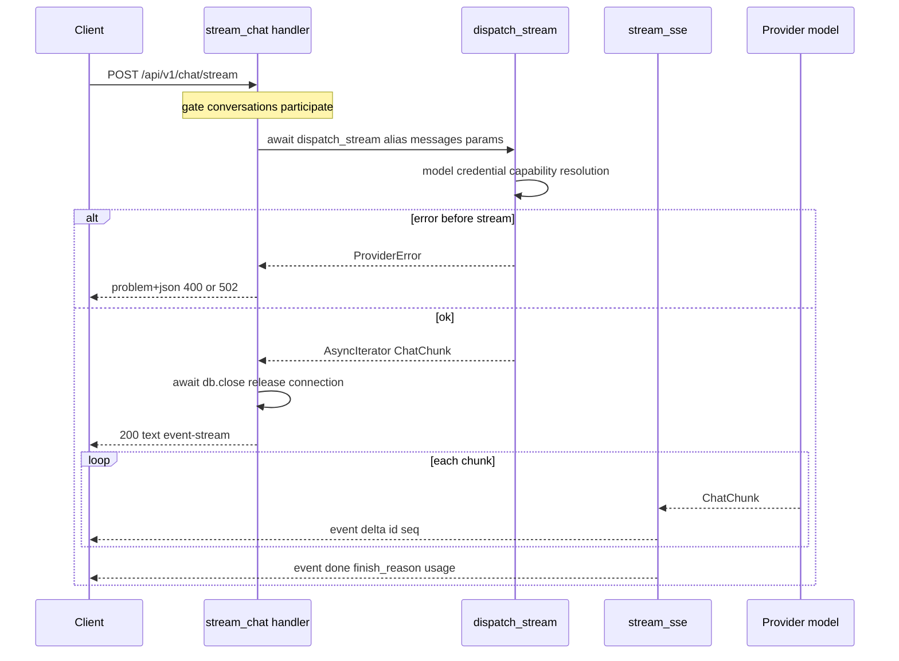

# Endpoint POST chat-stream

This is the "pipe" between the client and the AI model. The client sends messages, the endpoint fires the model and streams the response token by token over SSE. It writes nothing to the DB - it's a pure stream pass-through.

The endpoint lives in `app/api/v1/chat.py`, path `POST /api/v1/chat/stream`. The router is mounted under `/api/v1` in `app/api/v1/__init__.py`.

## Why it exists

The red team probes the model in real time - it sees the response as it's generated, it doesn't wait for the whole block. This endpoint is **stateless**: it creates no row in the DB, it doesn't save message history. Persistence lives under a separate endpoint tied to an evaluation (`POST .../conversations/{cid}/messages`, gate `conversations:update`) — see [Message persistence (write-path)](message-persistence-write-path.md). Here only transport matters.

## What it gets as input

The body is `ChatStreamRequest` (`app/core/conversations/schemas.py`):

| Field | Type | Note |
|---|---|---|
| `model_alias` | `str` | stable model slug, dispatch looks up the row by it |
| `messages` | `list[ChatMessage]` | min 1 message; the client may insert `role="system"` here; `content` may be a list of text + inline-image parts (`data:` URIs only — see [AI Gateway - message types](ai-gateway-message-types.md)), gated on `image` being in the model's `input_modalities` |
| `params` | `ChatStreamParams \| None` | override the model parameters; `extra="forbid"` (rejects unknown keys) |

`ChatStreamParams` has `extra="forbid"` - unlike the storage-side `InferenceParams` (`extra="allow"`). The edge rejects junk instead of forwarding it to the provider.

## What the handler does

Step by step:

1. The `conversations:participate` gate - this is the **only** permission check (the endpoint resolves no object in the DB, so there's nothing to scope).
2. Computes `params = body.params.model_dump(exclude_none=True)` or `None`.
3. `await dispatch_stream(...)` - resolves the model and opens the stream. Resolution errors (alias, credential, declared capabilities) surface **here**, before the first chunk.
4. Maps pre-stream errors to `problem+json`: `ProviderBadRequestError` -> 400, the rest of `ProviderError` -> 502.
5. **Releases the DB session** (`await db.close()`) - before the stream starts.
6. Returns `EventSourceResponse(stream_sse(chunks))`.

### The real handler snippet

`app/api/v1/chat.py`

```python
async def stream_chat(
    body: ChatStreamRequest,
    _caller: Annotated[SessionUser, Depends(require_permission(Permission.CONVERSATIONS_PARTICIPATE))],
    db: DbSession,
    settings: SettingsDep,
) -> EventSourceResponse:
    params = body.params.model_dump(exclude_none=True) if body.params else None
    try:
        chunks = await dispatch_stream(
            db, settings, model_alias=body.model_alias, messages=body.messages, params=params
        )
    except ProviderBadRequestError as exc:
        raise BadRequestError(str(exc)) from exc
    except ProviderError as exc:
        raise BadGatewayError(str(exc)) from exc
    # Release the pooled connection before the (possibly long) stream — get_db
    # would otherwise pin it for the whole response.
    await db.close()
    return EventSourceResponse(stream_sse(chunks))
```

## Why we release the DB session before the stream

This is a deliberate performance decision. The stream can run for a long time (the model generates for tens of seconds). If the session stayed alive, `get_db` would hold the pool connection for the **whole** duration of the response - with a few parallel long streams the pool would be exhausted.

We can safely close it because:
- `dispatch_stream` finished working with the session after its `await` (it resolved the model + credential).
- `stream_sse` **never** touches the DB - it only translates chunks into events.

The handler has no `@transactional` - because it writes nothing.

## Sequence diagram request -> SSE



## What it returns

After the stream starts the HTTP status is already **200** and the headers `text/event-stream`. Events travel in the body (details of the chunk -> event translation in [Streaming SSE](streaming-sse.md)):

- `delta` - a piece of text (`content`).
- `done` - terminal, with `finish_reason` and `usage`.
- `error` - when the provider fails **after** the stream starts (HTTP is already 200, so the error travels as a body event in RFC 7807 shape + `retryable`).

Declared pre-stream responses: 200 (SSE), 400 (the model can't answer in text, or an image sent to a model that doesn't accept image input), 401, 403 (missing `conversations:participate`), 404 (alias doesn't exist), 502 (credential undecryptable).

## The boundary "where the error surfaces"

An important pitfall: `dispatch_stream` is **deliberately not an async generator**. Thanks to that:

| Kind of error | Where it surfaces |
|---|---|
| alias doesn't exist / disabled | at `await dispatch_stream` (before the first chunk) -> 404 |
| unsupported modality / bad params | at `await` -> `ProviderBadRequestError` -> 400 |
| credential undecryptable | at `await` -> `ProviderUnavailableError` -> 502 |
| provider fails mid-stream | during iteration in `stream_sse` -> event `error` |

So everything detectable before the tokens fly returns as clean `problem+json`. Only failures during generation travel as an event `error`.

## Related

- [Streaming SSE](streaming-sse.md)
- [AI Gateway - dispatch](ai-gateway-dispatch.md)
- [Flow - AI message streaming (end-to-end)](../flows/flow-ai-message-streaming-end-to-end.md)
- [Conversations](conversations.md)
- [AI Gateway - message types](ai-gateway-message-types.md)
- [AI Gateway - error taxonomy](ai-gateway-error-taxonomy.md)
- [RBAC - global roles](rbac-global-roles.md)
- [Error handling (RFC 7807)](error-handling-rfc-7807.md)
