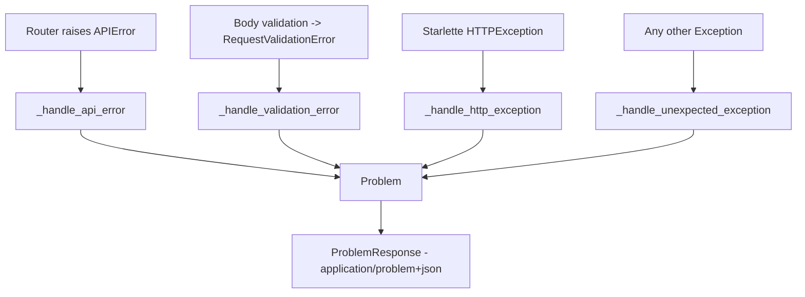

# Error handling (RFC 7807)

Every error response from the API has the same shape: a `Problem` envelope in the `application/problem+json` format (the RFC 7807 standard). Thanks to this the frontend always parses an error the same way, regardless of whether something went wrong in the router, in validation, or somewhere deep in the code.

The idea is simple: routers raise exceptions from the `APIError` hierarchy (instead of a bare `HTTPException`), and four global handlers turn every exception into a `Problem`. Internal details never leak.

## Where this comes from



## The APIError hierarchy

`app/core/exceptions.py` holds one root `APIError` and a few subclasses. A subclass sets `status_code` / `title` / `type` as class attributes, and the caller adds `detail` at the specific occurrence.

```python
class APIError(Exception):
    status_code: int = status.HTTP_500_INTERNAL_SERVER_ERROR
    title: str = "Internal Server Error"
    type: str = "about:blank"
    # Optional field-level detail (RFC 7807 `errors[]`, the 422 shape) so a
    # non-422 error can still map onto a form field. Default None.
    errors: list[ProblemErrorItem] | None = None

    def __init__(self, detail: str | None = None) -> None:
        super().__init__(detail or self.title)
        self.detail = detail
```

A subclass can populate `errors` to attach field-addressable detail to a non-422 status. The first such case is the password-policy `400` (`PasswordPolicyError` in `app/core/auth/password_policy.py`), which points `errors[0].loc` at the `password` field with a machine code (`password_too_common` / `password_too_similar`). See [Authentication (auth)](authentication.md).

Exception -> status mapping (all have `type = "about:blank"`, no subclass overrides it):

| Exception | status | title |
|---|---|---|
| `BadRequestError` | 400 | Bad Request |
| `UnauthorizedError` | 401 | Unauthorized |
| `ForbiddenError` | 403 | Forbidden |
| `NotFoundError` | 404 | Not Found |
| `ConflictError` | 409 | Conflict |
| `GoneError` | 410 | Gone |
| `BadGatewayError` | 502 | Bad Gateway |

Routers and services raise these instead of `fastapi.HTTPException`. This is a different layer than LLM provider errors, which have their own map (see [AI Gateway - error taxonomy](ai-gateway-error-taxonomy.md)) and ultimately also land in a `Problem` envelope.

## The Problem envelope

`app/core/schemas.py` defines `Problem` in line with RFC 7807:

```python
class Problem(BaseModel):
    type: str = "about:blank"
    title: str
    status: int
    detail: str | None = None
    instance: str | None = None
    errors: list[ProblemErrorItem] | None = None
```

- `type` — the URI of the problem type (here `about:blank`).
- `title` — a short, stable summary per type.
- `status` — a copy of the HTTP status.
- `detail` — an explanation of the specific occurrence.
- `instance` — the path of the request that failed.
- `errors` — a list of field errors (each `ProblemErrorItem` with `loc` / `msg` / `type`). Present on 422 schema-validation failures **and** on field-addressable business-rule errors (e.g. the password-policy 400).

Convention for clients: branch on `status` and optionally `type`, don't parse `detail` (it's human-facing text).

## Mapper and handlers

`app/core/error_handlers.py` has one public mapper and four private handlers. The mapper is public because bulk uses it too (a Problem per row, the same shape).

```python
class ProblemResponse(JSONResponse):
    media_type = "application/problem+json"


def api_error_to_problem(exc: APIError, *, instance: str | None) -> Problem:
    return Problem(
        type=exc.type,
        title=exc.title,
        status=exc.status_code,
        detail=exc.detail,
        instance=instance,
        errors=exc.errors,
    )
```

The four handlers are registered together:

```python
def register_error_handlers(app: FastAPI) -> None:
    _register(app, APIError, _handle_api_error)
    _register(app, RequestValidationError, _handle_validation_error)
    _register(app, StarletteHTTPException, _handle_http_exception)
    _register(app, Exception, _handle_unexpected_exception)
```

What each one does:

| Handler | Catches | Status | Notes |
|---|---|---|---|
| `_handle_api_error` | `APIError` | from the exception | `instance = request.url.path`; on 401 appends a `WWW-Authenticate: Bearer` header |
| `_handle_validation_error` | `RequestValidationError` | 422 | `title = "Unprocessable Entity"`, `detail = "Request body failed validation."`, `instance = request.url.path`, fills `errors[]` |
| `_handle_http_exception` | Starlette `HTTPException` | from the exception | title from the standard reason phrase (fallback `"HTTP Error"` for an unknown code); preserves the original `exc.headers` (e.g. `WWW-Authenticate` on 401, `Retry-After` on 429 / 503) |
| `_handle_unexpected_exception` | `Exception` | 500 | `logger.exception(...)` to the pipeline; the body NEVER leaks internals, only `"An unexpected error occurred."` |

The call is wired in once in `app/main.py` together with the rest of startup (see [Middleware, logging and request cycle](middleware-logging-and-request-cycle.md) for the request cycle and request_id logging).

## The same mapper in bulk

`app/core/bulk.py` uses `api_error_to_problem` for a single row that failed. Only `APIError` turns into `failed` in the result; any other exception aborts the whole bulk and goes out as a normal 500. Thanks to this a row error in a bulk looks exactly like an error from a regular endpoint — `instance=None`, because it's a synthetic context.

```python
except APIError as exc:
    results.append(BulkRowResult(
        row_key=row.row_key,
        status="failed",
        error=api_error_to_problem(exc, instance=None),
    ))
```

Partial-success and per-row SAVEPOINT details: [Pagination, bulk and soft-delete](pagination-bulk-and-soft-delete.md).

## Problem in OpenAPI

`app/core/openapi.py` registers the schema and a baseline of error responses, so that the contract is visible in the docs.

```python
def problem_response(description: str) -> dict[str, Any]:
    return {
        "model": Problem,
        "description": description,
        "content": {"application/problem+json": {"schema": {"$ref": "#/components/schemas/Problem"}}},
    }


COMMON_ERROR_RESPONSES: dict[int | str, dict[str, Any]] = {
    status.HTTP_422_UNPROCESSABLE_CONTENT: problem_response("Request failed validation."),
    status.HTTP_500_INTERNAL_SERVER_ERROR: problem_response("Unexpected server error."),
}
```

`COMMON_ERROR_RESPONSES` is the baseline 422 + 500 for every operation. An endpoint opts into additional codes via a merge:

```python
responses = COMMON_ERROR_RESPONSES | {
    status.HTTP_404_NOT_FOUND: problem_response("Thing not found."),
}
```

A full overview of endpoints and REST conventions: [API - overview and conventions](api-overview-and-conventions.md).

## Related

- [API - overview and conventions](api-overview-and-conventions.md)
- [Authentication (auth)](authentication.md)
- [AI Gateway - error taxonomy](ai-gateway-error-taxonomy.md)
- [Pagination, bulk and soft-delete](pagination-bulk-and-soft-delete.md)
- [Middleware, logging and request cycle](middleware-logging-and-request-cycle.md)
- [Flow - HTTP request lifecycle](../flows/flow-http-request-lifecycle.md)
