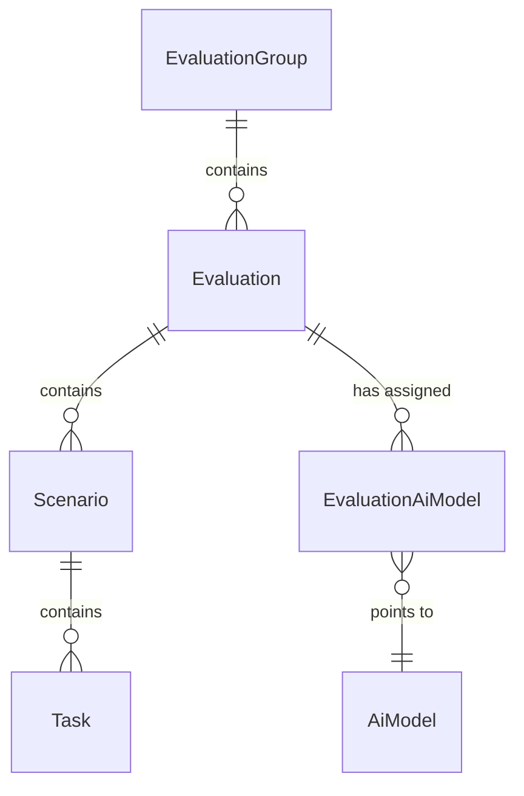

# Evaluation domain

This is the heart of the platform: the whole red-teaming engagement lives here. A group collects evaluations, an evaluation collects scenarios, a scenario collects tasks. You attach AI models to an evaluation, and the whole thing has its own lifecycle (draft -> publication) and two permission scopes (global + per-object).

Code: `app/core/evaluations/` (logic) + `app/api/v1/` (HTTP). Routers mounted under `/api/v1` in `app/api/v1/__init__.py`.

## Object hierarchy

Four levels down + one join to the side (AI models).



| Level | Table | Legacy name | What it is |
|---|---|---|---|
| [EvaluationGroup](../data-models/evaluation-group.md) | `evaluation_groups` | `Event` | Top level, the engagement. Lifecycle + access level + [metrics-access levels](analytics.md) + a [data-license](licenses.md) override |
| [Evaluation](../data-models/evaluation.md) | `evaluations` | — | A single evaluation in a group. Model-masking toggle + a per-eval [data-license](licenses.md) override |
| [Scenario](../data-models/scenario.md) | `scenarios` | `Challenge` | A challenge in an evaluation, has `position` (ordering) and `required_reviews` (review-queue threshold) |
| [Task](../data-models/task.md) | `tasks` | — | Lowest level, a task in a scenario |
| [EvaluationAiModel](../data-models/evaluation-ai-model.md) | `evaluation_ai_models` | — | Join: assignment of an [AiModel](../data-models/ai-model.md) to an evaluation |
| [EvaluationGroupAiModel](../data-models/evaluation-group-ai-model.md) | `evaluation_group_ai_models` | — | Join: the group's **allowed-model subset** — the pool assignments must come from |

All inherit `BaseModel` (`app/core/base_model.py`): `id` (UUID), `created_at`, `updated_at`, `deleted_at` (soft-delete). See [Database and sessions](database-and-sessions.md).

### Delete cascades

In the database the FKs have `ON DELETE CASCADE` going down (group->eval->scenario->task). But in practice the API exposes no hard delete — all services do a **soft-delete** (`deleted_at`). The `EvaluationGroup.evaluations` relation has `passive_deletes=True`, so the ORM doesn't try to null out the children's NOT-NULL FKs and leaves it to the database.

Cascade outside the tree: deleting an [AiModel](../data-models/ai-model.md) soft-deletes all live assignments (`unassign_models_for_model`) **and every group's subset row for it** (`unassign_group_models_for_model`), and an assignment unassign soft-deletes the related [Conversation](../data-models/conversation.md) records (`soft_delete_conversations_for_assignment`).

## Group lifecycle

A group has a status from the `PublicationStatus` enum (`enums.py`). The enum combines two concerns: **moderation** (an admin approves) and the **publish lifecycle** (the owner publishes/finishes).

States: `draft`, `pending_approval`, `changes_requested`, `approved`, `not_approved`, `published`, `inactive`.

**Two entry points.** The full create endpoint (`POST /evaluation-groups`) makes a **complete** group already submitted for review — it lands in `pending_approval`. Partial progress goes through `POST /evaluation-groups/draft` (title-only) → `draft`. The service function `create_evaluation_group` still defaults `status=DRAFT` (used by seeding); the public create route passes `PENDING_APPROVAL` explicitly.

The full set of transitions ships as `POST /{id}/submit|approve|request-changes|reject|publish|finish`:

```mermaid
stateDiagram-v2
    [*] --> pending_approval : create (full, submitted for review)
    [*] --> draft : POST /draft (partial, title-only)
    draft --> pending_approval : submit (owner / manage; completeness re-checked)
    changes_requested --> pending_approval : submit (owner / manage)
    pending_approval --> approved : approve (owner / manage)
    pending_approval --> changes_requested : request-changes (admin manage)
    pending_approval --> not_approved : reject (admin manage)
    approved --> published : publish (owner / manage)
    published --> inactive : finish (owner / manage)
```

Allowed-transitions table (`app/core/evaluations/services/publication.py`):

```python
_PUBLICATION_TRANSITIONS = {
    PublicationStatus.DRAFT: {PublicationStatus.PENDING_APPROVAL},
    PublicationStatus.CHANGES_REQUESTED: {PublicationStatus.PENDING_APPROVAL},
    PublicationStatus.PENDING_APPROVAL: {
        PublicationStatus.APPROVED,
        PublicationStatus.NOT_APPROVED,
        PublicationStatus.CHANGES_REQUESTED,
    },
    PublicationStatus.APPROVED: {PublicationStatus.PUBLISHED},
    PublicationStatus.PUBLISHED: {PublicationStatus.INACTIVE},
}
```

| Action | Transition | Who can | Endpoint |
|---|---|---|---|
| create (full) | -> `pending_approval` | `evaluation_groups:create` | POST `/evaluation-groups` |
| save draft | -> `draft` | `evaluation_groups:create` | POST `/evaluation-groups/draft` |
| duplicate | -> `draft` (fresh copy) | `evaluation_groups:create` + source write access | POST `/{id}/duplicate` |
| submit | `draft` / `changes_requested` -> `pending_approval` | owner or `:manage` (write-gate) + completeness | POST `/{id}/submit` |
| approve | `pending_approval` -> `approved` | owner or `:manage` (write-gate) | POST `/{id}/approve` |
| request-changes | `pending_approval` -> `changes_requested` | only `evaluation_groups:manage` | POST `/{id}/request-changes` |
| reject | `pending_approval` -> `not_approved` | only `evaluation_groups:manage` | POST `/{id}/reject` |
| publish | `approved` -> `published` | owner or `:manage` (write-gate) | POST `/{id}/publish` |
| finish | `published` -> `inactive` | owner or `:manage` (write-gate) | POST `/{id}/finish` |

Authorization is split per action. **submit / approve / publish / finish** follow the group-PATCH rule via `assert_group_write_access` (break-glass or an in-group `owner`), with the same 404-then-403 split — so an **owner may approve their own group** (a deliberate decision). **request-changes / reject** stay moderation verdicts gated on `evaluation_groups:manage` alone (scope already lifted, no ownership check), so an owner can't bounce or reject their own. `changes_requested` is the non-terminal verdict — the owner can `submit` again. `approve` / `request-changes` clear any stale `rejection_reason`; `reject` records it; `finish` is a pure state move (`end_date` unchanged). A bad source state → 409 ConflictError.

**The three verdicts notify the owner.** `approve` / `request-changes` / `reject` call `_notify_owner`, writing an in-app [notification](notifications.md) to `created_by_id` in the same transaction as the status flip — **skipped when the actor is the owner** (a self-verdict is not news, and an owner may legitimately approve their own group). The evaluation-level `approve` / `reject` do the same for the evaluation's creator.

**Submit re-imposes completeness.** Because a `draft` may have been saved with gaps, `submit_evaluation_group` runs `assert_group_submittable` before flipping to `pending_approval`: required fields present (`title`, `description`, `start_date`), `start_date` not before today (full-create parity — a group can't enter review opening in the past, even though a plain edit allows backdating), in-order dates, the `organization` invariant (org access needs a live org), at least one allowed model, and **every live evaluation carrying at least one live scenario** (`assert_every_evaluation_has_scenario`). Conversations target a scenario, so an evaluation without one would be unplayable once the group goes live. An incomplete draft → **400 BadRequestError**.

That last check is **re-run on `publish`**, not just on submit: scenarios are soft-deletable, so an evaluation can lose its last one between the two transitions. Only live evaluations count — a tombstoned one needs no scenario. This is the completeness counterpart to `assert_group_write_access` (authority): the draft path skips these, the submit path restores them.

Deferred: a feedback note on request-changes (would reuse `rejection_reason` / need a column).

## Partial drafts and duplicate

### Partial draft — `POST /evaluation-groups/draft`

Save a work-in-progress with **only a `title`** required (`create_evaluation_group_draft`, gated on `evaluation_groups:create`). `title` / `description` / `start_date` are now nullable columns and `access_level` defaults to `invitation_only` — so a draft is never accidentally exposed. The completeness the full create enforces (required fields, `start_date >= today`, the `organization` invariant) is **skipped at draft time** and re-imposed at submit (see above). The one rule kept here is date order, and only when *both* dates are supplied. Tenant isolation is **not** a completeness check, so it still applies: a set `organization_id` runs the same cross-tenant guard (`_assert_caller_may_assign_org`) — a non-manage caller may only target their own live org. Org *liveness* is deferred to completion.

**Public drafts are owner/manager-only.** A `public` group in `status == draft` is NOT visible by access alone — the `public` arm of both `group_visible_to` (SQL) and `group_is_visible` (in-Python) is gated on `status != draft`. An incomplete WIP stays owner/manager-only (members see it via the membership arm, break-glass managers via the `can_manage` lift) until it leaves `draft`.

Editing a draft (PATCH) deliberately allows partial state and backdating: `EvaluationGroupUpdate` now accepts explicit `null` on `description` / `start_date` (both nullable), rejecting `null` only on `title` / `access_level` (still NOT NULL). `update_evaluation_group` guards the date-order check with `start_date is not None` since a mid-completion draft may have it blank.

### Duplicate-from-template — `POST /{id}/duplicate?include_children=`

`duplicate_evaluation_group` copies a group into a fresh **`draft`** owned by the caller. By default it clones the group's own fields only; `include_children=true` also deep-copies its evaluations + scenarios + tasks + model assignments (same shared `AiModel` rows — no secrets: the API key lives on the `AiModel`, untouched; assignments whose model is soft-deleted are skipped). Runtime data is **never** copied (conversations, messages, flags, reviews); child evaluations reset to their default `new` status. A since-soft-deleted owning org is dropped (the copy goes org-less) rather than carried as a dangling reference.

Authority: duplicating needs **write access on the source** — the same owner-or-manage gate as a group edit (`assert_group_write_access` for `evaluation_groups:update`), not mere visibility. A caller who can only *see* the source gets 403; an invisible source is 404.

The deep-copy is one flush: every PK is a client-side UUID (`BaseModel.id` default_factory), so the whole graph is built in memory and inserted in FK order by a single trailing flush. Scenarios+tasks load in one `IN`-query across all source evaluations (no N+1); each scenario's `position` is preserved verbatim. `duplicate_evaluation` (`POST /evaluations/{id}/duplicate`) is the one-level-down analogue — copies an evaluation into the **same group** as a new `new` row, gated on `evaluations:create` write access via `authorize_evaluation_mutation`.

## Evaluation lifecycle

An evaluation has its own `EvaluationStatus` enum: `new`, `draft`, `under_review`, `rejected`, `approved`, `published`, `completed`. Always created as `new`.

Today only the admin-approval transition is enforced (`app/core/evaluations/services/approval.py`):

```python
_APPROVAL_TRANSITIONS = {EvaluationStatus.UNDER_REVIEW: {EvaluationStatus.APPROVED, EvaluationStatus.REJECTED}}
```

`approve` (clears `rejection_reason`) and `reject` (`rejection_reason` 1-2000 chars) are gated on the `evaluations:approve` permission. The rest of the graph has no enforced transitions yet.

### Adding evaluations needs an approved/published group

An evaluation can be created (or duplicated) into a group **only** when the parent group's status is `approved` or `published` — the allowlist `GROUP_STATUSES_ACCEPTING_EVALUATIONS` (`enums.py`, shared so the list filter can reuse it without an import cycle). Any other state (`draft`, `pending_approval`, `changes_requested`, `not_approved`, `inactive`) is a **409 ConflictError** from `_assert_group_accepts_evaluations`, raised in both `create_evaluation` and `duplicate_evaluation` **after** the object-scope write gate (so the 404/403 authorization split stays authoritative and the 409 never leaks a group the caller couldn't write). There is **no admin bypass** — the check runs regardless of `can_manage`. The group list exposes a matching `accepts_evaluations` filter (`true` = the accepting states, `false` = the complement).

## Visibility and access (reading)

There is no Postgres RLS or `tenant_id` — isolation lives **exclusively** in the query predicates in `app/core/evaluations/access.py`. This is the only line of defense — every new read MUST go through these functions.

Rules:
- A group has an `access_level` (`EvaluationGroupAccessLevel`): `public`, `organization`, or `invitation_only`.
- A group is visible when: it is `public` **and not a `draft`**, OR it is `organization` and its org equals the caller's **live** org, OR the caller holds a live object-role on it (any access level — so cross-org sharing rides the object-role layer).
- **Public drafts stay owner/manager-only** — the `public` arm is gated on `status != draft` in both `group_visible_to` and `group_is_visible`, so an incomplete WIP is seen only via the membership arm (the owner) or the `can_manage` break-glass lift.
- **No fallback to `created_by_id`** — the creator sees their group because create grants them the `owner` role.

`group_visible_to(caller_id)` returns a SQL predicate with three disjoint arms (`access.py`):

```python
member_group_ids = select(col(ObjectRoleAssignment.object_id)).where(
    col(ObjectRoleAssignment.object_type) == ObjectType.EVALUATION_GROUP,
    col(ObjectRoleAssignment.user_id) == caller_id,
    col(ObjectRoleAssignment.deleted_at).is_(None),
)
caller_org = caller_live_organization_select(caller_id).scalar_subquery()
return or_(
    and_(
        col(EvaluationGroup.access_level) == EvaluationGroupAccessLevel.PUBLIC,
        col(EvaluationGroup.status) != PublicationStatus.DRAFT,
    ),
    col(EvaluationGroup.id).in_(member_group_ids),
    and_(
        col(EvaluationGroup.access_level) == EvaluationGroupAccessLevel.ORGANIZATION,
        col(EvaluationGroup.organization_id) == caller_org,
    ),
)
```

The `organization` arm is **fail-closed**: `caller_live_organization_select` yields the caller's org id only when both the user and the org are live (read from the DB, not the frozen JWT), so an orgless caller, a soft-deleted caller-org, or a tombstoned group-org all produce a NULL subquery that never matches. `organization_id` is **not** create-defaulted; create/update validate that an `organization` access level requires a live org (with a `FOR SHARE` lock to close the TOCTOU window against a concurrent org delete), and a non-admin may assign a group only to their **own** live org (cross-tenant planting is a 403; `evaluation_groups:manage` lifts it). See [Organizations](organizations.md).

`join_visible_evaluation_group(...)` is the shared backbone for the children (scenarios, tasks, conversations): it joins the child's FK -> a live Evaluation -> a live EvaluationGroup and tacks on `group_visible_to` unless `can_manage`. Parent liveness is ALWAYS enforced; the `can_manage` flag (= `evaluation_groups:manage` in the JWT) only lifts the public-or-member predicate.

The in-Python variant `group_is_visible(...)` mirrors the SQL plus break-glass. An invisible group -> 404 (the gate doesn't leak the existence of a private group). See [Object roles - per-object permissions](object-roles-per-object-permissions.md).

## Write authorization

`assert_group_write_access` (`app/core/evaluations/services/evaluation_groups.py`) — authority comes exclusively from `ObjectRoleAssignment`, with no `created_by_id` fallback:

1. **Break-glass** — the caller has `evaluation_groups:manage` -> pass.
2. **Member** — `held_roles(...)`; pass only when one of the held roles has the required permission. A demoted member is blocked, even if they created the group.
3. **Non-member** — zero authority despite a global permission.

Error split: when `can_manage` is False — if the group is `public` or the caller holds a role -> **403 Forbidden**, otherwise **404 NotFound** (we don't leak the existence of a private group).

Group roles -> permissions (`app/core/auth/roles.py`). Of the roles assignable in a group, only `owner` passes the write-gate for evaluations/scenarios/tasks:

| Role in the group | What it has |
|---|---|
| `owner` | `evaluations:{read,create,update,delete}` + `evaluation_groups:{read,create,update,manage_members}` (NOT `:manage`) |
| `red_teamer` / `annotator` / `viewer` | read only |

Assignable **system** roles for `EVALUATION_GROUP`: `{owner, red_teamer, annotator, viewer}`; a custom role opts in via `Role.is_object_assignable`, and every assignable role must grant the type's `required_permission` (`evaluation_groups:read`). An **inactive** role grants nothing while still counting as membership. The group super-permission: `evaluation_groups:manage`. See [RBAC - global roles](rbac-global-roles.md), [Object roles - per-object permissions](object-roles-per-object-permissions.md).

The group **detail** GET surfaces the caller's effective in-group authority as `user_permissions` (via `resolve_group_user_permissions` → `resolve_object_access` + `effective_object_permissions`), so the UI can gate group actions without re-deriving them. It's the union of what the caller's in-group roles grant (empty for a non-member; the object type's full vocabulary under the `evaluation_groups:manage` break-glass). These are **whole-role** permission sets, so platform-wide entries a role also carries (e.g. `users:invite`) may appear — the client gates only on the group-relevant keys (`evaluation_groups:*`, `evaluations:*`).

## Allowed-model subset

A group declares **which models its evaluations may use at all**, held in the [EvaluationGroupAiModel](../data-models/evaluation-group-ai-model.md) join and edited as one declarative field:

| Path | Field | Rule |
|---|---|---|
| `POST /evaluation-groups` | `allowed_model_ids` | **required, non-empty**; every id must be a live model |
| `POST /evaluation-groups/draft` | `allowed_model_ids` | optional (defaults empty — a draft may be incomplete) |
| `PATCH /evaluation-groups/{id}` | `allowed_model_ids` | omit = unchanged, a non-empty list **replaces** the set, explicit `null` → 422 |

The service is `sync_group_models` (`services/group_models.py`); there is no per-row add/remove route. Three rules carry the design:

- **Fail-closed on empty.** An empty subset allows *nothing*. `assert_model_assignable_to_group` — called on every evaluation model-assignment — raises 400 both when the subset is empty and when the model isn't in it. Treating empty as "everything" would let deleting a model silently widen a group's pool.
- **A model in use can't be removed.** Dropping an id whose model is still assigned to a live evaluation in the group is a **409**. Locking keeps that honest: `sync_group_models` locks the current rows `FOR UPDATE` while the assignability check reads them `FOR SHARE`, and the PATCH route additionally holds the group row `FOR UPDATE` (adding to an *empty* subset locks no subset rows, so two concurrent adds would otherwise race the partial-unique index).
- **The subset is need-to-know.** The group detail embeds `allowed_models` only for a caller with `models:read` — global **or** via an in-group role (`owner` grants it) — and `null` otherwise: hidden, not merely empty. The `GET /ai-models?assignable_to_evaluation=` filter is the picker counterpart, and `?for_group=` lets an in-group owner without the global permission read the registry at all (see [AI Gateway - overview](ai-gateway-overview.md)).

Existing groups were seeded by a data migration from the models their evaluations already used; groups with no live usage stayed empty, i.e. closed until reconfigured.

## Model masking

Often a red-teamer should not know which AI model they're testing (so they aren't biased by the brand). Controlled at the evaluation level.

- `Evaluation.mask_models_enabled: bool` (default `True`) — the master toggle.
- `EvaluationAiModel.model_display_mask: str | None` — an alias substituted for the real identity when the parent masks. This is something other than `AiModel.model_alias` (the gateway dispatch slug).

Masking is a **response projection**, not a change to the data. `model_id` / `assignment_id` always resolve the real row. The `EvaluationAiModelView.from_assignment(assignment, *, masked)` schema:
- when `masked` -> returns only `assignment_id` + `name = model_display_mask`; the `provider`, `provider_model_id` fields as `null`.
- otherwise -> reads `assignment.ai_model`.

Assignments are addressed by `assignment_id`, NOT by `model_id` — so the same model can't be correlated across evaluations. The GET of a single assignment (`GET /evaluations/{id}/models/{assignment_id}`) is deliberately gated on `evaluations:update` (it returns the unmasked payload for the edit form) — read-only roles don't unmask the model via this endpoint; they see the identity only through the masked list.

Assignment inference parameters: `merge_inference_params(ai_model.parameters, assignment.parameters)` (most-specific-last). See [AI Gateway - inference parameters](ai-gateway-inference-parameters.md).

## Self-join and invitations

Self-join (`membership.py`) — `join_evaluation_group(group, *, caller_id)`. Self-joinable means **`public` or `organization`**, never `invitation_only`:
- `access_level == invitation_only` -> **403 Forbidden** (membership comes only by owner/admin invitation).
- `status != published` -> **409 Conflict**.
- already holds a role on the group (owners included) -> **409 Conflict**.
- otherwise adds the caller as the **participant default role** — resolved from the `is_participant_default` flag (seeded onto `red_teamer`, operator-reassignable via `PATCH /api/v1/roles/{id}`), not by name. DB check constraints keep that role active and object-assignable, since this path grants it directly instead of going through `resolve_assignable_roles`; nothing constrains its *permission set*, so an active participant default with no permissions resolves fine and grants nothing. The route (`POST /{id}/join`) is gated like the detail view (`evaluation_groups:read` + visibility), so an invisible group -> 404. An `organization` group is visible only to its own org, so reaching the join already implies the caller belongs to it — no extra org re-check.

Invitations (`group_invitations.py`) — single + bulk. `invite_to_group(...)`:

| User state | What happens | outcome | Mail |
|---|---|---|---|
| unknown/non-assignable role | `BadRequestError` 400 | — | — |
| `INACTIVE` | `ConflictError` 409 | — | — |
| `ACTIVE` | grant the role immediately | `assigned` | `evaluation_group_member_added` |
| new/onboarding | create an `INVITED` user, grant the role, scoped token | `invited` | `evaluation_group_invitation` with `accept_url` |

The roles are granted on the group **immediately** in both branches — `object_role_assignments` is the source of truth, so a pending invitee shows up in the member list; for onboarding the roles are inert until the account is activated. See [Flow - evaluation group invitation](../flows/flow-evaluation-group-invitation.md), [Invitation](../data-models/invitation.md), [Email](email.md).

## Annotator search (assignment to a flag/review)

The `GET /api/v1/evaluation-groups/{group_id}/annotators` endpoint (router `app/api/v1/evaluation_group_annotators.py`) returns users who can be assigned as **reviewers** to a [flag/review](message-flags.md) in the group. Gated on `evaluation_groups:manage_members` (`ManageMembersDep`) + group visibility; an invisible group → 404 (the `public` branch would otherwise expose the whole reviewer roster). The response is `Page[AnnotatorResponse]` (a `UserBase` projection). An optional `search` query param narrows by a case-insensitive substring on email / first / last name (escaped `LIKE`) — the picker's search box.

**The pool is defined by capability, not by role name**: a user is assignable when they hold a live, **active** role granting `reviews:annotate` — globally (via `UserRole`) or as an in-group object role (via `ObjectRoleAssignment`). So a custom role that grants the permission joins the pool, and deactivating a role drops its holders. In-group holders are **always** assignable (membership is the object-role escape hatch); the group's `access_level` only scopes the *global* arm:

| Access level | Global arm | Plus in-group holders |
|---|---|---|
| `public` | every global `reviews:annotate` holder — anyone may join, so anyone may be assigned | yes |
| `organization` | the group org's own global holders (org members may self-join, so they're assignable — `public` scoped to the org) | yes |
| `invitation_only` | none | yes (the only arm) |

The `organization` union keeps a deliberately-invited **external** reviewer (cross-org, granted an in-group role from the global pool) assignable. The org arm drops out (leaving only the membership arm) when `organization_id` is somehow missing, so a stray `None` can't collapse to `organization_id IS NULL` and match every orgless user. Soft-deleted users are dropped by `User.live_select()`. Every branch now orders by `email` then `id`, matching the reviews assign picker. See [RBAC - global roles](rbac-global-roles.md), [Object roles - per-object permissions](object-roles-per-object-permissions.md).

`list_group_annotators` and the pointwise `is_assignable_annotator(session, group, user_id)` (both in `app/core/evaluations/services/annotators.py`) share one predicate — `annotator_pool_predicate(group)` — so the picker and the assign gate can never disagree, including on soft-deleted users. See [Reviews - reviewer verdicts](reviews-reviewer-verdicts.md).

## Conversation tag schema

An evaluation governs whether the conversations under it may carry tags, and which keys. Two flags on [Evaluation](../data-models/evaluation.md) (`tags_enabled`, `tags_restricted`) plus an allow-list table, [EvaluationTagKey](../data-models/evaluation-tag-key.md), managed under the evaluation:

| Method + path | Permission |
|---|---|
| `GET /api/v1/evaluations/{id}/tag-keys` | `evaluations:read` (+ group visibility) |
| `POST /api/v1/evaluations/{id}/tag-keys` | `evaluations:update` (in-group) or `evaluation_groups:manage` |
| `DELETE /api/v1/evaluations/{id}/tag-keys/{key}` | same as POST |

The list is flat, **not** a `Page[T]`: the set is capped at the same 16 keys a single conversation's tag map has, so it can't outgrow one response, and the write path reads it whole on every create / PATCH / send. Both writes are audited (`evaluation.tag_key_add` / `evaluation.tag_key_remove`). Removing a key leaves existing conversation tags untouched — the prompt fold filters them instead of failing later turns. **Duplicating** an evaluation or a group always copies the tag schema (flags *and* keys), `include_children` or not, so a duplicate can't silently drop a restriction. Full behaviour: [Conversation tags](conversation-tags.md).

## Pitfalls and decisions (why it's like this)

- **No RLS** — `access.py` is the only defense. Every new read through `group_visible_to` / `join_visible_evaluation_group`.
- **`created_by_id` is attribution, not authority** — authority flows through the granted `owner` role; a demote really takes authority away.
- **Last-owner guard** — `owner` is the object-role layer's `protected_role` for a group, so removing or demoting its sole live holder is rejected with **409**: member PATCH/DELETE, a re-invite that drops `owner`, and deleting the sole-owner user. Hand the role off first; the guard is absolute (even a break-glass admin). See [Object roles - per-object permissions](object-roles-per-object-permissions.md).
- **404-then-403 split** everywhere — an invisible private group = 404, a visible-but-insufficient one = 403.
- **`Scenario.position` without a DB-unique** — reorder rewrites many rows in one transaction and would collide with intermediate states. Create and reorder lock the parent `for_update`. Reorder checks unknown-id (404) BEFORE completeness (409) and re-reads after the change (because the server-side `updated_at` expires the attribute -> `MissingGreenlet`).
- **`get_task` doesn't check chain liveness** — it relies on a preceding `authorize_scenario_mutation` in the same transaction; without it a task under a soft-deleted scenario would still resolve.
- **`_reject_explicit_null`** on NOT NULL fields (omission != null); PATCH `parameters` replaces the whole override layer (not a merge).
- **Bulk invitations without `@transactional`** — own boundary; mail best-effort after the commit. Known limitation: the Celery enqueue may outrun the audit-row commit -> dropped as `email.task.row_missing`. See [Celery workers](celery-workers.md).
- **Partial unique** on `(model_id, evaluation_id)` with `WHERE deleted_at IS NULL` — one live assignment per (model, eval); a re-assign after soft-delete creates a fresh row. A collision -> 409. The group subset uses the mirror index on `(model_id, evaluation_group_id)`.
- **An empty allowed-model subset means "no model assignable"**, never "all" — the one place in the domain where absence is deliberately read as a closed door.

## Endpoint map

`/api/v1/evaluation-groups` — list/create/draft/get/patch + `{id}/duplicate` + submit/approve/request-changes/reject/publish/finish/join + nested `/members` (search, role_id), `/invitations` and `/annotators` (search).
`/api/v1/evaluations` — list/create/get/patch/delete + `{id}/duplicate` + `/models` (assignments) + `/tag-keys` + `/approve` `/reject`.
`/api/v1/evaluations/{id}/scenarios` + standalone `/scenarios` (cross-eval) + reorder.
`/api/v1/scenarios/{id}/tasks` — list/create/get/patch/delete.

Reads gated on `*:read`, writes on `*:update`/`*:create`/`*:delete` via `authorize_*_mutation`. See [API - overview and conventions](api-overview-and-conventions.md), [Pagination, bulk and soft-delete](pagination-bulk-and-soft-delete.md).

## Related

- [EvaluationGroup](../data-models/evaluation-group.md)
- [Evaluation](../data-models/evaluation.md)
- [EvaluationTagKey](../data-models/evaluation-tag-key.md)
- [Conversation tags](conversation-tags.md)
- [Scenario](../data-models/scenario.md)
- [Task](../data-models/task.md)
- [EvaluationAiModel](../data-models/evaluation-ai-model.md)
- [EvaluationGroupAiModel](../data-models/evaluation-group-ai-model.md)
- [AiModel](../data-models/ai-model.md)
- [Conversation](../data-models/conversation.md)
- [Notifications (in-app feed)](notifications.md)
- [Message flags](message-flags.md)
- [Notes](notes.md)
- [Reviews - reviewer verdicts](reviews-reviewer-verdicts.md)
- [Object roles - per-object permissions](object-roles-per-object-permissions.md)
- [ObjectRoleAssignment](../data-models/object-role-assignment.md)
- [Organizations](organizations.md)
- [Data licensing & platform settings](licenses.md)
- [Exports (CSV / JSON)](exports.md)
- [Analytics - aggregate metrics](analytics.md)
- [RBAC - global roles](rbac-global-roles.md)
- [Invitation](../data-models/invitation.md)
- [Flow - evaluation group invitation](../flows/flow-evaluation-group-invitation.md)
- [AI Gateway - inference parameters](ai-gateway-inference-parameters.md)
- [Data model overview](../data-models/data-model-overview.md)
- [API - overview and conventions](api-overview-and-conventions.md)
- [Pagination, bulk and soft-delete](pagination-bulk-and-soft-delete.md)
- [Database and sessions](database-and-sessions.md)
- [Email](email.md)
- [Celery workers](celery-workers.md)
