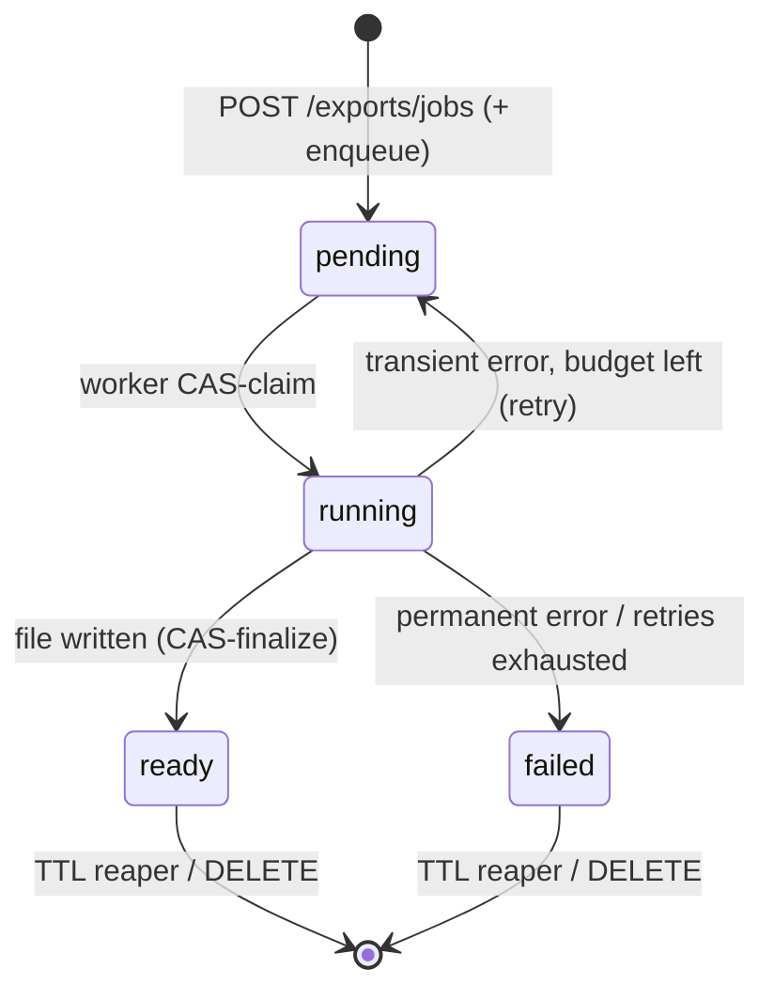

# Exports (CSV / JSON)

In-app data export: an owner/admin queues a background job that extracts a whole evaluation (or group) as a **CSV or JSON** file (the `format` is chosen at create), optionally narrowed by **row filters**, then polls and downloads it. Every export is **asynchronous** — there is no synchronous inline path. This note covers the catalog of export templates, formats, filters, the job lifecycle, the authority rule, the storage backends, and the router. The table itself is in [ExportJob](../data-models/export-job.md).

Code: `app/core/exports/` (logic) + `app/api/v1/exports.py` (HTTP, mounted under `/api/v1/exports`).

## Why it exists

Turn a finished (or in-flight) red-teaming engagement into a shareable deliverable — flags, reviews, transcripts, or a denormalised engagement report. The motivating deliverable is `engagement_report` (one client-facing row per conversation), but the same machinery serves six templates, two formats and both scopes (a single evaluation, or a whole evaluation group).

## The catalog: templates as data

An export template is a `CsvExport` dataclass (`app/core/exports/base.py`): picker metadata (`key` / `name` / `description`), a `permission` (informational — see below), a column spec (`columns`), the set of filter dimensions it honors (`supported_filters`), and an async `fetch(session, scope)` generator that yields already-scoped rows one page at a time. The registry (`app/core/exports/catalog.py`) is static and code-shipped, mirroring `app/core/licenses/catalog.py`. Adding an export = one new module under `app/core/exports/templates/` + one line in `_CATALOG`; the endpoint, the generic generators, and the picker stay untouched.

| Template `key` | Row | Informational `permission` |
|---|---|---|
| `flags` | one per `MessageFlag` (+ flagged message/turn ids, resolved scenario/task/author labels, and the flagged messages themselves — id + role + content — as one JSON cell) | `flags:read` |
| `reviews` | one per `Review` verdict (reviewer email, exploit assessment, notes) | `reviews:read` |
| `conversations` | one per conversation (with its `Tags` as stored + `Tags not sent`) | `conversations:read` |
| `conversation-groups` | one per conversation group | `conversations:read` |
| `transcript` | one per message across all conversations (fully reconstructable: turn / replaces / slot) | `conversations:read` |
| `engagement_report` | one client-facing row per conversation, full transcript as a JSON array (each message with its own `tags`), plus the conversation-level tags and a reduced `tags_not_sent` | `conversations:read` |

The `permission` on a template is **informational** picker metadata (the data-read permission its rows correspond to) — it does **not** gate running the export. That is the owner/admin authority rule below.

## Two formats, one column spec

`ExportJobCreate.format` picks the output (`ExportFormat`: `csv` default, `json`); the worker renders those bytes once and the download serves them with the matching `Content-Type` (`text/csv` / `application/json`). Both renderers consume the same `Column` spec, so a template defines its shape once:

- **CSV** — `app/core/csv_generator.py` (a `Column` = header + value-getter + optional formatter). Streaming-first (`csv_header` + `format_csv_row` hold one row in memory), quotes per RFC 4180, and defuses spreadsheet **formula injection** on string cells (a leading `=+-@`, checked against the first non-whitespace char, gets a `'` prefix). A UTF-8 BOM is prepended by `stream_export`'s CSV branch (not the generator) so Excel renders diacritics.
- **JSON** — `app/core/json_generator.py`, the same columns rendered as one object per row, streamed as a JSON array.

`ExportJob.format` is deliberately a **bare `str` column** (like `template`), not a Postgres enum — adding a format is a code change, no `ALTER TYPE` migration; writes are Pydantic-validated at the edge. Read/render paths coerce the stored value via `parse_stored_format`, which falls back to `csv` with a warning on an unknown value (a script/backfill could write outside the enum; corrupt data must not 500 a list response).

## Row filters (`ExportFilters`)

`ExportJobCreate.filters` (`app/core/exports/filters.py`, its own module to break the `schemas` ↔ `base` import cycle) narrows the exported rows. Every field is `None` = no constraint: `created_from` / `created_to` (UTC-coerced), `status`, `scenario_id`, `task_id`, `user_id` (the row's author — or the reviewer, for the reviews export). Three validation layers:

- **Unknown keys → 422** (`extra="forbid"`) — a typo'd filter must not silently run the export unfiltered on that dimension.
- **Unknown `status` value → 422** (validated against the union of the domain status enums at request time); a status valid in one domain but inapplicable to the template is mapped per template by `coerce_status`.
- **A dimension the chosen template doesn't support → 400** (checked against the template's `supported_filters`) — rejected rather than accepted-and-dropped, keeping the stored/audited/fingerprinted filter set honest. `task_id` narrows only `flags`; `status` only `flags`/`reviews`; `scenario_id` flags/conversations/conversation_groups/transcript/engagement_report (conversation groups gained it once `scenario_id` became a required column); the date range and `user_id` apply broadly.

Only the **set** filters are persisted (`model_dump(mode="json", exclude_none=True)`, or `NULL` when unfiltered) on `ExportJob.filters` (JSONB) — the detached worker replays them, and they are part of the idempotency fingerprint.

## Authority: an export is a whole-group extract

The one security-relevant rule, defined once in `app/core/exports/authority.py` (`assert_export_authority`) so the three call sites — create, worker, download — can't diverge:

1. **Visibility first.** Load the target evaluation (or group) under the caller's visibility → `NotFoundError` (404) if they can't see it.
2. **Then owner/admin authority.** The gate keys on the object-scoped **`evaluation_groups:export`** — a dedicated permission rather than a general edit right, because the bundle carries every member's transcripts, flags and reviews. The in-group `owner` role grants it; the `evaluation_groups:manage` break-glass lifts it → `ForbiddenError` (403) if visible-but-not-authorised.

Because only an owner/admin gets past the gate, an authorised export reads the **whole** evaluation's rows — every red-teamer's conversations/flags/reviews, not just the caller's own (`ExportScope.full_group_access=True`, set only in `_iter_export_rows`). So `engagement_report` is a complete client deliverable with no obligation to redact. `full_group_access` defaults `False` (fail-safe: a scope built without stated authority reads self-only).

```python
# app/core/exports/base.py
@dataclass(frozen=True, slots=True)
class ExportScope:
    evaluation_id: UUID
    caller: SessionUser
    evaluation: Evaluation | None = None
    full_group_access: bool = False
    effective_license: DataLicense | None = None
```

`effective_license` carries the resolved [DataLicense](../data-models/data-license.md) **row** (previously an SPDX string); `stream_export` batch-resolves it onto the scope for the whole group, and the templates that embed it per row (`transcript`, `engagement_report`) render `lic.spdx_id or lic.name` — a user-authored license has no SPDX id, so its name is the label.

## Sealed transcripts in an export

Message text of a conversation under a licence with `protects_conversation_data` is [sealed at rest](conversation-content-sealing.md), so the shared `message_dicts` opens each row through `unseal_for_export` before writing it.

Two details worth keeping:

- the plaintext lands in the **returned dict only** — assigning it back onto `message.content` would make the next flush rewrite the table in the clear;
- a row that cannot be opened is **fatal** (a partial extract that looks complete is the worse outcome), but the job's stored error carries no id, so the failure is logged as `exports.message.unseal_failed` with the message id first.

## Conversation tags in an export

The [tags](conversation-tags.md) an export prints are what was *authored*, which is not necessarily what the model *received*: the evaluation's tagging policy may have tightened since. So the two tag-carrying templates also say which keys the current policy keeps out of the prompt, resolved **once per export** via `load_tag_fold_policy` (not per row):

- `conversations` — `Tags` (the stored map: a real nested object in JSON, a JSON-encoded cell in CSV) + `Tags not sent` (`TagFoldPolicy.unsent`).
- `engagement_report` — the conversation layer, the per-message layer inside `messages`, and a **reduced** `tags_not_sent`: one row covers a whole conversation, so a key counts as sent once *some* turn sent it and is reported only if no turn did. Merging every message map into one instead would let a later turn blanking `env` claim `env` never reached the model; and the reduction accumulates what *was* sent rather than intersecting what wasn't, since a turn that simply lacks a key would otherwise cancel every other turn's report of it.

The per-message shape `message_dicts` builds (`message_id` / `turn_id` / `role` / `status` / `content` / `tags`) is shared by `flags` and `engagement_report`, so the two can't drift on the key set.

Authority is re-checked at **every** stage under the caller's *live* identity — never trusting the create-time grant. The worker reconstructs the requester's permissions from the live DB (`_load_caller` → `effective_permissions`), so a role revoked after queueing denies the detached job. Download re-runs the same gate live, so authority revoked *after* generation revokes the ~24h-downloadable file too.

## The job lifecycle



- **Enqueue after commit.** The endpoint commits the `pending` row, then calls `run_export_job.delay(...)` — only for a freshly created job (an idempotent replay is already queued). A broker failure drops the orphan row and returns **503** (retryable). See [Celery workers](celery-workers.md).
- **Single-writer via compare-and-swap.** The worker (`app/core/exports/tasks.py`) claims `pending → running` with a conditional UPDATE; a redelivery (visibility-timeout expiry) matches no `pending` row and bails, so two workers never write the same local `{job_id}.{csv,json}`. Finalize is the mirror CAS on `running → ready` — if the row was flipped away mid-generation (e.g. the stuck-job reaper failed it), the just-written file is dropped instead of resurrecting a terminated job.
- **Retry policy.** `autoretry_for=(OperationalError, ClientError)` with backoff, `max_retries=3` — but `_is_transient` gates the actual re-raise: a DB blip or S3 5xx/throttle resets the row to `pending` and retries; a permanent 4xx S3 misconfig (AccessDenied, NoSuchBucket) fails fast. Terminal failures record a **safe** `error` string (never upstream/DB internals) for the requester.
- **Expiry + stuck-job reaper.** `reap_expired_export_jobs` runs on Celery beat every `export_reap_interval_seconds`. Two sweeps per tick: (1) any live job past `expires_at` (only `ready`/`failed` carry one) has its file deleted and its row soft-deleted; (2) any `pending`/`running` job older than `export_stuck_ttl_seconds` (a crashed worker, or a dropped message with no `acks_late` redelivery) is flipped to `failed` with a stamped TTL — otherwise it would wedge and 409 forever. That sweep uses `UPDATE ... RETURNING` so the fail-transition stays one atomic statement *and* still hands back the rows to announce (below).

## Completion announcement

Every **terminal** transition — ready, failed, timed-out — announces itself through one function, `emit_export_completion` (`app/core/exports/notifications.py`), which writes three things for the **requester** (no "don't notify the actor" guard: they asked for the export):

| Side-effect | Detail |
|---|---|
| Audit row | `export.ready` / `export.failed`, actor **null** (worker-driven, not an interactive action) — written unconditionally |
| In-app [notification](notifications.md) | `Export ready` (with the retention window in hours) / `Export failed: <reason>`, deep-linked to the job's scope |
| Email | `export_ready` / `export_failed`, linking the FE **detail page** — the download endpoint is bearer-gated, so a mail can never link the bytes directly |

Skipped for a since-soft-deleted requester (the audit row is still written — there's just nobody to notify). Every write is no-commit, so all three land atomically with the status flip; the task wraps the call in `_announce`, a SAVEPOINT that **swallows** failures: forward-atomicity holds (a rolled-back finalize announces nothing), but a notify blip must never undo a just-generated export or abort the reaper's batch.

Announcing exactly once is the CAS's job: the ready path announces only when the finalize CAS won, and the failure path CAS-flips `running → failed` so a job the stuck-reaper already announced doesn't get a **second** failure notice.

## Human-readable naming

`app/core/exports/naming.py` drops the raw UUID from what the user sees:

- `report_filename(...)` → the download attachment name, `<title-slug>-<template>-<YYYYMMDD-HHMM>.<ext>` (UTC).
- `report_label(...)` → the notification/email label, `<Title> - <Template> Report (<FORMAT>) · <YYYY-MM-DD HH:MM> UTC`. Whitespace (including newlines) in the user-set title is collapsed to single spaces, because the label flows into an email `Subject` header, which rejects CR/LF.

Both take the timestamp from the job's `created_at`, so the filename (built at download time) and the label (built at completion) agree. `resolve_scope_title` reads the evaluation/group title **ignoring soft-delete**, so a scope tombstoned mid-export still names itself — not a disclosure, since the title only ever reaches the requester who exported that scope.

## Idempotency

`POST /exports/jobs` accepts an optional `idempotency_key` (a UUID). A repeat from the same requester with the same key replays the already-queued job instead of generating a duplicate (`created=False`, so the endpoint skips re-enqueue). Reusing a key for a *different* template/scope/**format/filters**, or losing a create race on the partial-unique index, is a **409** (standard Stripe-style key-fingerprints-one-request semantics). The uniqueness index is partial (`WHERE idempotency_key IS NOT NULL AND deleted_at IS NULL`), so a soft-deleted (reaped) job frees its key.

## Storage backends

A tiny port (`app/core/exports/storage/base.py`, `ExportStorage`: `save` / `open` / `exists` / `delete`) with two adapters, selected by `Settings.export_storage_backend` in `get_export_storage()` — mirroring the email-backend port:

| Backend | `file_ref` | Notes |
|---|---|---|
| `local` (default) | bare `{job_id}.{csv,json}` filename | under `export_storage_dir`; every access re-resolves against the base dir and rejects path-traversal escapes |
| `s3` | bare object key | prefix (`export_s3_prefix`) re-applied per access; small exports one PUT, larger switch to multipart at 8 MiB parts; creds via the default boto3 chain |

`save` is async (consumes the worker's export text stream) and takes the format's `content_type` — it tags the stored blob's own metadata on backends that carry one (S3); on the local filesystem the extension in the key already encodes it. `open` is sync (feeds a `StreamingResponse` iterated in a threadpool) and acquires the handle **eagerly** so a vanished file raises `FileNotFoundError` before the 200 + headers commit — a clean 404, not a truncated body. `S3ExportStorage.open` translates a missing-object `ClientError` into `FileNotFoundError` to honour the port. A misconfigured `s3` backend (no bucket) fails at **startup** via a `Settings` validator, not on the first job.

## Endpoints

`/api/v1/exports`, tag `exports`. Jobs are **owner-scoped**: a caller sees, lists, and downloads only jobs they requested (`requested_by_id`).

| Method | Path | Success | Notes |
|---|---|---|---|
| GET | `/exports` | 200 | List export templates (the picker). Auth-only, no permission. |
| POST | `/exports/jobs` | 202 | Queue a job (`template` + optional `format`/`filters`). `evaluation_groups:export` authority; 400 (unsupported filter dimension)/403/404/409/503. |
| GET | `/exports/jobs` | 200 | List the caller's jobs for one scope (exactly one of `evaluation_id`/`evaluation_group_id`, else **400**). |
| GET | `/exports/jobs/{id}` | 200 | Poll status; owner-scoped (404 across requesters). |
| DELETE | `/exports/jobs/{id}` | 204 | Delete a *finished* (`ready`/`failed`) job — removes the file + soft-deletes the row. `409` if still generating. |
| GET | `/exports/jobs/{id}/download` | 200 `text/csv` or `application/json` | Stream a `ready` job's file (media type per the job's `format`). 403/404/409. |

Create and delete are **audited** (`export.create` / `export.delete` via `record_audit`, with a curated job snapshot; download is captured by the audit middleware as `export.download`; the worker adds `export.ready` / `export.failed` on completion) — see [Audit log](audit-log.md). The create route manages its transaction manually (enqueue-after-commit), so on a broker failure it compensates by deleting both the job row **and** its just-committed audit row (`record_audit` returns the flushed row for exactly this).

Notable asymmetries:

- **Scope validation surfaces per layer.** Create validates "exactly one scope" in the Pydantic body → **422**; the list endpoint validates the same rule on query params → **400**. Deliberate.
- **Delete has a break-glass, download does not.** Delete is housekeeping, so `evaluation_groups:manage` lifts the owner scope (an admin cleans up a departed red-teamer's export) *without* granting read access. Download *serves* a whole group's data, so it stays strictly owner-scoped. Only terminal jobs are deletable — deleting a still-`running` one would race the worker's finalize and orphan its file. The owner-path delete does no per-group re-check, so a requester can always clear their own export even if its group was since deleted.
- **Download releases the DB connection** before streaming (like the chat/stream endpoint) — the job row + authority are already resolved, so `get_db` won't pin a pooled connection for a slow download. The attachment filename is resolved *before* that release (it needs the scope title).

## Related

- [ExportJob](../data-models/export-job.md) — the `export_jobs` table
- [Notifications (in-app feed)](notifications.md) — the completion notice
- [Email](email.md) — the `export_ready` / `export_failed` templates
- [Data licensing & platform settings](licenses.md) — the `effective_license` embedded per row
- [Audit log](audit-log.md) — `export.create`/`export.delete`/`export.download`/`export.ready`/`export.failed` audit events
- [Evaluation domain](evaluation-domain.md) — the group/evaluation visibility + `assert_group_write_access` the authority gate reuses
- [Object roles - per-object permissions](object-roles-per-object-permissions.md) — the in-group `owner` role the authority keys on
- [Celery workers](celery-workers.md) — the background task + beat-scheduled reaper
- [RBAC - global roles](rbac-global-roles.md) — `evaluation_groups:update` / `manage` (no dedicated export permission)
- [API - overview and conventions](api-overview-and-conventions.md)
- [Data model overview](../data-models/data-model-overview.md)
