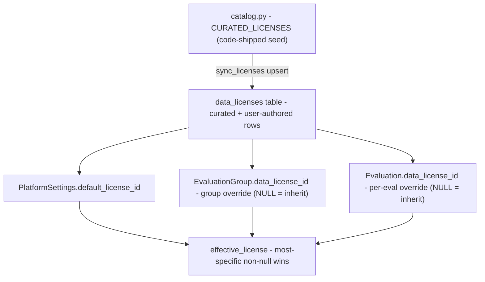

# Data licensing & platform settings

The platform's **data-licensing policy**: a DB-backed catalog of data licenses (curated + user-authored), a one-row platform-default singleton, and a three-layer cascade that resolves the *effective* license of an evaluation (and the conversations under it). This is about the license attached to red-teaming **data**, distinct from the code license (Apache-2.0).

Code: `app/core/licenses/` and `app/core/platform_settings/` + the routers `app/api/v1/licenses.py` and `app/api/v1/platform_settings.py`. Tables: [DataLicense](../data-models/data-license.md), [PlatformSettings](../data-models/platform-settings.md).

> **The settings singleton was split out.** `PlatformSettings` and its service moved from `app/core/licenses/` into their own `app/core/platform_settings/` package, and grew knobs that have nothing to do with licensing (registration policy, password policy, reset throttling). This note keeps only the licensing half; the rest lives in [PlatformSettings](../data-models/platform-settings.md).

> The catalog moved **into the database**. Before it, a license was a code-only `LicenseSpec` and the referencing columns held an SPDX string (`data_license`); now every layer stores a `data_licenses.id` (`data_license_id`) and users can author their own licenses.

## Three pieces



1. **Catalog** (`catalog.py`) — code-shipped **seed data**, no longer the source of truth for what exists. A tuple of `CuratedLicense` (`spdx_id` / `name` / `version` / `short_description` / `reference_url` / full `content`): the Creative Commons + Open Data Commons + CDLA set for datasets. Software licenses (MIT/Apache/BSD, the GPL family, …) are deliberately excluded — they govern code, not data. Shipped default: `CC-BY-4.0`. `curated_license_id(spdx) = uuid5(namespace, spdx)` gives each curated row a deterministic id, so it is identical across environments. `effective_license(*overrides, default=...)` still lives here and resolves the cascade (overrides most-specific-first, first non-null wins).

2. **Table** ([DataLicense](../data-models/data-license.md)) — every license the platform offers. Curated rows (`created_by_id IS NULL`, with an `spdx_id`) are reconciled by `sync_licenses`; user-authored rows (`created_by_id` set, no `spdx_id`) are plain CRUD. Soft-deletable, and a tombstoned license still resolves for whatever already references it.

3. **Singleton** ([PlatformSettings](../data-models/platform-settings.md)) — the django-solo analogue: one row at a fixed sentinel PK holding `default_license_id` (NOT NULL FK). Reads return the row or a **transient** instance pointing at the curated row for `Settings.platform_default_data_license` (env), so the row materializes only on the first admin PATCH.

## Syncing the curated set

`sync_licenses` (`service.py`) upserts `CURATED_LICENSES` keyed on the deterministic id — idempotent, reconciles metadata + `content`, and clears `deleted_at` (a resync revives a tombstoned curated row). It mirrors `syncroles`: a **deploy step after `migrate`**, and part of `seedlocal`.

```
make synclicenses      # docker compose run app python -m scripts.sync_licenses
```

Because a resync would revert any edit, curated rows are **almost** never editable via the API. The single exception: a manager with `licenses:manage` may fill in the legal `content` of a curated entry **the catalog ships without one** — `sync_licenses` drops `content` from the upsert for exactly those entries (`curated_ships_content`), so the write survives the next deploy. Every other field, and every entry whose text the catalog does ship, is refused (**403**) for everyone.

### The `No license` sentinel

One curated entry carries no SPDX identity of its own (catalog key `NONE`, `publishes_spdx=False`, so the stored row's `spdx_id` is NULL): a closed-data entry meaning *no rights are granted*. Two rules follow it around:

- it can **never be the platform default** — rejected at boot by `is_selectable_platform_default` and on `PATCH /platform-settings` (400), since as the default it would unlicense every inheriting group;
- it sets `protects_conversation_data`, which is what makes conversations created under it [sealed at rest](conversation-content-sealing.md).

## The cascade (resolution at the projection layer)

Three layers, **most-specific non-null wins**: platform default → group override → evaluation override. It is computed when projecting, not stored. `resolve_effective_licenses` (`app/core/evaluations/services/evaluations.py`) does one platform-default read + one batched `IN` query joining the parent group — no N+1:

- `EvaluationGroupResponse` surfaces both `data_license_id` (raw group override) and `effective_license` (the resolved license object — no evaluation layer at the group level).
- `EvaluationResponse` surfaces both `data_license_id` and `effective_license` (the full three-layer resolution).
- `ConversationResponse` carries only `effective_license`, inherited from its evaluation (conversations have no license column of their own).

The batched resolver **deliberately ignores the group's `deleted_at`** — license lineage doesn't lapse with a tombstoned parent — but excludes soft-deleted *evaluations* (an asymmetry documented in the service). The group-detail embed computes each child's cascade in-memory from the loaded parent (no resolver round-trip), and duplicating a group copies its `data_license_id`.

Tri-state on `EvaluationGroupUpdate.data_license_id` / `EvaluationUpdate.data_license_id` (like `cover_image`): **omitted** = unchanged, a **value** = set, an explicit **`null`** = reset to inherit (excluded from `_reject_explicit_null`). Every create/update write path validates a non-null id against `validate_license_ref` — a reference to a missing or tombstoned license is a **400**.

### The create-time default derived from `access_level`

When a group create **omits** `data_license_id` entirely, one is derived from the access level:

| `access_level` | Derived `data_license_id` |
|---|---|
| `invitation_only` | the curated **`No license`** sentinel — its evaluations and conversations then inherit "no licence" instead of the platform default |
| anything else | `NULL` (inherit) |

An explicit `null` always inherits. A later `access_level` change re-derives **only** when the group carries no licence *and* the payload omits the field: an inheriting group never chose one, while a stored id — or an explicit `null` in the same PATCH — is a decision and is never rewritten.

A *derived* id is checked with `assert_curated_license_synced` (**500** — `synclicenses` has not run) rather than `validate_license_ref` (400), because the caller never sent that id: it cannot be their mistake.

## Endpoints

### Licenses — `/api/v1/licenses`

Reads are **auth-only** (no permission): they back the license picker and the management list. Writes are permission-gated.

| Method | Path | Permission | Description |
|---|---|---|---|
| GET | `/licenses` | bearer only | `Page[DataLicenseSummary]` — the pick-list; `is_curated` + `is_default` flags; **`content` omitted** |
| GET | `/licenses/{license_id}` | bearer only | One license **with its full text**; unknown id → 404 |
| POST | `/licenses` | `licenses:create` | Create a user-authored license owned by the caller; 201 + `Location` |
| PATCH | `/licenses/{license_id}` | `licenses:update` | Own only, unless `licenses:manage`; curated → 403, except a `content`-only fill on an entry the catalog ships without text |
| DELETE | `/licenses/{license_id}` | `licenses:delete` | Soft-delete; own only unless `licenses:manage`; curated → 403, user-authored current default → 409 |
| POST | `/licenses/{license_id}/restore` | `licenses:delete` (+ `manage` for another author's) | Revive a tombstone; **curated → 403** — `synclicenses` revives those |

`?deleted=true` on the list (403 without `licenses:delete`) serves the restorable set, scoped to the licences the caller **authored** — not to their own deletes — unless they hold `licenses:manage`. An admin's delete of someone else's licence leaves its author as the only person who may restore it, which is why the scope is authorship. There is no 409 path: `spdx_id` is the only unique key and is never API-writable, so a restorable (user-authored) row always carries NULL. See [Restore](restore-soft-deleted-items.md).

The detail read deliberately **serves a tombstone** (`include_deleted`, read path only): groups and evaluations that already reference a deleted licence keep resolving it, so its text must stay reachable — while edit and delete still read it as missing.

Mutations load the row `for_update` and audit as `data_license.create` / `.update` / `.delete`. The snapshot is metadata only — the (large) `content` body is kept out of the trail, with a `content_changed: true` context flag so a text-only edit still records an event. See [Audit log](audit-log.md).

### Platform settings — `/api/v1/platform-settings` (admin-only)

A resource-level `PATCH` with a partial body (not a `/default-license` sub-path), so future settings extend the same routes.

| Method | Path | Permission | Description |
|---|---|---|---|
| GET | `/platform-settings` | `platform_settings:read` | Every knob + `updated_at` (`null` = never overridden) |
| PATCH | `/platform-settings` | `platform_settings:update` | Set `default_license_id` (a live licence, **not** the `No license` sentinel); omit to leave unchanged; explicit `null` → 422; not live → 400 |
| GET | `/platform-settings/public` | **none** | The anonymous subset — `signup_enabled` + `password_policy` |

The non-licensing knobs live in [PlatformSettings](../data-models/platform-settings.md).

## Permissions

| Permission | Held by | What it allows |
|---|---|---|
| `licenses:create` / `:update` / `:delete` | admin, owner | CRUD on **own** user-authored licenses |
| `licenses:manage` | admin | break-glass: edit/delete *other users'* licenses (still not curated ones) |
| `platform_settings:read` / `:update` | admin | read / set the platform default |

There is deliberately **no `licenses:read`** — reading the catalog is open to any authenticated user, because it backs the picker. See [RBAC - global roles](rbac-global-roles.md).

## Startup validation

A `Settings` `model_validator` rejects a `PLATFORM_DEFAULT_DATA_LICENSE` env value that isn't a **selectable** curated SPDX id (`is_selectable_platform_default`) — which excludes both a typo *and* the `No license` sentinel — so either surfaces as a boot error rather than a bogus default on every inheriting evaluation. The env default is `DEFAULT_DATA_LICENSE_SPDX_ID` itself, so the two never drift. See [Configuration (Settings)](configuration-settings.md).

## Related

- [DataLicense](../data-models/data-license.md) — the `data_licenses` table (curated vs user-authored)
- [PlatformSettings](../data-models/platform-settings.md) — the singleton table
- [EvaluationGroup](../data-models/evaluation-group.md) — the group-level `data_license_id` override and the access-level-derived default
- [Conversation content sealing](conversation-content-sealing.md) — what `protects_conversation_data` switches on
- [Evaluation](../data-models/evaluation.md) — `data_license_id` override + `effective_license`
- [Conversation](../data-models/conversation.md) — inherits `effective_license`
- [Evaluation domain](evaluation-domain.md)
- [Configuration (Settings)](configuration-settings.md) — `PLATFORM_DEFAULT_DATA_LICENSE`
- [RBAC - global roles](rbac-global-roles.md) — `licenses:*`, `platform_settings:*`
- [Audit log](audit-log.md) — `data_license.*`
- [API - overview and conventions](api-overview-and-conventions.md)
- [Data model overview](../data-models/data-model-overview.md)
