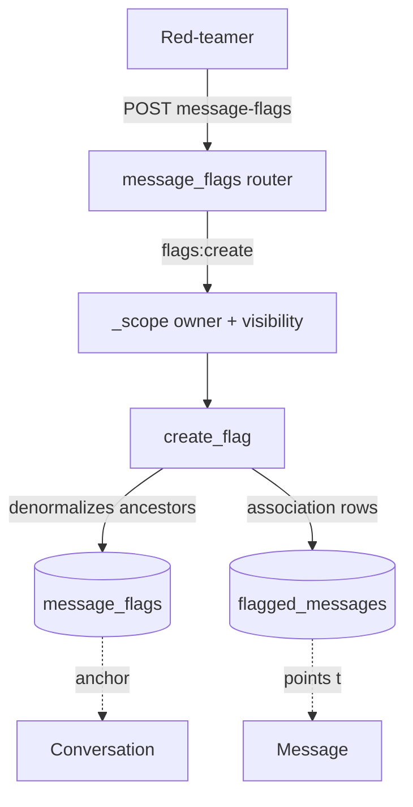

# Message flags

The first implemented piece of the `annotations` context. A red-teamer runs a conversation with a model ([Conversations](conversations.md)) and when a response looks like an exploit (jailbreak, harmful content), it **flags** a selection of messages: marks them, describes why they're worth an exploit and leaves it for review. A flag is a unit of annotation work.

Code: `app/core/annotations/` (logic) + `app/api/v1/message_flags.py` (HTTP). Model: [MessageFlag](../data-models/message-flag.md).

> [!note] The annotations context: flags, task completions, notes, labels, reviews
> `app/core/annotations/` used to be an empty package (just a docstring). Flags are its first real feature; **task completions** ([Task completions](task-completions.md), a red-teamer checking off scenario tasks per conversation) are the second, **notes** ([Notes](notes.md), an annotator's free-text remark on a message selection — called *annotations* before the rename) the third, and the **annotation-label vocabulary** ([AnnotationLabel](../data-models/annotation-label.md)) the fourth. Reviewer verdicts ([Reviews - reviewer verdicts](reviews-reviewer-verdicts.md), its own context `app/core/reviews/`) came alongside. `analytics` has since become real too (the reporting dashboards, [Analytics - aggregate metrics](analytics.md)).

## Why it exists

The output of red-teaming is not the transcript itself, but the **marked** moments where the model failed. A flag attaches to specific messages: a reason (`reason`), the assertion "this is actually an exploit" (`red_flagged`), an optional comment and a review status (`pending` → `approved`/`rejected`). Optionally it ties the flag to a `task_id` — the specific scenario task the probe concerned.

## Model and anchoring

Full description in [MessageFlag](../data-models/message-flag.md). In short: a flag anchors in one [Conversation](../data-models/conversation.md), spans >=1 [messages](../data-models/message.md) through the join table `flagged_messages`, and **denormalizes the ancestors** (`evaluation_id`, `evaluation_group_id`, `scenario_id`) from the conversation at creation time — so it can be listed/filtered with a single join.

## CRUD endpoints

Router `app/api/v1/message_flags.py`, prefix `/api/v1/message-flags`. Full CRUD, each action behind its own permission from the `flags:*` family:

| Method + path | Permission | `@transactional` | Service |
|---|---|---|---|
| `POST /message-flags` | `flags:create` | yes | `create_flag` |
| `GET /message-flags` | `flags:read` | no | `list_flags` |
| `GET /message-flags/{flag_id}` | `flags:read` | no | `get_flag` |
| `PATCH /message-flags/{flag_id}` | `flags:update` | yes | `update_flag` |
| `DELETE /message-flags/{flag_id}` | `flags:delete` | yes | `soft_delete_flag` |

The `flags:*` family (read/create/update/delete) is held by `red_teamer` and `admin`; `annotator` has only `flags:read` on flags — it reviews them through the separate `reviews:*` family ([Reviews - reviewer verdicts](reviews-reviewer-verdicts.md)). See [RBAC - global roles](rbac-global-roles.md).

## Scoping: owner + group visibility

The heart of authorization is `_scope` in `app/core/annotations/services/message_flags.py` — every read passes through it, exactly as in [Conversations](conversations.md). It delegates to the shared `join_conversation_scoped` (`app/core/evaluations/access.py`), the one read scope every child denormalizing `conversation_id` + `evaluation_id` + `created_by_id` uses — flags, [task completions](task-completions.md) and [notes](notes.md):

- **owner** — `created_by_id == caller_id`,
- **group visibility** — the shared `join_visible_evaluation_group` (group `public` or the caller has a live role) + a live anchor conversation.

One home on purpose: this is authorization, so a predicate added to one entity's reads and not the others' would be a silent hole rather than an inconsistency.

`can_manage` = `evaluation_groups:manage` in the JWT (admin break-glass, `caller_can_manage_groups`) raises owner + visibility on a read. But **authorship is always owner-only**: a manager won't create a flag on someone else's behalf — `resolve_conversation_context` resolves the conversation under the caller's ownership. Ancestor liveness (conversation/evaluation/group live) is enforced ALWAYS.

> [!warning] No RLS
> No RLS: isolation lives solely in the query predicates. Every new flag read MUST pass through `_scope`. See [Object roles - per-object permissions](object-roles-per-object-permissions.md).

## Service — key functions

`app/core/annotations/services/message_flags.py`:

| Function | What it does |
|---|---|
| `create_flag(session, draft, *, caller_id)` | Creates a flag: resolves the conversation under ownership, validates that `message_ids` belong to it via the shared `assert_messages_in_conversation` (and `task_id` to its scenario), denormalizes the ancestors, inserts the `flagged_messages` rows. |
| `list_flags(...)` | A page of flags in the caller's scope; filters narrow only within the scope. The `message_id` filter via an `IN`-subquery on `flagged_messages` (not a join — avoids duplicating flags). `search` is ILIKE over `reason`/`comment`. |
| `get_flag(session, flag_id, *, caller_id, can_manage, for_update)` | One live flag visible to the caller, with eager-loaded messages. Invisible → `NotFoundError`. |
| `update_flag(...)` | Edits content only (`reason` / `red_flagged` / `comment`). The anchor, the message set, the ancestors and `status` are immutable. |
| `soft_delete_flag(...)` | Stamps `deleted_at`; the `flagged_messages` rows remain (hidden with the flag). |
| `flag_counts_by_message(*, conversation_id, message_ids, caller_id, can_manage)` | A map `{message_id: how many of the caller's flags mark it}` for the message history page ([Conversations](conversations.md)). Counts live flags **anchored in this conversation**, in the same scope as a flag read (owner, raised by `can_manage`), so the badge agrees with `?message_id=` on the flag list. A message with no flag is absent from the map (the route defaults to 0). |

## Schemas, filters, validation

- `MessageFlagCreate` — `conversation_id`, `message_ids` (>=1, no duplicates), `reason` (>=1 char), `red_flagged` (default `True`), `comment?`, `task_id?`.
- `MessageFlagUpdate` — `reason?` / `red_flagged?` / `comment?`. The validator rejects an explicit `null` for `reason`/`red_flagged` (NOT NULL columns → 422), but allows `null` for `comment` (clears the note). The service gets `MessageFlagUpdateChanges` with `model_fields_set`, so it distinguishes "omitted" from "set to None".
- `MessageFlagResponse` — a projection of the flag with a list of `messages` (as `MessageBase`).
- `MessageFlagFilters` — `conversation_id` / `evaluation_id` / `evaluation_group_id` / `scenario_id` / `message_id` / `status` / `red_flagged` / `search` (max 255). `order_by`: `created_at`/`updated_at` (+`-`).

## Flag review (reviewer verdicts)

A flag is a "submission" — reviewers ([Review](../data-models/review.md)) assess it. Reviewers are assigned to a flag (`POST /reviews`), each records a verdict, and the review queue shows flags missing verdicts up to the `Scenario.required_reviews` threshold. A reviewer reads one flag as a submission through `GET /submissions/{id}` (flag + flagged messages + verdicts so far) and its parent transcript through `GET /submissions/{id}/messages` — both review-scoped, so a reviewer who doesn't own the conversation can still see it. Full description: [Reviews - reviewer verdicts](reviews-reviewer-verdicts.md).

Important: `MessageFlag.status` (`FlagStatus`) is **not** (yet) derived from reviews — it stays independent of verdicts. An aggregated flag verdict from reviews is future scope.

## Relation: who to assign to a flag/review

Who can be assigned a flag or a review is told by a separate endpoint in the evaluation domain — the annotator search `GET /api/v1/evaluation-groups/{group_id}/annotators`, whose pool is keyed on the `reviews:annotate` capability rather than on a role name (the same pool drives review-assignment validation, `is_assignable_annotator`). See [Evaluation domain](evaluation-domain.md).

## Diagram: a flag in context

## Related

- [MessageFlag](../data-models/message-flag.md)
- [Notes](notes.md) — the lighter sibling note, without a review workflow
- [Task completions](task-completions.md) — the annotations context's sibling feature
- [Reviews - reviewer verdicts](reviews-reviewer-verdicts.md)
- [Review](../data-models/review.md)
- [Message](../data-models/message.md)
- [Conversations](conversations.md)
- [Evaluation domain](evaluation-domain.md)
- [RBAC - global roles](rbac-global-roles.md)
- [Object roles - per-object permissions](object-roles-per-object-permissions.md)
- [Pagination, bulk and soft-delete](pagination-bulk-and-soft-delete.md)
- [API - overview and conventions](api-overview-and-conventions.md)
