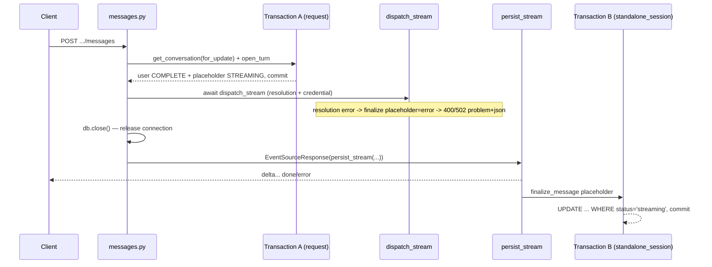

# Message persistence (write-path)

The layer that **writes** the conversation: it opens a turn, creates the user message and an assistant placeholder, streams the model's response to the client, and on completion finalizes the placeholder with content and status. This is the other half of a conversation alongside the stateless [Streaming SSE](streaming-sse.md) — this one writes and is tied to an evaluation, the other one only transports.

Unlike the stateless `POST /api/v1/chat/stream` ([Endpoint POST chat-stream](endpoint-post-chat-stream.md)), this write-path **is tied to its own endpoint**: `POST .../conversations/{conversation_id}/messages` plus `/regenerate` and `/continue`.

Code:
- endpoint `app/api/v1/messages.py` (3 routes + A/B orchestration at the HTTP layer),
- turn/message services `app/core/conversations/services/messages.py`,
- stream orchestrator `app/core/conversations/services/generation.py` (`persist_stream`),
- `resolve_dispatch_target` in `app/core/conversations/services/conversations.py`,
- the `standalone_session` helper in `app/core/database.py`.

## Endpoint: three routes

All nested under a conversation, router `tags=["conversations"]`, mounted in `app/api/v1/__init__.py`. The **`conversations:update`** gate (`_Participant`) — deliberately different from `conversations:participate` from the stateless sandbox: the write-path writes to a specific user conversation, so the gate is a *write to a resource*. The per-conversation authority (owner + group visibility + break-glass `evaluation_groups:manage`) is enforced by `get_conversation(..., for_update=True)`, not the gate itself.

| Route | What it does |
|---|---|
| `POST .../messages` | Appends a user message and streams the response. Idempotent on `client_message_id`. |
| `POST .../messages/{message_id}/regenerate` | Overwrites the assistant response and streams a fresh one for the same prompt. |
| `POST .../messages/{message_id}/continue` | Extends the response: streams a continuation appended to the existing text. |

Success is **always SSE** (`text/event-stream`), never JSON. Errors before the stream starts travel in an `application/problem+json` envelope ([Error handling (RFC 7807)](error-handling-rfc-7807.md)); errors after the start — as an `error` event in the body (HTTP is already 200). The events are identical to [Streaming SSE](streaming-sse.md) (`delta` / `done` / `error`). Declared codes: 200 (SSE), 400 (the model can't answer in text / context window / an image sent to a model that doesn't accept image input / a bad `image_keys` entry), 401, 403 (missing `conversations:update`), 404 (conversation/message invisible), 502 (upstream failure before the stream); `messages` adds 400 for a `tags` key the evaluation disallows and 409 (reuse of `client_message_id` in another conversation), `regenerate`/`continue` 409 (target not in the last turn or already overwritten).

`regenerate`/`continue` **do not take** a per-request parameter override — they use the conversation cascade. `messages` accepts an optional `params` (a layer above the cascade for this one stream), an optional `image_keys` — up to 5 storage keys of already-uploaded images to attach, in order — and optional `tags` ([Conversation tags](conversation-tags.md)), which are stored on the user message and folded into the prompt over the conversation's own map. `regenerate`/`continue` don't take tags either: `_superseding_turn` re-reads them from the turn's originating user message, so re-answering the same prompt uses the same context the transcript still shows on it.

Only what a request *authors* is validated against the evaluation's tagging policy, and only when it authors anything — a **replayed** send is a retry of a turn that was already accepted, so re-judging it against a policy tightened since would turn the stored reply into a permanent 400 the client can't tell from "never persisted".

### Image attachments (`image_keys`)

`UserMessageIn.image_keys` attaches images (uploaded first via `POST /api/v1/images`, see [Media (image upload & serving)](media-images.md)) to the user message. `_validate_attachments` runs before `open_turn`: every key must resolve to a live asset that is the **caller's own private upload** — a foreign upload reads as unknown (the same 400 as a bad key, so the check leaks nothing about other users' assets), and a public one is rejected (400, `is_private=true` required). `open_turn` then persists the link rows (`MessageImage`, one per key, `position` = attachment order — see [Message](../data-models/message.md)). The target model must declare image input (`image` in `AiModel.input_modalities`) — the dispatch gate rejects image content otherwise with a 400 ([AI Gateway - dispatch](ai-gateway-dispatch.md)).

## A/B architecture: two disjoint transactions

Streaming can be long (seconds–minutes), so holding a pool connection the whole time would kill the pool. Hence the **split into two transactions**:

- **Transaction A (the request session)** — `open_turn` / `open_replacement` under the conversation row-lock: it writes the user message (`COMPLETE`) + assistant placeholder (`STREAMING`), **commit**, and only then `db.close()`. The commit **before** releasing the connection is load-bearing: the detached Transaction B runs on a fresh connection and otherwise wouldn't see the placeholder.
- **Transaction B (detached, `standalone_session`)** — after the stream ends, `persist_stream` → `finalize_message` writes content + status to the placeholder, in a fresh session **outside the request cycle**.

Model resolution (`dispatch_stream`) is **awaited on the request session before `db.close()`** (as in the stateless endpoint); the actual provider call runs lazily only when `persist_stream` iterates.



### `_stream_into` — the shared tail of the three routes

After Transaction A commits, all three routes converge in `_stream_into`:

1. `resolve_dispatch_target(db, conversation)` → `(alias, params, mask)`,
2. for `messages`: mixes in the optional `params` from the body (`merge_inference_params`),
3. **folds the tags** — `allowed_tags_only(db, evaluation_id, {**conversation.tags, **message_tags})` then `fold_tag_context`, which returns *both* the sanitised map that will be recorded and the block that will be sent,
4. builds the history (`conversation_history`) — for `continue`, the prior reply is appended as an assistant context message here,
5. `await dispatch_stream(..., system_suffix=tag_block)` — **here** resolution/credential errors surface (already after Transaction A commits),
6. `await db.close()` → `EventSourceResponse(persist_stream(chunks, placeholder_id, mask=mask, prefix=..., tag_context=sent_tags))`.

The tag block travels as **`system_suffix`**, deliberately not merged into the dispatch params: the gateway drops the whole operator params cascade for a model with `advanced_params_disabled`, so folding it into `params["system_prompt"]` would silently drop the context while the reply still recorded it as sent. The step *filters* rather than rejects — the map carries the conversation's stored tags, which all three routes replay, so a policy tightened since then must stop them reaching the model instead of failing the turn. See [Conversation tags](conversation-tags.md) and [AI Gateway - inference parameters](ai-gateway-inference-parameters.md).

**Every failure between Transaction A and the stream start settles the placeholder** via `_settle_streaming_error` — it is finalized as `error` (instead of hanging `streaming` for the reaper), whether the failure is a `ProviderError` from `dispatch_stream` or an `APIError` from `resolve_dispatch_target` (the assignment vanished) or from the tagging-policy read (the evaluation was soft-deleted after Transaction A). For provider errors the HTTP status, the saved `extra` and any replay come from the single `provider_error_to_status` mapping — so the same error isn't 502 on the first call and 400 on replay. `extra` holds only the maskable `{status, title, retryable}`, never the raw `detail`. A vanished image blob is NOT such a failure — the history rebuild drops the missing attachment with a warning and generation proceeds without it.

## messages.py — CRUD of turns and messages

| Function | What it does |
|---|---|
| `open_turn(session, conversation, *, content, client_message_id=None, image_keys=None, tags=None)` | Opens a turn: user `COMPLETE` + assistant placeholder `STREAMING`, plus one `MessageImage` row per attachment (in order) and the request's `tags` on the user message. `turn_index = max+1` (the caller MUST hold a row lock on `Conversation`). Idempotent on `client_message_id` — a repeat in the same conversation returns the existing turn and **ignores `content`** (the authoritative key). Returns `OpenedTurn(turn, messages, replayed)`. |
| `open_replacement(session, conversation, message_id)` | A new placeholder replacing `message_id` (regenerate/continue). The target must be **a live assistant response in the LAST turn** — otherwise 409. If the target is `streaming`, first flip to `INTERRUPTED` (guarded). Returns a tuple `(superseded, placeholder)` — `continue` reads the predecessor's text without a second fetch. |
| `conversation_history(session, conversation_id)` | Builds the chat context from live turns, oldest first: user prompt + **only `complete`** assistant response (skips the `streaming` placeholder, empty content, and `interrupted`/`error`). A user message's attachments are rebuilt into multi-modal content parts (text + inline `data:`-URL images via `cached_data_url`, in attachment order — see [AI Gateway - message types](ai-gateway-message-types.md)); a vanished blob is dropped with a warning, degrading that message, not the generation. Reuses the same query as the history list (`_live_conversation_messages`). |
| `image_keys_for_messages(session, message_ids)` | Batched attachment lookup: each message's `image_key`s in `position` order, one query per page — feeds the `image_keys` field of the read projections. |
| `finalize_message(session, message_id, *, content, status, extra=None)` | Finalizes the placeholder in-place: `UPDATE ... WHERE status='streaming'`. Returns `True` if it updated (the guarded WHERE → a double finalize is a no-op). |
| `live_turn_messages(session, turn_id)` | "Live" (non-overwritten) messages of a turn, sorted by `MESSAGE_ROLE_ORDER`, `slot`, `id`. Filters out those overwritten via `replaces_message_id` — does **not** filter `deleted_at`. |
| `assert_messages_in_conversation(session, conversation_id, message_ids)` | Verifies every id is a live message of the conversation. Shared by every entity that attaches itself to a caller-supplied message selection ([Message flags](message-flags.md), [Notes](notes.md)), so a foreign or unknown id can't become attachable by naming someone else's conversation. A superseded-but-live message still qualifies — supersession is not deletion. |

The intra-turn sort key `MESSAGE_ROLE_ORDER` lives on the model module (`app/core/conversations/models.py`), not here, because the flag- and note-side selections order by it too — see [Message](../data-models/message.md).

`open_turn` has **two guarded flushes** (the turn before the messages — there's no ORM relationship that would order the FKs): a race without a row-lock bounces off either the unique `(conversation_id, turn_index)` (turn flush) or the partial-unique `client_message_id` (message flush). Both mean "you lost the race" → a clean `ConflictError` (409) instead of an opaque 500. The partial indexes are described in [Message](../data-models/message.md).

### Idempotency and replay

`client_message_id` is the idempotency key (one per send). `open_turn` calls `_replay` up front:
- the same key in **the same** conversation → returns the existing turn (`replayed=True`), the endpoint replays the saved response via `_replay_events` **without calling the model**,
- the same key in **another** conversation → `ConflictError` (409).

`_replay_events` replays the saved **terminal state** faithfully, so a retry doesn't mistake a failed (or in-progress) original for a fresh success:

| Saved response state | What it replays |
|---|---|
| `complete` | `delta` with content + `done` with `finish_reason="replayed"` (no `usage`) |
| `error` | `error` (rebuilt from the maskable `extra`, never the raw `detail`) |
| `interrupted` | `done` with `finish_reason="interrupted"` |
| `streaming` (parallel double-submit, before finalize lands) | `done` with `finish_reason="streaming"`, no content — not an empty "success" |

## generation.py — the stream orchestrator

`persist_stream(chunks, placeholder_id, *, mask, prefix="", session_provider=standalone_session)` is a forwarder: it passes SSE events through to the client while buffering the content and final state (`finish_reason`, `usage`, or a structural error in `extra`). After the stream is exhausted (or interrupted) it finalizes the placeholder.

```python
async def persist_stream(
    chunks: AsyncIterator[ChatChunk],
    placeholder_id: UUID,
    *,
    mask: bool,
    prefix: str = "",
    session_provider: SessionProvider = standalone_session,
) -> AsyncGenerator[dict[str, str]]:
```

- `prefix` (used by `continue`) seeds the buffer with the existing text, but **is not re-yielded** — the client gets only the new deltas, while the saved content is `prefix` + the continuation.
- `tag_context` is the map this dispatch actually carried; it is stamped onto whatever terminal state the stream reaches, under `extra["tag_context"]`. On a `continue` it covers only the appended continuation, so `extra["tag_context_partial"]` is set alongside it — the superseded message keeps its own record. See [Conversation tags](conversation-tags.md).
- The finalize **seals** the buffered text when the conversation is `content_protected`, pairing the stored value with the row's `content_encrypted` discriminator — see [Conversation content sealing](conversation-content-sealing.md). An empty placeholder stays unsealed.
- `mask=True` swaps the provider error's raw `detail` for `MASKED_ERROR_DETAIL` before the forward; the saved `extra` never holds the raw text anyway.
- `_finalize(...)` runs in `finally` under `asyncio.shield` — best-effort, **never raises** (so it doesn't mask exceptions from `persist_stream`). `SQLAlchemyError` is logged as a warning, the rest with a full stacktrace. If finalize fails, the placeholder stays `streaming` — the reaper (below) cleans it up.

> [!note] The reaper cleans up orphaned placeholders
> A hard process crash (SIGKILL/OOM/power loss) kills the worker **before** the detached finalize (Transaction B) gets to run — the placeholder hangs `streaming` forever. The periodic task `reap_orphaned_streaming_messages` (Celery beat) scans the partial `ix_messages_streaming` (`WHERE status='streaming'`) and flips placeholders older than `STREAMING_REAP_TTL_SECONDS` (default 900 s) to `interrupted`, with an `interrupted_by: reaper` marker mixed into `extra` (JSONB `||`). It doesn't recover content — the buffer died with the process; only the status flip happens. Handled interruptions (provider error, client disconnect, timeout) finalize themselves to `error`/`interrupted` — the reaper catches only the *unhandled* crash. Idempotent (guarded `WHERE status='streaming'`), no retry — the next beat tick is the recovery path. Details: [Celery workers](celery-workers.md).

## resolve_dispatch_target — model, parameters, mask

`resolve_dispatch_target(session, conversation) -> (model_alias, params, mask)` (`services/conversations.py`) with a single join `AiModel ⋈ EvaluationAiModel ⋈ Evaluation` on `conversation.evaluation_ai_model_id`:
- `params` = the cascade `merge_inference_params(model, assignment, conversation)` ([AI Gateway - inference parameters](ai-gateway-inference-parameters.md)),
- `mask` = `evaluation.mask_models_enabled` — when set, the streamed `error.detail` (which may name the real model) is masked,
- no row (a live conversation should always resolve its assignment — the soft-delete cascade guards against orphans) → a defensive `NotFoundError` instead of a raw 500.

## standalone_session — a session outside the request

A context manager from `app/core/database.py` opening **a fresh session outside the task cycle** for Transaction B: commit on a clean exit, rollback on error. Raises `RuntimeError` if the engine didn't come up (lifespan didn't fire).

```python
@asynccontextmanager
async def standalone_session() -> AsyncIterator[AsyncSession]:
    if _session_factory is None:
        raise RuntimeError(...)
    async with _session_factory() as session:
        try:
            yield session
            await session.commit()
        except Exception:
            await session.rollback()
            raise
```

It differs from `get_db` in purpose: `get_db` is one session per request (closed by the framework), `standalone_session` is for work **after** the request session is released. See [Database and sessions](database-and-sessions.md).

## Regenerate and continue — linear history

History is **linear**: regenerate/continue work only on the last turn (`open_replacement` enforces it with a 409). The shared setup `_superseding_turn` locks the conversation, calls `open_replacement` and commits Transaction A; the history is built later, inside `_stream_into`'s guard (already without the overwritten response).
- **regenerate** — streams a fresh response for the same prompt; the overwritten response remains as an append-only artifact.
- **continue** — `_stream_into` appends the previous text as context (`ChatMessage(role="assistant", ...)`) and streams with `prefix=superseded.content`, so the saved content = the previous text + the continuation, and the client sees only the new deltas.

## What's (still) not here

- **Multi-model / slots** — a conversation binds one model, so `slot` stays `null` and a turn has one assistant response.

## Related

- [Turn](../data-models/turn.md)
- [Message](../data-models/message.md)
- [Media (image upload & serving)](media-images.md)
- [Conversations](conversations.md)
- [Conversation tags](conversation-tags.md)
- [Streaming SSE](streaming-sse.md)
- [Flow - AI message streaming (end-to-end)](../flows/flow-ai-message-streaming-end-to-end.md)
- [Celery workers](celery-workers.md)
- [Database and sessions](database-and-sessions.md)
- [Endpoint POST chat-stream](endpoint-post-chat-stream.md)
- [AI Gateway - dispatch](ai-gateway-dispatch.md)
- [AI Gateway - inference parameters](ai-gateway-inference-parameters.md)
- [AI Gateway - message types](ai-gateway-message-types.md)
- [Error handling (RFC 7807)](error-handling-rfc-7807.md)
- [API - overview and conventions](api-overview-and-conventions.md)
