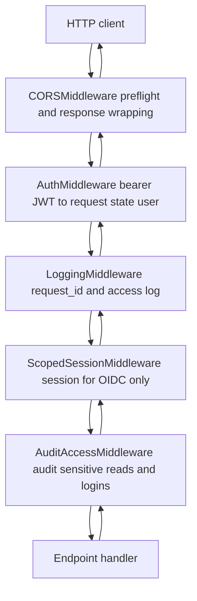

# Middleware, logging and request cycle

Every request passes through several layers before it reaches the handler. These layers (middleware) add shared concerns: parsing the OIDC session, assigning the request an ID and logging it, decoding the user's token, CORS. Logging is done by `structlog`, set up so that both application logs and stdlib logs go through the same channel (JSON in production, colored text locally).

What it's for: you want one log per request (with status and duration), to be able to correlate all logs of a single request by `request_id`, and to have the user already decoded before you enter the endpoint.

## The middleware stack and its ordering

Pitfall number one: FastAPI/`add_middleware` adds layers from the inside out. So the execution order on a request is the REVERSE of the order in the code. Whatever you add last wraps everything else.

Wiring in `app/main.py`:

| `add_middleware` order in code | Layer | Position on request |
|---|---|---|
| 1 | `AuditAccessMiddleware` | innermost |
| 2 | `ScopedSessionMiddleware` | inner |
| 3 | `LoggingMiddleware` | middle |
| 4 | `AuthMiddleware` | closer to the outside |
| 5 | `CORSMiddleware` (only if `cors_origins` is set) | outermost |

CORS is added last on purpose, so it sits at the very outside: it responds to the preflight before anything touches auth and wraps every response. Origins are always explicit, because credentials are enabled (`"*"` is not allowed). `AuditAccessMiddleware` is added first, so it is innermost — it wraps the router directly (sees the matched route + path params) and runs inside `AuthMiddleware` (needs `request.state.user`) and `LoggingMiddleware` (needs `request_id`).

## Request-traversal diagram



The request enters from the top through all the layers, reaches the handler, and the response travels back the same path in the reverse direction.

## ScopedSessionMiddleware

Pure ASGI. A wrapper over Starlette's `SessionMiddleware`, but it activates ONLY on the configured path prefixes (in `main.py` that's `("/api/v1/auth/oidc",)`).

Path matching: equality or extension by `/...`. So `/api/v1/auth/oidc/google` matches, while `/api/v1/auth/oidcx` does not. Reason: the session cookie is parsed only for the OIDC roundtrip (state and nonce for authlib). The rest of the requests (`/health`, plain `/api/v1/...`) never touch the session machinery.

The session secret is required in the config, because in a multi-process deployment the workers must share it (otherwise a redirect landing on a different worker would fail the state validation).

## AuditAccessMiddleware

Pure ASGI, and the **innermost** middleware (added first). It captures the read/access side of the audit trail — a read touches no row, so no in-service hook can see it. Details: [Audit log](audit-log.md).

- Runs the audit write **after** the response is sent (off the caller's latency path), in its own detached `standalone_session()`, **best-effort** — any failure is swallowed and logged (`audit.access_write_failed`), so auditing can never change the outcome of a login or download. It only wraps `send` to capture the status code; it never buffers the body, so it sits cleanly in front of the streaming export download.
- Fires only for an allowlist keyed by `(method, route name)` — a narrow set of sensitive reads / data egress (export download, conversation/submission transcript reads) on 2xx, plus the login route (`auth.login` on 2xx, `auth.login_failed` on 401). Routine browsing is deliberately not audited.
- The actor comes from `request.state.user` (set by the outer `AuthMiddleware`); the `request_id` is read ambiently from the contextvars bound by `LoggingMiddleware` — which is exactly why this layer sits inside both.

## LoggingMiddleware

Pure ASGI (not `BaseHTTPMiddleware`). This is where all the correlation and the access log happen.

What it does, step by step:
- requests other than `http` (websocket, lifespan) it passes through unchanged,
- generates a fresh `request_id = uuid.uuid4().hex` on each request,
- binds to `structlog.contextvars`: `request_id`, `method`, `path` — so that EVERY log during this request carries these fields,
- sets the same `request_id` as a tag on the **Sentry isolation scope** — the isolation scope survives the contextvars unwind, so an unhandled 500 captured by the outermost layer still carries it; harmless when Sentry is off (see [Observability](observability.md)),
- intercepts `http.response.start`, records the `status_code` and appends an `X-Request-ID` header to a fresh copy of the message headers,
- in `finally` writes one access log: the event `"http_request"` with `status_code` and `duration_ms` (rounded to 2 decimals, measured by `time.perf_counter`).

The default `status_code` is `500`. If the inner application raises an exception before sending a response, the access log will still fire — with 500.

Security decision: the incoming `X-Request-ID` is deliberately ignored. It is attacker-controlled as long as there is no trusted edge proxy in front of the application. We always generate our own.

Snippet (`app/core/middleware/logging.py`):

```python
async def __call__(self, scope, receive, send):
    if scope["type"] != "http":
        await self.app(scope, receive, send)
        return
    request_id = uuid.uuid4().hex
    status_code = _UNHANDLED_EXCEPTION_STATUS

    async def send_with_request_id(message):
        nonlocal status_code
        if message["type"] == "http.response.start":
            status_code = message["status"]
            headers = list(message.get("headers", []))
            headers.append((REQUEST_ID_HEADER, request_id.encode()))
            message = {**message, "headers": headers}
        await send(message)

    start = time.perf_counter()
    with structlog.contextvars.bound_contextvars(request_id=request_id, method=scope["method"], path=scope["path"]):
        try:
            await self.app(scope, receive, send_with_request_id)
        finally:
            access_logger.info(
                "http_request",
                status_code=status_code,
                duration_ms=round((time.perf_counter() - start) * 1000, 2),
            )
```

(Illustrative fragment — the exact shape is in the file; the key points are: a fresh uuid, bound contextvars, the `X-Request-ID` header appended to a copied header list, one `http_request` log in `finally`. The logger is `access_logger = get_logger(__name__)`.)

## AuthMiddleware

`BaseHTTPMiddleware`. Its job: if there is a valid bearer JWT, decode it and put the user into `request.state.user`. If there is no token, it's bad, or it's expired — `request.state.user = None`.

The middleware does NOT block the request. An anonymous user passes on; it's the per-route dependency that decides whether to require a logged-in user. It always forwards.

```python
request.state.user = None
header = request.headers.get("authorization", "")
scheme, _, token = header.partition(" ")
if scheme.lower() == "bearer" and token:
    settings = get_settings()
    try:
        user = decode_session_jwt(
            token,
            secret=settings.session_jwt_secret.get_secret_value(),
            algorithm=settings.session_jwt_algorithm,
        )
    except InvalidSessionTokenError:
        user = None
    # A force-logout revokes every session minted before its marker.
    if user is not None and await is_revoked(user.id, user.issued_at):
        user = None
    request.state.user = user
```

`decode_session_jwt` returns a `SessionUser`. The one non-token lookup is `is_revoked` — a **Redis** read of the per-user force-logout marker, which drops an otherwise-valid identity to anonymous. It fails **open** (a Redis error reads as "not revoked") so an outage can't 401 all traffic, and it uses the pooled client built in the app lifespan. Still no database access on this path. Details of login, JWT and the session are in [Authentication (auth)](authentication.md) and [Flow - request authentication and authorization](../flows/flow-request-authentication-and-authorization.md).

## structlog + stdlib — one pipeline

Goal: both application logs (structlog) and library logs (stdlib `logging`) come out through the same channel, in the same format. This is configured by `configure_logging(settings)` in `app/core/logging.py`, called as the first thing in the lifespan (before `init_engine`, so as to catch a DB engine build error too).

Driven from [Configuration (Settings)](configuration-settings.md):

| Env | `Settings` field | Default | Behavior |
|---|---|---|---|
| `LOG_LEVEL` | `log_level` | `INFO` | logging threshold |
| `LOG_FORMAT` | `log_format` | `json` | `json` = `JSONRenderer` (prod), `console` = colored text (locally) |
| `SERVICE_NAME` | `service_name` | `ai-red-teaming-api` | `service` field on JSON lines; compose sets `ai-red-teaming-worker` on worker/beat |

Shared processors (`_SHARED_PROCESSORS`): `merge_contextvars` (pulls in `request_id`/`method`/`path` from `LoggingMiddleware`), `add_logger_name`, `add_log_level`, `TimeStamper(fmt="iso", utc=True)`, `StackInfoRenderer`.

The renderer is chosen by `log_format`:
- `"json"` → `[_add_service, EventRenamer("message"), format_exc_info, JSONRenderer()]` — stamps `service`, renames structlog's `event` key to `message` (the log-shipping convention, see [Observability](observability.md)), and formats `exc_info` first because `JSONRenderer` won't serialize a raw tuple,
- otherwise → `[ConsoleRenderer(colors=...)]` (formats exceptions itself, in color when stdout is a TTY; keeps structlog's native `event` key).

One `StreamHandler(sys.stdout)` on the root logger; every record (structlog and stdlib) goes through the same chain via `ProcessorFormatter`. The function is idempotent (it swaps the handler in-place), so it's safe in tests.

Silencing uvicorn: `uvicorn`/`uvicorn.error` have their handlers cleared and `propagate=True`; `uvicorn.access` is DISABLED (`handlers=[]`, `propagate=False`, `disabled=True`). Reason: the access log is done by our `LoggingMiddleware` — without this every request would be logged twice.

Celery workers and beat run the same pipeline: `app/workers/celery_app.py` connects the `setup_logging` signal to `configure_logging`, which also stops Celery from installing its own root handler (the CLI `--loglevel` flag is ignored — `LOG_LEVEL` wins).

Convention in modules: `get_logger(__name__)`. It's a thin wrapper over `structlog.stdlib.get_logger`, so that modules depend only on `app.core.logging`.

## Related

- [Observability](observability.md)
- [Flow - HTTP request lifecycle](../flows/flow-http-request-lifecycle.md)
- [Audit log](audit-log.md)
- [Error handling (RFC 7807)](error-handling-rfc-7807.md)
- [Database and sessions](database-and-sessions.md)
- [Authentication (auth)](authentication.md)
- [Flow - request authentication and authorization](../flows/flow-request-authentication-and-authorization.md)
- [Configuration (Settings)](configuration-settings.md)
