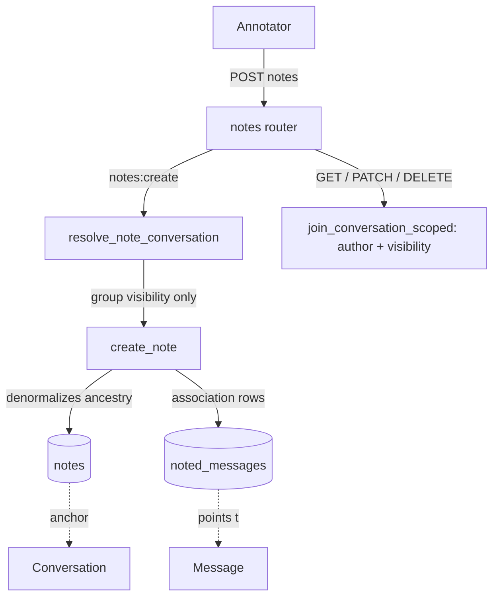

# Notes

One of the entities in `app/core/annotations/`, beside [Message flags](message-flags.md). A **note** is an annotator's free-text remark on a selection of one conversation's [messages](../data-models/message.md) — "the model refuses on the first ask, then complies once the request is reframed as fiction". It is a *lighter, independent* remark: no review workflow, no exploit assertion, and — the load-bearing difference — **its author need not own the conversation**.

Code: `app/core/annotations/services/notes.py` (logic) + `app/api/v1/notes.py` (HTTP). Model: [Note](../data-models/note.md).

> **Renamed.** The entity was called `Annotation` (table `annotations`, permissions `annotations:*`) until the rename freed that name for the per-message *label* entity. The **package** keeps the `annotations` name — it is the domain root for flags, notes, completions and the [label vocabulary](../data-models/annotation-label.md). A note is prose about a selection of messages; an annotation is a label you aggregate over.

## Why it exists beside flags

A flag is a *claim* a red-teamer makes about their own transcript, and it enters a review workflow ([Reviews - reviewer verdicts](reviews-reviewer-verdicts.md)). A note is an *observation* anyone with sight of the group can record on anyone's transcript. Riding the `flags:*` permissions would have been wrong twice over: authoring reaches conversations the caller does not own (so the two entities do not share authority), and the permissions matrix would have credited an annotator with editing *flags*. Hence its own `notes:*` split.

## CRUD endpoints

Router `app/api/v1/notes.py`, prefix `/api/v1/notes` — a flat resource, like message flags.

| Method + path | Permission | `@transactional` | Service |
|---|---|---|---|
| `POST /notes` | `notes:create` | yes | `create_note` |
| `GET /notes` (+ `?deleted=true`) | `notes:read` | no | `list_notes` |
| `GET /notes/{note_id}` | `notes:read` | no | `get_note` |
| `PATCH /notes/{note_id}` | `notes:update` | yes | `update_note` |
| `DELETE /notes/{note_id}` | `notes:delete` | yes | `soft_delete_note` |
| `POST /notes/{note_id}/restore` | `notes:delete` | yes | `restore_note` |

The full `notes:*` set is held by `admin`, `red_teamer` and `annotator` — for the annotator it is the prose surface. See [RBAC - global roles](rbac-global-roles.md).

## Scoping: author on read, visibility on create

`_scope` in the service delegates to the shared `join_conversation_scoped` (`app/core/evaluations/access.py`) — the same read scope [Message flags](message-flags.md) and [Task completions](task-completions.md) use:

- **group visibility** — `join_visible_evaluation_group` (group `public` or the caller holds a live in-group role),
- **live parent conversation**,
- **author** — `created_by_id == caller_id`.

`can_manage` (`evaluation_groups:manage` in the JWT) lifts the visibility *and* author predicates, so a manager reads, edits and soft-deletes any author's note. Ancestor **liveness** is enforced regardless.

Authoring is the asymmetric part. `resolve_note_conversation` walks `conversation → evaluation → group`, all live, under the group's **visibility only** — there is no `Conversation.user_id == caller_id` predicate, unlike the flag path's `resolve_conversation_context`. It also takes no `can_manage`: the break-glass lifts the read predicates but **not** this one, so a manager who cannot see the group cannot author a note in it either.

> [!note] Why the two entities differ here
> A flag is attributed to its author *and* owner-scoped on read, so a manager-authored flag would be invisible to the conversation owner — hence flags stay owner-only to create. A note is meant to cross that line: an annotator's whole job is commenting on someone else's transcript.

## Service — key functions

`app/core/annotations/services/notes.py`:

| Function | What it does |
|---|---|
| `resolve_note_conversation(session, conversation_id, *, caller_id)` | Resolves the conversation + its group id under group visibility alone. Unreachable → `NotFoundError` (addressing it must not confirm it exists). |
| `create_note(session, draft, *, caller_id)` | Resolves the conversation, validates the selection via the shared `assert_messages_in_conversation`, denormalizes the ancestry, inserts the `noted_messages` rows, then refreshes `created_at`/`updated_at`/`messages` by name (a bare refresh would expire the eager load and lazy-load under asyncio). |
| `get_note(..., for_update=False)` | One live readable note with its message set. Mutation paths pass `for_update=True`, which also sets `populate_existing` so a cached instance is overwritten with the locked state (otherwise a guard or an audit `before` snapshot would read pre-lock values). |
| `list_notes(...)` | One page in the caller's scope; the scope is applied **before** the user filters, so a filter can never widen it. |
| `update_note(session, note, changes)` | Content-only (`text`), driven by `changes.model_fields_set`. |
| `soft_delete_note(..., by_id)` | Stamps `deleted_at` + `deleted_by_id`; the link rows stay, hidden with the note. |
| `get_restorable_note` / `restore_note` | The [restore](restore-soft-deleted-items.md) pair — tombstones inside `RESTORE_WINDOW_DAYS`, scoped to `deleted_by_id` unless the break-glass lifts it. |

A **superseded** message (one a regenerate/continue pointed past via `replaces_message_id`) stays live and remains notable — the note is about the output that was produced, which supersession does not undo.

## Schemas, filters, validation

- `NoteCreate` — `conversation_id`, `message_ids` (>=1, at most 500, no duplicates), `text` (1–10 000 chars). The ancestry is **not** in the payload.
- `NoteUpdate` — `text?` only, and `extra="forbid"`: the message set is advertised as fixed, so sending `message_ids` must fail loudly rather than be silently dropped (this is where it differs from `MessageFlagUpdate`, which tolerates extras). An explicit `null` on `text` is rejected — it backs a NOT NULL column.
- `NoteResponse` — the note plus `message_ids` (**ids only**, oldest first — a client renders notes against a transcript it already fetched), the author, and both denormalized ancestors.
- `NoteFilters` — `conversation_id` / `evaluation_id` / `evaluation_group_id` / `message_id` / `created_by_id` / `created_from` / `created_to` / `search` (max 255, ILIKE on `text`). `order_by`: `created_at` / `updated_at` (+ `-`). The `message_id` filter is an `IN`-subquery against `noted_messages`, not a join, so widening it to several ids can't start duplicating rows.

Under the author scope `created_by_id` only ever matches the caller — naming anyone else yields an **empty page**, not a 404.

## Audit

Every write records a row ([Audit log](audit-log.md)): `note.create` / `note.update` / `note.delete` / `note.restore`. The `before`/`after` snapshot is the editable content (`text`); the `context` always carries `conversation_id` / `evaluation_id` / `evaluation_group_id`, because authoring is *not* ownership-scoped — which transcript was noted is exactly the fact the trail exists to answer, and the `notes` row can't be relied on to supply it later (a soft-deleted ancestor makes it unreachable, a hard-deleted one cascades it away).

## Diagram: a note in context

## Related

- [Note](../data-models/note.md)
- [AnnotationLabel](../data-models/annotation-label.md) — the label vocabulary that took the `annotation` name
- [Message flags](message-flags.md) — the sibling with a review workflow
- [Task completions](task-completions.md) — the third user of `join_conversation_scoped`
- [Reviews - reviewer verdicts](reviews-reviewer-verdicts.md)
- [Message](../data-models/message.md)
- [Conversations](conversations.md)
- [Restore - reading tombstones back](restore-soft-deleted-items.md)
- [RBAC - global roles](rbac-global-roles.md)
- [Object roles - per-object permissions](object-roles-per-object-permissions.md)
- [Audit log](audit-log.md)
- [API - overview and conventions](api-overview-and-conventions.md)
