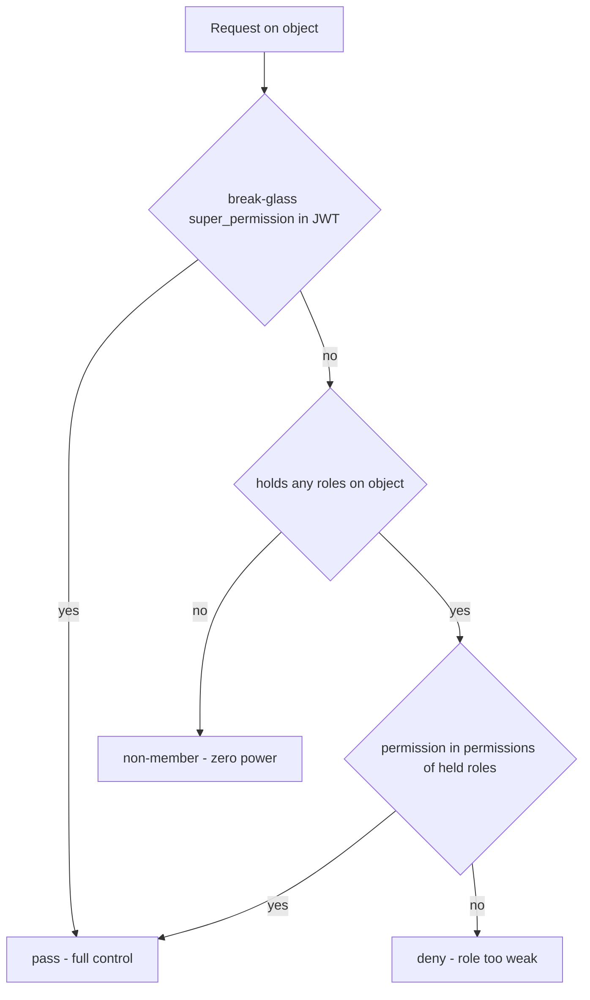

# Object roles - per-object permissions

This is the second authorization scope in the system. The first ([RBAC - global roles](rbac-global-roles.md)) says "what you may do on the platform" and sits in the JWT. This one says "what you may do on **this specific** object" and sits in the database. Analogous to `django-guardian`: instead of one global set of permissions you have separate permissions per single object.

Today the only object that carries such roles is the evaluation group ([EvaluationGroup](../data-models/evaluation-group.md)). The code lives in `app/core/auth/object_roles/`.

## Why this exists (intuition)

The owner of group A cannot rule group B, even though both are "evaluation_group". A global role cannot express this — a global `owner` would grant power over all groups. That is why power over an object is recorded as a row: "user X holds role Y on object Z". These rows are [ObjectRoleAssignment](../data-models/object-role-assignment.md).

## The most surprising rule

When you hold **any** role on an object, the permissions of those roles are your **ENTIRE** effective set on that object. They never combine with the global permissions from the JWT.

Consequences:
- A non-member has no object power — even if their JWT has a matching global permission.
- An explicit object role can only **narrow** power, never widen it. A member with a small role loses to a global permission.
- There is no "creator/owner" fallback. The creator rules the group because the domain grants them the `owner` role at creation time (`created_by_id` is only attribution, not power).
- The only thing that overrides this override is the **break-glass** `super_permission` in the JWT.

## The resolver's three-step rule



1. **break-glass** — `has_super` (the JWT carries `super_permission`) always wins, bypasses the override.
2. **held object role authoritative** — permissions = exclusively the permissions of held roles; an explicit role only narrows.
3. **non-member nothing** — no roles means an empty permission set; the global JWT grants nothing.

The rule does not live in a separate `resolver.py` (no such file exists). It is realized jointly by: `resolve_object_access` (read), `ObjectAccessContext.has` and the write-side `assert_group_write_access`.

## Registry — policy per object type

`app/core/auth/object_roles/registry.py` holds three things.

- **`ObjectType`** (StrEnum) — the kinds of objects carrying roles. Value = the stable slug stored in the `object_type` column. Today one entry: `EVALUATION_GROUP = "evaluation_group"`.
- **`ObjectScopeSpec`** (frozen dataclass) — authorization policy per type:
  - `assignable_system_roles` — which **system** roles the caller may grant on this type. `admin` is deliberately excluded. Note the word: this is a *subset* of the assignable set, not the whole of it — see below.
  - `required_permission` — a permission every role assignable here must grant, enforced by `resolve_assignable_roles`. `None` imposes no requirement.
  - `super_permission` — the global break-glass permission bypassing the override. `None` disables the loophole.
  - `protected_role` — a role that must always keep at least one live holder on the object; its last holder can be neither removed nor demoted, so the object can't be orphaned. `None` imposes no such invariant. For `evaluation_group` it's `owner` (see below).
- **`OBJECT_ROLE_REGISTRY`** — the `ObjectType -> ObjectScopeSpec` dictionary. The only entry:

`app/core/auth/object_roles/registry.py`

```python
ObjectType.EVALUATION_GROUP: ObjectScopeSpec(
    assignable_system_roles=frozenset(
        {SystemRole.OWNER, SystemRole.RED_TEAMER, SystemRole.ANNOTATOR, SystemRole.VIEWER}
    ),
    super_permission=Permission.EVALUATION_GROUPS_MANAGE,
    protected_role=SystemRole.OWNER,
    required_permission=Permission.EVALUATION_GROUPS_READ,
),
```

`required_permission` **enforces what used to be a prose invariant**: the visibility filter treats every live assignment as read access, so a role assignable here that didn't grant `evaluation_groups:read` would leave a member inside a group whose reported object permissions omit read. That was tolerable while the assignable set was a code constant; it isn't now that operators can opt custom roles in.

What a role *grants* in-object is its `Role.permissions` from the global catalog (one shared permission dictionary), not a declaration in the registry. Hence an in-group `owner` nominally also carries platform permissions like `users:invite`, which mean nothing on the group — an accepted price of simplicity.

### Assignability is a row flag, seeded from the registry

What assignment actually validates is `Role.is_object_assignable` on the row — **not** the registry set:

- For **system** roles the flag is code-owned: `OBJECT_ASSIGNABLE_SYSTEM_ROLES` unions every spec's `assignable_system_roles` and `sync_system_roles` projects it onto the column on every deploy (so the platform-only `admin` stays out).
- For **custom** roles it is an operator opt-in via `PATCH /api/v1/roles/{id}`.

A row-level flag can't express "assignable on type A but not type B", so the projection is lossless only while every spec declares the same system roles. A unit test (`tests/unit/test_rbac_catalog.py`) pins that equivalence and fails the moment a second type diverges — at which point assignment needs the per-type check back alongside the flag.

`resolve_assignable_roles` therefore rejects a role id that is unknown, soft-deleted, **inactive**, not object-assignable, or missing the type's `required_permission`.

## Last-owner invariant (`protected_role`)

A type may declare a `protected_role` that must never lose its last live holder. For `evaluation_group` it's `owner`: the group must always have someone who can manage it, so the layer refuses to leave it ownerless. Two enforcement points in `service.py`:

- **Member management** — `set_member_roles` (demote) and `remove_member` call `_assert_protected_role_survives`: if the dropped set carries the protected role and no *other* live user holds it on the object, raise **409** `ConflictError`. Hand the role off first. The group-invitation route surfaces the same 409 when a re-invite would drop an existing `owner`.
- **User deletion** — `objects_solely_held_by(user_id)` lists objects where the user is the protected role's only live holder; the user-delete route blocks the deletion (**409**) so a removed account can't orphan a group. See [User management](user-management.md).

Both lock the protected-role assignments `FOR UPDATE` first, so two concurrent demotions/removals serialize instead of both reading "another holder still exists" and together orphaning the object. A **ghost holder** (a live assignment backed by a soft-deleted user) never counts as surviving authority. The guard is **absolute**: because the member-management gate is object-scope, even a break-glass `evaluation_groups:manage` admin must reassign rather than orphan the group.

## resolve_object_access — entry to the gate

The function builds an `ObjectAccessContext`, which is the entry to the authorization gate. The gate then calls `context.access.has(permission)`.

`app/core/auth/object_roles/service.py`

```python
async def resolve_object_access(
    session: AsyncSession,
    caller: SessionUser,
    object_type: ObjectType,
    object_id: UUID,
) -> ObjectAccessContext:
    spec = OBJECT_ROLE_REGISTRY[object_type]
    roles = await held_roles(session, object_type, object_id, caller.id)
    # Inactive roles grant nothing, but still count as membership (visibility).
    permissions = frozenset(perm for role in roles if role.is_active for perm in role.permissions)
    has_super = spec.super_permission is not None and spec.super_permission.value in caller.permissions
    return ObjectAccessContext(
        object_type=object_type,
        object_id=object_id,
        permissions=permissions,
        is_member=bool(roles),
        has_super=has_super,
    )
```

`ObjectAccessContext` (frozen dataclass):

| Field | Meaning |
|---|---|
| `permissions` | the effective set of object permissions - permissions of the held **active** roles when a member, empty otherwise |
| `is_member` | whether they hold at least one role - a visibility signal, independent of whether the roles grant anything (an *inactive* role still makes you a member) |
| `has_super` | break-glass short-circuit |
| `has(permission)` | returns `self.has_super or permission.value in self.permissions` |

`effective_object_permissions` reports a break-glass caller the object type's full vocabulary — every permission any assignable **system** role grants, plus the break-glass key. Permissions unique to an operator-opted-in *custom* role are deliberately left out, so an operator can't inflate what a break-glass caller reports; their gates pass regardless, since `has_super` short-circuits `has`.

### Two companions for routes with no object in the path

`resolve_object_access` needs an `object_id`. Two flat surfaces don't have one:

```python
async def holds_permission_anywhere(session, user_id, object_type, permission) -> bool:
    """True when any live, active role the user holds on an object of that type grants it."""
```

The coarse companion — it answers "does this caller hold the capability *somewhere*", leaving which rows they may actually see to the service's own scope. That is what backs `conversations:read_any` on the flat conversation list. It is scoped to one `object_type`, because a capability held on one kind of object says nothing about another.

`assert_object_permission(session, caller, object_type, object_id, permission)` is the object arm of a gate that accepts the global permission *or* object authority (the caller checks the global arm first). It reads the membership-derived set **directly** rather than through `ObjectAccessContext.has`, which short-circuits on `has_super`: a break-glass key is itself delegable, so honouring it there would let it stand in for a capability the caller was never granted.

Both, like everything else here, treat an **inactive** role as granting nothing.

## How it fires in evaluation groups

For writes, the domain has its own gate `assert_group_write_access` in `app/core/evaluations/services/evaluation_groups.py`. The same three-step rule, plus a split of error codes.

`app/core/evaluations/services/evaluation_groups.py`

```python
    if can_manage:
        return
    roles = await held_roles(session, ObjectType.EVALUATION_GROUP, group_id, caller_id)
    if roles:
        granted = {perm for role in roles if role.is_active for perm in role.permissions}
        if permission.value in granted:
            return
    if access_level == EvaluationGroupAccessLevel.PUBLIC or roles:
        raise ForbiddenError(f"Caller lacks the '{permission}' permission for this group.")
    raise NotFoundError(missing_message)
```

The 404/403 split: break-glass already returned; visible-but-insufficient is 403; invisible (a private group without a relation) is 404 — we do not leak existence.

Touch points:
- **Creating a group** calls `grant_roles(..., [owner_role])` after flush — the creator gets in-group `owner`.
- **Child routers** (scenarios/tasks/conversations) and operations on the group go through `resolve_object_access` and the gates from `app/core/evaluations/dependencies.py` (`require_group_read`, `require_group_permission`, `ManageMembersDep`).
- Of the roles assignable in a group, only `owner` passes the write-gate for evaluations/scenarios/tasks — the rest have read only. The full picture is in [Evaluation domain](evaluation-domain.md).

How this composes into the full request path (first the JWT from the middleware, then this per-object scope) is described in [Flow - request authentication and authorization](../flows/flow-request-authentication-and-authorization.md).

## Model: polymorphic ObjectRoleAssignment

A row points at its target with the pair `object_type` (enum) + `object_id` (UUID) — **without an FK** to the target table. Integrity is the application's responsibility: on soft-delete of the object the domain calls `soft_delete_object_assignments`, because there is no DB cascade. Column, index and liveness-asymmetry details: [ObjectRoleAssignment](../data-models/object-role-assignment.md).

## Traps

- **No FK on `object_id`** — the cascade is done manually by `soft_delete_object_assignments`.
- **Last-owner guard** in `set_member_roles`/`remove_member` — the type's `protected_role` (here `owner`) can't lose its sole live holder: the call is rejected with **409** `ConflictError`, so a group can't be demoted to ownerless. The user-delete path enforces the same via `objects_solely_held_by`. Absolute even for a break-glass admin (the gate is object-scope) — see the dedicated section above.
- **Liveness asymmetry** — visibility (`group_visible_to`) looks only at a live assignment; authorization (`held_roles`) requires a live role AND a live assignment, and the permission union additionally filters on `Role.is_active`. Deliberate: it degrades safely toward less power — a deactivated role keeps you a member (you still see the group) while granting nothing.
- **Hidden roles are retained on a role-set replace** — `set_member_roles` replaces the set wholesale, but roles the API projection hides (inactive or tombstoned) are **kept**, not dropped: the caller never saw them to re-send, and soft-deleting the assignment would be unrecoverable even after the role is reactivated. The returned member carries them alongside the target set (so a caller diffing against `held_roles` doesn't read the retention as a revocation), while `RoleSummary.from_roles` filters them out of the response again.
- **Role-lifecycle counters live here** — `count_members_holding` (any holder; guards un-flagging `is_object_assignable`) and `count_members_solely_holding` (the object arm of the sole-role guard on deactivate/delete). Object and global memberships are separate scopes, so a member's global role never rescues an object membership. See [RBAC - global roles](rbac-global-roles.md).
- **One permission dictionary** — platform = object; simplicity at the cost of semantically "dead" permissions in-object.
- **No RLS** — there is no Postgres RLS or `tenant_id`. Isolation lives solely in the query predicates (`access.py`).

## Related

- [ObjectRoleAssignment](../data-models/object-role-assignment.md)
- [RBAC - global roles](rbac-global-roles.md)
- [Evaluation domain](evaluation-domain.md)
- [Flow - request authentication and authorization](../flows/flow-request-authentication-and-authorization.md)
- [EvaluationGroup](../data-models/evaluation-group.md)
- [User and Role](../data-models/user-and-role.md)
- [Authentication (auth)](authentication.md)
