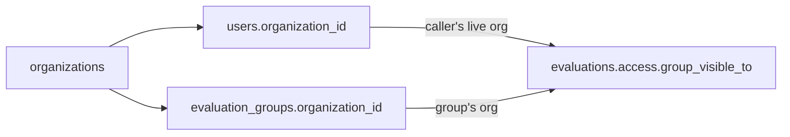

# Organizations

The tenancy root of the platform. An organization scopes users and evaluation groups; it is a flat, admin-managed entity (name + description), not a hierarchy. This note covers the CRUD + membership service and the API; the table itself is in [Organization](../data-models/organization.md).

Code: `app/core/organizations/` (logic) + `app/api/v1/organizations.py` (HTTP, mounted under `/api/v1/organizations`).

## Why it exists

Multi-tenancy. The org binds two things, each via a **nullable** FK so orgless accounts/groups stay valid and platform-wide:

- a [User](../data-models/user-and-role.md) belongs to at most one org (`User.organization_id`),
- an [EvaluationGroup](../data-models/evaluation-group.md) can belong to one (`EvaluationGroup.organization_id`).

The payoff is the `organization` access level: a group set to it is visible only to members of its org. That wiring lives in the evaluation domain — see [Evaluation domain](evaluation-domain.md). This context is just the entity and its membership.

## Two stages

The feature shipped in two stages, both now merged:

- **Stage 1** — the `organizations` table, full CRUD, and member assignment. `EvaluationGroup.organization_id` was added here too (so the whole tenancy schema is one migration), but unused.
- **Stage 2** — wired `organization_id` to read-visibility via the new `EvaluationGroupAccessLevel.ORGANIZATION` access level (a third axis beside `public` / `invitation_only`).

## Membership is a FK, not a join table

There is no membership table and no object-role machinery here. Assigning a member just stamps `User.organization_id` (`assign_member`), removing it clears the FK (`remove_member`). One user, one org; re-assigning overwrites.

```python
# app/core/organizations/services/organizations.py
async def assign_member(session, organization, user):
    user.organization = organization  # sets the relationship, not just the FK
    ...


async def remove_member(session, organization, user):
    if user.organization_id != organization.id:
        raise NotFoundError(...)  # a wrong (org, user) pair reads as missing
    user.organization = None
    ...
```

## Soft-delete: fail-closed + a delete guard

Two rules make tenancy safe under soft-delete:

- **A soft-deleted org reads as no organization.** The projection guard `OrganizationBase.from_optional_live` is authoritative (a many-to-one `with_live` doesn't reliably filter across identity-map states); the SQL visibility predicate re-guards with a `deleted_at IS NULL` join. So `/auth/me`, `UserResponse`, and the `organization` access level all fail-closed on a tombstoned org.
- **Delete is blocked while a live group references it** → **409**. A soft-delete doesn't fire the FK `SET NULL`, so a tombstoned org would leave its `organization`-access groups dark *and* un-editable (every group write re-validates a live `organization_id`). Reassign/clear those groups first. Member users keep their `organization_id` pointing at the tombstone — benign (they fail-closed to orgless).

## Endpoints

`/api/v1/organizations` + nested `/{organization_id}/members`. Gated on the `organizations:*` split. The crucial asymmetry: **`organizations:read` is held by every role** (any user can list/view orgs — it backs the org picker), while the management permissions (`create` / `update` / `delete` / `manage_members`) are **admin-only**.

| Method | Path | Permission | Description |
|---|---|---|---|
| GET | `/organizations` | `organizations:read` | Paginated list; `name` filter, `order_by` |
| POST | `/organizations` | `organizations:create` | Create; duplicate live name → 409, `Location` |
| GET | `/organizations/{id}` | `organizations:read` | Single org |
| PATCH | `/organizations/{id}` | `organizations:update` | Edit name/description; explicit `null` clears `description` |
| DELETE | `/organizations/{id}` | `organizations:delete` | Soft-delete; blocked (409) while a live group references it |
| GET | `/organizations/{id}/members` | `organizations:manage_members` | Paginated members (`User` projection, org eager-loaded) |
| POST | `/organizations/{id}/members` | `organizations:manage_members` | Assign a user (stamps the FK); idempotent |
| DELETE | `/organizations/{id}/members/{user_id}` | `organizations:manage_members` | Detach the user; wrong (org, user) pair → 404, 204 |

Reads gate on `organizations:read`, so a `red_teamer` / `annotator` / `viewer` can see the org list but a `404`/`403` never appears for management they lack — those routes are admin-only. See [RBAC - global roles](rbac-global-roles.md).

## Relationship to other contexts



The `organization` access level resolves the caller's **live** org (not the frozen JWT) inside the single SQL chokepoint `group_visible_to` and its in-Python mirror `group_is_visible` (`app/core/evaluations/access.py`), so all the group read paths narrow with no per-call-site change. Cross-org sharing still rides the object-role layer (a held in-group role grants visibility at any access level).

## Related

- [Organization](../data-models/organization.md) — the table
- [User and Role](../data-models/user-and-role.md) — `User.organization_id` membership
- [EvaluationGroup](../data-models/evaluation-group.md) — `organization_id` + the `organization` access level
- [Evaluation domain](evaluation-domain.md) — visibility, where the access level is enforced
- [Object roles - per-object permissions](object-roles-per-object-permissions.md) — the separate object-scope (cross-org sharing)
- [RBAC - global roles](rbac-global-roles.md) — the `organizations:*` permission split
- [API - overview and conventions](api-overview-and-conventions.md)
- [Data model overview](../data-models/data-model-overview.md)
