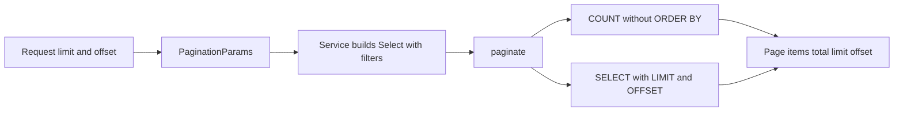
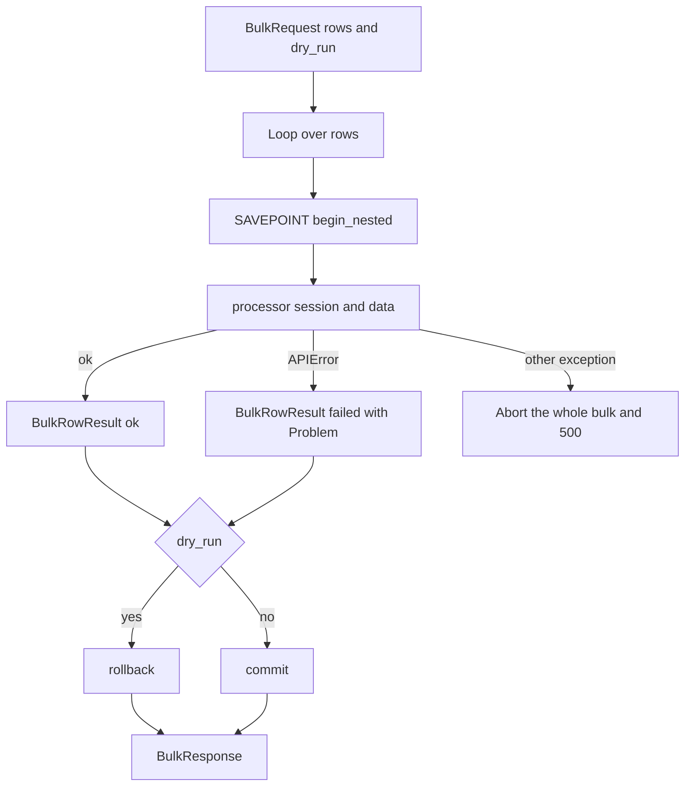
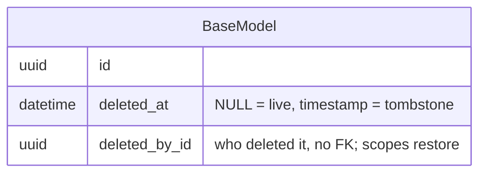

# Pagination, bulk and soft-delete

Three platform patterns that recur in every domain: how to return lists (pagination), how to do many operations in one request (bulk), and how to "delete" rows so they can be restored (soft-delete). If you're adding a new list/bulk/DELETE endpoint, don't invent your own response shape - use these helpers so the frontend talks to the whole API the same way.

All three live in `app/core/` and are shared by every bounded context.

## Pagination

Every list endpoint accepts the same query params and returns the same envelope. The client doesn't have to learn two conventions.

- Query params: `PaginationParams` (`app/core/schemas.py`) - `limit` (1..100, default 20) and `offset` (>=0, default 0). Injected via `PaginationDep`. Do NOT declare `limit`/`offset` manually on the routes.
- Response: `Page[T]` (`app/core/schemas.py`) - `items: list[T]`, `total: int` (full count), `limit`, `offset` (echo of the request).

The work happens in `paginate` (`app/core/pagination.py`). The helper takes a ready `Select` (with filters and sorting already inside) and appends only `LIMIT`/`OFFSET` plus a parallel `COUNT(*)`.

`app/core/pagination.py`
```python
async def paginate[T](session, statement: Select[tuple[T]], *, limit, offset) -> tuple[list[T], int]:
    count_stmt = statement.with_only_columns(func.count(), maintain_column_froms=True).order_by(None)
    total = (await session.execute(count_stmt)).scalar_one()
    page = (await session.execute(statement.limit(limit).offset(offset))).scalars().all()
    return list(page), total
```

Two decisions easy to overlook:

| Decision | What for |
|---|---|
| `order_by(None)` on the count | the DB doesn't sort rows it's only counting |
| `with_only_columns(..., maintain_column_froms=True)` instead of `.subquery()` | `.subquery()` loses ORM options (including the soft-delete filter) and inflates the count; this variant keeps the original FROM, so the count sees the same `deleted_at IS NULL` predicate as the list |

The latter is precisely the coupling of pagination with soft-delete - the count must count only live rows. More on sorting in [API - overview and conventions](api-overview-and-conventions.md).



## Bulk

One contract for all bulk operations (inviting users, status changes, importing models). The frontend gets uniform partial-success: some rows may pass, some may fail, each on its own.

Schemas in `app/core/bulk.py`:

| Type | What it carries |
|---|---|
| `BulkRow[T]` | `row_key` (1..128, echo for correlation) + `data: T` |
| `BulkRequest[T]` | `rows` (min 1) + `dry_run: bool=False`; the validator rejects duplicate `row_key` and exceeding `bulk_max_rows` (default 1000) as 422 |
| `BulkRowResult[R]` | `row_key`, `status: ok or failed`, `data`, `error: Problem` |
| `BulkResponse[R]` | `dry_run`, `total`, `succeeded`, `failed`, `results` in request order |

The engine is `apply_bulk`. It iterates rows sequentially, each in its own SAVEPOINT (`begin_nested()`), and owns the transaction itself.

`app/core/bulk.py`
```python
for row in request.rows:
    try:
        async with session.begin_nested():  # SAVEPOINT per row
            result = await processor(session, row.data)
    except APIError as exc:
        results.append(
            BulkRowResult(row_key=row.row_key, status="failed", error=api_error_to_problem(exc, instance=None))
        )
        failed += 1
    else:
        results.append(BulkRowResult(row_key=row.row_key, status="ok", data=result))
        succeeded += 1

if request.dry_run:
    await session.rollback()
else:
    await session.commit()
```

The most important rules (and pitfalls):

- SAVEPOINT per row - an `APIError` rolls back only that one row, the loop carries on.
- ONLY `APIError` is caught. Any other exception (a bug, a downed DB) propagates and aborts the whole bulk - a normal 500 goes out via [Error handling (RFC 7807)](error-handling-rfc-7807.md). The client won't see a half-finished `BulkResponse`.
- The transaction boundary is HERE: commit at the end, or rollback when `dry_run`. That's why **a handler calling `apply_bulk` must NOT have `@transactional`** - there would be two transaction owners. This is the opposite of ordinary mutating endpoints, which do have the decorator (see [Database and sessions](database-and-sessions.md)).
- `dry_run=True` passes through full validation and processing, then rolls back - a preview of exactly what a commit would do. But side effects (Celery, email, audit, HTTP) you must gate manually on `dry_run` in the processor, because a rollback won't undo them.
- `begin_nested()` relies on session autobegin - don't disable autobegin on the factory, or per-row isolation will break.

Endpoints on the envelope today: `/auth/invitations/bulk`, `/auth/users/force-logout` (revoke sessions in bulk — the Redis revoke and the audit row are `dry_run`-gated), `/ai-models/bulk`, `/ai-models/api-keys/bulk`, `/evaluation-groups/{id}/invitations/bulk` and `/reviews/bulk` (one row per `{flag, reviewer}` pair). Two of them push their notifications **after** `apply_bulk` commits (group invitations, reviews) — the writes are durable by then, so a mail failure is logged rather than raised.

> A side-effect that reaches outside the transaction can't be rolled back, so it must be either `dry_run`-gated inside the processor (force-logout's Redis write) or deferred past the commit (the mailers). A Redis/broker error mid-batch is *not* an `APIError`, so it aborts the whole bulk with a 500 — earlier rows keep their external effect while their DB rows roll back. Force-logout accepts that direction deliberately (a logged-out user is the safe side).



## Soft-delete

Rows don't disappear from the database - they get a `deleted_at` marker. By default you query only live rows; "deleted" ones (tombstones) stay in the table for audit and possible restoration.

`BaseModel` provides `deleted_at: datetime|None` **and `deleted_by_id: uuid|None`** (who tombstoned the row — no FK, so the trail survives the deleter's own deletion), along with `soft_delete(by_id)` (stamps both; `None` = system-initiated), `restore()` (clears both), and the `is_deleted` property. Filtering live rows is done by `with_live` from `app/core/soft_delete.py`.

`app/core/soft_delete.py`
```python
def with_live(model):
    return with_loader_criteria(
        model,
        lambda cls: col(cls.deleted_at).is_(None),
        include_aliases=True,
    )
```

This is per-statement filtering - no global state, no event listener. `include_aliases=True` makes the predicate follow joins and aliases too. In practice you don't call `with_live` manually, only the helpers on `BaseModel`:

- `Model.live_select()` = `select(cls).options(with_live(cls))` - list/read of live rows only.
- `Model.live_update()` = `update(cls).options(with_live(cls))` - a bulk update skips tombstones without an explicit `.where`.

Pitfalls:

- When a single statement loads >1 soft-delete-aware model (e.g. an eager-loaded relationship), add `with_live(OtherModel)` to `.options(...)` per extra class.
- Raw Core (`text(...)`, plain `Table.update()`) bypasses the ORM pipeline and is NOT filtered - add the predicate manually.
- To query tombstones on purpose, use the window- and deleter-scoped helpers in `app/core/restore.py` — see [Restore - reading tombstones back](restore-soft-deleted-items.md) — or, outside that surface, a plain `select(Model)`.



For a bulk soft-delete via `live_update()`, chain `.values(deleted_at=func.now(), deleted_by_id=actor_id)` — the timestamp is stamped server-side and the deleter is recorded for restore scoping.

## How it all fits together

| Pattern | Helper | Key point |
|---|---|---|
| Pagination | `paginate` -> `Page[T]` | the count sees the same soft-delete filter as the list |
| Bulk | `apply_bulk` -> `BulkResponse` | SAVEPOINT per row, owns the transaction itself (no `@transactional`) |
| Soft-delete | `with_live` / `live_select` / `live_update` | per-statement filter, `deleted_at IS NULL` |
| Restore | `deleted_select` / `restore_row` | the inverse: window- and deleter-scoped tombstone reads |

Pagination and soft-delete are coupled (the count must count only live ones). Bulk produces per-row errors as `Problem`, the same shape as the rest of the API - the `api_error_to_problem` mapper is shared with [Error handling (RFC 7807)](error-handling-rfc-7807.md).

## Related

- [API - overview and conventions](api-overview-and-conventions.md)
- [Database and sessions](database-and-sessions.md)
- [Error handling (RFC 7807)](error-handling-rfc-7807.md)
- [Restore - reading tombstones back](restore-soft-deleted-items.md) — the `?deleted=true` + `POST .../restore` surface built on this
