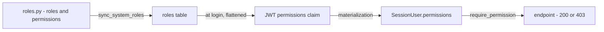

# RBAC - global roles

Global RBAC says "who you are on the platform and what you may do at all". An account has roles (e.g. `admin`, `red_teamer`), each role carries a set of permissions. We put these permissions into the JWT at login, and endpoints check them via `require_permission`. Everything has one source of truth: the file `app/core/auth/roles.py`.

Note: this is ONLY the first authorization scope. The second, per-object (who is the owner of a specific evaluation group), is described in [Object roles - per-object permissions](object-roles-per-object-permissions.md).

## How it works in brief



Key point: the middleware NEVER reads the DB. The entire permission list rides in the JWT and is frozen for the token's lifetime (no immediate *permission* revoke - a deliberate decision). What an admin **can** revoke immediately is the whole session: a force-logout (`users:manage_sessions`) writes a Redis marker the auth middleware checks per request, so every one of that user's tokens stops being accepted. The rest of the authentication flow: [Authentication (auth)](authentication.md).

## roles.py - the single source of truth

The file `app/core/auth/roles.py` defines three things: canonical roles, permissions and the role -> permissions mapping.

### Canonical roles

`SystemRole(StrEnum)` - the enum value is the stable slug stored in `roles.name` (a machine key, not a label):

| Slug | Purpose |
|---|---|
| `admin` | full administrative access, including break-glass to groups |
| `owner` | manages their own instance, invites users |
| `red_teamer` | the default role - participates in evaluations, runs conversations, flags messages |
| `annotator` | reviewer - reads evaluations and flags, assigns reviews and records verdicts |
| `viewer` | view-only of aggregated results |

`DEFAULT_PARTICIPANT_ROLE = SystemRole.RED_TEAMER` - the base role that every new account gets (self-signup and invitations). It only **seeds** the `is_default` / `is_participant_default` flags on the first sync; the flags on the `roles` rows are the runtime source of truth and an operator may reassign them. Elevation comes later, via a user PATCH or a new invitation.

### Permissions

`Permission(StrEnum)` - only permissions backing IMPLEMENTED functionality. Format `domain:action`, e.g. `users:read`. Groups: `users:*`, `roles:read/manage`, `organizations:*`, `models:*`, `evaluations:*`, `evaluation_groups:*`, `conversations:*`, `flags:*`, `notes:*`, `annotations:read`, `reviews:*`, `licenses:*`, `platform_settings:*`, `saved_views:*`, `notifications:*`, `audit:read`.

A few non-obvious ones:
- `users:invite` - a coarse gate: required to issue ANY invitation.
- `users:manage_admin` - elevation. Needed to GRANT or REVOKE the admin role (and the `owner` role too) and to delete an admin user. It also gates resend/revoke of an elevated account's invitation and a change of its status.
- `users:manage_sessions` - **admin-only**: force-logout, i.e. revoke every active session of a user (single + bulk). Separate from `users:update` on purpose — kicking someone out is not editing their profile. See [User management](user-management.md).
- `roles:read` - read the role + permission **catalogs** (`GET /api/v1/roles`, `GET /api/v1/permissions`). Held by everyone who assigns roles: `admin` (user create/update) and `owner` (the invitation role-picker).
- `roles:manage` - **admin-only**: create / edit / activate / delete roles. Non-delegable, so it can never be folded into a custom role's permission set — it is an elevation vector. See [Role management](#role-management-custom-roles) below.
- `organizations:*` - the tenancy root. **`organizations:read` is held by every role** (any user lists/views orgs — it backs the org picker); the management split (`create` / `update` / `delete` / `manage_members`) is **admin-only**. See [Organizations](organizations.md).
- `platform_settings:read` / `platform_settings:update` - **admin-only**: read and override every platform-wide knob — data licensing, registration policy, password policy, reset throttling ([PlatformSettings](../data-models/platform-settings.md)). The anonymous subset (`GET /platform-settings/public`) takes no permission at all. The license *catalog* read (`GET /api/v1/licenses`) takes **no** permission — auth only.
- `licenses:create` / `:update` / `:delete` - CRUD on **own** user-authored data licenses; held by `admin` + `owner`. There is deliberately **no `licenses:read`** (the catalog backs the picker, so reading it is auth-only). `licenses:manage` is the **admin-only** break-glass over *other users'* licenses. It is also what lets a manager fill in the legal `content` of a curated licence the catalog ships without one; every **other** curated field stays uneditable for everyone. See [Data licensing & platform settings](licenses.md).
- `notifications:read` / `notifications:update` - a user's in-app notification feed. **Every role holds both**, like `saved_views:*`: personal data, owner-scoped by the service, no break-glass. No create/delete members exist — rows are minted internally and there is no user-facing delete. See [Notifications (in-app feed)](notifications.md).
- `evaluation_groups:manage` - break-glass in the JWT. Bypasses the per-object override, gives the admin full control over every group (see [Object roles - per-object permissions](object-roles-per-object-permissions.md)).
- `evaluation_groups:view_metrics` - object-scoped: the always-pass **FULL** metrics capability (the whole-event dashboard at any access level). Conferred by the in-group `owner` role (held globally by `admin`), lifted by the `evaluation_groups:manage` break-glass. Deliberately kept distinct from `:update` so a read-only reporting role can hold it without edit rights. See [Analytics - aggregate metrics](analytics.md).
- `evaluation_groups:view_personal_metrics` - object-scoped: at a group's `members_personal_metrics` access level, admits a member to the metrics dashboards **scoped to their own contributions**. Held by the `red_teamer` role; a custom role opts in by carrying it, never by name. `viewer` deliberately lacks it (it authors nothing, so a personal view would be empty). Distinct from `view_metrics` — it never bypasses the configured level and never widens beyond the holder's own data. See [Analytics - aggregate metrics](analytics.md).
- `saved_views:*` (read/create/update/delete) - a user's named list-view state. **Every role holds the full set** — like `organizations:read`, it is personal data anyone can manage; the service confines it to the caller's own rows (no break-glass). See [Saved views](saved-views.md).
- `audit:read` - read the append-only audit trail (`GET /api/v1/audit-logs`). **Admin-only** — a platform-security surface, not a member view. There is no write permission; audit rows are written only by `record_audit` / the access middleware. See [Audit log](audit-log.md).
- `conversations:participate` - a coarse gate on conversing with the model; the only check on the stateless [Endpoint POST chat-stream](endpoint-post-chat-stream.md).
- `notes:*` (read/create/update/delete) - free-text remarks on a selection of a conversation's messages, **renamed from `annotations:*`**. Its **own** split rather than riding `flags:*`: authoring reaches conversations the caller does not own, so the two entities do not share authority, and the matrix would otherwise credit an annotator with editing *flags*. Held in full by `admin`, `red_teamer` and `annotator`. Reads stay author-scoped in the service; `evaluation_groups:manage` is the break-glass. See [Notes](notes.md).
- `annotations:read` - the **new** meaning of that key: the shared per-message label vocabulary ([AnnotationLabel](../data-models/annotation-label.md)). A separate split from `notes:*` because they are different things — a note is prose about a selection, an annotation is a label you aggregate over. Only the read half exists so far, and it gates nothing but the label list; the write split lands with the entity. Held by `admin`, `owner` and `annotator` — deliberately **not** `red_teamer`, the role kept clear of the annotation surface.
- `conversations:read_any` - object-scoped: lifts the owner predicate on conversation **reads** for a group the caller holds it on, so a group owner sees its members' transcripts. Reads only — update and delete stay owner-scoped for everyone. Held by `owner`; `red_teamer` deliberately never gets it. See [Conversations](conversations.md).
- `evaluation_groups:export` - object-scoped: run and download a group's exports. A dedicated permission rather than a general edit right, because the bundle carries every member's transcripts, flags and reviews. Held by `owner`, conferred in-group by the `owner` role, lifted by the `evaluation_groups:manage` break-glass. See [Exports (CSV / JSON)](exports.md).
- `reviews:*` - the family of reviewer verdicts. Full CRUD is held by `annotator` (that is precisely the reviewer), `owner` and `admin`; `red_teamer` has only `reviews:read` (the service narrows it down to reviews of their own flags). Keying the reviewer goes by `reviews:create` (`caller_can_review`). See [Reviews - reviewer verdicts](reviews-reviewer-verdicts.md).
- `reviews:annotate` - **not an endpoint gate**: the marker that puts a user in a group's assignable-reviewer pool. Held by `annotator` globally, and conferred in-group by the `owner` role. Keying the pool on the capability rather than on the `annotator` role *name* is what lets a custom role opt in. See [Reviews - reviewer verdicts](reviews-reviewer-verdicts.md).

### Role -> permissions mapping

`RoleSpec` (frozen dataclass) holds `display_name`, `description`, `permissions: frozenset[Permission]`. The `ROLE_SPECS` dictionary is the actual matrix:

| Role | permissions (abbreviated) |
|---|---|
| `admin` | full `users:*` (with `users:manage_admin` + `users:manage_sessions`), `roles:read` + `roles:manage`, `organizations:*` (full), `models:*`, `evaluations:*` (+ `approve`), `evaluation_groups:read/create/update/view_metrics` + break-glass `manage` (**not** `export`, `manage_members` or `view_personal_metrics` — it reaches those through the break-glass), `conversations:read/create/update/delete/participate` (**not** `read_any` — likewise via break-glass), `flags:*`, `notes:*`, `annotations:read`, `reviews:*`, `licenses:create/update/delete` + `manage`, `platform_settings:read/update`, `saved_views:*`, `notifications:*`, `audit:read` |
| `owner` | `users:invite`, `roles:read`, `organizations:read`, `models:read` (reads the registry to curate a group's allowed-model subset — model CRUD stays admin-only), `evaluations:read/create/update/delete`, `evaluation_groups:read/create/update/view_metrics` + `manage_members` + `export`, `conversations:participate/read/read_any`, `annotations:read`, `reviews:read/create/update/delete` + `annotate` (in-group), `licenses:create/update/delete` (own only — no `manage`), `saved_views:*`, `notifications:*` |
| `red_teamer` | `organizations:read`, `evaluations:read`, `evaluation_groups:read/view_personal_metrics`, `conversations:read/create/update/delete/participate` (never `read_any`), `flags:read/create/update/delete`, `notes:read/create/update/delete`, `reviews:read`, `saved_views:*`, `notifications:*` |
| `annotator` | `organizations:read`, `evaluations:read`, `evaluation_groups:read`, `flags:read`, `notes:read/create/update/delete`, `annotations:read`, `reviews:read/create/update/delete` + `annotate`, `saved_views:*`, `notifications:*` |
| `viewer` | `organizations:read`, `evaluations:read`, `evaluation_groups:read`, `saved_views:*`, `notifications:*` |

Deliberate omission: `owner` does NOT have `evaluation_groups:manage` - that is a global elevation (edit ANY group), whereas the owner is scoped to a single instance.

### Derived maps

- `ELEVATED_ROLE_PERMISSIONS = {ADMIN: USERS_MANAGE_ADMIN, OWNER: USERS_MANAGE_ADMIN}` - roles whose grant OR revoke requires an elevated permission. Default-allow: a *system* role outside this map is freely assignable, so a new sensitive one MUST go here. Both entries key on `users:manage_admin` precisely because it is non-delegable — that is what stops an operator-defined role from minting admins or owners through `users:invite` / `users:update`. Custom roles can never be listed here (the map is `SystemRole`-keyed); what bounds them is `NON_DELEGABLE_PERMISSIONS`.
- `NON_DELEGABLE_PERMISSIONS = {roles:manage, users:manage_admin, users:update}` - permissions an operator can never fold into a custom role. Each is an elevation vector: role-management, the admin-assignment key, or (via `users:update`, which replaces a user's *whole* role set) any role `ELEVATED_ROLE_PERMISSIONS` doesn't gate. System roles still hold them; `create_role` / `update_role` reject them in operator-defined sets, and `GET /permissions` reports each entry's `is_delegable`.
- `NON_DEACTIVATABLE_SYSTEM_ROLES = {admin, owner}` - `admin` alone holds `roles:manage`, so switching it off would strip the platform of its only role manager; `owner` is stamped on every group creator, so an inactive owner would be a powerless in-group role. Neither may be made a default either (auto-granting one would be an escalation). The two *defaults* are protected dynamically, by flag rather than by name.
- `RESERVED_ROLE_NAMES` - the canonical slugs; a custom role can't claim one (a clean 409 before the partial-unique index would fire).
- `OBJECT_ASSIGNABLE_SYSTEM_ROLES` - the union of every object type's `assignable_system_roles`, which `sync_system_roles` projects onto `Role.is_object_assignable`. See [Object roles - per-object permissions](object-roles-per-object-permissions.md).
- `ROLE_PERMISSIONS: dict[SystemRole, frozenset[str]]` - flattened strings. This is exactly what `sync_system_roles` writes into the `roles.permissions` column.

## Role management (custom roles)

The catalog is a managed surface: beside the code-owned canonical roles, an admin can define **custom** roles. Service `app/core/auth/services/roles.py`, router `app/api/v1/roles.py`, all writes gated on `roles:manage`.

| Method + path | What |
|---|---|
| `POST /api/v1/roles` | create a custom role — always `is_system=False`, `is_active=True`, `is_default=False` |
| `PATCH /api/v1/roles/{role_id}` | field edits (custom only) → activation → new-user default → participant default, in that order |
| `DELETE /api/v1/roles/{role_id}` | soft-delete a custom role |

Four flags on the `roles` row carry the policy (see [User and Role](../data-models/user-and-role.md) for the columns and DB constraints):

| Flag | Meaning |
|---|---|
| `is_active` | an inactive role **grants nothing** and can't be assigned; it stays in the catalog so it can be reactivated without losing existing assignments |
| `is_default` | the single role auto-assigned to every new user |
| `is_participant_default` | the single role granted on evaluation-group self-join |
| `is_object_assignable` | whether the role may be held as an in-group (object) role |

The guards are the interesting part:

- **System roles are code-owned.** A field edit (label / description / permissions / object-assignability) on one is a 400 — `sync_system_roles` would overwrite it on the next deploy. Only their activation and default flags are mutable.
- **The slug `name` is immutable** once created, which sidesteps rename collisions and dangling references.
- **Sole-role guard.** Deactivating or deleting a role is refused when it is some principal's *only active* role — in either scope: a user's only active global role (`user_roles`) or a member's only active role on an object (`object_role_assignments`). The scopes are independent: a global role never rescues an object membership.
- **Default guards.** Neither default can be deactivated or deleted (reassign it first), and the flag can't be *cleared* directly — you make another role the default instead. `admin` / `owner` can never be a default.
- **Un-flagging `is_object_assignable`** is refused while any live member still holds the role on an object, and a role that is (or stays) object-assignable must grant the object type's `required_permission`.
- **Permission removal revokes sessions.** Dropping a permission, deactivating, or deleting a role force-logs-out every live global holder, so the lost access takes effect immediately; pure *additions* ride the ≤24h token TTL. Object-only holders aren't covered — object permissions resolve live per request, so they never go stale in a token.

Every write records an audit row (`role.create` / `role.update` / `role.delete`); a no-op PATCH records nothing.

## Catalog endpoints - `/roles` and `/permissions`

The same vocabulary is exposed read-only over REST, so the admin/owner role-builder UI lists assignable roles and resolves permission descriptions instead of hard-coding them. Both **reads** gate on `roles:read` (the writes above take `roles:manage`); the routers are **top-level** (`/api/v1/roles`, `/api/v1/permissions`), not under `/auth`.

- `GET /api/v1/roles` - `Page[RoleResponse]`, the assignable-role catalog (each entry with its permissions + the `is_system` / `is_active` / `is_default` / `is_participant_default` / `is_object_assignable` flags); the source for `role_ids` when creating/updating/inviting users. **Active-only by default**, since the assignment picker can't assign an inactive role; the management view passes `include_inactive=true`. `is_object_assignable=true` narrows to what in-group assignment accepts, so an in-group picker needn't re-derive that policy client-side. Service `list_roles` (`app/core/auth/services/roles.py`).
- `GET /api/v1/roles/{role_id}` - a single role, active or inactive — the management view's detail source.
- `GET /api/v1/permissions` - `Page[PermissionResponse]` (`{key, description, is_delegable}`), projected from the static `PERMISSION_DESCRIPTIONS` map in `roles.py`, sorted by key. `is_delegable=false` marks an elevation vector reserved for system roles, so a role builder can grey it out rather than have `POST`/`PATCH /roles` reject it. A test asserts every `Permission` member has a description, so a new permission can't ship without one.

`GET /auth/me` reuses the same vocabulary: it now returns the caller's live `roles` (a `RoleSummary` list) and flattened `permissions`, **re-read from the DB** (`effective_permissions`) so the FE can refresh them right after a role change without waiting for the JWT to be re-minted. A `sub` with no live DB row falls back to the token claim (empty `roles`, `permissions` from the JWT). See [Authentication (auth)](authentication.md).

## Permissions in the JWT

When minting a token we take the permissions from ALL of the user's live roles (`role.deleted_at is None`), deduplicate, sort and put them into the `permissions` claim. On the request side, `SessionUser.permissions` is a `frozenset[str]` built directly from this claim - without touching the DB.

Trap: if the user's roles are not eager-loaded, flattening returns an empty list (a lazy-load would crash under an async session). That is why every path that mints a token must load the roles beforehand. Minting and `SessionUser` details -> [Authentication (auth)](authentication.md).

## require_permission - the gate on endpoints

`require_permission` (`app/core/auth/dependencies.py`) is a FastAPI dependency factory. It takes a `Permission`, returns a callable that checks whether the `SessionUser` has that permission - if not, a `ForbiddenError` (403) is raised.

`app/core/auth/dependencies.py`
```python
def require_permission(permission: Permission) -> Callable[..., SessionUser]:
    def _check(user: Annotated[SessionUser, Depends(current_user)]) -> SessionUser:
        if permission not in user.permissions:
            raise ForbiddenError(f"Caller lacks the '{permission}' permission.")
        return user

    return _check
```

Use in a route:
```python
user: Annotated[SessionUser, Depends(require_permission(Permission.USERS_READ))]
```

No token / 401 is handled by `current_user` (which `require_permission` depends on). So `require_permission` is a pure "what you can do" check, assuming we already know "who you are".

## sync_system_roles - projecting onto the DB

`roles.py` is the definition, but the runtime reads rows from the `roles` table. `sync_system_roles` (`app/core/auth/services/roles.py`) is the only writer of the *canonical* roles; it projects the dictionary onto rows on every deploy (`make syncroles`, `make seedlocal`). Upsert: overwrites `display_name`/`description`/`permissions`/`is_system=True`/`is_object_assignable`, ignores soft-deleted, does not touch non-canonical roles (e.g. the legacy `participant`).

What it deliberately does **not** overwrite: `is_default` and `is_participant_default` are seeded only when a row is *created* (and `is_active` just follows its column default), so an operator's activation or default reassignment survives deploys. Object-assignability re-converges instead, because it is platform policy, not operator preference.

## docs/permissions.md is generated

The role x permission matrix is also exported to `docs/permissions.md` in the backend repo - but that file is GENERATED from `roles.py` (and the object-roles registry) by `make permissionsdump`. CI checks for drift: you change a role or permissions -> regenerate and commit in the same diff, or the pipeline will fail. Do not edit `docs/permissions.md` by hand.

## Example: who can issue an invitation

`POST /api/v1/auth/invitations/bulk` (the only platform invite path — a single invitee is a one-row request) is behind the gate `require_permission(Permission.USERS_INVITE)`. This permission is held by `admin` and `owner`, so `red_teamer` will get a 403 before anything happens. And if an admin wants to invite another admin — or an owner — a second check (`users:manage_admin`) kicks in at the role-assignment level, per row. The full invitation flow: [Flow - evaluation group invitation](../flows/flow-evaluation-group-invitation.md).

## Related

- [Authentication (auth)](authentication.md) - login, JWT, minting a token with permissions
- [Object roles - per-object permissions](object-roles-per-object-permissions.md) - the second authorization scope (per-object) + break-glass
- [Organizations](organizations.md) - consumer of the `organizations:*` family
- [Data licensing & platform settings](licenses.md) - consumer of the `platform_settings:*` family
- [User and Role](../data-models/user-and-role.md) - the `users` / `roles` / `user_roles` tables and the M2M relation
- [Flow - request authentication and authorization](../flows/flow-request-authentication-and-authorization.md) - end-to-end: who you are and what you can do
- [Endpoint POST chat-stream](endpoint-post-chat-stream.md) - an example of the `conversations:participate` gate
- [Message flags](message-flags.md) - consumer of the `flags:*` family
- [Notes](notes.md) - consumer of the `notes:*` family
- [AnnotationLabel](../data-models/annotation-label.md) - what `annotations:read` gates today
- [Reviews - reviewer verdicts](reviews-reviewer-verdicts.md) - consumer of the `reviews:*` family (incl. the `reviews:annotate` pool marker)
- [User management](user-management.md) - consumer of `users:*`, incl. the elevated-role guards
- [Saved views](saved-views.md) - consumer of the `saved_views:*` family (held by every role)
- [Notifications (in-app feed)](notifications.md) - consumer of the `notifications:*` family (held by every role)
- [Analytics - aggregate metrics](analytics.md) - consumer of `view_metrics` / `view_personal_metrics`
- [Audit log](audit-log.md) - consumer of `audit:read` (admin-only)
