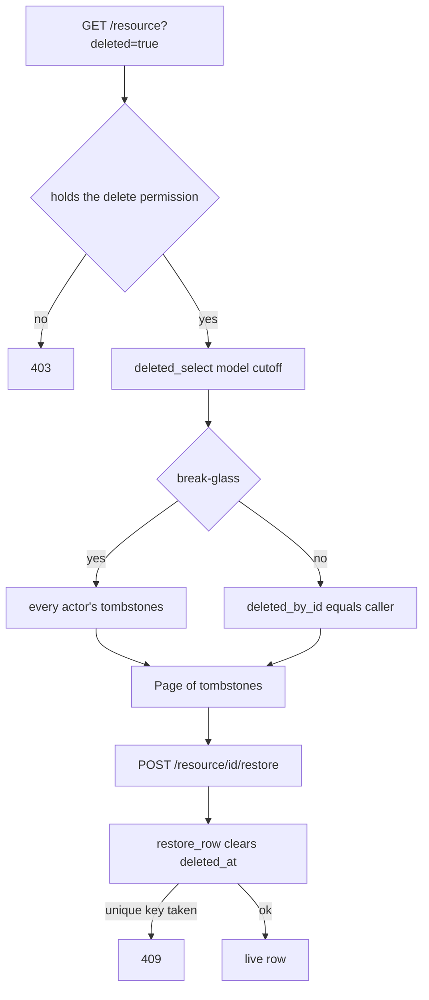

# Restore - reading tombstones back

[Soft-delete](pagination-bulk-and-soft-delete.md#soft-delete) stamps `deleted_at` instead of removing a row, but for a long time nothing could read those rows back through the API. This is the inverse surface: a **deleted view** on a list endpoint (`?deleted=true`) and a **restore** endpoint per resource (`POST .../{id}/restore`).

Shared machinery: `app/core/restore.py`. The per-resource rules stay in each domain's own service — this module only owns the two scoping rules every resource obeys.

## Two scoping rules, enforced in one place

| Rule | What it means | Where |
|---|---|---|
| **Window** | a tombstone older than `Settings.restore_window_days` (`RESTORE_WINDOW_DAYS`, default 7) is not addressable — it drops out of the deleted listing and its restore is a **404** | `restore_cutoff` + `deleted_select` |
| **Deleter** | `deleted_by` scopes the view to one actor's own deletes; `None` widens it to every actor's (a break-glass admin, or a resource scoped by something else) | `deleted_select` |

Nothing purges a tombstone past the window — it just stops being restorable. And `deleted_by` has **no default**: the permissive branch is a decision each call site states, never something you get by forgetting an argument.

`app/core/restore.py`
```python
def deleted_select[T: BaseModel](model, cutoff, *, deleted_by: uuid.UUID | None) -> Select[tuple[T]]:
    statement = select(model).where(col(model.deleted_at).is_not(None), col(model.deleted_at) >= cutoff)
    if deleted_by is not None:
        statement = statement.where(col(model.deleted_by_id) == deleted_by)
    return statement
```

Note the deliberate omission: `deleted_select` does **not** apply `with_live(model)` — filtering the target's tombstones away is exactly what it must not do. A statement that eager-loads a *related* soft-deletable model still needs `with_live(OtherModel)` in its `.options(...)`.

## `deleted_by_id` on `BaseModel`

The deleter is recorded on the row itself, so scoping needs no join to the audit trail:

`app/core/base_model.py`
```python
# No FK: the trail must survive the deleter's own tombstoning (same as AuditLog.actor_id).
deleted_by_id: uuid.UUID | None = Field(default=None)


def soft_delete(self, by_id: uuid.UUID | None) -> None:
    """``None`` = system-initiated."""
    self.deleted_at = datetime.now(UTC)
    self.deleted_by_id = by_id


def restore(self) -> None:
    self.deleted_at = None
    self.deleted_by_id = None
```

`soft_delete()` now **takes an argument** — every call site passes the actor, or `None` for a system-initiated cascade. For a bulk soft-delete via `live_update()`, chain `.values(deleted_at=func.now(), deleted_by_id=actor_id)`.

> **Rollout blind spot.** Rows tombstoned before the migration carry `deleted_by_id IS NULL`, so they fall out as admin-only — and for a resource with no break-glass ([saved views](saved-views.md)) they are unrestorable by anyone. Accepted as a one-window cost: it clears itself once every pre-migration tombstone ages past the window.

## Restoring a row - the 409 that isn't pre-checked

Every soft-delete-aware unique index is **partial** (`WHERE deleted_at IS NULL`), so reviving a row whose key a live row has since taken violates it. `restore_row` turns that into a `ConflictError` rather than a 500:

```python
async def restore_row(session, row: BaseModel, *, conflict_message: str) -> None:
    row.restore()
    session.add(row)
    try:
        await session.flush()
    except IntegrityError as exc:
        raise ConflictError(conflict_message) from exc
```

No caller pre-checks the key — `conflict_message` *is* the user-facing text, and catching the driver error is what keeps the race honest.

## The four listing scopes

`?deleted=true` is a plain `bool` query param, but its **OpenAPI description** differs by which tier the resource actually has — the annotated aliases in `restore.py` exist so a listing can describe the tier it implements:

| Alias | Scope it describes | Example |
|---|---|---|
| `DeletedFilter` / `DeletedFilterNewestFirst` | owner tier + break-glass | conversations, scenarios, tasks, reviews |
| `DeletedFilterOwnerOnly` | owner tier, **no** break-glass | saved views |
| `DeletedFilterAnyDeleter` / `…NewestFirst` | permission gates the whole view, no per-deleter narrowing | users, organizations, roles |
| `DeletedFilterAuthorNewestFirst` | scoped by the row's **author**, not its deleter | data licenses |

The last one exists because an admin's delete of someone else's licence leaves the *author* as the only person who may restore it — scoping that listing by deleter would hide the row from the only caller who can act on it.

Picking the alias is a manual step, so it can disagree with the service. Two listings currently do, each needing a different correction:

- `GET /ai-models` carries `DeletedFilterNewestFirst`. The ordering half is right — the listing exposes no `order_by` — but the scope half is not: `app/core/ai_gateway/services/ai_models.py` passes `deleted_by=None` and narrows by nothing, so `DeletedFilterAnyDeleterNewestFirst` is the description that matches.
- `GET /evaluations/{evaluation_id}/models` carries plain `DeletedFilter` (`app/core/evaluations/filters.py`, `EvaluationAiModelFilters`). Its route does expose `order_by`, so the order hint is the right half to keep; only the scope sentence is wrong — `app/core/evaluations/services/assignments.py` passes `deleted_by=None` on both the listing and the restore lookup. `DeletedFilterAnyDeleter` is the match.

The per-resource table above reflects the **behaviour**; the published OpenAPI text for those two does not.

`assert_may_list_deleted(deleted, caller, permission, entity=...)` is the flat-listing gate: a deleted view is a **restore surface**, so it takes the permission that *restores* rather than the one that reads.



## Where it is wired

Fourteen resources carry the pair today. Each keeps its own extra preconditions — restore is never a blank re-create:

| Resource | Deleted view gated on | Notable extra rule |
|---|---|---|
| [AiModel](../data-models/ai-model.md) | `models:delete` (also lifts the disabled filter) | **shallow** — assignments/conversations its delete cascaded stay gone; 409 if a live model took its `name`/`model_alias`; `restore()` also re-arms the inactivity alert |
| [User](../data-models/user-and-role.md) | `users:delete` | elevation guard (`assert_can_restore_user`); cascaded `provider_identities` stay tombstoned and re-link on the next external login |
| [Role](../data-models/user-and-role.md) | `roles:manage` | a **system** role is refused (400) — `syncroles` recreates the name; the listing needs `include_inactive=true` |
| [Organization](../data-models/organization.md) | `organizations:delete` | 409 if a live org took the name; members need no repair |
| [DataLicense](../data-models/data-license.md) | `licenses:delete` | author-scoped; a **curated** tombstone is refused (403) — `synclicenses` revives those |
| [Evaluation](../data-models/evaluation.md) | `evaluations:delete` | not restorable under a soft-deleted group |
| [EvaluationAiModel](../data-models/evaluation-ai-model.md) | write access on the parent group | refused once the **model** is deleted; re-opens the conversations its removal tombstoned |
| [Scenario](../data-models/scenario.md) | `evaluations:update` (+ group write on the nested list) | appended **last**, not returned to its old `position` |
| [Task](../data-models/task.md) | `evaluations:update` + group write | `TaskCompletion` rows were never tombstoned, so checkmarks survive |
| [Conversation](../data-models/conversation.md) | owner tier | restoring the last member revives the group the delete pruned; a model-unassign cascade is **not** restorable |
| [MessageFlag](../data-models/message-flag.md) | owner tier | audited as `flag.restore` |
| [Note](../data-models/note.md) | owner tier | audited as `note.restore` |
| [Review](../data-models/review.md) | own unassignments | a `pending` review must still be reassignable (preconditions re-checked); the reviewer is emailed again |
| [SavedView](../data-models/saved-view.md) | owner only, **no break-glass** | 409 if a live view took `(resource, name)` |

`ObjectRoleAssignment` deliberately has **no** restore endpoint: the row carries no state beyond `(object, user, role)`, so re-adding the member *is* the undo — and it re-validates the roles, which a restore would bypass.

## Related

- [Pagination, bulk and soft-delete](pagination-bulk-and-soft-delete.md) — the `deleted_at` mechanism this inverts
- [Database and sessions](database-and-sessions.md) — `with_live`, the transaction boundary
- [Audit log](audit-log.md) — restores of flags and notes are audited
- [Configuration (Settings)](configuration-settings.md) — `RESTORE_WINDOW_DAYS`
- [API - overview and conventions](api-overview-and-conventions.md) — where `?deleted=true` sits in the list contract
