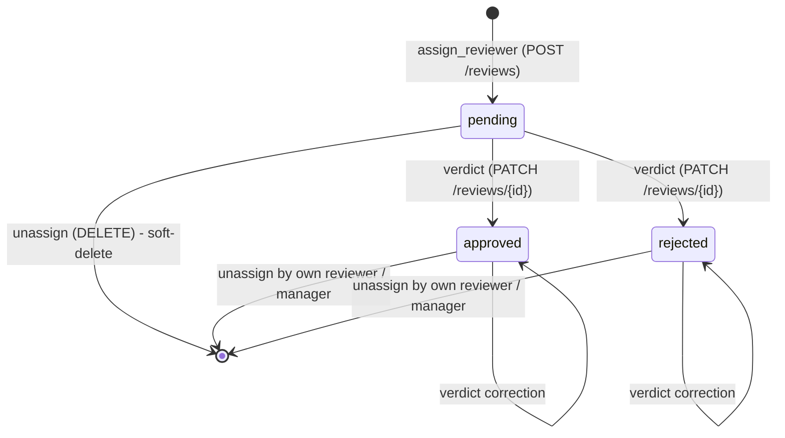
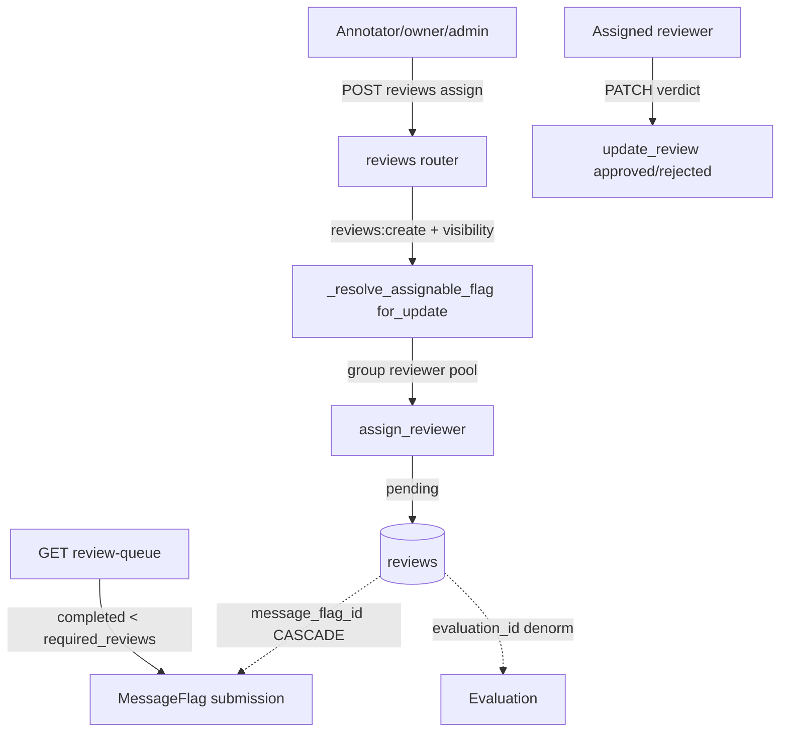

# Reviews - reviewer verdicts

The second citizen of the `annotations` context, after [flags](message-flags.md). A flag is a **submission** — a red-teamer claims that a selection of messages is an exploit. A **review** is the assignment of a reviewer to that flag plus their verdict: whether the exploit actually succeeded, whether it is unique, how many prompts it took. One flag collects many reviews (one per reviewer), and how many verdicts are needed to "close" a flag is told by `Scenario.required_reviews`.

Code: `app/core/reviews/` (logic) + `app/api/v1/reviews.py` (HTTP). Model: [Review](../data-models/review.md).

## Why it exists

A flag alone is the opinion of a single red-teamer. To turn it into a result you can trust, the exploit must be confirmed by reviewers (annotators). A review is their verdict: assign creates a `pending` review, the reviewer fills in the evaluation fields and sets `status` to `approved` / `rejected`, and the review queue shows the flags still missing verdicts toward the `required_reviews` threshold. A reviewer works a submission through two read endpoints — the submission detail (`GET /submissions/{id}`: the flag, its flagged messages, and the verdicts so far) and the parent-conversation transcript (`GET /submissions/{id}/messages`).

## Review lifecycle

- **assign** — `assign_reviewer` creates a `pending` row.
- **verdict** — `update_review` records the evaluation fields and flips `status` to `approved`/`rejected`. The verdict **remains editable** — the reviewer can correct the assessment; there is no terminal lock, because the flag's aggregated verdict is not (yet) derived from reviews.
- **unassign** — `unassign_review` is a soft-delete (stamps `deleted_at`), not a hard-delete.

## `required_reviews` is a queue target, not an assignment limit

The most important trap: `Scenario.required_reviews` says **how many completed verdicts** (`approved`/`rejected`) a flag of that scenario needs before the queue stops showing it. It is **not** an upper limit on the number of reviewers — `assign_reviewer` does not check this threshold and you can assign more reviewers than `required_reviews` (the test `test_assign_beyond_required_reviews_succeeds` guarantees this). When a flag does not target a live scenario, the threshold drops to `1`. Usually odd (1 or 3) for consensus.

> [!note] Divergence from the backend CLAUDE.md
> `../backend/CLAUDE.md` describes `required_reviews` as a "hard cap ... enforced at assignment time". The code does not do this — the threshold is computed only in the queue (`review_queue`), assign does not enforce it. The note follows the code.

## Reviewer assignment (assign)

`POST /reviews` (`assign_reviewer`) creates a `pending` review. Conditions:

- the flag must be **visible** to the caller (the `join_visible_evaluation_group` spine over the flag's denormalized `evaluation_id`) — invisible reads like a 404,
- the flag must still be `pending` (`FlagStatus`) — a flag with a verdict does not accept new reviewers (409),
- **no self-review** — the flag's author cannot be its reviewer (409),
- `reviewer_id` must be in the group's **assignable-reviewer pool** — holders of the `reviews:annotate` capability (a live, active role granting it, **not** the `annotator` role name, so a custom role can opt in), scoped by access level: a `public` group takes every global holder ∪ its in-group holders, an `organization` group its org's global holders ∪ in-group holders, an `invitation_only` group only its in-group holders (`is_assignable_annotator`, see [Evaluation domain](evaluation-domain.md)),
- **one review per reviewer** per flag — partial-unique index `(message_flag_id, reviewer_id)` `WHERE deleted_at IS NULL`; a duplicate is 409.

`_resolve_assignable_flag` locks the flag row `for_update`, so that a race between two parallel assigns of the same reviewer yields a clean 409 instead of a unique-constraint error.

### Bulk assign — `POST /reviews/bulk`

One row is one `{message_flag_id, reviewer_id}` pair, so the whole *flags × reviewers* cartesian goes in a single call — the motivating UI is picking several reviewers for several flags at once. It rides the platform `BulkRequest`/`BulkResponse` envelope (`ReviewBulkRequest`): per-row failures (already-assigned, self-author, non-pending flag, non-assignable reviewer) land in `results[].error` **without failing the batch**, `dry_run` previews without committing, and the row cap / duplicate `row_key` rules are the envelope's. Same `reviews:create` gate as the single assign; no `@transactional` (`apply_bulk` owns the boundary). See [Pagination, bulk and soft-delete](pagination-bulk-and-soft-delete.md).

Notifications are sent **after** `apply_bulk` commits, reusing the single-assign mailer per row and then committing the audit/mail rows: the assignments are already durable, so a notify failure is logged (`bulk_assign.notify_failed`), not raised. Known limitation, shared with the bulk-invitations route: it is N+1 selects + one `apply_async` per row before a single commit — fine for the one-flag-many-reviewers case, and the same large-batch mail race documented there.

## Write authorization — visibility, not in-group write

Key point: a review does **NOT** go through `assert_group_write_access` (the in-group `owner` gate that gates scenarios/tasks). Writes (assign / verdict / unassign) ride on **group visibility + the JWT `reviews:*` permission**. The rationale from `_resolve_assignable_flag`: reviewing is cross-group reviewer work — a `public` group is open to any `reviews:annotate` holder, `invitation_only` is visible only to members, so visibility already narrows writes to the right pool without checking membership. Break-glass `evaluation_groups:manage` removes the entire scope.

| Action | Permission | Who actually writes |
|---|---|---|
| assign (`POST /reviews`) | `reviews:create` | any holder in a visible group |
| verdict (`PATCH /reviews/{id}`) | `reviews:update` | **only the assigned reviewer** (or a break-glass manager) |
| unassign `pending` (`DELETE`) | `reviews:delete` | any holder in the group (roster management) |
| unassign with a verdict (`DELETE`) | `reviews:delete` | only the reviewer who recorded the verdict (or a manager) |

Verdict and unassign-with-verdict are locked to the own reviewer so that a colleague does not wipe out someone else's assessment. The check "is this the assigned reviewer" itself is done by the route (`update_review_endpoint` / `unassign_review_endpoint`), not the service.

## Email notifications (best-effort)

After **assign** and after **unassign** the route calls `notify_review_assigned` / `notify_review_unassigned` (`app/core/reviews/notifications.py`) — the reviewer gets an email that they were assigned to a flag (or removed). This is a **post-condition** of the write: the review row is already flushed, so a mail failure cannot roll it back — `send_email_best_effort` wraps the error in a SAVEPOINT (the best-effort variant, see [Email](email.md)). Two templates: `review_assigned`, `review_unassigned`. Context: `assignee_name` (reviewer, the `User` row), `assigner_name` (caller, the `SessionUser`) — both from a `display_name` property (full name, otherwise email; see [User and Role](../data-models/user-and-role.md)) — plus `evaluation_title` (empty string if the evaluation is gone). A deep-link to the review page does not exist yet (no route in the frontend — a `TODO` in the code).

## Read scope — visibility + reviewer vs author

`scope_reviews` (`access.py`) narrows the query along two axes:

1. **group visibility** — `join_visible_evaluation_group` over the denormalized `Review.evaluation_id` + a live parent flag,
2. **reviewer vs author** — a **reviewer** (`can_review`, i.e. a `reviews:create` holder → annotator / owner / admin) sees every review in a visible group; a read-only **red-teamer** (`reviews:read` without `create`) sees only reviews of flags they **created themselves**.

`caller_can_review` is keyed on `reviews:create` — exactly the permission that distinguishes a reviewer from a read-only red-teamer. Break-glass `evaluation_groups:manage` (`can_manage`) raises both axes. The parent flag's liveness is ALWAYS enforced.

> [!warning] No RLS
> No RLS: isolation lives in the query predicates. Every new review read MUST pass through `scope_reviews` / `scope_review_flags`. See [Object roles - per-object permissions](object-roles-per-object-permissions.md).

## Endpoints

Router `app/api/v1/reviews.py`, mounted under `/api/v1` (the router itself sets no prefix). A flat `/reviews` resource + the `/review-queue` dashboard + the `/submissions/{id}` reviewer views:

| Method + path | Permission | `@transactional` | Service |
|---|---|---|---|
| `POST /reviews` | `reviews:create` | yes | `assign_reviewer` |
| `POST /reviews/bulk` | `reviews:create` | no (`apply_bulk`) | `assign_reviewer` per row |
| `GET /reviews` | `reviews:read` | no | `list_reviews` |
| `GET /review-queue` | `reviews:read` | no | `review_queue` |
| `GET /reviews/{id}` | `reviews:read` | no | `get_review` |
| `PATCH /reviews/{id}` | `reviews:update` | yes | `update_review` |
| `DELETE /reviews/{id}` | `reviews:delete` | yes | `unassign_review` |
| `POST /reviews/{id}/restore` | `reviews:delete` | yes | `restore_review` |
| `GET /submissions/{id}` | `reviews:read` | no | `get_submission_detail` |
| `GET /submissions/{id}/messages` | `reviews:read` | no | `submission_conversation_messages` |
| `GET /submissions/{id}/assignable-reviewers` | `reviews:create` | no | `list_assignable_reviewers` |

The `reviews:*` family in full (read/create/update/delete) is held by `annotator`, `owner` and `admin`; `red_teamer` has only `reviews:read` (scoped to its own flags). `viewer` nothing. `annotator` additionally holds `reviews:annotate` — not an endpoint gate, but the marker that puts a user in a group's assignable-reviewer pool (the in-group `owner` role confers it too). See [RBAC - global roles](rbac-global-roles.md).

`POST /reviews` sets `Location: /api/v1/reviews/{id}`. Lists return `Page[T]`; `GET /reviews` filters by `message_flag_id` / `evaluation_id` / `reviewer_id` / `status` / `created_from` / `created_to`, sort `created_at`/`updated_at` (+`-`), default `-created_at`, and takes `?deleted=true` for tombstoned (unassigned) reviews.

**Restore an unassignment**: `?deleted=true` carries no permission of its own — it returns the caller's own unassignments, or every actor's for a break-glass manager. `POST /reviews/{review_id}/restore` revives one: your own unassignment only (a break-glass manager restores anyone's), and a *decided* review additionally only by the reviewer who recorded it or that manager. A `pending` review must also still be **reassignable** — submission undecided, reviewer live and in the assignable pool, i.e. the assign preconditions re-checked (the listing mirrors all but the pool check). The verdict rides along (this is not a blank re-assignment), the reviewer is emailed as on a fresh assignment (a decided review's since-deleted reviewer is not), a tombstoned parent flag or conversation makes it a 404, and re-assigning that reviewer meanwhile makes it a 409. See [Restore](restore-soft-deleted-items.md).

Assign, verdict and unassign are **audited** (`review.assign` / `review.verdict` / `review.unassign` via `record_audit`, with a curated review snapshot; the verdict records only the changed fields via `changed_fields`) — see [Audit log](audit-log.md).

## Assignable-reviewers picker (`/submissions/{id}/assignable-reviewers`)

The assign picker's candidate pool (before it, the FE offered users the assign call would then reject). `list_assignable_reviewers` returns **exactly the set `POST /reviews` accepts**: while the flag is still `pending` (a decided flag takes no new reviewers → empty pool), the flag group's assignable-reviewer pool (`annotator_pool_predicate` — the same capability-keyed rule `is_assignable_annotator` enforces, made public for this) minus the flag's author (no self-review) and anyone already carrying a live review on it (one-review-per-reviewer). Gated on `reviews:create` like the assign it feeds; the submission is resolved under the same `join_visible_evaluation_group` scope (invisible → 404). Paginated, ordered by email; an optional `search` query param narrows the pool by a case-insensitive substring on email / first / last name (escaped `LIKE`) — the picker's search box.

Each candidate is an `AssignableReviewerResponse` — the annotator shape plus **`active_review_count`**: pending reviews that person holds whose whole parent chain is live and whose evaluation is neither `completed` nor `rejected` and whose group is neither `inactive` nor `not_approved`. Deliberately **not** a lifetime total, and narrower than the review queue (which also lists work inside finished evaluations). It is counted **platform-wide, including groups the caller cannot see**: the question it answers is how loaded the person is, not how loaded they are on work you can account for.

## Review queue (`/review-queue`)

`review_queue` lists flags awaiting review: those whose number of **completed** reviews (`approved`/`rejected`) is fewer than `required_reviews`. The threshold is computed in SQL via an `outerjoin` to a live `Scenario` with `func.coalesce(Scenario.required_reviews, 1)` (a flag without a live scenario → 1). Filters: `evaluation_id` / `evaluation_group_id` / `scenario_id`, plus **`unassigned=true`** for flags carrying no live reviewer assignment at all — the "nobody has picked this up" slice. The visibility + reviewer scope is enforced by the service regardless of any filter. Each entry (`ReviewQueueItem`) carries: `submission` (`MessageFlagResponse` with the flagged messages), `required_reviews`, `completed_reviews` and `reviews` (the reviews assigned so far). The queue is flag-centric, so it scopes via `scope_review_flags` (same reviewer-vs-author split as `scope_reviews`, but joined on the flag's own `evaluation_id`).

## Submission detail (`/submissions/{id}`)

Two read endpoints give a reviewer the full picture of one flag without owning the underlying conversation. Both are review-scoped through `scope_review_flags` (the same axis as the queue: a reviewer / break-glass manager sees any flag in a visible group, a red-teamer only their own) and 404 an invisible submission.

- `GET /submissions/{id}` (`get_submission_detail`) → `SubmissionDetailResponse`: the flag (`submission`, a `MessageFlagResponse` with its flagged messages eager-loaded), a **paginated** `reviews` (`Page[ReviewResponse]`), and `superseded_message_ids`. The last is the subset of flagged messages a later regenerate/continue superseded — still in `submission.messages` for provenance, but dropped from the live transcript — so the UI can mark them. The parent conversation isn't inlined; it's referenced via `submission.conversation_id` and fetched separately.
- `GET /submissions/{id}/messages` (`submission_conversation_messages`) → `Page[TranscriptMessage]`: the parent conversation's live transcript (oldest-first, superseded messages excluded; each message carries its `image_keys` so a reviewer sees the attachments too). The conversations message-history endpoint is **owner-scoped**, so a reviewer who isn't the conversation's owner can't read it there — this review-scoped endpoint serves the transcript instead.

## Schemas

- `ReviewCreate` — `message_flag_id` + `reviewer_id`.
- `ReviewUpdate` — the verdict: `status` (only `approved`/`rejected`; an explicit `null` and `pending` rejected by the `_reject_null_and_pending` validator → 422), `successful_exploit`, `unique_exploit`, `valid_submission`, `number_prompts` (`ge=0`), `notes` (`null` clears). The service receives `ReviewUpdateChanges` (`extra="forbid"`) built from `model_dump(exclude_unset=True)`, so `model_fields_set` distinguishes "omitted" from "set to null".
- `ReviewBulkRequest` — `BulkRequest[ReviewCreate]`: many `{flag, reviewer}` pairs in one call.
- `ReviewResponse` — a projection of the row (`from_model`); verdict fields are `null` until assessed. It also carries the **reviewer's `reviewer_email`**, batch-resolved by the caller (`project_review` / `project_reviews` → one `resolve_reviewer_emails` query for a whole page, no N+1) because the FE can't map a `reviewer_id` off a bounded users list. Resolution uses a plain `select`, **not** `live_select`: a soft-deleted reviewer still owns the assignment, so display keeps their email for historical attribution — deliberately asymmetric with the mailer, which uses `live_select` (we don't email a deleted account). It is `null` where the identity wasn't resolved, e.g. a bulk-assign per-row result.
- `ReviewQueueItem` — one queue entry: `submission` (`MessageFlagResponse`), `required_reviews`, `completed_reviews`, `reviews` (`list[ReviewResponse]`).
- `SubmissionDetailResponse` — the reviewer's submission detail: `submission` (`MessageFlagResponse`), `reviews` (`Page[ReviewResponse]`), `superseded_message_ids` (`list[UUID]`).

## Diagram: review in context

## Related

- [Review](../data-models/review.md)
- [Message flags](message-flags.md)
- [MessageFlag](../data-models/message-flag.md)
- [Email](email.md)
- [Scenario](../data-models/scenario.md)
- [Evaluation domain](evaluation-domain.md)
- [Audit log](audit-log.md)
- [RBAC - global roles](rbac-global-roles.md)
- [Object roles - per-object permissions](object-roles-per-object-permissions.md)
- [Pagination, bulk and soft-delete](pagination-bulk-and-soft-delete.md)
- [API - overview and conventions](api-overview-and-conventions.md)
