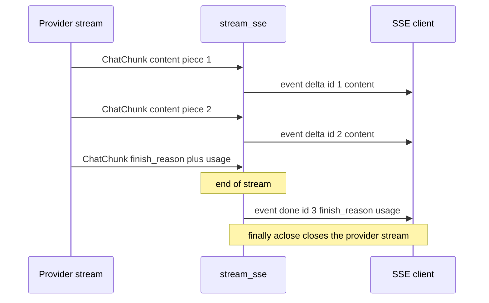
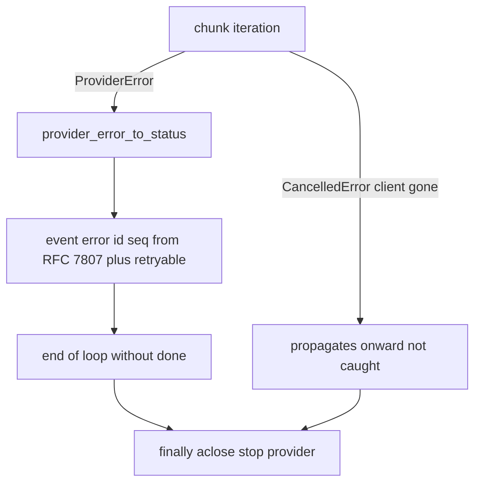

# Streaming SSE

What it's for: an AI model doesn't return the whole response at once, but as a stream of small pieces (chunks). This layer takes that stream and translates it into SSE events that the client browser understands. Nothing more. Pure transport translation — no DB writes, no turns, no state.

All the code lives in `app/core/conversations/streaming.py`, function `stream_sse`. The endpoint that fires it is described in [Endpoint POST chat-stream](endpoint-post-chat-stream.md).

## What stream_sse does

It takes an `AsyncIterator[ChatChunk]` (the stream from the provider, see [AI Gateway - message types](ai-gateway-message-types.md)) and turns it into a stream of SSE dicts. Each event has three fields: `event` (type), `id` (monotonic counter), `data` (JSON of the payload).

Three event types:

| Event | When | Payload | What it carries |
|---|---|---|---|
| `delta` | every chunk with non-empty text | `StreamDelta` | `content: str` — a piece of the response text |
| `done` | after the stream is exhausted | `StreamDone` | `finish_reason: str \| None`, `usage: Usage \| None` |
| `error` | provider failed mid-stream | `StreamError` | `title`, `status: int`, `detail: str`, `retryable: bool` |

Key rules:

- `delta` is sent **only** for non-empty `choice.delta.content`. Empty/None is skipped — no empty events.
- `finish_reason` is accumulated during the loop, sent only in `done`. The last non-empty one wins.
- `usage` (token counters) is usually set by the provider only in the terminal chunk — it also lands in `done`.
- `id` (monotonic seq) increments by 1 **before** each yield. This is the groundwork for a future resume via `Last-Event-ID`.
- After `error` the loop ends — there is no `done` after `error`.
- It takes only `chunk.choices[0]` (the first choice, no support for n>1).

`StreamError` has the shape of RFC 7807 (like [Error handling (RFC 7807)](error-handling-rfc-7807.md)) plus an extra `retryable`. The HTTP status of the whole response is already 200 (the SSE headers went out before the provider failed), so the error must travel in the body as an event, not as an HTTP code.

## Provider error mapping

The function `provider_error_to_status(exc) -> tuple[int, bool]` translates an exception from the `ProviderError` taxonomy (see [AI Gateway - error taxonomy](ai-gateway-error-taxonomy.md)) into an HTTP code and a `retryable` flag. It iterates the table via `isinstance`, fallback `(502, False)`.

| Exception | HTTP | retryable |
|---|---|---|
| `ProviderRateLimitError` | 429 | yes |
| `ProviderTimeoutError` | 504 | yes |
| `ProviderUnavailableError` | 502 | yes |
| `ProviderContextWindowError` | 400 | no |
| `ProviderBadRequestError` | 400 | no |
| `ProviderAuthError` | 502 | no |

`retryable=yes` = a transient problem on the upstream side (rate limit, timeout, unavailability) — a retry may succeed. Auth/bad-request/context-window won't be fixed by repeating.

## Client disconnect and cleanup

Two important things in the `try/finally`:

- **`CancelledError` (the client disconnected) is NOT caught.** `EventSourceResponse` throws it into the generator, and we let it propagate.
- **`finally` calls `chunks.aclose()`** — it closes the stream at the provider so it stops generating. Otherwise we'd be burning tokens and a connection on a response nobody is reading anymore.

`aclose` is taken defensively via `getattr(chunks, "aclose", None)` — not every `AsyncIterator` has that method.

## The real code

`app/core/conversations/streaming.py`

```python
async def stream_sse(chunks: AsyncIterator[ChatChunk]) -> AsyncGenerator[dict[str, str]]:
    seq = 0
    finish_reason: str | None = None
    usage = None
    try:
        async for chunk in chunks:
            choice = chunk.choices[0] if chunk.choices else None
            if choice is not None:
                if choice.finish_reason is not None:
                    finish_reason = choice.finish_reason
                if choice.delta.content:
                    seq += 1
                    yield _event("delta", seq, StreamDelta(content=choice.delta.content))
            if chunk.usage is not None:
                usage = chunk.usage
        seq += 1
        yield _event("done", seq, StreamDone(finish_reason=finish_reason, usage=usage))
    except ProviderError as exc:
        code, retryable = provider_error_to_status(exc)
        seq += 1
        yield _event(
            "error", seq, StreamError(title=HTTPStatus(code).phrase, status=code, detail=str(exc), retryable=retryable)
        )
    finally:
        aclose = getattr(chunks, "aclose", None)
        if aclose is not None:
            await aclose()
```

And building the event itself is a single helper:

```python
def _event(name: str, seq: int, payload: BaseModel) -> dict[str, str]:
    return {"event": name, "id": str(seq), "data": payload.model_dump_json()}
```

The format fits `sse_starlette.EventSourceResponse`.

## Note: detail in error is the provider's raw text

The structural fields (`content`, `finish_reason`, `status`) don't reveal which model or provider sits underneath. But `StreamError.detail` is `str(exc)` — raw text from the provider that **may name the real model**. The module is deliberately identity-agnostic so it can be shared with the masked write-path (tied to an evaluation). Therefore: a caller that masks the model identity **must sanitize `detail` itself** — `stream_sse` doesn't do it. The [write-path](message-persistence-write-path.md) already does: `persist_stream(..., mask=...)` swaps `detail` for generic text when the evaluation has `mask_models_enabled`.

## Diagram: chunk -> event



The mid-stream error path:



## What's not here

- **Persistence.** `stream_sse` creates no row, knows no turns or slots. Writing the stream is done by a separate write-path (`persist_stream` wraps the stream and finalizes the placeholder), tied to its own `POST .../messages` endpoint — not this stateless `chat/stream`. See [Message persistence (write-path)](message-persistence-write-path.md).
- **Domain logic.** It knows nothing about evaluations, scenarios, authorization. The endpoint does that before handing the stream to `stream_sse`.
- **Touching the DB.** The endpoint closes the database session (`await db.close()`) before firing the stream — `stream_sse` never reaches for it.

The full path from a client click to the last `done` is described in [Flow - AI message streaming (end-to-end)](../flows/flow-ai-message-streaming-end-to-end.md).

## Related

- [Endpoint POST chat-stream](endpoint-post-chat-stream.md)
- [AI Gateway - message types](ai-gateway-message-types.md)
- [AI Gateway - error taxonomy](ai-gateway-error-taxonomy.md)
- [Flow - AI message streaming (end-to-end)](../flows/flow-ai-message-streaming-end-to-end.md)
- [AI Gateway - dispatch](ai-gateway-dispatch.md)
- [Conversations](conversations.md)
- [Message persistence (write-path)](message-persistence-write-path.md)
- [Error handling (RFC 7807)](error-handling-rfc-7807.md)
