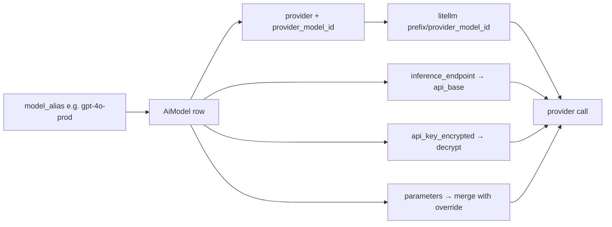
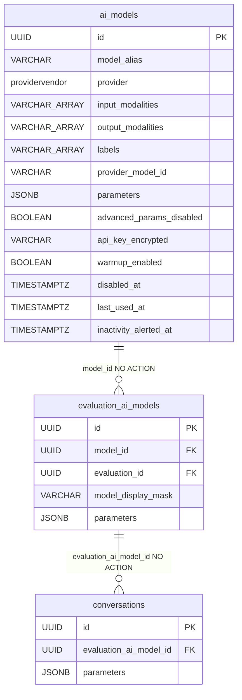

# AiModel

Registry of the AI models the platform talks to. One row = one model at some provider (OpenAI, Anthropic, a custom endpoint...), together with how to call it: endpoint, key (encrypted), default inference parameters.

[AI Gateway - dispatch](../components/ai-gateway-dispatch.md) reaches for a row when someone wants to talk to a model. The dispatch key is `model_alias` — a stable slug we look the model up by.

Table `ai_models`, code in `app/core/ai_gateway/models.py`, CRUD in `app/core/ai_gateway/services/ai_models.py`.

## Why an alias instead of the provider name

`model_alias` is our stable name (e.g. `gpt-4o-prod`), which dispatch uses to find the row. The real model at the provider lives in two other fields:

- `provider` — which vendor (enum, e.g. `openai`, `anthropic`).
- `provider_model_id` — the id the provider API expects (e.g. `gpt-4o-2024-08-06`).

The adapter assembles the litellm string `"<prefix>/<provider_model_id>"` out of this. This lets you swap the real provider model (change `provider_model_id`) without touching anything that calls by the alias. Mapping details in [AI Gateway - LiteLLM provider](../components/ai-gateway-litellm-provider.md).

## Columns

Beyond the common `id` / `created_at` / `updated_at` / `deleted_at` (from `BaseModel`, see [Data model overview](data-model-overview.md)):

| Field | Type | Meaning |
|---|---|---|
| `name` | VARCHAR(255) NOT NULL | display name; unique **globally** among live rows |
| `description` | TEXT NULL | operator prose about the model; absent from `EvaluationAiModelView`, the per-evaluation list a red-teamer reads |
| `model_alias` | VARCHAR(128) NOT NULL | stable slug, dispatch key; unique among live rows |
| `provider` | enum `providervendor` NOT NULL, idx | which vendor |
| `input_modalities` | VARCHAR[] NOT NULL, default `{text}` | what the model accepts in a prompt; must include `text` |
| `output_modalities` | VARCHAR[] NOT NULL, default `{text}` | what the model can return; must be non-empty |
| `provider_model_id` | VARCHAR(255) NOT NULL | model id on the provider API side |
| `endpoint_name` | VARCHAR(255) NULL | admin name on the provider side |
| `inference_endpoint` | VARCHAR(1024) NULL | custom URL → litellm `api_base`; **required when `provider` is `generic`** |
| `warmup_enabled` | BOOLEAN NOT NULL, default `false` | opt-in: this model's endpoint scales to zero, so warm it before the first message |
| `labels` | VARCHAR[] NOT NULL, default `{}` | free-form operator annotations shown as badges; no catalog — see below |
| `advanced_params_disabled` | BOOLEAN NOT NULL, default `false` | opts the row out of the whole inference-params cascade |
| `icon_file` | VARCHAR(255) NULL | hint for the frontend |
| `parameters` | JSONB NOT NULL, default `{}` | default inference knobs (from `InferenceParamsMixin`) |
| `extras` | JSONB NOT NULL, default `{}` | provider call-shape metadata; does NOT go to the provider |
| `api_key_encrypted` | VARCHAR(1024) NULL | JWE-encrypted key; NEVER in an HTTP response |
| `disabled_at` | TIMESTAMPTZ NULL | disable marker (separate from soft-delete) |
| `health_check_status` | enum `healthcheckstatus` NULL | `checking` / `alive` / `dead`; **NULL = never checked** |
| `last_health_check_at` | TIMESTAMPTZ NULL | when the last check **started** — doubles as the CAS token and the staleness clock |
| `last_health_reason` | VARCHAR(64) NULL | machine reason when dead (`auth`, `bad-request`, `context-window`, `cold/deadline`, `error`); NULL when alive |
| `last_healthy_at` | TIMESTAMPTZ NULL | when the endpoint was last confirmed alive |
| `capability_mismatch` | VARCHAR(255) NULL | verdict of the last capability probe; NULL = nothing contradicted the row (or nothing to probe) |
| `inactivity_alert_hours` | INTEGER NULL | per-model opt-in threshold for the inactivity alert; NULL = never alert |
| `last_used_at` | TIMESTAMPTZ NULL | last real message traffic (**not** warmups) |
| `last_warmup_at` | TIMESTAMPTZ NULL | last warmup probe, stamped at most every 5 minutes |
| `inactivity_alerted_at` | TIMESTAMPTZ NULL | episode marker: set when an alert fires, cleared by traffic or by restoring any disarm knob |

Two key distinctions:

- `parameters` vs `extras` — `parameters` are inference knobs (temperature, top_p...) that go to the provider. `extras` is metadata about the call shape (auth/apiUrl/body) and is NOT forwarded. Cascade details in [AI Gateway - inference parameters](../components/ai-gateway-inference-parameters.md).
- `disabled_at` vs `deleted_at` — two different mechanisms. `disabled_at` = "temporarily disabled, can be re-enabled". `deleted_at` = soft-delete (tombstone). Dispatch treats BOTH as "unavailable" and raises `NotFoundError`.
- `warmup_enabled` — an explicit operator toggle (not derived from `provider`), so it survives model masking: the assignment view can tell a red-teamer "warm this one first" without leaking that the endpoint is a self-hosted / serverless GPU box. Drives the warmup probe — see [AI Gateway - overview](../components/ai-gateway-overview.md#warming-up-scale-to-zero-endpoints).
- `input_modalities` / `output_modalities` — the declared capability sets, replacing the old single `modality` enum plus `supports_image_input` boolean. `input_modalities` gates image attachments, `output_modalities` gates dispatch (which needs a text reply). `input_modalities` is surfaced through masking like `warmup_enabled` — a capability set the chat composer needs (offer attachments or not), not an identifier; `output_modalities` is deliberately **not** surfaced there, since the composer has no use for it and it would only widen the fingerprint.

## Modality sets

`Modality` (`text` / `image`) is a *kind of content*, and a declaration is a **set**:

- Held as **`varchar[]` array columns, not a DB enum**, so adding a modality (audio, video) is a code change instead of an `ALTER TYPE`. The cost: the column no longer refuses an out-of-set value at write time while every read path stays strict — so `AiModelResponse.from_model` logs the offending row id/alias before re-raising the `ValidationError`, because on the list route the projection runs inside a page comprehension and one bad row would otherwise 500 every page it appears on, naming nothing to fix.
- **Canonicalised at the schema edge**: deduped and re-sorted into enum order, so equal declarations store and render identically. An input set must include `text` (every dispatched call carries a text prompt); an output set must be non-empty. Both hold on create **and** on PATCH, which replaces a set wholesale rather than merging into it. Nothing detects any of this — it is an operator declaration.
- The retired `modality` / `supports_image_input` fields are **actively rejected** (422) on create and update rather than ignored. The payload models accept extras, so silently dropping them would apply the permissive text/text default to a row whose author declared image output — i.e. dispatch a chat completion to an image endpoint. The console's bulk import forwards a pasted object verbatim, so last cycle's config file reaches the API unchanged.

## Free-form `labels`

Operator annotations — "self-hosted", "fine-tuning needed" — rendered as badges on the registry view. There is **no label catalog**: the set a console offers is `DISTINCT unnest(labels)` over the live rows, so a label exists exactly as long as some model carries it (`GET /api/v1/ai-models/labels`).

Canonical form — sanitised, deduped case-insensitively, sorted — is enforced by the **request schemas**, like the modality sets; the column itself enforces neither.

> Contrast [AnnotationLabel](annotation-label.md), the *other* label vocabulary: that one is a table with stable ids, because an annotation has to point at an entry and an external taxonomy has to be reconcilable against it. This one is emergent and needs neither.

## Opting out of the params cascade

`advanced_params_disabled` drops the **whole operator-set cascade** for this row — its own `parameters` and everything a caller merged on top. Enforced in exactly one place, `_build_call` in [AI Gateway - dispatch](../components/ai-gateway-dispatch.md), which every provider call funnels through, so a new param source upstream cannot bypass it:

```python
merged = {} if model.advanced_params_disabled else merge_inference_params(model.parameters, params)
```

Stored overrides are **kept, not deleted**, so flipping the flag back restores them. Reads that advertise inheritable params (`EvaluationAiModelView.effective_parameters`) project empty for such a model.

The corollary matters for anything the *platform* adds to a call: gateway-owned context (the [conversation tag](../components/conversation-tags.md) block, the probe's token cap) must travel on its own channel — `dispatch_*`'s `system_suffix`, or applied after `_build_call` — because `params` is exactly what this flag suppresses.

## `generic` needs an `inference_endpoint`

A `generic` row routes through litellm's `openai` prefix with a caller-supplied `api_base`, so without the URL it can never dispatch — `MissingInferenceEndpointError` (**400**) on create, and on a PATCH that touches `provider` or `inference_endpoint` (checked on the *merged* row, since a partial patch may supply either half). An untouched endpoint is never re-validated, so a row predating the rule stays editable. The other vendors resolve a base from the prefix alone, or outside `Settings` entirely (litellm reads `AZURE_API_BASE` itself), which is why the rule is scoped to `generic`.

**The rule is advisory, not an invariant**: there is no `CHECK` constraint and no backfill, so a legacy row may still hold NULL. Hence the same `missing_inference_endpoint` predicate also guards dispatch — without it such a row would ride the `openai` prefix with `api_base=None` and no credential of its own, i.e. red-team OpenAI on the platform key. The URL itself is only **scheme-checked** (`http(s)`, at the edge, surrounding whitespace stripped so a pasted URL doesn't fail opaquely at litellm); the error carries a field-addressable `errors[]` entry so a form can map it onto the field.

## Disabling vs deleting

```python
def disable(self) -> None:
    self.disabled_at = datetime.now(UTC)


def enable(self) -> None:
    self.disabled_at = None


@property
def is_disabled(self) -> bool:
    return self.disabled_at is not None
```

`disable()` / `enable()` only stamp the column — the caller does the flush/commit itself. `is_disabled` is a derived property, which is why an update goes through `disable()`/`enable()`, not through a raw `setattr`.

## Health check (the four `*health*` columns)

`POST /api/v1/ai-models/{id}/health-check` (gated `models:update`) probes the endpoint for liveness and settles the four columns above. The row **is** the whole state store — there is no job table:

1. The route locks the row `FOR UPDATE`, stamps `health_check_status = checking` + `last_health_check_at = now`, and enqueues the Celery task (`202`). A check started less than `health_check_task_time_limit_seconds` ago is *fresh in flight*, so the request is idempotent (`200`, no second task). Disabled models are checkable on purpose — you verify an endpoint before enabling it.
2. `run_health_check` loops a 1-token probe (`dispatch_health`) every `HEALTH_CHECK_BACKOFF_SECONDS` up to `HEALTH_CHECK_WAKE_DEADLINE_SECONDS`, waiting out a scale-to-zero cold start, then writes `alive` / `dead` (+ `last_health_reason`, and `last_healthy_at` when alive).
3. An endpoint that **served** the text probe and whose row claims image input additionally gets a **capability probe** — see below.
4. The settle is a **CAS on `last_health_check_at`** (the start stamp): a check superseded by a newer one updates nothing and just logs `health_check.superseded`.

Because the abandonment horizon is *derived* from the task's hard `time_limit`, a killed task never leaves a row stuck in `checking` — the next request may override it. Details: [AI Gateway - dispatch](../components/ai-gateway-dispatch.md), [Celery workers](../components/celery-workers.md).

Distinct from `warmup_enabled`, which is the automatic pre-message warmup probe: the health check is a manual, operator-triggered diagnosis whose verdict is persisted.

### The capability probe → `capability_mismatch`

`dispatch_capability_probe` re-sends the *same* call with a 1×1 transparent PNG attached, capped at one token. It has **three** outcomes, not two:

| Outcome | Meaning | Written |
|---|---|---|
| `(True, None)` | the endpoint took the image | `capability_mismatch = NULL` |
| `(True, reason)` | it refused it (`ProviderBadRequestError`) | `capability_mismatch = reason` (truncated to 255 with a trailing `…`, marked so an operator can tell a cut from the whole message) |
| `(False, None)` | the probe learned nothing | **nothing** — the stored finding is kept |

It is conclusive **only** because it is *differential*: the health probe has just made the identical call minus the image part and been served, so a 400 here is attributable to the image or the content-part shape. A liveness verdict that came from a rate limit does not carry that premise, which is why `ProviderRateLimitError` maps to `(READY, "rate-limit")` — the reason is never persisted, its *presence* is the signal that skips the capability probe.

Deliberately **not** folded into `health_check_status`: an endpoint that answers but refuses an image is alive, and "fix the endpoint" vs "fix the declaration" are different remedies. The reason carries the upstream text rather than a verdict, since an endpoint may reject the `data:` URI or the multimodal shape while the model behind it does have vision.

`PROBED_CALL_FIELDS` — `input_modalities`, `inference_endpoint`, `provider`, `provider_model_id` — is the single definition of what the verdict is a function of. A finding survives only while all four still hold; the same tuple drives the clear in `update_model`, the settle guard in `run_health_check` and the re-check trigger on the routes, so the three cannot drift apart. The credential and the merged `params` shape the call too and stay out — neither decides acceptance.

## Inactivity alerting

A warmup-enabled endpoint can be kept warm — and billable — long after the last real message, so dispatch stamps the traffic:

| Stamp | Written by | Why kept apart |
|---|---|---|
| `last_used_at` | real message traffic (`dispatch_chat` / `dispatch_stream`) | resets the quiet clock and clears `inactivity_alerted_at` |
| `last_warmup_at` | warmup probes (`dispatch_probe`), at most every 5 minutes | a warmup is what makes an unused model *look* active, so it must **not** reset the clock |

Both go through a detached `standalone_session`, because the streaming call sites close the request session uncommitted; the usage stamp fires as iteration begins — after both call sites `db.close()` — so its checkout never nests inside a held request connection. All three system writes pin `updated_at`, so that public timestamp keeps meaning "last admin edit". The stamp is best-effort and never raises: a lost stamp costs at most one spurious alert.

A Celery beat sweep (`check_model_inactivity`, every `MODEL_INACTIVITY_CHECK_INTERVAL_SECONDS`) alerts every holder of `models:update` + `models:read` once a model passes its own opt-in `inactivity_alert_hours` — in-app notification plus email, **once per episode**. A model that never carried traffic is measured from `created_at`, so a registered-but-forgotten endpoint alerts too. The claim UPDATE re-checks the *whole* inactive predicate rather than just the stamp, so traffic landing mid-sweep loses the row — which is also what makes the sweep safe under `acks_late` redelivery and overlapping beat ticks. Real traffic, or restoring any disarm knob (enable, warm-up, threshold, undelete), re-arms it. Disabling the model stays a human decision.

```python
def enable(self) -> None:
    # Only on a real disabled→enabled transition: the console sends `is_disabled`
    # on every save, so a no-op enable must not restart the episode.
    if self.disabled_at is not None:
        self.inactivity_alerted_at = None
    self.disabled_at = None


def restore(self) -> None:  # unconditional — only ever runs on a genuine tombstone
    super().restore()
    self.inactivity_alerted_at = None
```

## API key — encryption and precedence

The key never sits in the database in plaintext. `api_key_encrypted` holds JWE compact in the format `<kid>:<jwe>`, encrypted with a key derived from the `MODEL_SECRETS_KEY` secret. Full description in [AI Gateway - key encryption](../components/ai-gateway-key-encryption.md).

In an HTTP response the key NEVER comes back — `AiModelResponse` collapses it to a `has_api_key` bool.

At dispatch the key is resolved by `resolve_api_key(model, settings)`:

1. Has its own `api_key_encrypted` → decrypt and use it (env-var fallback NOT consulted).
2. No own key → fall back to `<provider>_api_key` from `Settings` (huggingface/google/openai/anthropic/azure/cohere).
3. Provider without a fallback (`aws_bedrock` via IAM, `generic` caller-supplied) → `None`.

Important security decision: if decrypting the model's own key fails, that's a **hard error** (not a silent fallback to env). Silently using the env key after an at-rest rotation would route traffic with the wrong credential.

## Mapping the alias to a call



The logic that assembles the call (the modality + base-URL gates, parameter merge, translating `system_prompt`/`stop_sequences`) is held by `_build_call` in [AI Gateway - dispatch](../components/ai-gateway-dispatch.md).

## Indexes and soft-delete

Two partial-unique indexes with `WHERE deleted_at IS NULL`: `ix_ai_models_name` and `ix_ai_models_model_alias`. So uniqueness applies only among live rows — a soft-deleted model does not block registering a new one with the same key.

**`name` is globally unique again**, dropping the `provider` half of the old composite `ix_ai_models_name_provider`. Two registry rows called `GPT-4o` under different vendors were indistinguishable in every picker, so the display name is now the business key on its own — and the bulk API-key upload consequently targets its model by `name` alone, no longer by a `(name, provider)` pair.

`live_select()` (from `BaseModel`) filters out tombstones. Dispatch additionally rejects disabled ones. More on the pattern in [Database and sessions](../components/database-and-sessions.md).

**Restore**: `?deleted=true` on the list (privileged like `include_disabled` — 403 without `models:delete`, and it lifts the disabled filter) plus `POST /api/v1/ai-models/{model_id}/restore`. Deliberately **shallow** — it brings the registry row back, never the assignments / group-subset rows / conversations its delete cascaded to — and **409**s if a live model has taken its `name` or `model_alias` meanwhile. See [Restore - reading tombstones back](../components/restore-soft-deleted-items.md).

## Relation to the rest of the data model

`AiModel` does not hang on its own — a model is assigned to an evaluation through the join table [EvaluationAiModel](evaluation-ai-model.md) (`evaluation_ai_models.model_id → ai_models.id`). That's where the per-assignment parameter override and the model identity mask live. A second join, [EvaluationGroupAiModel](evaluation-group-ai-model.md), says which models an evaluation *group* may pick from at all — the allowed-model subset that gates every assignment.



The FK `evaluation_ai_models.model_id → ai_models.id` deliberately has NO DB-side `ON DELETE CASCADE`. Deleting a model goes through an application-level cascading soft-delete: DELETE model → `unassign_models_for_model` (remove from evaluations) → `unassign_group_models_for_model` (remove from every group's [allowed-model subset](evaluation-group-ai-model.md), which may leave a group's subset empty and therefore closed) → soft-delete the conversations that picked those assignments. Thanks to this invariant the `ai_model` relation on an assignment is loaded **without** `with_live` — a live assignment always has a live model.

## Parameter cascade

`parameters` on `AiModel` is the **baseline** (lowest layer). On top of it come the overrides from `EvaluationAiModel` (per-assignment), then from `Conversation` (most-specific). At dispatch the most specific layer wins, with call-time params on top of that. Full description in [AI Gateway - inference parameters](../components/ai-gateway-inference-parameters.md).

A write to any `parameters` column always goes through `dump_inference_params` (`exclude_none`), never a raw `model_dump` — this keeps only the knobs you actually override in the database, without `null`.

## Related

- [EvaluationAiModel](evaluation-ai-model.md) — assigning a model to an evaluation (join + override params + mask)
- [EvaluationGroupAiModel](evaluation-group-ai-model.md) — the group's allowed-model subset (gates every assignment)
- [AI Gateway - dispatch](../components/ai-gateway-dispatch.md) — the gateway's entry point, maps the alias to a provider call
- [AI Gateway - key encryption](../components/ai-gateway-key-encryption.md) — how `api_key_encrypted` is encrypted (JWE)
- [AI Gateway - inference parameters](../components/ai-gateway-inference-parameters.md) — the `parameters` cascade model → assignment → conversation
- [AI Gateway - LiteLLM provider](../components/ai-gateway-litellm-provider.md) — the adapter that assembles the model string and `api_base`
- [AI Gateway - overview](../components/ai-gateway-overview.md) — the whole LLM integration layer
- [Conversation](conversation.md) — the red-teamer's session, the most specific layer of the cascade
- [AnnotationLabel](annotation-label.md) — the *other* label vocabulary, a table rather than an emergent set
- [Restore - reading tombstones back](../components/restore-soft-deleted-items.md) — the shallow model restore
- [Notification](notification.md) / [Email](../components/email.md) — where an inactivity alert lands
- [Data model overview](data-model-overview.md) — ERD of the whole data model
- [API - overview and conventions](../components/api-overview-and-conventions.md) — the `/v1/ai-models` endpoints
