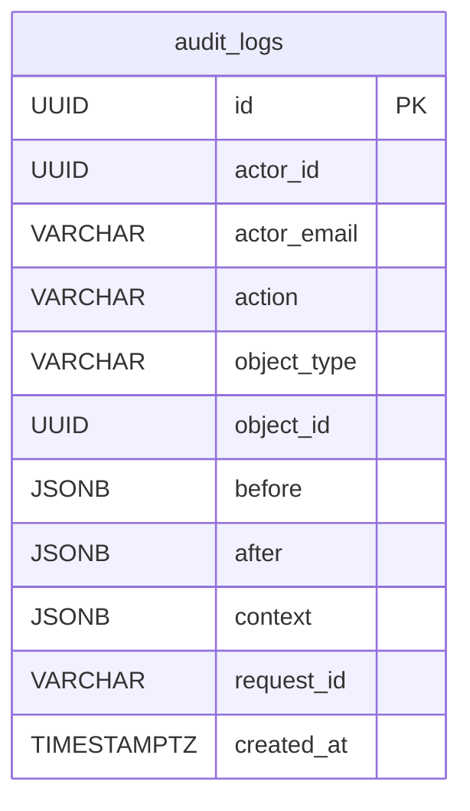

# AuditLog

One append-only record of a sensitive action or access: the actor, the `action` (a `domain.verb` string), the polymorphic target, a curated before/after snapshot, and the correlating `request_id`. The trail is deliberately **FK-less** and **never mutated or soft-deleted** — it must outlive the actor and target it references.

Table: `audit_logs`, model: `app/core/audit/models.py`. Component note: [Audit log](../components/audit-log.md).

## What it is for

A durable "who did what to what, and when" for security-relevant operations across identity, evaluation groups, evaluations, reviews, and asset access. Written two ways — mutating handlers call `record_audit(...)` atomically, reads/accesses are captured by `AuditAccessMiddleware` — and read back only by an admin (`GET /api/v1/audit-logs`).

## Columns

Inherits `BaseModel` (`id` UUID, `created_at`, `updated_at`, `deleted_at`), but the trail is **append-only**: `created_at` is the event time; `updated_at` and `deleted_at` stay inert (never updated, never tombstoned — accepted, we only reuse `id`/`created_at`). Beyond that:

| Column | Type | Notes |
|---|---|---|
| `actor_id` | UUID NULL | the human actor; NULL for system / unauthenticated events (e.g. a failed login). **No FK**, indexed |
| `actor_email` | VARCHAR(320) NULL | denormalised for readability without a join |
| `action` | VARCHAR(64) NOT NULL | a `domain.verb` string from the `AuditAction` catalog — plain text, not a PG enum; indexed |
| `object_type` | VARCHAR(64) NULL | polymorphic target type (same shape as `ObjectRoleAssignment`) |
| `object_id` | UUID NULL | polymorphic target id — **no FK**; NULL for target-less actions |
| `before` | JSONB NULL | curated non-secret pre-state (mutations only; NULL for access events) |
| `after` | JSONB NULL | curated non-secret post-state |
| `context` | JSONB NOT NULL | extra non-secret metadata; `server_default '{}'` |
| `request_id` | VARCHAR(64) NULL | correlates with the `http_request` access log's `request_id`; indexed |

Indexes: `ix_audit_logs_object` (composite `object_type, object_id`), `ix_audit_logs_created_at`, plus the single-column `action` / `actor_id` / `request_id` indexes.

## No foreign keys — by design

Not a single FK. The trail must survive the deletion of whatever it references — a removed user or evaluation cannot cascade-drop its audit history. The target is **polymorphic** (`object_type` + `object_id`, no FK), the actor is denormalised (`actor_id` + `actor_email`). This mirrors `outbound_emails` (also FK-less, JSONB, `BaseModel`).

`before`/`after` are curated snapshots (never whole rows, credentials or tokens): **secret-free, but not PII-free** — identifying fields are deliberate attribution, retained under a deferred retention / right-to-erasure policy.

## Not a DB enum

`action` (and `object_type`) are free-text `VARCHAR(64)`, validated on the write side against the `AuditAction` StrEnum but stored as plain strings — so the catalog grows without an `ALTER TYPE` migration. See [Audit log](../components/audit-log.md).

## Relationships

None in the schema — the FK-less design means no ERD edges. `actor_id` / `object_id` point at users / various tables only by convention, enforced nowhere in the DB:

## Related

- [Audit log](../components/audit-log.md) — the two write paths, the middleware, the service, the API
- [Email](../components/email.md) — `outbound_emails`, the FK-less append-only row this is modelled on
- [Middleware, logging and request cycle](../components/middleware-logging-and-request-cycle.md) — the `request_id` this correlates with
- [Data model overview](data-model-overview.md) — the full ERD
