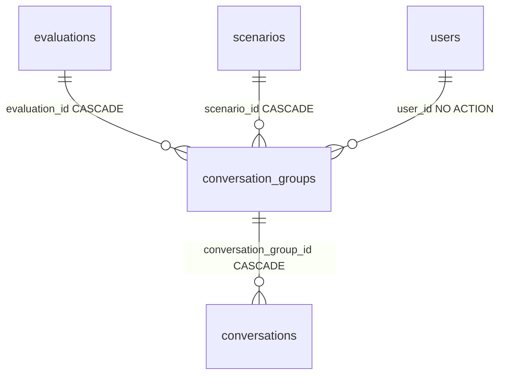

# ConversationGroup

A named bucket grouping a red-teamer's [conversations](conversation.md) within one [Evaluation](evaluation.md). Every `Conversation` belongs to **exactly one** group (`conversation_group_id` is required). The motivating case is **comparative model testing** — one conversation per model on the same prompt, grouped together — but the group is just a named bucket: it owns a `name` and the (required, shared) scenario, while each member conversation keeps its own inference-params layer and message history. Table `conversation_groups`, model `app/core/conversations/models.py`.

## Columns

| Column | Type | FK | On delete | Note |
|---|---|---|---|---|
| `id`, `created_at`, `updated_at`, `deleted_at` | — | — | — | `BaseModel` (UUID PK, soft-delete) |
| `user_id` | UUID | `users.id` | NO ACTION | owner, indexed |
| `evaluation_id` | UUID | `evaluations.id` | CASCADE | parent evaluation, indexed |
| `scenario_id` | UUID | `scenarios.id` | CASCADE | **required** shared scenario, indexed — every member conversation carries the same one |
| `name` | VARCHAR(255) | — | — | required |

The `conversations` relationship is eager-loadable (ordered by `Conversation.created_at`); load it with `with_live(Conversation)` so soft-deleted members don't show.

## Lifecycle and invariants

- **Created with ≥1 conversation** — the create endpoint takes `models[]` (one conversation per entry, the same model may repeat). See [Conversation groups](../components/conversation-groups.md).
- **Members change over its life**: added via the conversation create endpoint, **moved** to another group of the same evaluation via the conversation PATCH, removed via the conversation delete — all in [Conversations](../components/conversations.md).
- **Always ≥1 live conversation**: when the last live member leaves (move or delete), the group is soft-deleted (`soft_delete_empty_groups`). Deleting the group cascade-soft-deletes its members (`conversation_group_id` is `ON DELETE CASCADE`). So a live conversation never dangles under a dead group, and an empty group never lingers.
- **Size cap**: `MAX_CONVERSATION_GROUP_SIZE` (default 4) bounds members — enforced on batch-create and on add/move (a full group → 409). See [Configuration (Settings)](../components/configuration-settings.md).
- Only `name` is editable (PATCH on the group); the evaluation/scenario links and the member set are immutable. A conversation may be **moved** into another group of the same evaluation — and of its own scenario: a target group sitting on another scenario is a **409**, not a 404.

## Related

- [Conversation](conversation.md)
- [Conversation groups](../components/conversation-groups.md)
- [Conversations](../components/conversations.md)
- [Evaluation](evaluation.md)
- [Data model overview](data-model-overview.md)
