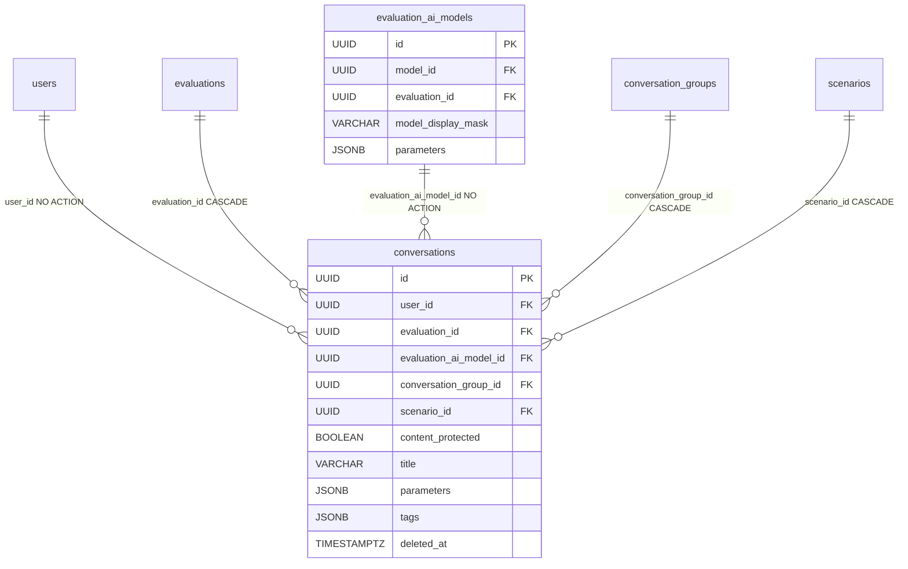
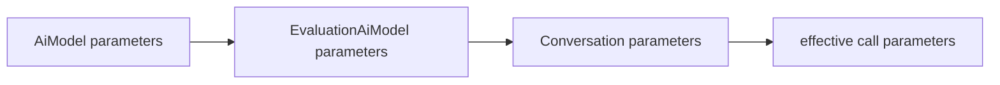

# Conversation

A red-team session with one AI model within one evaluation. Put more plainly: who, in which evaluation, against which assigned model and in which scenario, is running a conversation. It's a durable row in the database. The message history hangs below it in separate `turns`/`messages` tables ([Turn](turn.md), [Message](message.md)) — written by the [write-path](../components/message-persistence-write-path.md) via `POST .../conversations/{cid}/messages` (+ `/regenerate`, `/continue`). The stateless `POST /api/v1/chat/stream` is a separate track — it persists nothing ([Streaming SSE](../components/streaming-sse.md)).

Table: `conversations`, model: `app/core/conversations/models.py`. Created empty. There's a separate note about conversation CRUD, [Conversations](../components/conversations.md), and message streaming is described in [Streaming SSE](../components/streaming-sse.md).

## Fields (beyond the common ones)

Inherits `BaseModel` (`id`, `created_at`, `updated_at`, `deleted_at`, soft-delete) plus `InferenceParamsMixin` (the `parameters` JSONB column).

| Column | Type | FK | ON DELETE | Note |
|---|---|---|---|---|
| `user_id` | UUID | `users.id` | none (NO ACTION) | session owner, indexed |
| `evaluation_id` | UUID | `evaluations.id` | CASCADE | kept explicitly despite redundancy |
| `evaluation_ai_model_id` | UUID | `evaluation_ai_models.id` | none (NO ACTION) | assignment, NOT the bare model |
| `conversation_group_id` | UUID | `conversation_groups.id` | CASCADE | **required**, indexed (`ix_conversations_conversation_group_id`) — every conversation belongs to exactly one group |
| `scenario_id` | UUID | `scenarios.id` | CASCADE | **required**; usually outlives a tombstoned scenario |
| `content_protected` | BOOL | — | — | NOT NULL, default `false` — resolved from the effective licence at create, never re-derived |
| `title` | VARCHAR(255) or NULL | — | — | optional caller-supplied label; nullable (NULL = no label) |
| `parameters` | JSONB | — | — | the most specific layer of the cascade |
| `tags` | JSONB | — | — | NOT NULL, `server_default '{}'` — free-form `key: value` prompt context |

Every conversation belongs to exactly one [ConversationGroup](conversation-group.md) — `conversation_group_id` is `NOT NULL`, set at creation and movable to another group of the same evaluation. The grouping lifecycle (batch-create, move, prune-on-empty) lives in [Conversation groups](../components/conversation-groups.md).

```python
class Conversation(BaseModel, InferenceParamsMixin, table=True):
    __tablename__ = "conversations"

    user_id: uuid.UUID = Field(foreign_key="users.id", nullable=False, index=True)
    evaluation_id: uuid.UUID = Field(foreign_key="evaluations.id", nullable=False, ondelete="CASCADE", index=True)
    evaluation_ai_model_id: uuid.UUID = Field(foreign_key="evaluation_ai_models.id", nullable=False, index=True)
    conversation_group_id: uuid.UUID = Field(
        foreign_key="conversation_groups.id", nullable=False, ondelete="CASCADE", index=True
    )
    scenario_id: uuid.UUID = Field(foreign_key="scenarios.id", nullable=False, ondelete="CASCADE", index=True)
    title: str | None = Field(default=None, max_length=255)
    tags: dict[str, str] = Field(
        default_factory=dict,
        sa_type=JSONB,
        sa_column_kwargs={"nullable": False, "server_default": text("'{}'::jsonb")},
    )
```

`title` is an optional label — nullable, so `NULL` legitimately means "no label". Editing it is tri-state on PATCH (omit = unchanged, string = set, explicit `null` = clear), mirroring `Evaluation.data_license_id`; see [Conversations](../components/conversations.md). It's filterable (case-insensitive substring) and sortable on the conversation list.

## Why an assignment, not a bare AiModel

`evaluation_ai_model_id` targets `evaluation_ai_models` (the `Evaluation ⇄ AiModel` join), not `ai_models`. This is a key decision — see [EvaluationAiModel](evaluation-ai-model.md):

- the conversation inherits the assignment's **masking** (the model alias shown to the red-teamer instead of the real name),
- the conversation inherits the assignment's **parameter layer** in the inference cascade.

The price of this decision: the assignment lies **outside** the `evaluation → group` graph, so visibility (`join_visible_evaluation_group`) won't catch deletion of the assignment. Hence two explicit soft-delete cascades in the code (see below).

## Inference parameter cascade

`Conversation` is the **most specific** layer. The effective parameters are computed like this:

```
merge_inference_params(ai_model.parameters, assignment.parameters, conversation.parameters)
```

The merge is most-specific-last and two-state: a present key overrides, an absent one inherits from above. There's no "clear" state. The `parameters` column is `NOT NULL` with `server_default '{}'::jsonb`, so an empty dict means "inherit everything". Merge details in [AI Gateway - inference parameters](../components/ai-gateway-inference-parameters.md).

A PATCH on a conversation **replaces the entire override layer** (`{}` clears it), it doesn't merge. Omitting the `parameters` field in the payload = leave unchanged (the validator rejects an explicit `null` → 422, because the column is `NOT NULL`).

## Tags — prompt context, not metadata

`tags` is a free-form `key: value` map the dispatch layer folds into the model's **system prompt**, so it changes what the model is told. It behaves like `parameters` on the write side: a PATCH replaces the map wholesale (`{}` clears), omitting it leaves the row alone, and an explicit `null` is a 422 (NOT NULL column). Bounded at the schema edge (16 keys, 512-char values, 10 KiB serialised) and sanitised at both the write edge and the prompt boundary, so *stored == returned == sent*.

What the evaluation allows is a separate axis: with `tags_enabled=false` every tag write is rejected, and with `tags_restricted=true` every key must be in the evaluation's [EvaluationTagKey](evaluation-tag-key.md) set. Tags already stored when a policy tightens **stay on the row** but stop reaching the model. A tag change is the one conversation write that is audited (`conversation.tags_update`). Full rules: [Conversation tags](../components/conversation-tags.md).

## Soft-delete and cascades

The row doesn't physically disappear — `deleted_at` marks it. `evaluation_id` has DB-side `ON DELETE CASCADE`, so a hard delete of the evaluation will pull the conversations along. But two FKs deliberately have no `ondelete` and are handled by application code:

- deleting an assignment → `soft_delete_conversations_for_assignment(evaluation_ai_model_id)`. Wiring: the `unassign` route in `app/api/v1/evaluations.py`.
- deleting an AI model → `soft_delete_conversations_for_model(model_id)` (subquery on `EvaluationAiModel.model_id`). Wiring: the `delete_model` route in `app/api/v1/ai_models.py`.

Reason: these paths are outside the visibility graph, so the query filter would miss them on its own. `scenario_id` with `CASCADE` only governs hard-delete (which in practice arrives via the evaluation's own cascade anyway) — normally a scenario is soft-deleted and the link deliberately points at a tombstone (a historical record: which challenge the attempt concerned). The column is **NOT NULL**: a conversation targets exactly one challenge, and the read path never resolves it.

## Effective license (inherited, not stored)

A conversation has no license column. `ConversationResponse` carries `effective_license`, inherited from its [evaluation](evaluation.md) via the three-layer cascade (the evaluation's `data_license` override → its group's → the platform default). See [Data licensing & platform settings](../components/licenses.md).

## Denormalization of evaluation_id

`evaluation_id` could be derived from the assignment or the scenario, but it's kept explicitly. Reason: owner/visibility listings come down to a single join. Consistency is guaranteed by the `create_conversation` service — it validates that the assignment and the scenario actually belong to this evaluation — and the create is posted to `/api/v1/scenarios/{scenario_id}/conversations`, so the evaluation is *derived from* the resolved scenario rather than supplied beside it, so the denormalization can't drift apart.

## Relationship diagram



The parameter-layer cascade (inheritance direction):



## Message history

A conversation starts empty. The history schema is `conversations → turns → messages` ([Turn](turn.md), [Message](message.md)); it's written by the [write-path](../components/message-persistence-write-path.md) via `POST .../conversations/{cid}/messages` (+ `/regenerate`, `/continue`), which opens a turn, streams the model's response and finalizes the placeholder (architecture A/B). The stateless `POST /api/v1/chat/stream` is a separate track — it persists nothing, it only translates chunks into SSE events ([Streaming SSE](../components/streaming-sse.md), [Endpoint POST chat-stream](../components/endpoint-post-chat-stream.md)).

## Related

- [Conversations](../components/conversations.md)
- [Conversation tags](../components/conversation-tags.md)
- [EvaluationTagKey](evaluation-tag-key.md)
- [Conversation groups](../components/conversation-groups.md)
- [ConversationGroup](conversation-group.md)
- [Turn](turn.md)
- [Message](message.md)
- [Message persistence (write-path)](../components/message-persistence-write-path.md)
- [EvaluationAiModel](evaluation-ai-model.md)
- [Streaming SSE](../components/streaming-sse.md)
- [AI Gateway - inference parameters](../components/ai-gateway-inference-parameters.md)
- [Endpoint POST chat-stream](../components/endpoint-post-chat-stream.md)
- [Evaluation](evaluation.md)
- [Data licensing & platform settings](../components/licenses.md)
- [Scenario](scenario.md)
- [Conversation content sealing](../components/conversation-content-sealing.md) — what `content_protected` switches on
- [AiModel](ai-model.md)
- [Data model overview](data-model-overview.md)
