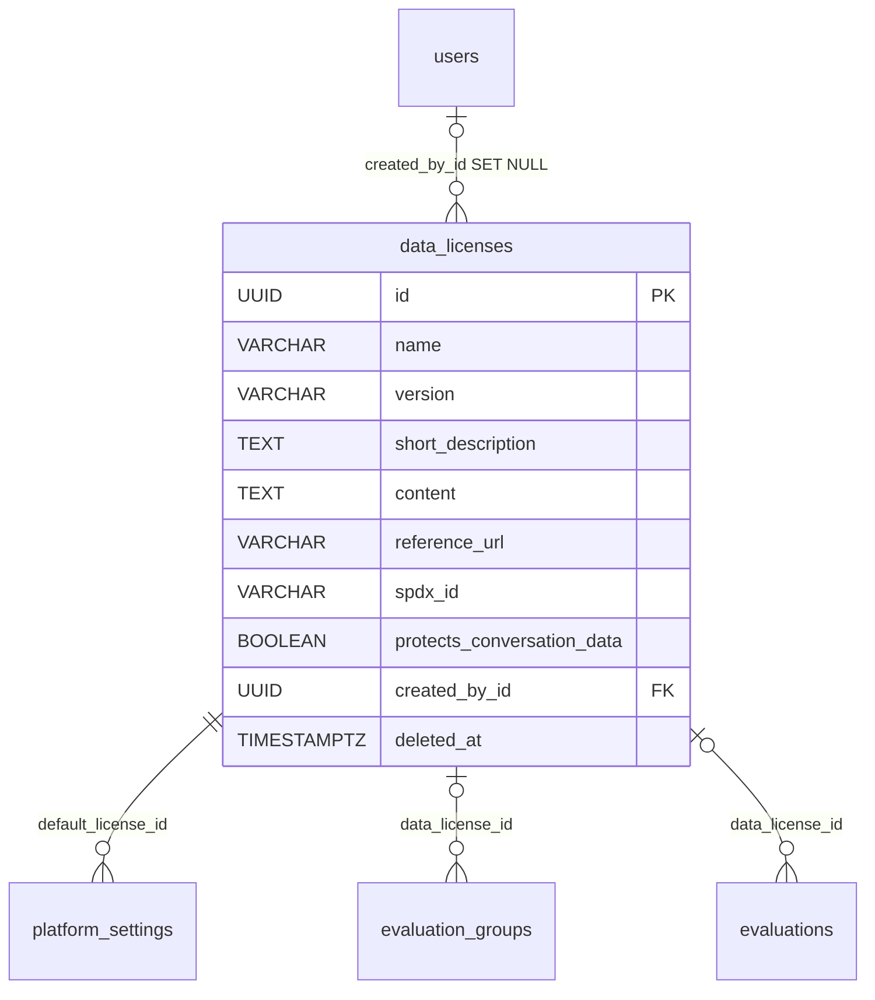

# DataLicense

One data license the platform offers for red-teaming data — a row, not a code constant. Two kinds live in the same table: **curated** licenses shipped in code (the CC / ODC / CDLA set) and **user-authored** ones an owner writes. Groups, evaluations, and the platform-default singleton reference a row by id.

Table: `data_licenses`, model: `app/core/licenses/models.py`. Component note: [Data licensing & platform settings](../components/licenses.md).

## Columns

Inherits `BaseModel` (`id` UUID, `created_at`, `updated_at`, `deleted_at` soft-delete). Beyond that:

| Column | Type | Notes |
|---|---|---|
| `name` | VARCHAR(255) NOT NULL | human-readable title |
| `version` | VARCHAR(64) NULL | e.g. `4.0` |
| `short_description` | TEXT NOT NULL | one-line gist shown in the picker |
| `content` | TEXT NOT NULL | the full legal text (omitted from the list projection) |
| `reference_url` | VARCHAR(1024) NULL | canonical URL of the text |
| `protects_conversation_data` | BOOL NOT NULL, default `false` | licences that forbid redistributing raw conversations; message text of conversations written under one is [sealed at rest](../components/conversation-content-sealing.md). Export *authority* is unaffected |
| `spdx_id` | VARCHAR(64) NULL | only a curated row can carry one — and not every curated row does, since a catalog entry with `publishes_spdx=False` is upserted with NULL; partial-unique among live rows |
| `created_by_id` | UUID NULL FK → `users.id` (`SET NULL`) | the author; **NULL marks a curated row** |

## Curated vs user-authored — one column tells them apart

`created_by_id IS NULL` **is** the curated marker (a user-authored row never carries an `spdx_id`; a curated one usually does, but may not — see the `No license` sentinel):

- **Curated** — defined in `app/core/licenses/catalog.py` as `CuratedLicense` entries and reconciled into the table by `sync_licenses` (`make synclicenses`, a deploy step after `migrate` and part of `seedlocal`). The row id is **deterministic**: `curated_license_id(spdx) = uuid5(_CURATED_NAMESPACE, spdx)`, so the same license has the same id in every environment and no UUID literals need syncing between the seed, the resync, and any backfill. Never *deletable* through the API, and almost never editable — a resync would revert the change anyway. The one exception: a `licenses:manage` holder may fill in the `content` of an entry **the catalog ships without text** (`curated_ships_content`), and `sync_licenses` drops `content` from the upsert for those entries so the write survives the next deploy. Every other field, and every entry whose text the catalog does ship, is a **403**.
- **User-authored** — a plain row created via `POST /api/v1/licenses`, owned by its author, editable/deletable by them (or by a `licenses:manage` admin). No `spdx_id`.

`sync_licenses` is an idempotent upsert keyed on that deterministic id and clears `deleted_at`, so a resync also **revives** a tombstoned curated row.

## Uniqueness and soft-delete

```python
Index("ix_data_licenses_spdx_id", "spdx_id", unique=True, postgresql_where=text("deleted_at IS NULL"))
```

Unique among live rows only, so a curated id can be re-added after a tombstone. Deletes are soft: a tombstoned license disappears from the picker, but **groups and evaluations that already reference it keep resolving it** — license lineage doesn't lapse. Deleting the current platform default is refused (409 for a user-authored one; a curated one is refused as curated with 403 first).

The **detail read** deliberately serves a tombstone (`include_deleted`, read path only) so its text stays reachable for whatever still references it, while edit and delete read it as missing.

**Restore** is `POST /api/v1/licenses/{license_id}/restore` plus `?deleted=true` on the list, both gated like a delete. Two rules of its own: the listing is scoped to the licences the caller **authored** (not to their own deletes) unless they hold `licenses:manage` — an admin's delete of someone else's licence leaves the author as the only person who may restore it — and a **curated** tombstone is refused (403), because `synclicenses` revives those. There is no 409 path: `spdx_id` is the only unique key and is never API-writable, so a restorable row always carries NULL. See [Restore](../components/restore-soft-deleted-items.md).

### The `No license` sentinel

One curated entry (catalog key `NONE`, `publishes_spdx=False`, so the stored row's `spdx_id` is NULL) means *no rights are granted*. It sets `protects_conversation_data`, and it can **never** be the platform default — rejected at boot and on `PATCH /platform-settings` (400) — since as the default it would unlicense every inheriting group. A group created `invitation_only` with no explicit licence derives it.

## Who references it

| Referencing column | Meaning |
|---|---|
| `platform_settings.default_license_id` (NOT NULL) | the platform default — always resolves, so no cascade |
| `evaluation_groups.data_license_id` (NULL) | group-level override; NULL = inherit |
| `evaluations.data_license_id` (NULL) | per-evaluation override; NULL = inherit |

None of the three has an `ON DELETE` action (NO ACTION): licenses are soft-deleted, never physically removed. The cascade that resolves the *effective* license from these three layers lives in [Data licensing & platform settings](../components/licenses.md).

## Relationships



## Related

- [Data licensing & platform settings](../components/licenses.md) — catalog, CRUD, the cascade
- [PlatformSettings](platform-settings.md) — the singleton holding `default_license_id`
- [EvaluationGroup](evaluation-group.md) / [Evaluation](evaluation.md) — the override columns
- [User and Role](user-and-role.md) — `created_by_id`
- [Audit log](../components/audit-log.md) — `data_license.create` / `.update` / `.delete`
- [Data model overview](data-model-overview.md) — the full ERD
