# Data model overview

This is a map of all the tables in the database and how they connect. If you got lost in `app/core/.../models.py`, start here. It first shows the common foundation (what EVERY table has), then the big diagram, then the tables one by one.

## Foundation: BaseModel

Almost every table inherits from `BaseModel` (`app/core/base_model.py`). That means it gets five columns "for free", without repeating them in every model:

| Column | Type | What for |
|---|---|---|
| `id` | UUID PK | primary key, generated in Python when the object is created (not in the DB) |
| `created_at` | TIMESTAMPTZ | when it was created, `server_default now()` |
| `updated_at` | TIMESTAMPTZ | when it was last changed, updates itself on UPDATE |
| `deleted_at` | TIMESTAMPTZ NULL | soft-delete marker (tombstone). NULL = a live row |
| `deleted_by_id` | UUID NULL | who tombstoned the row — **no FK**, so the trail survives the deleter's own deletion. Scopes [restore](../components/restore-soft-deleted-items.md); NULL = system-initiated (or a row predating the column) |

All times are timezone-aware, the application keeps everything in UTC. Stack: SQLModel on SQLAlchemy 2.x, Postgres, Alembic migrations, async engine. Details in [Database and sessions](../components/database-and-sessions.md).

The exceptions are the join tables `user_roles`, `flagged_messages`, `noted_messages` and `message_images` - pure SQLModel, without `BaseModel`, so they do NOT have timestamps or soft-delete. They have a composite PK instead (`(user_id, role_id)` / `(message_flag_id, message_id)` / `(note_id, message_id)` / `(message_id, position)`).

### Soft-delete: how it works (and where it bites)

We don't delete rows physically. Instead we set `deleted_at` to now - that's the "tombstone". The pattern lives in `app/core/soft_delete.py`. Key point: filtering is **per-query**, not global. There's no magic event-listener that filters out deleted rows everywhere.

To fetch only live rows, you use `Model.live_select()` instead of a bare `select(Model)`:

`app/core/soft_delete.py`
```python
def with_live(model: type[BaseModel]) -> LoaderCriteriaOption:
    return with_loader_criteria(
        model,
        lambda cls: col(cls.deleted_at).is_(None),
        include_aliases=True,
    )
```

Pitfalls that bite most often:
- `live_select()` adds the filter only for the main class. If a single query loads a second model (eager-loading a relation), you must **manually** add `with_live(OtherModel)` to `.options(...)`.
- ORM relations (`Relationship`) do NOT filter out tombstones on their own. There's an annotation about this in the relation docstrings.
- Raw Core (`text(...)`, `Table.update()`) bypasses this mechanism entirely - you add the filter manually.
- Want to query deleted rows? Use the window- and deleter-scoped helpers in `app/core/restore.py` (`deleted_select` / `restore_row`) — see [Restore - reading tombstones back](../components/restore-soft-deleted-items.md) — or, outside that surface, a plain `select(Model)`.

Hence one of the most common bugs: a relation returns a deleted row because someone forgot `with_live`.

## The big diagram (ERD)

A condensed version of `docs/erd.md` (that file is auto-generated by `make erddump`, and CI makes sure it doesn't drift from the code). The labels on the arrows show the FK column and the hard-delete behavior.

```mermaid
erDiagram
    users {
        UUID id PK
        VARCHAR email
        UUID organization_id FK
        userstatus status
        TIMESTAMPTZ password_cleared_at
        TIMESTAMPTZ deleted_at
    }
    provider_identities {
        UUID id PK
        VARCHAR provider
        VARCHAR subject
        UUID user_id FK
        TIMESTAMPTZ deleted_at
    }
    organizations {
        UUID id PK
        VARCHAR name
        VARCHAR description
        TIMESTAMPTZ deleted_at
    }
    platform_settings {
        UUID id PK
        UUID default_license_id FK
        BOOLEAN invite_only
        INTEGER email_verification_ttl_hours
        INTEGER password_min_length
        INTEGER password_reset_cooldown_seconds
        INTEGER password_reset_max_per_day
    }
    data_licenses {
        UUID id PK
        VARCHAR name
        VARCHAR spdx_id
        TEXT content
        BOOLEAN protects_conversation_data
        UUID created_by_id FK
        TIMESTAMPTZ deleted_at
    }
    roles {
        UUID id PK
        VARCHAR name
        JSONB permissions
        BOOLEAN is_system
        BOOLEAN is_active
        BOOLEAN is_default
        BOOLEAN is_participant_default
        BOOLEAN is_object_assignable
    }
    user_roles {
        UUID user_id PK,FK
        UUID role_id PK,FK
    }
    invitations {
        UUID id PK
        UUID user_id FK
        UUID invited_by_user_id FK
        objecttype object_type
        UUID object_id
        invitationstatus status
    }
    email_verifications {
        UUID id PK
        UUID user_id FK
        emailverificationstatus status
    }
    password_reset_tokens {
        UUID id PK
        UUID user_id FK
        passwordresettokenstatus status
    }
    object_role_assignments {
        UUID id PK
        objecttype object_type
        UUID object_id
        UUID user_id FK
        UUID role_id FK
    }
    ai_models {
        UUID id PK
        VARCHAR model_alias
        providervendor provider
        VARCHAR_ARRAY input_modalities
        VARCHAR_ARRAY output_modalities
        VARCHAR_ARRAY labels
        TEXT description
        JSONB parameters
        BOOLEAN advanced_params_disabled
        VARCHAR api_key_encrypted
        BOOLEAN warmup_enabled
        TIMESTAMPTZ disabled_at
        healthcheckstatus health_check_status
        TIMESTAMPTZ last_health_check_at
        VARCHAR capability_mismatch
        INTEGER inactivity_alert_hours
        TIMESTAMPTZ last_used_at
        TIMESTAMPTZ last_warmup_at
        TIMESTAMPTZ inactivity_alerted_at
    }
    evaluation_groups {
        UUID id PK
        UUID created_by_id FK
        UUID organization_id FK
        publicationstatus status
        evaluationgroupaccesslevel access_level
        UUID data_license_id FK
        metricsaccesslevel metrics_access_during
        metricsaccesslevel metrics_access_after
    }
    evaluation_group_ai_models {
        UUID id PK
        UUID evaluation_group_id FK
        UUID model_id FK
        TIMESTAMPTZ deleted_at
    }
    evaluations {
        UUID id PK
        UUID created_by_id FK
        UUID evaluation_group_id FK
        BOOLEAN mask_models_enabled
        BOOLEAN tags_enabled
        BOOLEAN tags_restricted
        UUID data_license_id FK
        evaluationstatus status
    }
    evaluation_tag_keys {
        UUID id PK
        UUID evaluation_id FK
        VARCHAR key
        TIMESTAMPTZ deleted_at
    }
    evaluation_ai_models {
        UUID id PK
        UUID model_id FK
        UUID evaluation_id FK
        VARCHAR model_display_mask
        JSONB parameters
    }
    scenarios {
        UUID id PK
        UUID evaluation_id FK
        INTEGER position
        INTEGER required_reviews
    }
    tasks {
        UUID id PK
        UUID scenario_id FK
    }
    conversation_groups {
        UUID id PK
        UUID user_id FK
        UUID evaluation_id FK
        UUID scenario_id FK
        VARCHAR name
    }
    conversations {
        UUID id PK
        UUID user_id FK
        UUID evaluation_id FK
        UUID evaluation_ai_model_id FK
        UUID conversation_group_id FK
        UUID scenario_id FK
        VARCHAR title
        BOOLEAN content_protected
        JSONB parameters
        JSONB tags
    }
    turns {
        UUID id PK
        UUID conversation_id FK
        INTEGER turn_index
        TIMESTAMPTZ deleted_at
    }
    messages {
        UUID id PK
        UUID turn_id FK
        messagerole role
        messagestatus status
        TEXT content
        BOOLEAN content_encrypted
        VARCHAR slot
        UUID replaces_message_id FK
        JSONB extra
        JSONB tags
    }
    message_images {
        UUID message_id PK,FK
        INTEGER position PK
        VARCHAR image_key
    }
    message_flags {
        UUID id PK
        UUID created_by_id FK
        UUID conversation_id FK
        UUID evaluation_id FK
        UUID evaluation_group_id FK
        UUID scenario_id FK
        UUID task_id FK
        flagstatus status
        BOOL red_flagged
    }
    flagged_messages {
        UUID message_flag_id PK,FK
        UUID message_id PK,FK
    }
    notes {
        UUID id PK
        TEXT text
        UUID created_by_id FK
        UUID conversation_id FK
        UUID evaluation_id FK
        UUID evaluation_group_id FK
        TIMESTAMPTZ deleted_at
    }
    noted_messages {
        UUID note_id PK,FK
        UUID message_id PK,FK
    }
    annotation_labels {
        UUID id PK
        UUID created_by_id FK
        VARCHAR key
        VARCHAR name
        TIMESTAMPTZ deleted_at
    }
    reviews {
        UUID id PK
        UUID message_flag_id FK
        UUID reviewer_id FK
        UUID assigned_by_id FK
        UUID evaluation_id FK
        reviewstatus status
        BOOL successful_exploit
        INTEGER number_prompts
        TIMESTAMPTZ deleted_at
    }
    outbound_emails {
        UUID id PK
        VARCHAR template_name
        VARCHAR recipient
        outboundemailstatus status
        UUID requested_by_user_id FK
        UUID batch_key
    }
    export_jobs {
        UUID id PK
        VARCHAR template
        VARCHAR format
        JSONB filters
        UUID evaluation_id FK
        UUID evaluation_group_id FK
        UUID requested_by_id FK
        exportjobstatus status
        VARCHAR file_ref
        UUID idempotency_key
        TIMESTAMPTZ deleted_at
    }
    task_completions {
        UUID id PK
        UUID created_by_id FK
        UUID conversation_id FK
        UUID task_id FK
        UUID conversation_group_id FK
        UUID evaluation_id FK
        UUID evaluation_group_id FK
        UUID scenario_id FK
        TIMESTAMPTZ deleted_at
    }
    media_assets {
        UUID id PK
        VARCHAR key
        VARCHAR content_type
        INTEGER width
        INTEGER height
        UUID created_by_id FK
        BOOLEAN is_private
        TIMESTAMPTZ deleted_at
    }
    saved_views {
        UUID id PK
        UUID created_by_id FK
        VARCHAR resource
        VARCHAR name
        JSONB state
        TIMESTAMPTZ deleted_at
    }
    notifications {
        UUID id PK
        UUID user_id FK
        VARCHAR name
        TIMESTAMPTZ read_at
        VARCHAR object_type
        UUID object_id
        TIMESTAMPTZ deleted_at
    }
    audit_logs {
        UUID id PK
        UUID actor_id
        VARCHAR actor_email
        VARCHAR action
        VARCHAR object_type
        UUID object_id
        JSONB before
        JSONB after
        VARCHAR request_id
        TIMESTAMPTZ created_at
    }

    organizations ||--o{ users : "organization_id SET NULL"
    organizations ||--o{ evaluation_groups : "organization_id SET NULL"
    users ||--o{ user_roles : "user_id CASCADE"
    roles ||--o{ user_roles : "role_id CASCADE"
    users ||--o{ email_verifications : "user_id CASCADE"
    users ||--o{ password_reset_tokens : "user_id CASCADE"
    users ||--o{ invitations : "user_id CASCADE"
    users |o--o{ invitations : "invited_by_user_id NO ACTION"
    users ||--o{ object_role_assignments : "user_id CASCADE"
    roles ||--o{ object_role_assignments : "role_id NO ACTION"
    users ||--o{ evaluation_groups : "created_by_id NO ACTION"
    users ||--o{ evaluations : "created_by_id NO ACTION"
    evaluation_groups ||--o{ evaluations : "evaluation_group_id CASCADE"
    ai_models ||--o{ evaluation_ai_models : "model_id NO ACTION"
    evaluations ||--o{ evaluation_ai_models : "evaluation_id"
    evaluations ||--o{ scenarios : "evaluation_id CASCADE"
    scenarios ||--o{ tasks : "scenario_id CASCADE"
    users ||--o{ conversations : "user_id NO ACTION"
    evaluations ||--o{ conversations : "evaluation_id CASCADE"
    evaluation_ai_models ||--o{ conversations : "evaluation_ai_model_id NO ACTION"
    scenarios |o--o{ conversations : "scenario_id SET NULL"
    evaluations ||--o{ conversation_groups : "evaluation_id CASCADE"
    scenarios |o--o{ conversation_groups : "scenario_id SET NULL"
    users ||--o{ conversation_groups : "user_id NO ACTION"
    conversation_groups ||--o{ conversations : "conversation_group_id CASCADE"
    conversations ||--o{ turns : "conversation_id CASCADE"
    turns ||--o{ messages : "turn_id CASCADE"
    messages |o--o| messages : "replaces_message_id SET NULL"
    messages ||--o{ message_images : "message_id CASCADE"
    users ||--o{ message_flags : "created_by_id"
    conversations ||--o{ message_flags : "conversation_id CASCADE"
    evaluations ||--o{ message_flags : "evaluation_id CASCADE"
    evaluation_groups ||--o{ message_flags : "evaluation_group_id CASCADE"
    scenarios |o--o{ message_flags : "scenario_id SET NULL"
    tasks |o--o{ message_flags : "task_id SET NULL"
    message_flags ||--o{ flagged_messages : "message_flag_id CASCADE"
    messages ||--o{ flagged_messages : "message_id NO ACTION"
    users ||--o{ notes : "created_by_id NO ACTION"
    conversations ||--o{ notes : "conversation_id CASCADE"
    evaluations ||--o{ notes : "evaluation_id CASCADE"
    evaluation_groups ||--o{ notes : "evaluation_group_id CASCADE"
    notes ||--o{ noted_messages : "note_id CASCADE"
    messages ||--o{ noted_messages : "message_id NO ACTION"
    users |o--o{ annotation_labels : "created_by_id NO ACTION"
    users ||--o{ provider_identities : "user_id CASCADE"
    evaluations ||--o{ evaluation_tag_keys : "evaluation_id CASCADE"
    users |o--o{ outbound_emails : "requested_by_user_id"
    message_flags ||--o{ reviews : "message_flag_id CASCADE"
    evaluations ||--o{ reviews : "evaluation_id CASCADE"
    users ||--o{ reviews : "reviewer_id"
    users ||--o{ reviews : "assigned_by_id"
    users ||--o{ export_jobs : "requested_by_id CASCADE"
    evaluations ||--o{ export_jobs : "evaluation_id SET NULL"
    evaluation_groups ||--o{ export_jobs : "evaluation_group_id SET NULL"
    users ||--o{ task_completions : "created_by_id NO ACTION"
    conversations ||--o{ task_completions : "conversation_id CASCADE"
    conversation_groups ||--o{ task_completions : "conversation_group_id CASCADE"
    evaluations ||--o{ task_completions : "evaluation_id CASCADE"
    evaluation_groups ||--o{ task_completions : "evaluation_group_id CASCADE"
    scenarios |o--o{ task_completions : "scenario_id SET NULL"
    tasks ||--o{ task_completions : "task_id CASCADE"
    users ||--o{ media_assets : "created_by_id NO ACTION"
    users ||--o{ saved_views : "created_by_id NO ACTION"
    users ||--o{ notifications : "user_id"
    users |o--o{ data_licenses : "created_by_id SET NULL"
    data_licenses ||--o{ platform_settings : "default_license_id"
    data_licenses |o--o{ evaluation_groups : "data_license_id"
    data_licenses |o--o{ evaluations : "data_license_id"
    evaluation_groups ||--o{ evaluation_group_ai_models : "evaluation_group_id CASCADE"
    ai_models ||--o{ evaluation_group_ai_models : "model_id"
```



Some relations are not on the diagram, because they have no FK in the database: `object_role_assignments.object_id` and `invitations.object_id` (polymorphic columns pointing at different tables by `object_type` — today only `evaluation_groups`; integrity enforced by the application), `notifications.object_id` (a **loose** deep-link target — the row it names may be gone), and `audit_logs` — which is **entirely FK-less** by design (its `actor_id` / `object_id` point at users / various tables only by convention, so the trail survives the deletion of what it references). Mermaid shows `audit_logs` as a standalone entity with no edges. More in [Object roles - per-object permissions](../components/object-roles-per-object-permissions.md) and [Audit log](../components/audit-log.md).

## The tables one by one

| Table | What for | Key FKs | Note |
|---|---|---|---|
| `users` | user accounts | organization_id | [User and Role](user-and-role.md) |
| `roles` | global roles + permission list (JSONB) | - | [User and Role](user-and-role.md) |
| `user_roles` | M2M user-role, the only table without BaseModel | user_id, role_id | [User and Role](user-and-role.md) |
| `organizations` | the tenancy root scoping users + groups | - | [Organization](organization.md) |
| `platform_settings` | one-row singleton: data licensing, registration policy, password policy, reset throttling | default_license_id | [PlatformSettings](platform-settings.md) |
| `data_licenses` | the data-license catalog: curated (code-seeded) + user-authored rows | created_by_id | [DataLicense](data-license.md) |
| `provider_identities` | an external (OIDC) login identity linked to a local account | user_id | [ProviderIdentity](provider-identity.md) |
| `invitations` | platform and group-scoped invitations | user_id, invited_by_user_id | [Invitation](invitation.md) |
| `email_verifications` | email verification tokens | user_id | [Support tables (email, verification, reset)](support-tables-email-verification-reset.md) |
| `password_reset_tokens` | one-time password reset links | user_id | [Support tables (email, verification, reset)](support-tables-email-verification-reset.md) |
| `object_role_assignments` | per-object roles (polymorphic RBAC) | user_id, role_id + object_id without FK | [ObjectRoleAssignment](object-role-assignment.md) |
| `ai_models` | registry of AI models (endpoint, key, params) | - | [AiModel](ai-model.md) |
| `evaluation_groups` | top level: a red-teaming engagement | created_by_id | [EvaluationGroup](evaluation-group.md) |
| `evaluations` | a single evaluation within a group | created_by_id, evaluation_group_id | [Evaluation](evaluation.md) |
| `evaluation_group_ai_models` | the group's allowed-model subset (pure join; gates every assignment) | evaluation_group_id, model_id | [EvaluationGroupAiModel](evaluation-group-ai-model.md) |
| `evaluation_ai_models` | assigning a model to an evaluation (join + mask) | model_id, evaluation_id | [EvaluationAiModel](evaluation-ai-model.md) |
| `evaluation_tag_keys` | the evaluation's allowed conversation-tag keys (the admin tag schema) | evaluation_id | [EvaluationTagKey](evaluation-tag-key.md) |
| `scenarios` | a reorderable challenge in an evaluation | evaluation_id | [Scenario](scenario.md) |
| `tasks` | lowest level: a task within a scenario | scenario_id | [Task](task.md) |
| `conversation_groups` | a named bucket grouping a red-teamer's conversations in an evaluation | user_id, evaluation_id, scenario_id | [ConversationGroup](conversation-group.md) |
| `conversations` | a red-teamer's session against a model | user_id, evaluation_id, evaluation_ai_model_id, conversation_group_id, scenario_id | [Conversation](conversation.md) |
| `turns` | one exchange (round) in a conversation | conversation_id | [Turn](turn.md) |
| `messages` | a single message in a turn | turn_id, replaces_message_id (self) | [Message](message.md) |
| `message_images` | ordered image attachments of a user message, without BaseModel | message_id (+ `image_key` — a media key, no FK) | [Message](message.md) |
| `message_flags` | a flag: a message choice worth exploiting | created_by_id, conversation_id, evaluation_id, evaluation_group_id, scenario_id, task_id | [MessageFlag](message-flag.md) |
| `flagged_messages` | M2M flag-message, without BaseModel | message_flag_id, message_id | [MessageFlag](message-flag.md) |
| `notes` | an annotator's free-text remark on a message selection | created_by_id, conversation_id, evaluation_id, evaluation_group_id | [Note](note.md) |
| `noted_messages` | M2M note-message, without BaseModel | note_id, message_id | [Note](note.md) |
| `annotation_labels` | the label vocabulary the annotation picker suggests: curated (code-seeded) + per-author rows | created_by_id | [AnnotationLabel](annotation-label.md) |
| `reviews` | a reviewer's verdict on a flagged submission | message_flag_id, reviewer_id, assigned_by_id, evaluation_id | [Review](review.md) |
| `outbound_emails` | audit log of sent emails | requested_by_user_id (+ `batch_key`, a bulk correlator with no FK) | [Email](../components/email.md) |
| `export_jobs` | async export job (CSV/JSON): template + format + filters + scope, lifecycle, stored file | requested_by_id, evaluation_id, evaluation_group_id | [ExportJob](export-job.md) |
| `task_completions` | a red-teamer checking off a scenario task per conversation | created_by_id, conversation_id, task_id, conversation_group_id, evaluation_id, evaluation_group_id, scenario_id | [TaskCompletion](task-completion.md) |
| `media_assets` | uploaded image blob metadata (cover/avatar/icon) | created_by_id | [MediaAsset](media-asset.md) |
| `saved_views` | a user's named filter/sort/column state for a list | created_by_id | [SavedView](saved-view.md) |
| `notifications` | a user's in-app notification feed (read mark + loose object link) | user_id | [Notification](notification.md) |
| `audit_logs` | append-only, FK-less trail of sensitive actions/accesses | — (no FK; polymorphic `actor_id`/`object_id`) | [AuditLog](audit-log.md) |

The evaluation domain hierarchy goes top to bottom: group -> evaluation -> scenario -> task. The full lifecycle is described by [Evaluation domain](../components/evaluation-domain.md).

## JSONB columns worth noting

- `roles.permissions` - a list of permission strings, loaded into the JWT. See [RBAC - global roles](../components/rbac-global-roles.md).
- `conversations.tags` / `messages.tags` - free-form `key: value` prompt context folded into the model's system prompt; bounded and sanitised at the schema edge. See [Conversation tags](../components/conversation-tags.md).
- `parameters` on `ai_models`, `evaluation_ai_models`, `conversations` - inference parameters (`InferenceParamsMixin`). They compose into a cascade model -> assignment -> conversation, most specific wins. See [AI Gateway - inference parameters](../components/ai-gateway-inference-parameters.md).
- `ai_models.extras` - provider call-shape metadata, outside the params cascade.
- `messages.extra` - per-message generation metadata (`finish_reason`, `usage`, `error`) plus `tag_context` / `tag_context_partial`, the tag map the reply's prompt actually carried. See [Conversation tags](../components/conversation-tags.md).
- `outbound_emails.context` - the validated email template context, without secrets.
- `saved_views.state` - a client-owned list-view envelope (filters/sort/hidden columns/pagination), shape-validated (`extra="forbid"`) but value-opaque, capped at 64 KiB. See [SavedView](saved-view.md).
- `audit_logs.before` / `after` / `context` - curated non-secret snapshots of a mutation's pre/post state (+ extra metadata); never whole rows or credentials. See [AuditLog](audit-log.md).

## Enums

All are `StrEnum`, stored in the database as lower_snake values (not member names). The sets are closed - adding a value requires an `ALTER TYPE ... ADD VALUE` migration.

| Enum | DB type | Values | Where |
|---|---|---|---|
| `UserStatus` | userstatus | active, pending, invited, inactive | `users.status` |
| `InvitationStatus` | invitationstatus | pending, accepted, expired, revoked | `invitations.status` |
| `EmailVerificationStatus` | emailverificationstatus | pending, verified, expired, revoked | `email_verifications.status` |
| `PasswordResetTokenStatus` | passwordresettokenstatus | pending, used, expired, revoked | `password_reset_tokens.status` |
| `ObjectType` | objecttype | evaluation_group | `object_role_assignments`, `invitations` |
| `ProviderVendor` | providervendor | huggingface, google, openai, anthropic, azure, generic, aws_bedrock, cohere | `ai_models.provider` |
| `HealthCheckStatus` | healthcheckstatus | checking, alive, dead | `ai_models.health_check_status` (NULL = never checked) |
| `PublicationStatus` | publicationstatus | draft, pending_approval, changes_requested, approved, not_approved, published, inactive | `evaluation_groups.status` |
| `EvaluationStatus` | evaluationstatus | new, draft, under_review, rejected, approved, published, completed | `evaluations.status` |
| `EvaluationGroupAccessLevel` | evaluationgroupaccesslevel | public, organization, invitation_only | `evaluation_groups.access_level` |
| `MetricsAccessLevel` | metricsaccesslevel | owner_only, members_personal_metrics, all_members, inherit_group_access | `evaluation_groups.metrics_access_during` / `metrics_access_after` |
| `MessageRole` | messagerole | user, assistant, system | `messages.role` |
| `MessageStatus` | messagestatus | streaming, complete, interrupted, error | `messages.status` |
| `FlagStatus` | flagstatus | pending, approved, rejected | `message_flags.status` |
| `ReviewStatus` | reviewstatus | pending, approved, rejected | `reviews.status` |
| `OutboundEmailStatus` | outboundemailstatus | queued, sent, failed | `outbound_emails.status` |
| `ExportJobStatus` | exportjobstatus | pending, running, ready, failed | `export_jobs.status` |

Alongside these enums there are also vocabularies that are NOT DB columns, but drive the data: `SystemRole` (admin, owner, red_teamer, annotator, viewer) goes into `roles` rows, and `Permission` into `roles.permissions`. Details in [RBAC - global roles](../components/rbac-global-roles.md) and [Object roles - per-object permissions](../components/object-roles-per-object-permissions.md). A few more are validated in Python but stored as plain strings, not PG enums: `SavedViewResource` (`saved_views.resource` — which list a view targets; a string key so a new list needs no migration), `AuditAction` (`audit_logs.action` — a `domain.verb` catalog that grows without a migration), `ExportFormat` (`export_jobs.format` — `csv`/`json`, code-only like `template`), `NotificationObjectType` (`notifications.object_type` — `evaluation` / `evaluation_group` / `ai_model`, the deep-link target), `Modality` (`ai_models.input_modalities` / `output_modalities` — `text` / `image`, held in `varchar[]` array columns so a new modality is a code change, not an `ALTER TYPE`), and `MetricsScope` (`full` / `personal`) is response-only, never persisted. `WarmupStatus` (`ready` / `starting` / `error`) is a probe result, also never stored — the persisted verdict is `HealthCheckStatus`.

## Decisions and pitfalls

1. **The PK is a UUID from Python** (`default_factory=uuid.uuid4`) - the row has an id before it reaches the database.
2. **Soft-delete is not global** - relations return tombstones without `with_live(...)`, raw Core bypasses the filter entirely. The most common source of bugs.
3. **Partial unique indexes** `WHERE deleted_at IS NULL` on every natural key (`users.email`, `roles.name`, `organizations.name`, `ai_models.name` — **global**, no longer composite with `provider` — and `ai_models.model_alias`, all `token_hash`, the assignment tuple, `evaluation_group_ai_models.(model_id, evaluation_group_id)`, `data_licenses.spdx_id`, the `export_jobs.(requested_by_id, idempotency_key)` idempotency key, `saved_views.(created_by_id, resource, name)`, `task_completions.(conversation_id, task_id)` — the owner is left off the last one since a conversation has a single owner, `provider_identities.(provider, subject)`, `annotation_labels.key` (curated rows) and `annotation_labels.(created_by_id, lower(name))` (authored rows)) - a deleted row doesn't block re-creation, which is what makes [restore](../components/restore-soft-deleted-items.md) a 409 rather than an integrity error.
4. **Three different "disablings"**, easy to confuse: `deleted_at` (soft-delete), `AiModel.disabled_at` (model disabled, but live), `UserStatus.INACTIVE` (account inactive).
5. **Mixed DB vs application cascades**: some FKs have DB-level `ON DELETE CASCADE` (group -> evaluation -> scenario -> task, `conversations.evaluation_id`, per-user tokens). But `evaluation_ai_models.model_id` and `conversations.evaluation_ai_model_id` deliberately have NO ondelete - deletion goes through an application-level soft-delete, because these are paths outside the visibility graph.
6. **`conversations.scenario_id` / `conversation_groups.scenario_id` are NOT NULL** — every conversation targets exactly one challenge — with `ON DELETE CASCADE` governing a hard delete only. Normally a scenario is soft-deleted and the link points at a tombstone: intentional, it records which challenge was attacked.
7. **`object_id` polymorphic without FK** in two tables - integrity is application debt.
8. **Join tables without BaseModel** - `user_roles`, `flagged_messages`, `noted_messages` and `message_images`: composite PK, no timestamps and no soft-delete. `flagged_messages.message_id` and `noted_messages.message_id` have `ON DELETE` **NO ACTION** (blocking a hard delete of a flagged/noted message), while `message_flag_id` / `note_id` CASCADE; `message_images.message_id` CASCADEs with its message, and `image_key` deliberately has no FK to `media_assets` (the media store is decoupled from its consumers).
9. **Denormalization of `conversations.evaluation_id`** - derivable from the assignment, kept explicit for single-join queries; validated in the create service.
10. **`evaluation_ai_models.ai_model` loaded without `with_live`** deliberately - invariant: a live assignment has a live model thanks to the soft-delete cascade.
11. **`messages.content` is sometimes ciphertext** - a conversation created under a licence with `protects_conversation_data` carries `conversations.content_protected`, and each message then records `content_encrypted`. Never read the column directly; every reader goes through `unseal_content`. See [Conversation content sealing](../components/conversation-content-sealing.md).
12. **`audit_logs` is append-only and FK-less** - it inherits `BaseModel` but `updated_at`/`deleted_at` stay inert (never updated, never tombstoned), and it has no foreign keys so the trail survives the deletion of any actor/target it references (modelled on `outbound_emails`). See [AuditLog](audit-log.md).

## Related

- [Database and sessions](../components/database-and-sessions.md)
- [Restore - reading tombstones back](../components/restore-soft-deleted-items.md)
- [Architecture overview](../basics/architecture-overview.md)
- [Directory structure](../basics/directory-structure.md)
- [Glossary](../basics/glossary.md)
- [Evaluation domain](../components/evaluation-domain.md)
- [User and Role](user-and-role.md)
- [ObjectRoleAssignment](object-role-assignment.md)
- [Organization](organization.md)
- [PlatformSettings](platform-settings.md)
- [DataLicense](data-license.md)
- [Notification](notification.md)
- [Invitation](invitation.md)
- [Support tables (email, verification, reset)](support-tables-email-verification-reset.md)
- [AiModel](ai-model.md)
- [EvaluationGroup](evaluation-group.md)
- [Evaluation](evaluation.md)
- [EvaluationAiModel](evaluation-ai-model.md)
- [EvaluationGroupAiModel](evaluation-group-ai-model.md)
- [Scenario](scenario.md)
- [Task](task.md)
- [Conversation](conversation.md)
- [Turn](turn.md)
- [Message](message.md)
- [MessageFlag](message-flag.md)
- [Review](review.md)
- [ExportJob](export-job.md)
- [TaskCompletion](task-completion.md)
- [MediaAsset](media-asset.md)
- [SavedView](saved-view.md)
- [AuditLog](audit-log.md)
- [AI Gateway - inference parameters](../components/ai-gateway-inference-parameters.md)
- [RBAC - global roles](../components/rbac-global-roles.md)
- [Object roles - per-object permissions](../components/object-roles-per-object-permissions.md)
- [Pagination, bulk and soft-delete](../components/pagination-bulk-and-soft-delete.md)
- [Email](../components/email.md)
