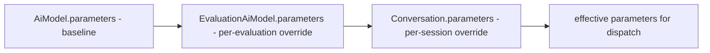
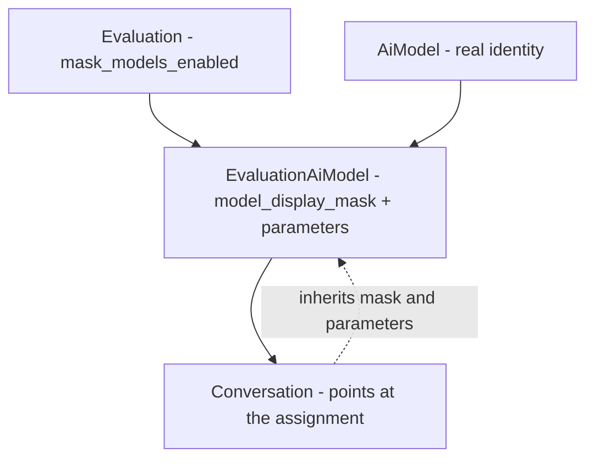

# EvaluationAiModel

What it is for: so that the same AI model can be used in many evaluations, each with its own identity masking and its own inference parameters. This is the join table connecting [Evaluation](evaluation.md) with [AiModel](ai-model.md) — one row = "this model is assigned to this evaluation".

A plain many-to-many relation is not enough. The row carries its own data: the display mask (`model_display_mask`) and a parameter layer (`parameters`). That is why it is not an ordinary link table but an **association object**.

## Why a separate row rather than the bare model

Two things live on the assignment, not on the model:

- **Identity mask** — in one evaluation the model can be called "Model A", in another "Model B", while the real name is hidden. This is a property of the assignment, not the model.
- **Per-evaluation parameters** — the same base model, but in this evaluation `temperature` should be lower. The override sits on the assignment.

The bare `AiModel` is shared. The assignment is where an evaluation "personalizes" the model for itself.

## Columns

Table `evaluation_ai_models`. Inherits [BaseModel](data-model-overview.md) (id, timestamps, soft-delete) plus `InferenceParamsMixin` (the `parameters` column).

| Field | Type | Notes |
|---|---|---|
| `model_id` | UUID FK -> `ai_models.id` | points to [AiModel](ai-model.md) |
| `evaluation_id` | UUID FK -> `evaluations.id` | points to [Evaluation](evaluation.md) |
| `model_display_mask` | VARCHAR 255, nullable | alias shown when the evaluation masks; DIFFERENT from `AiModel.model_alias` (which is the dispatch slug) |
| `parameters` | JSONB NOT NULL | the override layer in the inference cascade |

File: `app/core/evaluations/models.py`.

### Indexes and uniqueness

- **Partial unique** `(model_id, evaluation_id) WHERE deleted_at IS NULL` — one LIVE assignment per model-evaluation pair. After a soft-delete you can assign again: a fresh row is created, the old tombstone does not block.
- A plain index on `evaluation_id` (listing an evaluation's models).

An attempt to add a duplicate -> `IntegrityError` -> the service maps it to `ConflictError` (409).

## Relation to AiModel — without `with_live`

The `ai_model` relation loads **without** the soft-delete filter. Deliberately. The invariant: removing an [AiModel](ai-model.md) cascade-soft-deletes its live assignments (`unassign_models_for_model`), so a live assignment always has a live model. The lack of `with_live` is defense-in-depth — the projection won't blow up should the invariant ever break.

## Place in the parameter cascade

This is the middle layer of the chain **model -> assignment -> conversation**. See [AI Gateway - inference parameters](../components/ai-gateway-inference-parameters.md) for the full mechanics (`merge_inference_params`, most-specific-wins).

Each layer overrides the keys of the previous one; an absent key is inherited. There is no "clear" state — the write path strips `null`.

## Why the conversation points at the assignment, not the bare model

[Conversation](conversation.md) holds the FK `evaluation_ai_model_id` -> `evaluation_ai_models.id`, and NOT `model_id` -> `ai_models.id`. Two reasons:

1. **Masking** — the conversation should see the model through this evaluation's mask. If it pointed at the bare model, it would know the real identity.
2. **Parameter layer** — the session inherits the assignment's override as the base of its own layer. By pointing at the assignment it gets this for free.

## Masking — where it lives

Masking is a **projection in the response**, not a change to the data. `model_id`/`assignment_id` always resolve the real row in the database.

- The master toggle is `Evaluation.mask_models_enabled` (default `true`).
- When enabled, the model view on the evaluation shows `model_display_mask` instead of the real name; `provider`/`provider_model_id` are withheld as `null`.
- Addressing goes by `assignment_id`, NOT by `model_id` — so that the same model can't be correlated across evaluations.
- The GET single-assignment endpoint is deliberately gated on `evaluations:update` (not `:read`) — so that read-only roles don't unmask the identity through the edit form.
- **Capability declarations survive masking**: `warmup_enabled` and `input_modalities` are surfaced even when masked — they tell the client what to *do* (warm the endpoint, offer image attachments), not which model it is. `output_modalities` is deliberately withheld here: the composer has no use for it and it would only widen the fingerprint.
- **`effective_parameters` survives masking, filtered**: the view carries the merged model-baseline + assignment-override params a conversation inherits; under masking they're reduced by `mask_inference_params` to the identity-safe numeric knobs — `system_prompt` and provider-specific keys are withheld. See [AI Gateway - inference parameters](../components/ai-gateway-inference-parameters.md).

`EvaluationAiModelResponse` deliberately does NOT echo the model identity — masking belongs to the evaluation's projection (`EvaluationAiModelView.from_assignment(..., masked=...)`).

## Schemas (edge)

- `EvaluationAiModelAssign` — assignment body: `model_id`, `model_display_mask`, `parameters`.
- `EvaluationAiModelUpdate` — `model_display_mask` accepts an explicit `null` (clearing), `parameters` REJECTS an explicit `null` (backs the NOT NULL column).
- `EvaluationAiModelView` — the read view on an evaluation; when `masked` it returns `assignment_id` + `name=model_display_mask` + the capability flags + the filtered `effective_parameters`.

## Cascade on deletion

- Soft-delete an [AiModel](ai-model.md) -> `unassign_models_for_model` soft-deletes all live assignments of that model.
- Unassign an assignment -> `soft_delete_conversations_for_assignment` soft-deletes the conversations that selected it.

The FKs `model_id` and `evaluation_id` have no DB-side `ON DELETE CASCADE` — the whole cascade goes through application-level soft-delete, because this path is outside the evaluation->group visibility graph.

## Restore

`POST /api/v1/evaluations/{evaluation_id}/models/{assignment_id}/restore` plus `?deleted=true` on the sub-resource list, both authorized as a **write on the parent group**. Refused once the underlying [AiModel](ai-model.md) itself is deleted. Re-instating an assignment also re-opens the restorability of the conversations its removal tombstoned. See [Restore - reading tombstones back](../components/restore-soft-deleted-items.md).

## Related

- [Evaluation](evaluation.md) — parent; holds `mask_models_enabled`
- [AiModel](ai-model.md) — the model that is assigned
- [Conversation](conversation.md) — points at the assignment, inherits mask and parameters
- [AI Gateway - inference parameters](../components/ai-gateway-inference-parameters.md) — the full mechanics of the model->assignment->conversation cascade
- [Data model overview](data-model-overview.md) — the ERD of the whole database
- [Evaluation domain](../components/evaluation-domain.md) — group/evaluation lifecycle
