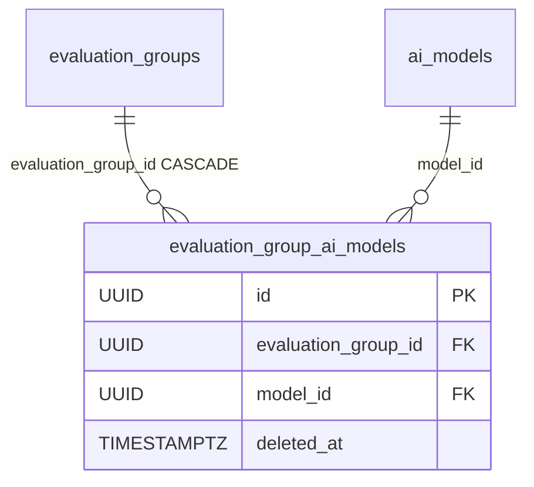

# EvaluationGroupAiModel

Membership of an [AiModel](ai-model.md) in an [EvaluationGroup](evaluation-group.md)'s **allowed-model subset**: the pool a group's evaluations may pick from. A pure join table — unlike [EvaluationAiModel](evaluation-ai-model.md) it carries no inference-params override and no display mask.

Table: `evaluation_group_ai_models`, model: `app/core/evaluations/models.py`. Service: `app/core/evaluations/services/group_models.py`. Component note: [Evaluation domain](../components/evaluation-domain.md).

## Why it exists

Two different questions about a model: *may this group use it at all* (this table) and *is it assigned to this evaluation* ([EvaluationAiModel](evaluation-ai-model.md)). The group owner curates the first as a declarative set on the group create/edit form (`allowed_model_ids`); assigning a model to an evaluation is then gated on it.

## Columns

Inherits `BaseModel` (`id` UUID, `created_at`, `updated_at`, `deleted_at` soft-delete). Beyond that only the two FKs:

| Column | Type | Notes |
|---|---|---|
| `evaluation_group_id` | UUID NOT NULL FK → `evaluation_groups.id` (`ON DELETE CASCADE`) | the owning group |
| `model_id` | UUID NOT NULL FK → `ai_models.id` | no `ON DELETE` — removal rides an application-level soft-delete cascade |

Indexes mirror [EvaluationAiModel](evaluation-ai-model.md): a partial-unique `(model_id, evaluation_group_id) WHERE deleted_at IS NULL` (leading with `model_id` so it also serves that FK and the delete cascade) plus a plain index on `evaluation_group_id`.

The `ai_model` relationship is loaded **without** `with_live(AiModel)` on purpose — soft-deleting a model cascades to its subset rows, so a live subset row always points at a live model.

## An empty subset allows nothing (fail-closed)

The rule that shapes the whole feature: an empty subset is an *incomplete* state — a draft, a legacy group, or one emptied by a model-delete cascade — and **never** "everything allowed". `assert_model_assignable_to_group` raises `BadRequestError` on an empty set, and the `assignable_to_evaluation` filter on `GET /ai-models` yields nothing. Otherwise deleting a model could silently widen a group's pool.

## Written only as a whole set

There is no per-row CRUD surface. `sync_group_models(session, *, group_id, model_ids)` replaces the subset declaratively:

- duplicates collapse; every id must reference a **live** model (otherwise 400 naming the offenders);
- removing a model that is still assigned to a live evaluation in the group is a **409**;
- current rows are locked `FOR UPDATE`, while `assert_model_assignable_to_group` reads them `FOR SHARE` — so a removal and a concurrent assignment serialize instead of racing;
- the PATCH route additionally holds the group row `FOR UPDATE`, because adding to an *empty* subset locks no rows here and two concurrent adds would otherwise race to the partial-unique index.

`unassign_group_models_for_model(session, model_id)` is the cascade hook fired when an `AiModel` is soft-deleted (mirroring `unassign_models_for_model`), which may leave a group's subset empty — assignability then fails closed until it is reconfigured.

## Backfill

The table shipped with a data migration (`508387a6dfc1`) seeding each group's subset with the DISTINCT live models its live evaluations already used, so pre-existing groups keep working under the new rule. It joins `ai_models` to keep a soft-deleted model out of the seed, is idempotent via `NOT EXISTS`, and leaves groups with no live usage empty (fail-closed). The downgrade is a deliberate no-op — backfilled rows are indistinguishable from operator-created ones.

## Relationships

## Related

- [EvaluationGroup](evaluation-group.md) — `allowed_model_ids` on create / draft / edit
- [EvaluationAiModel](evaluation-ai-model.md) — the other model join (per-evaluation assignment)
- [AiModel](ai-model.md) — the registry rows this points at
- [Evaluation domain](../components/evaluation-domain.md) — the subset rule and the assignment gate
- [AI Gateway - overview](../components/ai-gateway-overview.md) — the registry side
- [Data model overview](data-model-overview.md) — the full ERD
