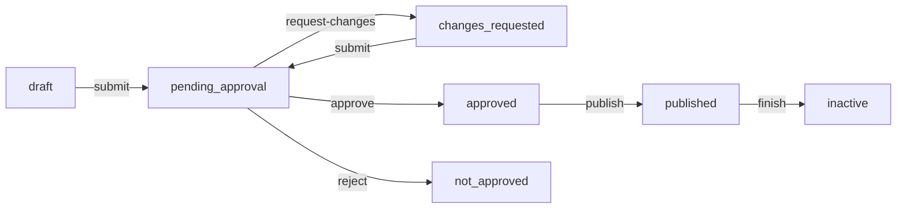
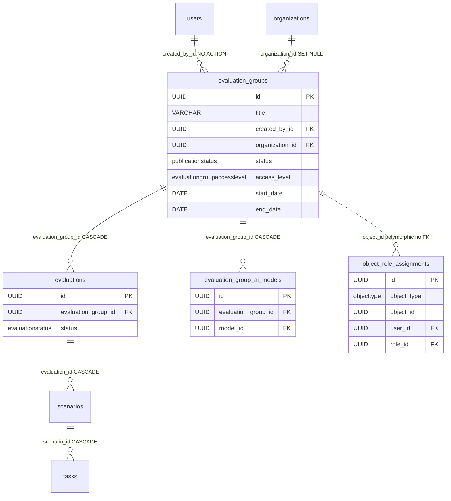

# EvaluationGroup

The top level of the evaluation hierarchy. One group is one red-teaming engagement — a container in which [Evaluation](evaluation.md) records live, and inside them scenarios and tasks. In the old Prisma code it was called `Event`.

The full hierarchy: **EvaluationGroup -> [Evaluation](evaluation.md) -> [Scenario](scenario.md) -> [Task](task.md)**.

## What it is for

A group collects evaluations into one project, which has its own publication lifecycle (draft -> approved -> published -> inactive), its own set of members (via per-object roles), an optional owning [organization](organization.md), and its own access level (public, organization-scoped, or invitation-only). It is at the group level that it is decided who sees anything and who can change anything.

Model file: `app/core/evaluations/models.py`.

## Columns

The group inherits from `BaseModel`, so it has `id` (UUID), `created_at`, `updated_at`, `deleted_at` (soft-delete). Beyond that:

| Column | Type | Notes |
|---|---|---|
| `title` | VARCHAR(255) NULL | group name; `null` only while a partial `draft` |
| `description` | TEXT NULL | description; `null` only while a partial `draft` |
| `created_by_id` | UUID FK -> `users.id` | attribution, NOT authority (see below); indexed; no ON DELETE |
| `status` | `publicationstatus` NOT NULL | model default `draft`; full create lands `pending_approval` |
| `rejection_reason` | TEXT NULL | reason for rejection by moderation |
| `access_level` | `evaluationgroupaccesslevel` NOT NULL | `public`, `organization`, or `invitation_only`; model default `invitation_only`; indexed |
| `organization_id` | UUID FK -> `organizations.id` NULL | owning [organization](organization.md); `ON DELETE SET NULL`; indexed. Required + live when `access_level = organization` |
| `start_date` | DATE NULL | start date, validated `>= today` on full create; `null` only while a partial `draft` |
| `end_date` | DATE NULL | end date, must be `> start_date` |
| `data_license_id` | UUID FK -> `data_licenses.id` NULL, idx | group-level [data-license](../components/licenses.md) override; NULL = inherit the platform default |
| `metrics_access_during` | `metricsaccesslevel` NOT NULL | who sees the [metrics dashboards](../components/analytics.md) while the group runs; `server_default 'owner_only'`, ORM default `members_personal_metrics` |
| `metrics_access_after` | `metricsaccesslevel` NOT NULL | same, once the group is `inactive`; same defaults |

Table: `evaluation_groups`.

Not a column, but part of the group's configuration: its **allowed-model subset**, held in the [EvaluationGroupAiModel](evaluation-group-ai-model.md) join and written declaratively as `allowed_model_ids` (required, non-empty on full create; optional on a draft; replaceable on PATCH). Only models in it may be assigned to the group's evaluations, and an empty subset allows **none** (fail-closed).

### data_license_id, metrics_access_*

`data_license_id` is the group layer of the three-layer license cascade (platform → group → evaluation); NULL inherits. The **effective** license is resolved at the projection layer — `EvaluationGroupResponse` surfaces both `data_license_id` (raw) and `effective_license` (the resolved license object). See [Data licensing & platform settings](../components/licenses.md). The two `metrics_access_*` columns (a `MetricsAccessLevel`: `owner_only` / `members_personal_metrics` / `all_members` / `inherit_group_access`) configure the metrics-dashboard audience, split for the running vs finished (`inactive`) group. The **DB `server_default` is `owner_only`** (fail-closed backfill) while the **ORM/product default is `members_personal_metrics`** — deliberately not aligned. See [Analytics - aggregate metrics](../components/analytics.md).

### Partial-draft nullability

`title` / `description` / `start_date` are **nullable** so a partial draft can be saved with only a `title` (migration `af9006ae9924`). `access_level` is deliberately **not** widened — it keeps NOT NULL with a model-side default of `invitation_only`, so a draft is never accidentally exposed (a null level would behave identically to `invitation_only` everywhere, buying nothing but null-handling). The completeness these columns skip at draft time is re-imposed at submit — see [Evaluation domain](../components/evaluation-domain.md).

### created_by_id is attribution, not authority

This matters. `created_by_id` says only WHO founded the group — it grants no permissions. Authority over a group comes solely from entries in [ObjectRoleAssignment](object-role-assignment.md). On `create_evaluation_group` the creator gets the `owner` role on the group and that is what grants access. If someone strips their `owner` role, they lose authority over their own group, even though they are still in `created_by_id`.

## Status / lifecycle

`status` uses the `PublicationStatus` enum (DB type `publicationstatus`). Values:

`draft`, `pending_approval`, `changes_requested`, `approved`, `not_approved`, `published`, `inactive`.

The enum combines two concerns: moderation (`pending_approval -> changes_requested / approved / not_approved`) and publication (`draft -> published -> inactive`).

Implemented transitions (`app/core/evaluations/services/publication.py`), the full set:



| Transition | Service function | Gate |
|---|---|---|
| draft / changes_requested -> pending_approval | `submit_evaluation_group` | owner-or-manage, perm `evaluation_groups:update` |
| pending_approval -> approved | `approve_evaluation_group` | owner-or-manage, perm `evaluation_groups:update` |
| pending_approval -> changes_requested | `request_changes_for_evaluation_group` | moderation, perm `evaluation_groups:manage` |
| pending_approval -> not_approved | `reject_evaluation_group` | moderation, perm `evaluation_groups:manage` |
| approved -> published | `publish_evaluation_group` | owner-or-manage, perm `evaluation_groups:update` |
| published -> inactive | `finish_evaluation_group` | owner-or-manage, perm `evaluation_groups:update` |

A wrong source state for a transition = 409 ConflictError. The owner-or-manage actions let an **owner approve their own group** (a deliberate call); only `request-changes` / `reject` are moderation-only (`:manage`), so an owner can't bounce or reject their own. `approve` / `request-changes` clear any stale `rejection_reason`; `reject` records it; `changes_requested` is the non-terminal verdict the owner re-`submit`s from.

The three **verdict** transitions (approve / request-changes / reject) also write an in-app [notification](notification.md) to the group owner via `_notify_owner` — skipped when the actor *is* the owner, since a self-verdict is not news. It lands in the same transaction as the status flip.

## Visibility (who sees the group)

`access_level` is the `EvaluationGroupAccessLevel` enum: `public`, `organization`, or `invitation_only`.

The visibility rule (`app/core/evaluations/access.py`): a group is visible when it is `public` **and not a `draft`**, OR it is `organization` and its org equals the caller's **live** org, OR the caller holds a live per-object role on it. A `public` **draft** stays owner/manager-only (the `public` arm is gated on `status != draft`); the owner sees it via the membership arm, a break-glass manager via the `can_manage` lift. There is no fallback to `created_by_id` — the creator sees the group because they got the `owner` role.

There is no Postgres RLS here, so `access.py` is the ONLY line of defense. Every new read must pass through these predicates. The main SQL function:

`app/core/evaluations/access.py`

```python
member_group_ids = select(col(ObjectRoleAssignment.object_id)).where(
    col(ObjectRoleAssignment.object_type) == ObjectType.EVALUATION_GROUP,
    col(ObjectRoleAssignment.user_id) == caller_id,
    col(ObjectRoleAssignment.deleted_at).is_(None),
)
caller_org = caller_live_organization_select(caller_id).scalar_subquery()
return or_(
    and_(
        col(EvaluationGroup.access_level) == EvaluationGroupAccessLevel.PUBLIC,
        col(EvaluationGroup.status) != PublicationStatus.DRAFT,
    ),
    col(EvaluationGroup.id).in_(member_group_ids),
    and_(
        col(EvaluationGroup.access_level) == EvaluationGroupAccessLevel.ORGANIZATION,
        col(EvaluationGroup.organization_id) == caller_org,
    ),
)
```

Access variants (more in [Object roles - per-object permissions](../components/object-roles-per-object-permissions.md), [Organizations](../components/organizations.md) and [Evaluation domain](../components/evaluation-domain.md)):

- **public** — anyone with the global `evaluation_groups:read` permission sees it, regardless of any org — **except a `draft`**, which stays owner/manager-only until it leaves `draft`.
- **organization** — visible only to members of the group's [organization](organization.md), resolved from the caller's **live** org (not the frozen JWT). Fail-closed: an orgless caller, a soft-deleted caller-org, or a tombstoned group-org all stop matching.
- **owned / member** — a held live per-object role makes the group visible at any access level, so cross-org sharing rides the object-role layer.
- **break-glass** — whoever has global `evaluation_groups:manage` in the JWT sees and manages everything (admin).

A non-visible private group returns 404 (the gate does not reveal that the group exists). Visible but without sufficient permissions = 403. This is the "404-then-403" pattern across the whole domain.

## Relations

### To [Evaluation](evaluation.md) — 1-to-n, ON DELETE CASCADE

The group has `evaluations: list[Evaluation]`. The FK on the child side (`evaluations.evaluation_group_id`) has **ON DELETE CASCADE** — deleting the group in the DB deletes all evaluations (and further down scenarios and tasks).

The ORM relation has `passive_deletes=True`. This is NOT speculative: without it, on `session.delete(group)` SQLAlchemy would try to null out the NOT-NULL child FKs and blow up. `passive_deletes` tells the ORM "leave the cascade to the database". In practice the domain uses soft-delete anyway (`deleted_at`); hard-delete is not exposed by the API.

The relation is also sorted by `(created_at, id)`.

### To [ObjectRoleAssignment](object-role-assignment.md) — per-object roles

Membership and authority over a group live in `object_role_assignments` with `object_type = EVALUATION_GROUP` and `object_id = group id`. This binding is **polymorphic, without an FK** — integrity is enforced by the application (soft-delete of assignments when a group is removed). Roles assignable in a group: `owner`, `red_teamer`, `annotator`, `viewer`. Only `owner` passes the write-gate on evaluations/scenarios/tasks. Details in [Object roles - per-object permissions](../components/object-roles-per-object-permissions.md).



## Write authorization

The `assert_group_write_access` function (`app/core/evaluations/services/evaluation_groups.py`) decides who can write:

- **break-glass** (`evaluation_groups:manage` in the JWT) -> passes through.
- **member** -> checks `held_roles`; passes through only when one of the held roles has the given `permission` in `Role.permissions`. A demoted member is blocked, even if they created the group.
- **non-member** -> zero authority, even with a global permission.

Error split: after `can_manage=False`, when the group is `public` or the caller has any roles -> 403; otherwise 404 (so as not to reveal the existence of a private group).

## Creating a group

Two entry points: a **full** create (`POST /evaluation-groups`) makes a complete group already submitted for review (lands `pending_approval`), and a **partial draft** (`POST /evaluation-groups/draft`) needs only a `title` (lands `draft`). Both share the `_persist_new_group` tail and grant the creator the `owner` role. A third path, **duplicate** (`POST /{id}/duplicate`), copies an existing group into a fresh `draft`. Full details in [Evaluation domain](../components/evaluation-domain.md).

`create_evaluation_group`:

- takes the target `status` from the caller (the route passes `pending_approval`; the service default `draft` is used by seeding),
- validates the dates (`start_date >= today` UTC, `end_date > start_date`) -> 400 BadRequestError,
- delegates to `_persist_new_group`, which after flush grants the creator the `owner` role via `grant_roles(ObjectType.EVALUATION_GROUP, ...)`.

`create_evaluation_group_draft` skips the required-field / `start_date >= today` / org-liveness completeness (re-imposed at submit by `assert_group_submittable`), keeping only the both-dates-set order check and the same cross-tenant org guard.

## Related

- [Evaluation](evaluation.md) — child of the group (1-n, CASCADE)
- [Evaluation domain](../components/evaluation-domain.md) — the whole group/evaluations/scenarios/tasks + lifecycle
- [Object roles - per-object permissions](../components/object-roles-per-object-permissions.md) — the second authorization scope, the source of authority over a group
- [ObjectRoleAssignment](object-role-assignment.md) — the per-object role assignment table
- [Organization](organization.md) — the owning org + the `organization` access level
- [Organizations](../components/organizations.md) — tenancy, where the `organization` access level is enforced
- [EvaluationGroupAiModel](evaluation-group-ai-model.md) — the group's allowed-model subset
- [Notification](notification.md) — the verdict notice sent to the group owner
- [Data licensing & platform settings](../components/licenses.md) — the `data_license_id` group override
- [Analytics - aggregate metrics](../components/analytics.md) — the `metrics_access_*` levels
- [Invitation](invitation.md) — invitations scoped to a group
- [Flow - evaluation group invitation](../flows/flow-evaluation-group-invitation.md) — the path for inviting a user
- [Data model overview](data-model-overview.md) — the full ERD of all tables
- [RBAC - global roles](../components/rbac-global-roles.md) — global roles and permissions in the JWT
- [Scenario](scenario.md) — a challenge in an evaluation
- [Task](task.md) — a task in a scenario
