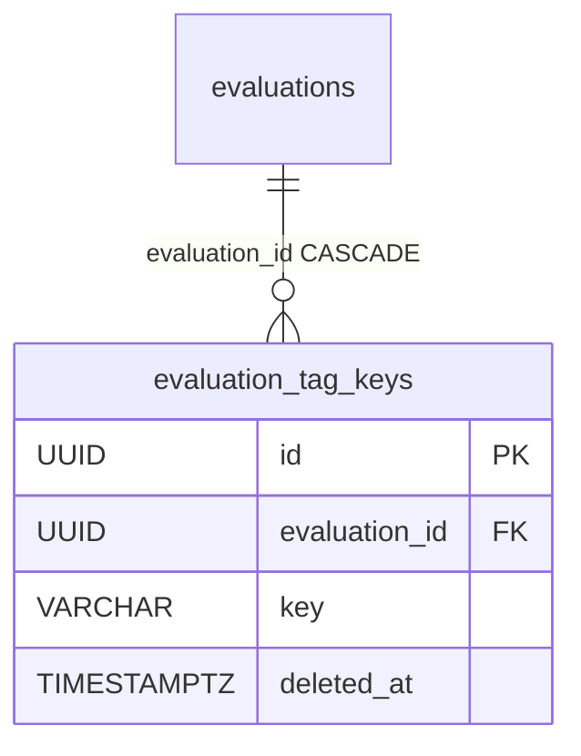

# EvaluationTagKey

One **allowed conversation-tag key** for an [Evaluation](evaluation.md) — the admin-defined "tag schema". A plain allow-list row; the behaviour it drives is described in [Conversation tags](../components/conversation-tags.md).

Class in `app/core/evaluations/models.py`, table `evaluation_tag_keys`.

## Columns

Inherits `BaseModel` (`id`, `created_at`, `updated_at`, `deleted_at`).

| Column | Type | FK | ON DELETE | Note |
|---|---|---|---|---|
| `evaluation_id` | UUID | `evaluations.id` | CASCADE | owning evaluation, NOT NULL |
| `key` | VARCHAR(64) | — | — | NOT NULL — the allowed key |

```python
class EvaluationTagKey(BaseModel, table=True):
    __tablename__ = "evaluation_tag_keys"
    __table_args__ = (
        Index(
            "ix_evaluation_tag_keys_evaluation_id_key",
            "evaluation_id",
            "key",
            unique=True,
            postgresql_where=text("deleted_at IS NULL"),
        ),
    )

    evaluation_id: uuid.UUID = Field(foreign_key="evaluations.id", nullable=False, ondelete="CASCADE")
    key: str = Field(max_length=64, nullable=False)
```

One partial-unique index does three jobs: it keeps `(evaluation, key)` unique **among live rows** (so a removed key can be re-added), it leads with `evaluation_id` so it also serves the FK + delete cascade, and it backs the per-evaluation list.

## The two flags that govern it

The allow-list is inert on its own. Two independent booleans on [Evaluation](evaluation.md) decide, in this order:

| Flag | Default | Meaning |
|---|---|---|
| `tags_enabled` | `true` | whether tagging exists here at all — off rejects every tag and the console renders no tagging surface |
| `tags_restricted` | `false` | off = free-form keys regardless of this table; on = every key must be in the live set (**an empty set while restricted forbids all tags**) |

Keeping "disabled" separate from "restricted with nothing allowed" is deliberate: they would be indistinguishable in the DB otherwise, so neither the API nor the UI could tell a deliberate opt-out from a half-finished setup.

## Cap

The set is capped at `MAX_TAGS` (16) — the same ceiling a single conversation's tag map has, so a longer allow-list would be weight the write path re-reads on every create / PATCH / send without any conversation being able to use it. Unlike the uniqueness rule, this cap has **no index behind it**: concurrent adds can overshoot it by the number of racing requests, leaving a row past the ceiling that no conversation can use.

## Key charset

`key` shares one definition with the conversation payload validator — `TAG_KEY_PATTERN` in `app/core/conversations/tags.py`: letters, digits, `_`, `.`, `-`, 1–64 chars, and not dots alone. So a key an admin allows is exactly one a conversation may use. The anchoring differs by engine on purpose (Pydantic compiles with Rust regex where `^`/`$` bound the whole text; Python's `re` needs `\A`/`\Z`, because its `$` also matches before a trailing newline — the divergence that would let a key forge an extra prompt line).

## Lifecycle

- **Add** — `POST /api/v1/evaluations/{id}/tag-keys` (409 on a duplicate or at the cap).
- **Remove** — `DELETE /api/v1/evaluations/{id}/tag-keys/{key}` soft-deletes the row. Conversation tags already stored are **left untouched**; the fold filters them out of the prompt instead of failing later turns.
- **Duplicating an evaluation or a group** copies the whole tag schema — both flags and the allowed keys — `include_children` or not, so a duplicate can't silently drop the restriction.

## Relationship diagram



## Related

- [Conversation tags](../components/conversation-tags.md)
- [Evaluation](evaluation.md)
- [Conversation](conversation.md)
- [Message](message.md)
- [Evaluation domain](../components/evaluation-domain.md)
- [Data model overview](data-model-overview.md)
