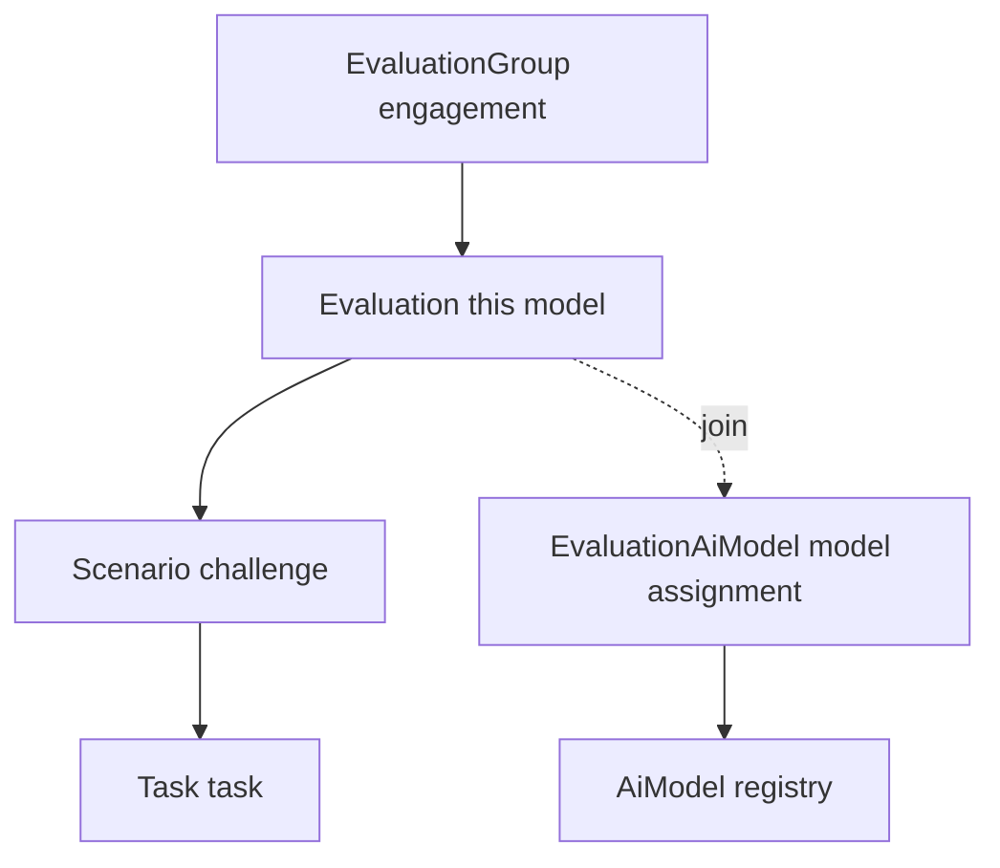
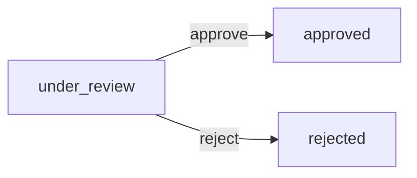
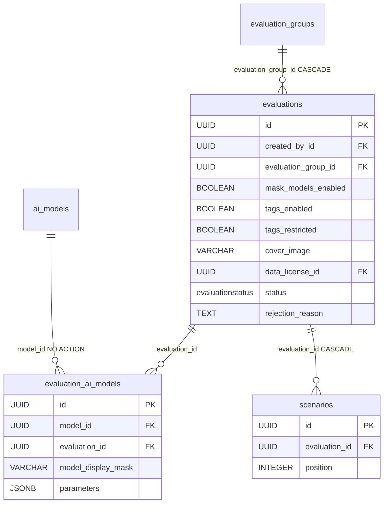

# Evaluation

A single evaluation inside a group. This is where AI models get wired in for testing and challenge scenarios are created. One level below [EvaluationGroup](evaluation-group.md), one level above [Scenario](scenario.md).

Think of it this way: the group is the whole red-teaming engagement, and the evaluation is a concrete "test" within that engagement — it has its own models, its own scenarios and its own status in the lifecycle.

## What it is for

- Groups AI models (via the [EvaluationAiModel](evaluation-ai-model.md) join) and scenarios ([Scenario](scenario.md)) under one roof.
- Holds the model identity masking flag (`mask_models_enabled`) — whether the red-teamer sees the real model name or an alias.
- Holds the **conversation-tag policy** (`tags_enabled` / `tags_restricted` + the [EvaluationTagKey](evaluation-tag-key.md) allow-list). See [Conversation tags](../components/conversation-tags.md).
- Carries an optional per-evaluation **data-license** override (`data_license`); NULL inherits the platform default. See [Data licensing & platform settings](../components/licenses.md).
- Has its own moderation/publication status (`new` -> `under_review` -> `approved`/`rejected` -> ...).

## Place in the hierarchy



## Columns

All tables inherit from `BaseModel`, so they have `id` (UUID), `created_at`, `updated_at`, `deleted_at` (soft-delete). Only the own fields are listed below.

| Column | Type | Notes |
|---|---|---|
| `title` | VARCHAR(255) | evaluation name |
| `description` | TEXT NULL | description; nullable so an evaluation can be saved title-only and completed later |
| `mask_models_enabled` | BOOLEAN | master masking toggle, `server_default true` |
| `tags_enabled` | BOOLEAN | may conversations here carry tags at all; `server_default true` |
| `tags_restricted` | BOOLEAN | must tag keys come from the evaluation's allowed set; `server_default false` |
| `cover_image` | VARCHAR(1024) NULL | cover image, clearable |
| `data_license_id` | UUID FK -> data_licenses.id NULL, idx | per-eval data-license override; NULL = inherit the platform default |
| `status` | `evaluationstatus` | `server_default 'new'`, indexed |
| `rejection_reason` | TEXT NULL | rejection reason (filled in on reject) |
| `created_by_id` | UUID FK -> users.id | attribution, NOT authority; indexed |
| `evaluation_group_id` | UUID FK -> evaluation_groups.id | `ON DELETE CASCADE`, indexed |

File: `app/core/evaluations/models.py`.

### mask_models_enabled

The most important field specific to an evaluation. When `true`, the detail projection substitutes `model_display_mask` from [EvaluationAiModel](evaluation-ai-model.md) for the real model name, and the identifying fields (`provider`, `provider_model_id`) are returned as `null`. The red-teamer attacks "model X" without knowing it is e.g. GPT-4. Masking is purely a response layer — `model_id` in the database always resolves the real row.

### tags_enabled / tags_restricted (the tag schema)

Two independent flags, checked in that order, governing conversation tags under this evaluation. `tags_enabled=false` rejects every tag write and hides the console's tagging surface; `tags_restricted=true` then requires every key to be in the evaluation's [EvaluationTagKey](evaluation-tag-key.md) allow-list (an empty set while restricted forbids all tags). Keeping the two apart is deliberate — "disabled" and "restricted with nothing allowed" would otherwise be indistinguishable in the DB, so neither the API nor the UI could tell a deliberate opt-out from a half-finished setup. Defaults (`true` / `false`) leave existing evaluations behaving as before: tagging on, unrestricted. Both flags travel with a duplicate, `include_children` or not. Full behaviour: [Conversation tags](../components/conversation-tags.md).

### data_license_id (the license cascade)

A nullable FK to a live [DataLicense](data-license.md) row (validated on every write by `validate_license_ref` — a missing or tombstoned target is a 400). NULL means "inherit". The **effective** license is resolved at the projection layer, not stored, via the three-layer cascade (most-specific non-null wins): `evaluation.data_license_id or group.data_license_id or platform_default` (`resolve_effective_licenses`, one platform-default read + one batched `IN` query joining the parent group — no N+1). `EvaluationResponse` surfaces both `data_license_id` (the raw override) and `effective_license` (the resolved license object); a [Conversation](conversation.md) under the evaluation carries only the inherited `effective_license`. `EvaluationUpdate.data_license_id` is tri-state like `cover_image`: omitted = unchanged, a value = set, explicit `null` = reset to inherit. See [Data licensing & platform settings](../components/licenses.md) and [PlatformSettings](platform-settings.md).

### created_by_id is not authority

`created_by_id` serves attribution only (who created it). Authority over an evaluation comes from the `owner` role on the parent group via object roles — see [Object roles - per-object permissions](../components/object-roles-per-object-permissions.md). On group create the creator gets the `owner` role; a demoted creator loses authority despite `created_by_id`.

## Status (EvaluationStatus)

DB enum `evaluationstatus`, values: `new`, `draft`, `under_review`, `rejected`, `approved`, `published`, `completed`.

Today only the admin transition `under_review -> approved`/`rejected` is enforced (`app/core/evaluations/services/approval.py`). The rest of the graph is waiting for the owner submit/publish flow (not yet implemented — some states reachable only via fixtures). Lifecycle details: [Evaluation domain](../components/evaluation-domain.md).



`approve` clears `rejection_reason`, `reject` requires `rejection_reason`. A wrong source state = 409 ConflictError. Both verdicts write an in-app [notification](notification.md) to `created_by_id` in the same transaction — unless the actor *is* the owner (admin holds both `evaluations:create` and `evaluations:approve`, so it can approve its own, and a self-verdict is not news).

## ORM relations

| Relation | Type | Note |
|---|---|---|
| `evaluation_group` | -> [EvaluationGroup](evaluation-group.md) | parent |
| `models` | -> list [EvaluationAiModel](evaluation-ai-model.md) | assigned AI models |
| `scenarios` | -> list [Scenario](scenario.md) | challenges |

No relation filters soft-deleted rows automatically — on eager-load you have to add `with_live(...)` in `.options(...)`. The model loader is extracted to avoid an import cycle:

`app/core/evaluations/services/loaders.py`

```python
def evaluation_models_loader() -> Load:
    return selectinload(Evaluation.models).selectinload(EvaluationAiModel.ai_model)
```

## Inference parameters (cascade layer)

`Evaluation` itself does NOT carry a `parameters` column. The [EvaluationAiModel](evaluation-ai-model.md) join does (via `InferenceParamsMixin`). The parameter cascade goes: `AiModel` -> `EvaluationAiModel` -> [Conversation](conversation.md), most-specific-last (`merge_inference_params`). So the evaluation itself has no knobs of its own — it sets them per-model-assignment. Details: [AI Gateway - inference parameters](../components/ai-gateway-inference-parameters.md).

## Data model fragment diagram



## Pitfalls

- **Visibility.** No RLS. Every evaluation read MUST go through `join_visible_evaluation_group` / scope to visible groups. The visibility invariant is inherited from the parent group (`access.py`).
- **404-then-403.** A non-visible private parent group = 404 (we don't leak existence), visible but without permissions = 403.
- **GET single assignment gated on `evaluations:update`.** Deliberately edit-scoped — read-only roles don't unmask the model identity through this endpoint, they only see it through the masked list.
- **Cascade on unassign.** Removing a model assignment soft-deletes the related conversations (`soft_delete_conversations_for_assignment`).
- **`_reject_explicit_null`.** NOT NULL fields in PATCH (`title`, `mask_models_enabled`, `tags_enabled`, `tags_restricted`) reject an explicit `null` (omission != clearing); the nullable `description`, `cover_image`, and `data_license_id` are excluded — an explicit `null` clears them (for `data_license_id`, `null` = reset to inherit the platform default).
- **Assignment is gated on the group's allowed-model subset.** Assigning a model to an evaluation passes `assert_model_assignable_to_group`: the model must sit in the parent group's [allowed-model subset](evaluation-group-ai-model.md), and an **empty** subset allows nothing (400, fail-closed).
- **Title-only create + duplicate.** `description` is optional on create (`EvaluationCreate`), so an evaluation can be saved with only a title. `POST /evaluations/{id}/duplicate?include_children=` copies an evaluation into the **same group** as a fresh `new` row owned by the caller (model assignments + scenarios + tasks with `include_children`, referencing the same shared `AiModel`; never runtime data or keys); it needs `evaluations:create` write access on the source, not mere visibility. See [Evaluation domain](../components/evaluation-domain.md).

## Restore

`POST /api/v1/evaluations/{evaluation_id}/restore`, and `?deleted=true` on the list (which needs `evaluations:delete`). Both the listing and the restore show only the caller's **own** deletes unless they hold the `evaluation_groups:manage` break-glass.

The delete tombstones only this row, so scenarios / tasks / assignments / conversations come back with it through the visibility join. Not restorable under a soft-deleted group. See [Restore - reading tombstones back](../components/restore-soft-deleted-items.md).

## Related

- [EvaluationGroup](evaluation-group.md)
- [EvaluationAiModel](evaluation-ai-model.md)
- [EvaluationGroupAiModel](evaluation-group-ai-model.md) — the group subset every assignment is checked against
- [Notification](notification.md) — the approve/reject notice to the owner
- [Scenario](scenario.md)
- [Task](task.md)
- [Conversation](conversation.md)
- [Evaluation domain](../components/evaluation-domain.md)
- [Data licensing & platform settings](../components/licenses.md)
- [PlatformSettings](platform-settings.md)
- [AiModel](ai-model.md)
- [AI Gateway - inference parameters](../components/ai-gateway-inference-parameters.md)
- [Object roles - per-object permissions](../components/object-roles-per-object-permissions.md)
- [Data model overview](data-model-overview.md)
