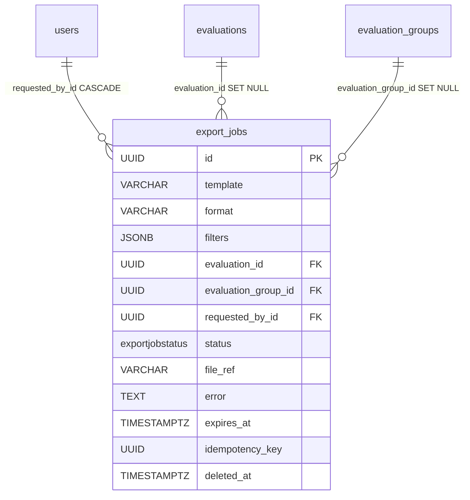

# ExportJob

The durable record of one asynchronous export: which `template` to run over which scope (exactly one of `evaluation_id` / `evaluation_group_id`), in which `format` (CSV/JSON) and under which row `filters`, who asked (`requested_by_id`), its lifecycle `status`, and where the finished file landed (`file_ref`). The scope ids are plain **pointers** the worker re-resolves under the requester's live visibility at run time — never trusted to widen access.

Table: `export_jobs`, model: `app/core/exports/models.py`. Component note: [Exports (CSV / JSON)](../components/exports.md).

## What it is for

Every export is generated in the background (there is no synchronous path). The row is the state a client polls (`pending → running → ready`/`failed`), the audit of who exported what, and the handle to the stored file for download until its TTL lapses.

## Columns

Inherits `BaseModel` (`id` UUID, `created_at`, `updated_at`, `deleted_at` soft-delete). Beyond that:

| Column | Type | Notes |
|---|---|---|
| `template` | VARCHAR NOT NULL | catalog key (`flags`, `reviews`, `transcript`, `engagement_report`, …) |
| `format` | VARCHAR NOT NULL, `server_default 'csv'` | output format (`csv`/`json`); a **bare str** like `template`, edge-validated against `ExportFormat` — a new format is code-only, no PG-enum migration; reads coerce via `parse_stored_format` (unknown → `csv` + warning) |
| `filters` | JSONB NULL | the set (non-`None`) row filters chosen at create (`ExportFilters`), or `NULL` when unfiltered; replayed by the detached worker, part of the idempotency fingerprint |
| `evaluation_id` | UUID NULL FK → `evaluations.id` | scope target (single evaluation); `ON DELETE SET NULL` |
| `evaluation_group_id` | UUID NULL FK → `evaluation_groups.id` | scope target (whole group); `ON DELETE SET NULL` |
| `requested_by_id` | UUID NOT NULL FK → `users.id` | requester (owner scope); `ON DELETE CASCADE`, indexed |
| `status` | `exportjobstatus` enum NOT NULL | `pending` default, `server_default 'pending'`, indexed |
| `file_ref` | VARCHAR NULL | opaque storage handle set by the worker on success |
| `error` | TEXT NULL | safe, requester-facing failure reason when `failed` (never upstream/DB internals) |
| `expires_at` | TIMESTAMPTZ NULL | TTL deadline, stamped only when the job reaches `ready`/`failed`; null while `pending`/`running` |
| `idempotency_key` | UUID NULL | client key that dedups a burst of identical creates |

Exactly one of `evaluation_id` / `evaluation_group_id` is set (enforced by the request schema + worker, not a DB constraint). The scope FKs are **SET NULL** (not CASCADE) so a hard-deleted target leaves the finished file and audit row intact.

### The `ExportJobStatus` enum

Lifecycle, orthogonal to soft-delete. Closed set — adding a value needs a migration (`ALTER TYPE … ADD VALUE`).

```python
class ExportJobStatus(StrEnum):
    PENDING = "pending"  # created, enqueued
    RUNNING = "running"  # a worker claimed it (CAS pending → running)
    READY = "ready"  # file written, downloadable
    FAILED = "failed"  # generation raised — `error` carries the reason
```

Reaching `ready` or `failed` also **announces** the outcome to the requester (audit row + in-app notification + email), inside the same transaction as the status flip. Both terminal flips are compare-and-swap, which is what makes the announcement exactly-once: a row the stuck-job reaper already failed doesn't get a second notice from the worker. See [Exports (CSV / JSON)](../components/exports.md) and [Notification](notification.md).

## Idempotency: a partial-unique index

A repeated `idempotency_key` from the same requester replays the stored job rather than queuing a duplicate. Enforced by a partial-unique index, scoped to live, keyed rows:

```python
Index(
    "ix_export_jobs_requester_idempotency_key",
    "requested_by_id",
    "idempotency_key",
    unique=True,
    postgresql_where=text("idempotency_key IS NOT NULL AND deleted_at IS NULL"),
)
```

So distinct requesters never collide, keyless jobs are exempt, and a soft-deleted (reaped) job frees its key for reuse.

## Soft-delete + TTL

`status` (the lifecycle) is orthogonal to `deleted_at` (the tombstone). A finished job carries `expires_at`; the beat-scheduled reaper (`reap_expired_export_jobs`) drops its stored file and soft-deletes the row once it lapses. The manual `DELETE` endpoint does the same for a finished job on demand. File removal is best-effort — the row is soft-deleted regardless, so a lingering file can never keep the job "live".

## Relationships



Deleting the requester CASCADEs their jobs away; deleting either scope target only nulls the pointer (the finished export stays downloadable).

## Related

- [Exports (CSV / JSON)](../components/exports.md) — the catalog, formats, filters, job lifecycle, authority, storage, and API
- [Evaluation](evaluation.md) — the `evaluation_id` scope target
- [EvaluationGroup](evaluation-group.md) — the `evaluation_group_id` scope target
- [User and Role](user-and-role.md) — `requested_by_id` (owner scope)
- [Data model overview](data-model-overview.md) — the full ERD
